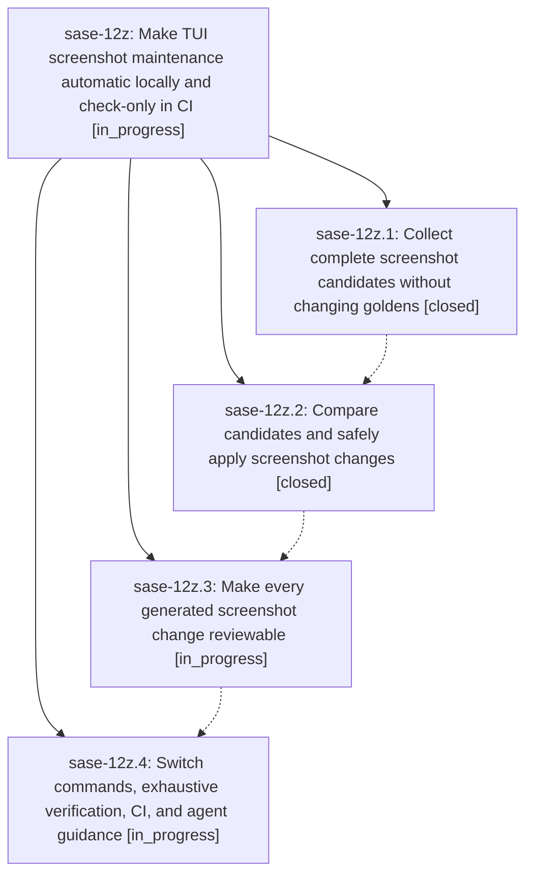

# Bead: sase-12z — Make TUI screenshot maintenance automatic locally and check-only in CI

[Bead Pages](../README.md) / sase-12z

**Status:** ◐ in_progress · **Type:** ▸ plan · **Tier:** epic
**Owner:** `bryanbugyi34@gmail.com` · **Created by:** [bbugyi200.athena.0mx](https://github.com/sase-org/sase--agents/blob/main/families/bbugyi200.athena.0mx.md) · **Assignee:** `sase-12z.land`
**Created:** 2026-09-18 10:39:49 EDT
**Plan:** [202609/fix\_tui\_screenshots.md](https://github.com/sase-org/sase--plans/blob/main/202609/fix_tui_screenshots.md)

## Description

Replace the manual visual snapshot workflow with a reviewable, staged fix-tui-screenshots command that updates goldens during local check-full and explicit agent calls, while CI checks the complete corpus without accepting it.

## Phases

| Bead | Title | Status | Size | Created | Agents | Commits |
|---|---|---|---|---|---:|---:|
| [sase-12z.1](sase-12z.1.md) | Collect complete screenshot candidates without changing goldens | ✓ closed | medium | 2026-09-18 | 1 | 1 |
| [sase-12z.2](sase-12z.2.md) | Compare candidates and safely apply screenshot changes | ✓ closed | medium | 2026-09-18 | 1 | 1 |
| [sase-12z.3](sase-12z.3.md) | Make every generated screenshot change reviewable | ◐ in_progress | medium | 2026-09-18 | 1 | 0 |
| [sase-12z.4](sase-12z.4.md) | Switch commands, exhaustive verification, CI, and agent guidance | ◐ in_progress | medium | 2026-09-18 | 1 | 0 |

## Lineage

## Agents

| Agent | Bead | Commits |
|---|---|---:|
| [bbugyi200.athena.sase-12z.1](https://github.com/sase-org/sase--agents/blob/main/agents/bbugyi200.athena.sase-12z.1/README.md) | [sase-12z.1](sase-12z.1.md) | 1 |
| [bbugyi200.athena.sase-12z.2](https://github.com/sase-org/sase--agents/blob/main/families/bbugyi200.athena.sase-12z.2.md) | [sase-12z.2](sase-12z.2.md) | 1 |
| [bbugyi200.athena.sase-12z.3](https://github.com/sase-org/sase--agents/blob/main/agents/bbugyi200.athena.sase-12z.3/README.md) | [sase-12z.3](sase-12z.3.md) | 0 |
| [bbugyi200.athena.sase-12z.4](https://github.com/sase-org/sase--agents/blob/main/agents/bbugyi200.athena.sase-12z.4/README.md) | [sase-12z.4](sase-12z.4.md) | 0 |
| [bbugyi200.athena.sase-12z.land](https://github.com/sase-org/sase--agents/blob/main/agents/bbugyi200.athena.sase-12z.land/README.md) | [sase-12z](README.md) | 0 |

## Commits

| Repo | Commit | Subject | Bead | Committed |
|---|---|---|---|---|
| sase | [`da4caa9`](https://github.com/sase-org/sase/commit/da4caa94cff22a9319c76f82f9fd440ec52523d7) | test(visual): add isolated screenshot candidate-capture protocol | [sase-12z.1](sase-12z.1.md) | 2026-09-18 11:44:59 EDT |
| sase | [`9243c0b`](https://github.com/sase-org/sase/commit/9243c0bdd7563d2271de57833084e721fec4958e) | feat(visual): add screenshot golden maintenance runner | [sase-12z.2](sase-12z.2.md) | 2026-09-18 13:34:39 EDT |
