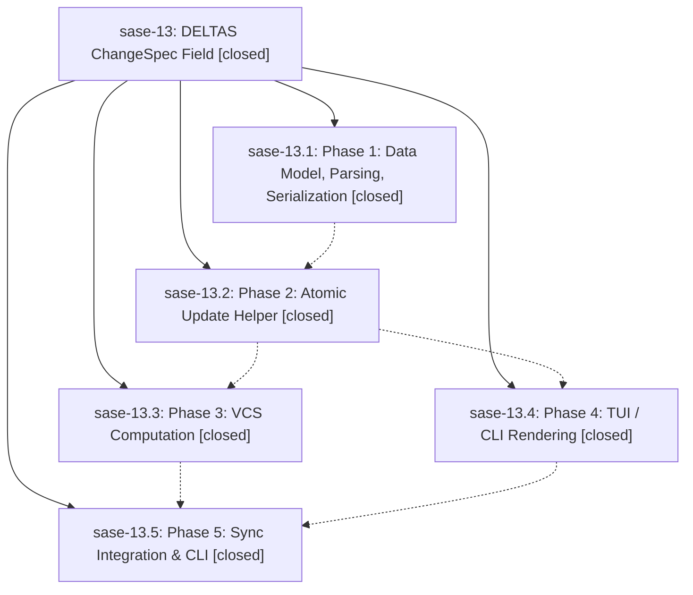

# Bead: sase-13 — DELTAS ChangeSpec Field

[Bead Pages](../README.md) / sase-13

**Status:** ✓ closed · **Resolution:** (unrecorded) · **Type:** plan · **Tier:** epic
**Owner:** `bryanbugyi34@gmail.com`
**Created:** 2026-04-29 00:30:07 UTC · **Closed:** 2026-04-29 01:21:24 UTC
**Plan:** [202604/deltas\_field.md](https://github.com/sase-org/sase--plans/blob/main/202604/deltas_field.md)

## Phases

| Bead | Title | Status | Size | Agents | Commits |
|---|---|---|---|---:|---:|
| [sase-13.1](sase-13.1.md) | Phase 1: Data Model, Parsing, Serialization | ✓ closed | small | 0 | 1 |
| [sase-13.2](sase-13.2.md) | Phase 2: Atomic Update Helper | ✓ closed | small | 0 | 1 |
| [sase-13.3](sase-13.3.md) | Phase 3: VCS Computation | ✓ closed | small | 0 | 1 |
| [sase-13.4](sase-13.4.md) | Phase 4: TUI / CLI Rendering | ✓ closed | small | 0 | 1 |
| [sase-13.5](sase-13.5.md) | Phase 5: Sync Integration & CLI | ✓ closed | small | 0 | 1 |

## Lineage

## Commits

| Commit | Subject | Bead | Committed (UTC) |
|---|---|---|---|
| [`47ee8b1`](https://github.com/sase-org/sase/commit/47ee8b1c85c15f52ee27504f8dfe39566d5df08d) | feat(changespec): parse + format DELTAS field (sase-13.1) | [sase-13.1](sase-13.1.md) | 2026-04-29 00:36:48 |
| [`d165909`](https://github.com/sase-org/sase/commit/d1659098c89c8cc435532d055145c6c721a7066f) | feat(changespec): atomic DELTAS update helper (sase-13.2) | [sase-13.2](sase-13.2.md) | 2026-04-29 00:43:53 |
| [`d1c6573`](https://github.com/sase-org/sase/commit/d1c6573e31dc747adbd3f039f4c1a4a285de7cde) | feat(ace): render DELTAS in CLI + TUI with fold support (sase-13.4) | [sase-13.4](sase-13.4.md) | 2026-04-29 00:55:52 |
| [`858fa7e`](https://github.com/sase-org/sase/commit/858fa7e1a99b7f431eacec8d90acb87b1d9591ce) | feat(deltas): compute DELTAS from VCS state (sase-13.3) | [sase-13.3](sase-13.3.md) | 2026-04-29 01:00:34 |
| [`5336866`](https://github.com/sase-org/sase/commit/53368663b086f5e7d4e9f889465b40f07ada75e0) | feat(deltas): wire DELTAS sync into lifecycle hooks + sync-deltas CLI (sase-13.5) | [sase-13.5](sase-13.5.md) | 2026-04-29 01:16:31 |
