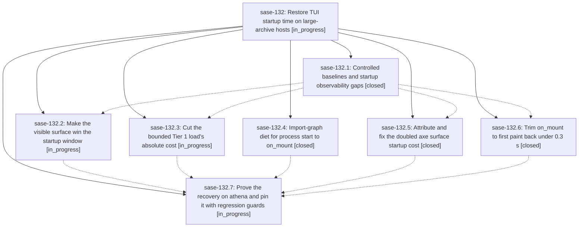

# Bead: sase-132 — Restore TUI startup time on large-archive hosts

[Bead Pages](../README.md) / sase-132

**Status:** ◐ in_progress · **Type:** ▸ plan · **Tier:** epic
**Owner:** `bryanbugyi34@gmail.com` · **Created by:** [bbugyi200.athena.0n7](https://github.com/sase-org/sase--agents/blob/main/families/bbugyi200.athena.0n7.md) · **Assignee:** `sase-132.land`
**Created:** 2026-09-18 15:22:32 EDT
**Plan:** [202609/tui\_startup\_regression.md](https://github.com/sase-org/sase--plans/blob/main/202609/tui_startup_regression.md)

<!-- sase:links:start -->

## Links

| Relation | Artifact | Why |
| --- | --- | --- |
| implemented-by | [plan:202609/tui_startup_regression.md][1] | derived from the plan's `bead_id:` frontmatter field |

[1]: https://github.com/sase-org/sase--plans/blob/main/202609/tui_startup_regression.md

<!-- sase:links:end -->

## Description

A sase TUI session on athena is interactive on its visible tab in about 3.5 seconds at the median again (it is 6.8-8 s today, from 3.25 s in mid-August), every stage of the durable startup telemetry returns to its mid-August band, and the startup-critical path is regression-guarded so the next creep is caught by measurement instead of by feel.

## Phases

| Bead | Title | Status | Size | Created | Agents | Commits |
|---|---|---|---|---|---:|---:|
| [sase-132.1](sase-132.1.md) | Controlled baselines and startup observability gaps | ✓ closed | medium | 2026-09-18 | 1 | 1 |
| [sase-132.2](sase-132.2.md) | Make the visible surface win the startup window | ◐ in_progress | large | 2026-09-18 | 1 | 0 |
| [sase-132.3](sase-132.3.md) | Cut the bounded Tier 1 load's absolute cost | ◐ in_progress | large | 2026-09-18 | 1 | 0 |
| [sase-132.4](sase-132.4.md) | Import-graph diet for process start to on\_mount | ✓ closed | medium | 2026-09-18 | 1 | 1 |
| [sase-132.5](sase-132.5.md) | Attribute and fix the doubled axe surface startup cost | ✓ closed | medium | 2026-09-18 | 1 | 1 |
| [sase-132.6](sase-132.6.md) | Trim on\_mount to first paint back under 0.3 s | ✓ closed | small | 2026-09-18 | 1 | 1 |
| [sase-132.7](sase-132.7.md) | Prove the recovery on athena and pin it with regression guards | ◐ in_progress | medium | 2026-09-18 | 1 | 0 |

## Lineage

## Agents

| Agent | Bead | Commits |
|---|---|---:|
| [bbugyi200.athena.sase-132.1](https://github.com/sase-org/sase--agents/blob/main/agents/bbugyi200.athena.sase-132.1/README.md) | [sase-132.1](sase-132.1.md) | 1 |
| [bbugyi200.athena.sase-132.2](https://github.com/sase-org/sase--agents/blob/main/families/bbugyi200.athena.sase-132.2.md) | [sase-132.2](sase-132.2.md) | 0 |
| [bbugyi200.athena.sase-132.3](https://github.com/sase-org/sase--agents/blob/main/families/bbugyi200.athena.sase-132.3.md) | [sase-132.3](sase-132.3.md) | 0 |
| [bbugyi200.athena.sase-132.4](https://github.com/sase-org/sase--agents/blob/main/agents/bbugyi200.athena.sase-132.4/README.md) | [sase-132.4](sase-132.4.md) | 1 |
| [bbugyi200.athena.sase-132.5](https://github.com/sase-org/sase--agents/blob/main/agents/bbugyi200.athena.sase-132.5/README.md) | [sase-132.5](sase-132.5.md) | 1 |
| [bbugyi200.athena.sase-132.6](https://github.com/sase-org/sase--agents/blob/main/agents/bbugyi200.athena.sase-132.6/README.md) | [sase-132.6](sase-132.6.md) | 1 |
| [bbugyi200.athena.sase-132.7](https://github.com/sase-org/sase--agents/blob/main/agents/bbugyi200.athena.sase-132.7/README.md) | [sase-132.7](sase-132.7.md) | 0 |
| [bbugyi200.athena.sase-132.land](https://github.com/sase-org/sase--agents/blob/main/agents/bbugyi200.athena.sase-132.land/README.md) | [sase-132](README.md) | 0 |

## Commits

| Repo | Commit | Subject | Bead | Committed |
|---|---|---|---|---|
| sase | [`264eedc`](https://github.com/sase-org/sase/commit/264eedc6c4f3ba70d5a87a0d0698c82aa4de22a0) | perf(tui): trim startup import graph | [sase-132.4](sase-132.4.md) | 2026-09-18 15:53:05 EDT |
| sase | [`8319c22`](https://github.com/sase-org/sase/commit/8319c2240817397540352638ba160c0cead93626) | feat(tui): add startup substages, axe spans, and pre-mount telemetry split | [sase-132.1](sase-132.1.md) | 2026-09-18 16:31:06 EDT |
| sase | [`85fef14`](https://github.com/sase-org/sase/commit/85fef143a06f8f25965662998d67c1d690edc7fa) | perf(ace): skip chop-history walk on axe startup first load | [sase-132.5](sase-132.5.md) | 2026-09-18 17:31:15 EDT |
| sase | [`bb332b5`](https://github.com/sase-org/sase/commit/bb332b5aad323bcde23c013c49e0ee33a3292ae2) | fix(tui): defer non-frame startup work | [sase-132.6](sase-132.6.md) | 2026-09-18 17:48:45 EDT |
