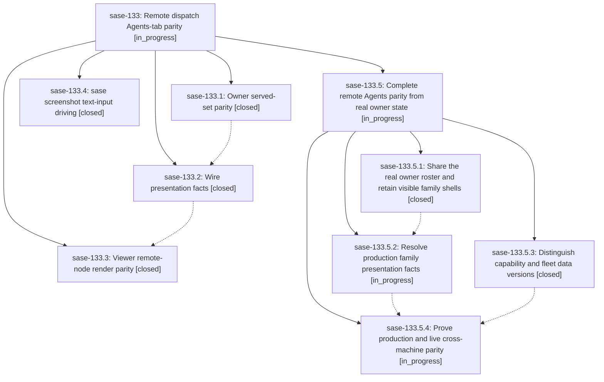

# Bead: sase-133 — Remote dispatch Agents-tab parity

[Bead Pages](../README.md) / sase-133

**Status:** ◐ in_progress · **Type:** ▸ plan · **Tier:** epic
**Owner:** `bryanbugyi34@gmail.com` · **Created by:** [bbugyi200.athena.0na](https://github.com/sase-org/sase--agents/blob/main/families/bbugyi200.athena.0na.md) · **Assignee:** `sase-133.land`
**Created:** 2026-09-18 16:37:57 EDT
**Plan:** [202609/remote\_dispatch\_agents\_tab\_parity.md](https://github.com/sase-org/sase--plans/blob/main/202609/remote_dispatch_agents_tab_parity.md)

<!-- sase:links:start -->

## Links

| Relation | Artifact | Why |
| --- | --- | --- |
| implemented-by | [plan:202609/remote_dispatch_agents_tab_parity.md][1] | derived from the plan's `bead_id:` frontmatter field |
| related | file:explicit:5da8f82f843ffd6a5d7cf4d2 | attached via sase artifact create --bead |
| related | file:explicit:6afea0b63a45b9273428ffc2 | attached via sase artifact create --bead |
| related | file:explicit:d1d475c9a14db30b47241095 | attached via sase artifact create --bead |
| related | file:explicit:dfc574b713144c3e3c3636ec | attached via sase artifact create --bead |

[1]: https://github.com/sase-org/sase--plans/blob/main/202609/remote_dispatch_agents_tab_parity.md

<!-- sase:links:end -->

## Description

Remote machine nodes on the Agents tab are indistinguishable from local nodes except for the machine chip, and a viewer filtered to machine:X shows exactly the nodes machine X's own TUI shows — same count, grouping, statuses, and chips — with stale owner-side rows retired and `sase screenshot` able to drive query filters unattended for the cross-machine evidence captures.

## Notes

[2026-09-19T12:02:39Z · sase-133.land] LANDING AUDIT (2026-09-19): NOT READY TO CLOSE. Read the original epic plan, the epic (initially no notes and no parent), all four phase beads and all seven child notes, and the phase-2/phase-3 linked plans. Reviewed Python epic commits fa61906da, 67614ee2b, 2ec00fe68 and Rust commits b7531db, 11b8e06 against current primary HEAD 8989d0a72 and core HEAD 39602c9. The primary checkout is clean and on master; the local origin/master has no additional commits. No successful close or plan-done update is justified.

VERIFIED: phase 1 adds dismissal-first selection and a shared host observer with zombie/wrong-command/claim checks; phase 2 adds optional owner facts and separate run timestamps with v1-v3 tolerant parsing; phase 3 consumes rich supplied facts using shared rendering/grouping; phase 4 provides ordered press/type/wait and forwards it remotely. The source and fixtures substantiate those narrower changes, but not the epic's end-to-end parity claim. Phase 1's owner_served_set_matches_visible_identity_set test asserts a manually expected gateway set; it never invokes the owner's TUI loader. Phase 3's parity test supplies rich statuses and a complete family tree by hand. Neither detects the production gap below. Prior phase-2 reports of 17 unrelated test failures are historical evidence, not a fresh combined-tree verification pass; full check-full and visual review remain due after repairs.

DISCOVERED ISSUE: Production gateway presentation still does not reproduce owner rows. fleet_presentation.rs excludes all dead family_member rows; the TUI _fleet_refresh.py requests presentation scope only, so those shells never reach the viewer. fleet_reads.rs PresentationContext is built only from served records and cannot reconstruct actual modern family roots/shells from omitted records. display_status_for_record uses coarse marker-derived RUNNING/WAITING/DONE and generic done.status_label; it does not reproduce the actual owner family/plan/monitor status pipeline. Local running loaders also explicitly preserve pending-gate claims whose creator PID is dead, so indiscriminate dead-PID retirement must be checked against real local shell lifecycle, not just the mocked liveness fixture.

LIVE EVIDENCE: apollo runs sase 0.17.1+914.g423316a05 and gateway/core 0.34.63, which include this epic. Athena capture uses the same installed Python revision with core 0.34.59 (also after this epic's core changes). The authenticated live catalog is schema v4 with 41 presentation rows, including 0n--plan and 0k--plan as DONE gates without parent linkage. The real owner renders those families as TALE DONE x7 and EPIC CREATED checkmark x7. A settled owner capture reports 20 agents, all done, panels default=8, epic=6, research=6. A near-contemporaneous machine:apollo viewer capture reports 30 agents (R1 W4 D25), filter 17/17, and panels default=1, epic=23, research=6. Counts use different surfaces and are not assumed interchangeable; their disagreement and the explicit family render mismatch require repair. Captures are failure evidence, not final same-build acceptance. The initial owner screenshot is file:explicit:5da8f82f843ffd6a5d7cf4d2; live catalog is file:explicit:d1d475c9a14db30b47241095. Settled owner/viewer capture refs are appended separately.

DISCOVERED ISSUE: machine_handler._version_skew compares capability_schema_version with fleet_contract_schema. Gateway hello intentionally has a v1 capability envelope while catalog rows are v4. A focused probe with matching local/remote 0.34.63 still falsely reports fleet contract remote schema v1 != local v4. Phase 2 updated tests to expect that false warning. Fix this integration contract, retaining independent protocol/capability/fleet schemas and genuine old-gateway diagnostics.

POST-START INTEGRATION: reviewed non-epic changes since fa61906da, plus Rust post-b7531db commits. The newer Agents-list projection (13a8efbb4 / core 8e1b8b6) must be covered by the real fixture oracle while retaining bounded loads; startup scheduling and metadata-only defaults (bb332b5aa, 59c82a36e, 5d158ad65) must remain intact. The screenshot login-shell deduplication d4c028772 preserves ordered forwarding. Hold selector/admission changes and tool-run/service additions do not directly consume this fleet projection, but waiting/gate fixtures must reflect current lifecycle. Screenshot maintenance now requires reviewed generated goldens. The core source pin already includes the epic commits; no ratchet-only substitute fixes the observed missing semantics.

FOLLOW-UP DISPOSITIONS: sase-133.4 note 2 (ArtifactFileCache/MultiPrompt/TailCache) is declined as already resolved: bb332b5aa privatized definitions and 8989d0a72 removed unused aliases/lazy exports. No duplicate task created. Note 1 (--type reference-memory documentation) is not a semantic duplicate of sase-12x, which only corrects the resvg dependency advice. Read sase_new_task and memory-write policy, searched all-status tasks, swept last week's tasks, and reviewed active epic inventory. The missing --type guidance is caused by this epic, so it is retained here under the active-epic routing rule rather than filed as an unrelated task or silently edited. The original plan explicitly requested a memory-task disposition; the eventual parent lander must settle that documented proposal under the memory authorization policy before close. No memory file was edited and no plan step proposes an unauthorized memory change. The screenshot CLI flow itself worked with -p /, a wait for INSERT, literal typing, a wait for the query text, and Enter; early attempts without focus waits either encountered notifications or lost typed text.

NEXT: propose a remaining-work child epic with parent_bead: sase-133. Keep this epic and its linked plan open until real owner-to-gateway-to-viewer parity, truthful version diagnostics, deployment evidence, and exhaustive verification are complete. sase bead epic-symbols sase-133 reports no entries. After the child lands, its lander must re-audit this note, the original seven phase notes, follow-up outcomes, all descendants, linked plans, and intervening drift before resuming normal ancestor landing. No parent close/symvision/status-update phase belongs in the child plan.

SETTLED CAPTURE REFS: owner file:explicit:dfc574b713144c3e3c3636ec; viewer file:explicit:6afea0b63a45b9273428ffc2. Both PNGs visually inspected; same 160x60 geometry and status grouping. Viewer screenshot has a nonblocking update toast, but identities, row statuses, filter, and all tribe banners remain readable. No gate was resolved for the captures.

## Phases

| Bead | Title | Status | Size | Created | Agents | Commits |
|---|---|---|---|---|---:|---:|
| [sase-133.1](sase-133.1.md) | Owner served-set parity | ✓ closed | large | 2026-09-18 | 1 | 1 |
| [sase-133.2](sase-133.2.md) | Wire presentation facts | ✓ closed | large | 2026-09-18 | 1 | 2 |
| [sase-133.3](sase-133.3.md) | Viewer remote-node render parity | ✓ closed | large | 2026-09-18 | 1 | 1 |
| [sase-133.4](sase-133.4.md) | sase screenshot text-input driving | ✓ closed | medium | 2026-09-18 | 1 | 1 |

## Lineage

## Agents

| Agent | Bead | Commits |
|---|---|---:|
| [bbugyi200.athena.sase-133.1](https://github.com/sase-org/sase--agents/blob/main/families/bbugyi200.athena.sase-133.1.md) | [sase-133.1](sase-133.1.md) | 1 |
| [bbugyi200.athena.sase-133.2](https://github.com/sase-org/sase--agents/blob/main/families/bbugyi200.athena.sase-133.2.md) | [sase-133.2](sase-133.2.md) | 2 |
| [bbugyi200.athena.sase-133.3](https://github.com/sase-org/sase--agents/blob/main/families/bbugyi200.athena.sase-133.3.md) | [sase-133.3](sase-133.3.md) | 1 |
| [bbugyi200.athena.sase-133.4](https://github.com/sase-org/sase--agents/blob/main/agents/bbugyi200.athena.sase-133.4/README.md) | [sase-133.4](sase-133.4.md) | 1 |
| [bbugyi200.athena.sase-133.5.1](https://github.com/sase-org/sase--agents/blob/main/families/bbugyi200.athena.sase-133.5.1.md) | [sase-133.5.1](sase-133.5.1.md) | 2 |
| [bbugyi200.athena.sase-133.5.2](https://github.com/sase-org/sase--agents/blob/main/families/bbugyi200.athena.sase-133.5.2.md) | [sase-133.5.2](sase-133.5.2.md) | 1 |
| [bbugyi200.athena.sase-133.5.3](https://github.com/sase-org/sase--agents/blob/main/families/bbugyi200.athena.sase-133.5.3.md) | [sase-133.5.3](sase-133.5.3.md) | 2 |
| [bbugyi200.athena.sase-133.5.4](https://github.com/sase-org/sase--agents/blob/main/agents/bbugyi200.athena.sase-133.5.4/README.md) | [sase-133.5.4](sase-133.5.4.md) | 0 |
| [bbugyi200.athena.sase-133.5.land](https://github.com/sase-org/sase--agents/blob/main/agents/bbugyi200.athena.sase-133.5.land/README.md) | [sase-133.5](sase-133.5.md) | 0 |
| [bbugyi200.athena.sase-133.land](https://github.com/sase-org/sase--agents/blob/main/families/bbugyi200.athena.sase-133.land.md) | [sase-133](README.md) | 0 |

## Commits

| Repo | Commit | Subject | Bead | Committed |
|---|---|---|---|---|
| sase | [`fa61906`](https://github.com/sase-org/sase/commit/fa61906da0978519d060f62eacd7417acaf02cb0) | feat(screenshot): add argv-ordered --type text driving | [sase-133.4](sase-133.4.md) | 2026-09-18 17:41:05 EDT |
| sase-core | [`sase-core@b7531db`](https://github.com/sase-org/sase-core/commit/b7531dbeae28d447f973381d9d486f7db6e88315) | fix(fleet): honor owner dismissal and strong host liveness in the served set | [sase-133.1](sase-133.1.md) | 2026-09-18 17:42:01 EDT |
| sase | [`67614ee`](https://github.com/sase-org/sase/commit/67614ee2b01e6f2e6e2b8c6fe9fd21e4394b0956) | feat(fleet): consume owner presentation facts | [sase-133.2](sase-133.2.md) | 2026-09-18 20:08:07 EDT |
| sase-core | [`sase-core@11b8e06`](https://github.com/sase-org/sase-core/commit/11b8e060fe88d0a147b8449050d61a5f29038b9c) | feat(fleet): expose owner-resolved presentation facts | [sase-133.2](sase-133.2.md) | 2026-09-18 20:10:33 EDT |
| sase | [`2ec00fe`](https://github.com/sase-org/sase/commit/2ec00fe68360d40767990d563b9c432a42acf921) | feat(tui): render remote fleet rows with local Agents-tab parity | [sase-133.3](sase-133.3.md) | 2026-09-18 21:36:20 EDT |
| sase | [`ad0670d`](https://github.com/sase-org/sase/commit/ad0670d959f0379f2ce948030a5e21ce1f6950e2) | fix(dispatch): compare fleet-data versions instead of capability schema | [sase-133.5.3](sase-133.5.3.md) | 2026-09-19 10:41:47 EDT |
| sase-core | [`sase-core@2b9caf4`](https://github.com/sase-org/sase-core/commit/2b9caf4e47da76a35f48c3e02ee5f7f68e523cc1) | feat(gateway): advertise fleet\_contract\_schema\_version independently of capabilities | [sase-133.5.3](sase-133.5.3.md) | 2026-09-19 10:44:46 EDT |
| sase | [`7d6ec55`](https://github.com/sase-org/sase/commit/7d6ec552b5d0650e06682075b422b98fc3d6727e) | feat(tui): attach unparented family shells and oracle owner-roster parity | [sase-133.5.1](sase-133.5.1.md) | 2026-09-19 11:38:22 EDT |
| sase-core | [`sase-core@8acae32`](https://github.com/sase-org/sase-core/commit/8acae3297f0c4db55905baf2a190f7f4ac818a37) | feat(fleet): share family-shell classifier and assemble catalog in core | [sase-133.5.1](sase-133.5.1.md) | 2026-09-19 11:41:40 EDT |
| sase | [`2631449`](https://github.com/sase-org/sase/commit/263144991496900af018d7470257dc841555d873) | feat(fleet): carry owner presentation facts through the viewer catalog adapter | [sase-133.5.2](sase-133.5.2.md) | 2026-09-20 08:17:33 EDT |
