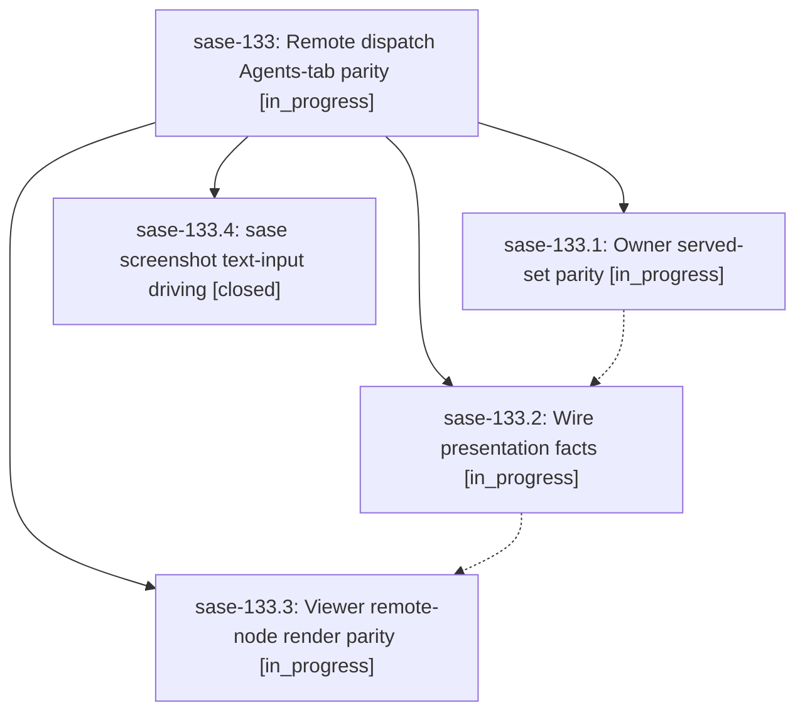

# Bead: sase-133 — Remote dispatch Agents-tab parity

[Bead Pages](../README.md) / sase-133

**Status:** ◐ in_progress · **Type:** ▸ plan · **Tier:** epic
**Owner:** `bryanbugyi34@gmail.com` · **Created by:** [bbugyi200.athena.0na](https://github.com/sase-org/sase--agents/blob/main/families/bbugyi200.athena.0na.md) · **Assignee:** `sase-133.land`
**Created:** 2026-09-18 16:37:57 EDT
**Plan:** [202609/remote\_dispatch\_agents\_tab\_parity.md](https://github.com/sase-org/sase--plans/blob/main/202609/remote_dispatch_agents_tab_parity.md)

<!-- sase:links:start -->

## Links

| Relation | Artifact | Why |
| --- | --- | --- |
| implemented-by | [plan:202609/remote_dispatch_agents_tab_parity.md][1] | derived from the plan's `bead_id:` frontmatter field |

[1]: https://github.com/sase-org/sase--plans/blob/main/202609/remote_dispatch_agents_tab_parity.md

<!-- sase:links:end -->

## Description

Remote machine nodes on the Agents tab are indistinguishable from local nodes except for the machine chip, and a viewer filtered to machine:X shows exactly the nodes machine X's own TUI shows — same count, grouping, statuses, and chips — with stale owner-side rows retired and `sase screenshot` able to drive query filters unattended for the cross-machine evidence captures.

## Phases

| Bead | Title | Status | Size | Created | Agents | Commits |
|---|---|---|---|---|---:|---:|
| [sase-133.1](sase-133.1.md) | Owner served-set parity | ◐ in_progress | large | 2026-09-18 | 1 | 0 |
| [sase-133.2](sase-133.2.md) | Wire presentation facts | ◐ in_progress | large | 2026-09-18 | 1 | 0 |
| [sase-133.3](sase-133.3.md) | Viewer remote-node render parity | ◐ in_progress | large | 2026-09-18 | 1 | 0 |
| [sase-133.4](sase-133.4.md) | sase screenshot text-input driving | ✓ closed | medium | 2026-09-18 | 1 | 1 |

## Lineage

## Agents

| Agent | Bead | Commits |
|---|---|---:|
| [bbugyi200.athena.sase-133.1](https://github.com/sase-org/sase--agents/blob/main/families/bbugyi200.athena.sase-133.1.md) | [sase-133.1](sase-133.1.md) | 0 |
| [bbugyi200.athena.sase-133.2](https://github.com/sase-org/sase--agents/blob/main/agents/bbugyi200.athena.sase-133.2/README.md) | [sase-133.2](sase-133.2.md) | 0 |
| [bbugyi200.athena.sase-133.3](https://github.com/sase-org/sase--agents/blob/main/agents/bbugyi200.athena.sase-133.3/README.md) | [sase-133.3](sase-133.3.md) | 0 |
| [bbugyi200.athena.sase-133.4](https://github.com/sase-org/sase--agents/blob/main/agents/bbugyi200.athena.sase-133.4/README.md) | [sase-133.4](sase-133.4.md) | 1 |
| [bbugyi200.athena.sase-133.land](https://github.com/sase-org/sase--agents/blob/main/agents/bbugyi200.athena.sase-133.land/README.md) | [sase-133](README.md) | 0 |

## Commits

| Repo | Commit | Subject | Bead | Committed |
|---|---|---|---|---|
| sase | [`fa61906`](https://github.com/sase-org/sase/commit/fa61906da0978519d060f62eacd7417acaf02cb0) | feat(screenshot): add argv-ordered --type text driving | [sase-133.4](sase-133.4.md) | 2026-09-18 17:41:05 EDT |
