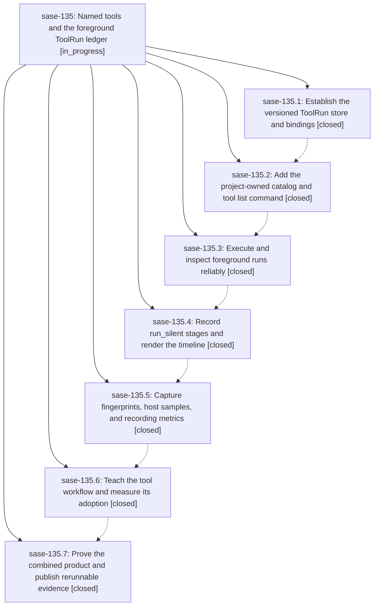

# Bead: sase-135 — Named tools and the foreground ToolRun ledger

[Bead Pages](../README.md) / sase-135

**Status:** ◐ in_progress · **Type:** ▸ plan · **Tier:** epic
**Owner:** `bryanbugyi34@gmail.com` · **Created by:** [bbugyi200.athena.0nm](https://github.com/sase-org/sase--agents/blob/main/families/bbugyi200.athena.0nm.md) · **Assignee:** `sase-135.land`
**Created:** 2026-09-18 22:19:17 EDT
**Plan:** [202609/tool\_e1\_named\_tools.md](https://github.com/sase-org/sase--plans/blob/main/202609/tool_e1_named_tools.md)

<!-- sase:links:start -->

## Links

| Relation | Artifact | Why |
| --- | --- | --- |
| implemented-by | [plan:202609/tool_e1_named_tools.md][1] | derived from the plan's `bead_id:` frontmatter field |

[1]: https://github.com/sase-org/sase--plans/blob/main/202609/tool_e1_named_tools.md

<!-- sase:links:end -->

## Description

Deliver project-owned named commands and a Rust-owned, machine-local ToolRun ledger through sase tool list/run/runs/show, preserving command behavior while recording stages, fingerprints, and host load, with bounded retention, adoption guidance, and reproducible black-box acceptance evidence.

## Phases

| Bead | Title | Status | Size | Created | Agents | Commits |
|---|---|---|---|---|---:|---:|
| [sase-135.1](sase-135.1.md) | Establish the versioned ToolRun store and bindings | ✓ closed | medium | 2026-09-18 | 1 | 2 |
| [sase-135.2](sase-135.2.md) | Add the project-owned catalog and tool list command | ✓ closed | medium | 2026-09-18 | 1 | 1 |
| [sase-135.3](sase-135.3.md) | Execute and inspect foreground runs reliably | ✓ closed | medium | 2026-09-18 | 1 | 1 |
| [sase-135.4](sase-135.4.md) | Record run\_silent stages and render the timeline | ✓ closed | medium | 2026-09-18 | 1 | 1 |
| [sase-135.5](sase-135.5.md) | Capture fingerprints, host samples, and recording metrics | ✓ closed | medium | 2026-09-18 | 1 | 2 |
| [sase-135.6](sase-135.6.md) | Teach the tool workflow and measure its adoption | ✓ closed | medium | 2026-09-18 | 1 | 1 |
| [sase-135.7](sase-135.7.md) | Prove the combined product and publish rerunnable evidence | ✓ closed | medium | 2026-09-18 | 1 | 2 |

## Lineage

## Agents

| Agent | Bead | Commits |
|---|---|---:|
| [bbugyi200.athena.sase-135.1](https://github.com/sase-org/sase--agents/blob/main/families/bbugyi200.athena.sase-135.1.md) | [sase-135.1](sase-135.1.md) | 2 |
| [bbugyi200.athena.sase-135.2](https://github.com/sase-org/sase--agents/blob/main/agents/bbugyi200.athena.sase-135.2/README.md) | [sase-135.2](sase-135.2.md) | 1 |
| [bbugyi200.athena.sase-135.3](https://github.com/sase-org/sase--agents/blob/main/agents/bbugyi200.athena.sase-135.3/README.md) | [sase-135.3](sase-135.3.md) | 1 |
| [bbugyi200.athena.sase-135.4](https://github.com/sase-org/sase--agents/blob/main/agents/bbugyi200.athena.sase-135.4/README.md) | [sase-135.4](sase-135.4.md) | 1 |
| [bbugyi200.athena.sase-135.5](https://github.com/sase-org/sase--agents/blob/main/agents/bbugyi200.athena.sase-135.5/README.md) | [sase-135.5](sase-135.5.md) | 2 |
| [bbugyi200.athena.sase-135.6](https://github.com/sase-org/sase--agents/blob/main/agents/bbugyi200.athena.sase-135.6/README.md) | [sase-135.6](sase-135.6.md) | 1 |
| [bbugyi200.athena.sase-135.7](https://github.com/sase-org/sase--agents/blob/main/families/bbugyi200.athena.sase-135.7.md) | [sase-135.7](sase-135.7.md) | 2 |
| [bbugyi200.athena.sase-135.land](https://github.com/sase-org/sase--agents/blob/main/agents/bbugyi200.athena.sase-135.land/README.md) | [sase-135](README.md) | 0 |

## Commits

| Repo | Commit | Subject | Bead | Committed |
|---|---|---|---|---|
| sase | [`9cfa200`](https://github.com/sase-org/sase/commit/9cfa20067519122b6737890dff68a883d43e49d2) | feat(tool-run): land V1 ToolRun bindings, disk owner, and smokes | [sase-135.1](sase-135.1.md) | 2026-09-19 04:46:06 EDT |
| sase-core | [`sase-core@44b82c3`](https://github.com/sase-org/sase-core/commit/44b82c3e392bb4642fbb909a2d656b8e94d2cadd) | feat(tool-run): add ToolRun store, PyO3 bindings, and reserved tool kind | [sase-135.1](sase-135.1.md) | 2026-09-19 04:56:12 EDT |
| sase | [`423316a`](https://github.com/sase-org/sase/commit/423316a05119ce40327edb864eff941013424bc6) | feat(tool): add the project-owned catalog and sase tool list | [sase-135.2](sase-135.2.md) | 2026-09-19 06:13:22 EDT |
| sase | [`91b6767`](https://github.com/sase-org/sase/commit/91b67672b4f23dfb4f8eae10394de46195edd24f) | feat(cli): add foreground ToolRun execution and run/runs/show | [sase-135.3](sase-135.3.md) | 2026-09-19 08:23:04 EDT |
| sase | [`a4eb8dd`](https://github.com/sase-org/sase/commit/a4eb8dd0eed0ced1c4d019d0585b097d3833924a) | feat(tool): record run\_silent stages and render ToolRun timelines | [sase-135.4](sase-135.4.md) | 2026-09-19 10:30:48 EDT |
| sase | [`1f6adf4`](https://github.com/sase-org/sase/commit/1f6adf43bb2b77a52f57c985beb4de1e966dfa8a) | feat(tool): capture ToolRun fingerprints, host samples, and recording metrics | [sase-135.5](sase-135.5.md) | 2026-09-19 12:43:07 EDT |
| sase-core | [`sase-core@e8578c1`](https://github.com/sase-org/sase-core/commit/e8578c1eea01968b7f5cf6a2d9cf9554df5f33c9) | feat(tool-run): persist canonical before/after fingerprints on finish | [sase-135.5](sase-135.5.md) | 2026-09-19 12:46:15 EDT |
| sase | [`9cfb06a`](https://github.com/sase-org/sase/commit/9cfb06a548aefb28f04ea408eae0ce5c01d95d8d) | docs(tool): teach the named-tool workflow and add adoption report | [sase-135.6](sase-135.6.md) | 2026-09-20 06:55:42 EDT |
| sase | [`58f2de8`](https://github.com/sase-org/sase/commit/58f2de8f80e88754ca4905322855f463e3f0d840) | feat(tool): make ToolRun output truncation explicit and prove E1 end to end | [sase-135.7](sase-135.7.md) | 2026-09-20 10:34:36 EDT |
| sase-core | [`sase-core@1db3b29`](https://github.com/sase-org/sase-core/commit/1db3b298f5f1ff35148ba808802252dd7d225726) | feat(tool-run): apply the aggregate log\_max\_bytes retention target | [sase-135.7](sase-135.7.md) | 2026-09-20 10:37:53 EDT |
