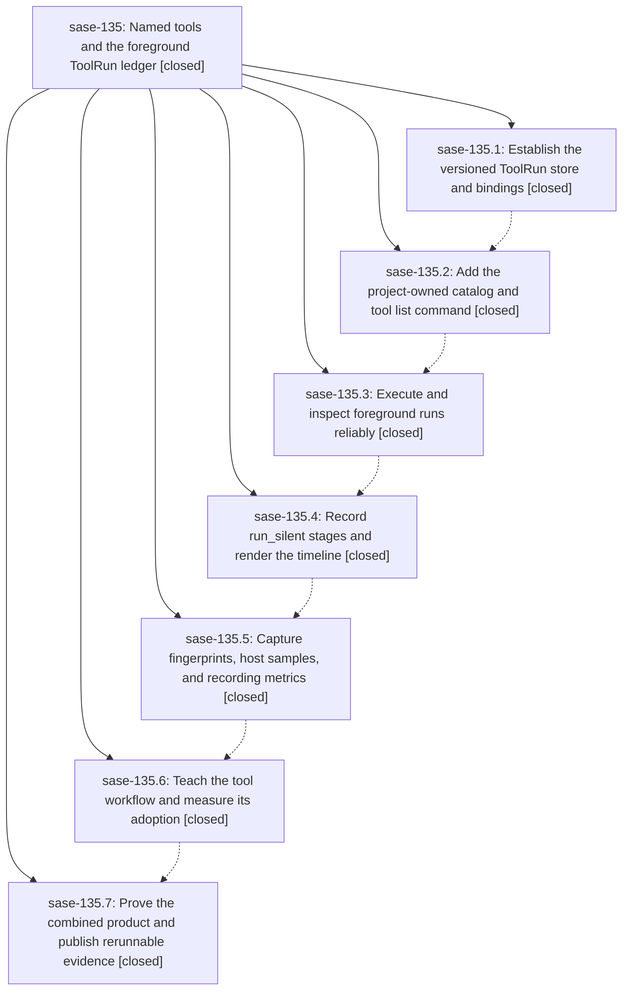

# Bead: sase-135 — Named tools and the foreground ToolRun ledger

[Bead Pages](../README.md) / sase-135

**Status:** ✓ closed · **Resolution:** done · **Type:** ▸ plan · **Tier:** epic
**Owner:** `bryanbugyi34@gmail.com` · **Created by:** [bbugyi200.athena.0nm](https://github.com/sase-org/sase--agents/blob/main/families/bbugyi200.athena.0nm.md) · **Assignee:** `sase-135.land`
**Created:** 2026-09-18 22:19:17 EDT · **Closed:** 2026-09-20 12:24:34 EDT
**Plan:** [202609/tool\_e1\_named\_tools.md](https://github.com/sase-org/sase--plans/blob/main/202609/tool_e1_named_tools.md)

<!-- sase:links:start -->

## Links

| Relation | Artifact | Why |
| --- | --- | --- |
| implemented-by | [plan:202609/tool_e1_named_tools.md][1] | derived from the plan's `bead_id:` frontmatter field |

[1]: https://github.com/sase-org/sase--plans/blob/main/202609/tool_e1_named_tools.md

<!-- sase:links:end -->

## Description

Deliver project-owned named commands and a Rust-owned, machine-local ToolRun ledger through sase tool list/run/runs/show, preserving command behavior while recording stages, fingerprints, and host load, with bounded retention, adoption guidance, and reproducible black-box acceptance evidence.

## Notes

[2026-09-20T16:24:34Z · sase-135.land] E1 landing verification at master 9a56fc1294 (workspace sase_10, fresh `just install`; core built from pinned 39602c95 = v0.34.63 via the linked sase-core checkout at 1db3b29).

\## 1. Verification

Reviewed all seven phase beads, every note, and the linked plan `plan:202609/tool_e1_named_tools.md`. All seven phases are closed `done` with no unaddressed note, and the shipped code matches what each phase reported: the project-owned catalog (`sase/sase.yml` `tools:` with five named tools, `src/sase/config/tools.py`), the CLI surface (`src/sase/main/parser_tool.py` list/run/runs/show, `src/sase/tool/{executor,logs,observe,ownership,query,render,sample,liveness,stage_protocol,argv}.py`), the Rust store (`sase-core crates/sase_core/src/tool_run/{store,catalog,canonical,fingerprint,wire}.rs` from 44b82c3, e8578c1, 1db3b29), the disk owner `tool_run_retention`, `docs/tool.md` plus mkdocs nav, `tools/tool_adoption_report` with `just tool-adoption`, and the `tool` entry in compact root help.

Independently re-ran the acceptance harness rather than trusting phase 7's report:

- `tools/smoke_sase_tool_runs --sase .venv/bin/sase` -> `failed=0 not-run=3` (the three `--live` cases).
- `tools/smoke_sase_tool_runs --sase .venv/bin/sase --live` -> **35/35 pass, failed=0, not-run=0**, DoD-1 through DoD-13 all `pass`, including `dod-13-overhead`.

Dogfooded the feature: `sase tool run check` twice, `sase tool list` (LAST/TYPICAL populated, `check-full failed/1 15.1s (n=1)` from phase 7's monitor-owned run), `sase tool runs`, `sase tool show -j`. Confirmed the three ledger rows sitting in `running` are correct, not stuck: their `wrapper_pid`/`boot_id` resolve to live `sase tool run check` processes in sibling workspaces, so `tool_run_reconcile` is right to leave them unsettled.

DoD-12 post-landing check: `tools/tool_adoption_report -d 7 -j` now reports 637 raw / 6 wrapped / 220 ambiguous heavy calls against phase 6's 654 / 0 / 194 baseline — the first wrapped invocations are appearing.

Gate results at this tree:

- `just check` stops at **lint (symvision)** on 26 unused public symbols. Confirmed unrelated: all six owning files were added by non-epic refactors (3bfec5f704, 5b25837696, c18991b23e, 5082ca8cf3). Owner `sase-13s` (open); +1 recorded.
- Ran the stages symvision aborts: lint (toobig), SASE validation, committed plans, and the core-floor probe all pass.
- `just test` (full, 17m38s) and then `just test-scoped` (escalated to the full lane by `core-identity-changed`, 13m19s): **43710 passed, 15 skipped**, 3 failures, all unrelated and all owned — `sase-13n` (lazy tier2 reconcile), `sase-13q` (capacity gate queue_weight, stale vs 28d1e87083). `sase-120`'s git-identity node failed once under load average ~30 and passed on rerun. +1 recorded on each.
- `sase bead epic-symbols sase-135` and each of `.1`-`.7`: no entries. Nothing to retire or re-key.

Per this landing's instructions and `decisions:check-full-is-explicit` (28d1e87083, which landed mid-epic), `just check` is the gate; `just check-full` was not run.

\## 2. Integration with changes landed since the epic started

52 commits landed between 9cfa200675 and HEAD. Two genuinely interacted, and one was broken:

**Fixed — contract-manifest conflict (epic-caused).** `5023214dbf` (sase-iu) deliberately admitted `tests/test_tool_adoption_report_tool.py` to `tests/contract_manifest.txt` and re-curated `_MANIFEST_ENTRY_BUDGET` 66 -> 67 with a written rationale. About an hour later, epic commit `58f2de8f80` (phase 7) removed `pytestmark = pytest.mark.contract` from that same file without refreshing the manifest, re-breaking `test_contract_manifest_matches_marker_selection` in the opposite direction (manifest 67, marker 66). Restored the marker, honoring sase-iu's curation: `tools/tool_adoption_report` is not an import-graph node, so `RULE_CONTRACT_SET_ONLY` fires and the contract set is that script's only scoped-selection coverage. `pytest tests/test_contract_manifest.py -q` -> 3 passed. Noted on `sase-13m`.

**Fixed — portability defect in the epic's own test (epic-caused).** `tests/tool/test_executor.py::test_literal_argv_preserves_spaces_and_dashes`, added by phase 5 (`1f6adf43b`), passed a bare `"python"` as the literal argv head. Athena masks this with a pyenv shim; apollo ships only `python3`, so it exits 127 there. Switched to `sys.executable`, matching what the smoke harness already does (`tools/_smoke_tool_runs_helper.py:62`). Filed minutes earlier by the sase-zr.7 land agent as `sase-140`; accepted as epic work, fixed, and closed. `pytest tests/tool/test_executor.py -q` -> 14 passed.

**Already integrated — check-full became explicit-only mid-epic.** `28d1e87083` landed `decisions:check-full-is-explicit` on 2026-09-19, after this epic's plan was written. Phase 6 landed afterward and reconciled correctly: `sase/memory/lint_and_test.md` carries both the "prefer `sase tool run check`" guidance and the explicit-only rule, and `src/sase/xprompts/skills/sase_monitor.md` routes the explicit case through `-- sase tool run check-full`. `docs/tool.md`'s only `check-full` mention is descriptive. No conflict, no duplication.

**Checked, no action needed.** `0fc51c2998` ratcheted `sase-core-revision.txt` to 39602c95 = v0.34.63, which contains 44b82c3 — this satisfies phase 1's deferred pin condition. The two later epic core commits (e8578c1, 1db3b29) are published on sase-core `origin/master` and the scheduled Core Pin Ratchet workflow advances the pin on its own; neither adds a binding name, and no Python test asserts their behavior, so CI at the current pin is not reddened. Also reviewed the fleet/TUI, service, llm-provider, and sdd commits from this window: none touch a ToolRun surface (E5 owns ToolRun TUI, explicitly out of scope).

\## 3. Follow-up disposition

Every `PROPOSED FOLLOW-UP:` note from the child beads is accounted for:

- **New tasks:** `sase-141` (no run id printed when the child fails to launch), `sase-143` (retention never selects quarantined `runs.sqlite.corrupt-*` stores), `sase-145` (persist ToolRun finish diagnostics in sase-core), `sase-146` (move `tool_adoption_report` pairing/classification/aggregation into Rust), `sase-147` (raise the floor to >=0.34.63 and admit `smoke_sase_core_rs_tool_runs` to the release-core-floor job), `sase-148` (`tools/AGENTS.md` still says `phase-pending` where the harness now says `not-run`; filed rather than edited, since agent-instruction files need explicit user approval).
- **Corroborated instead of refiled:** the zsh `sbd` completion flake -> +1 on `sase-13a`; the symvision half of phase 6's "red at clean HEAD" note -> +1 on `sase-13s`.
- **Resolved, no task:** the mypy half of phase 6's note — `sase-13k` is closed and `45df425498` is on master; `just check` now passes lint (mypy). Phase 1's pin follow-up — the pin already contains the ToolRun core SHA; only the published-floor half survives, as `sase-147`.
- **Declined:** phase 7's proposal to rerun `sase tool run check-full` under a verify monitor on a rebased tree to turn DoD-13 `pass`. Superseded by `decisions:check-full-is-explicit`, which landed mid-epic: `just check-full` is no longer an agent-initiated recipe, and a `just check` pass with a `just check-full` failure is a test-infrastructure bug rather than epic work. DoD-13's substance is met at this tree without it — `just check`'s lint and validation stages, the escalated full test lane, the core-floor probe, the harness `dod-13-overhead` case, and empty `epic-symbols` are all recorded above, and every remaining failure has a demonstrated baseline and a named owner rather than a blanket waiver.

## Phases

| Bead | Title | Status | Size | Created | Agents | Commits |
|---|---|---|---|---|---:|---:|
| [sase-135.1](sase-135.1.md) | Establish the versioned ToolRun store and bindings | ✓ closed | medium | 2026-09-18 | 1 | 2 |
| [sase-135.2](sase-135.2.md) | Add the project-owned catalog and tool list command | ✓ closed | medium | 2026-09-18 | 1 | 1 |
| [sase-135.3](sase-135.3.md) | Execute and inspect foreground runs reliably | ✓ closed | medium | 2026-09-18 | 1 | 1 |
| [sase-135.4](sase-135.4.md) | Record run\_silent stages and render the timeline | ✓ closed | medium | 2026-09-18 | 1 | 1 |
| [sase-135.5](sase-135.5.md) | Capture fingerprints, host samples, and recording metrics | ✓ closed | medium | 2026-09-18 | 1 | 2 |
| [sase-135.6](sase-135.6.md) | Teach the tool workflow and measure its adoption | ✓ closed | medium | 2026-09-18 | 1 | 1 |
| [sase-135.7](sase-135.7.md) | Prove the combined product and publish rerunnable evidence | ✓ closed | medium | 2026-09-18 | 1 | 2 |

## Lineage

## Agents

| Agent | Bead | Commits |
|---|---|---:|
| [bbugyi200.athena.sase-135.1](https://github.com/sase-org/sase--agents/blob/main/families/bbugyi200.athena.sase-135.1.md) | [sase-135.1](sase-135.1.md) | 2 |
| [bbugyi200.athena.sase-135.2](https://github.com/sase-org/sase--agents/blob/main/agents/bbugyi200.athena.sase-135.2/README.md) | [sase-135.2](sase-135.2.md) | 1 |
| [bbugyi200.athena.sase-135.3](https://github.com/sase-org/sase--agents/blob/main/agents/bbugyi200.athena.sase-135.3/README.md) | [sase-135.3](sase-135.3.md) | 1 |
| [bbugyi200.athena.sase-135.4](https://github.com/sase-org/sase--agents/blob/main/agents/bbugyi200.athena.sase-135.4/README.md) | [sase-135.4](sase-135.4.md) | 1 |
| [bbugyi200.athena.sase-135.5](https://github.com/sase-org/sase--agents/blob/main/agents/bbugyi200.athena.sase-135.5/README.md) | [sase-135.5](sase-135.5.md) | 2 |
| [bbugyi200.athena.sase-135.6](https://github.com/sase-org/sase--agents/blob/main/agents/bbugyi200.athena.sase-135.6/README.md) | [sase-135.6](sase-135.6.md) | 1 |
| [bbugyi200.athena.sase-135.7](https://github.com/sase-org/sase--agents/blob/main/families/bbugyi200.athena.sase-135.7.md) | [sase-135.7](sase-135.7.md) | 2 |
| [bbugyi200.athena.sase-135.land](https://github.com/sase-org/sase--agents/blob/main/agents/bbugyi200.athena.sase-135.land/README.md) | [sase-135](README.md) | 2 |

## Commits

| Repo | Commit | Subject | Bead | Committed |
|---|---|---|---|---|
| sase | [`9cfa200`](https://github.com/sase-org/sase/commit/9cfa20067519122b6737890dff68a883d43e49d2) | feat(tool-run): land V1 ToolRun bindings, disk owner, and smokes | [sase-135.1](sase-135.1.md) | 2026-09-19 04:46:06 EDT |
| sase-core | [`sase-core@44b82c3`](https://github.com/sase-org/sase-core/commit/44b82c3e392bb4642fbb909a2d656b8e94d2cadd) | feat(tool-run): add ToolRun store, PyO3 bindings, and reserved tool kind | [sase-135.1](sase-135.1.md) | 2026-09-19 04:56:12 EDT |
| sase | [`423316a`](https://github.com/sase-org/sase/commit/423316a05119ce40327edb864eff941013424bc6) | feat(tool): add the project-owned catalog and sase tool list | [sase-135.2](sase-135.2.md) | 2026-09-19 06:13:22 EDT |
| sase | [`91b6767`](https://github.com/sase-org/sase/commit/91b67672b4f23dfb4f8eae10394de46195edd24f) | feat(cli): add foreground ToolRun execution and run/runs/show | [sase-135.3](sase-135.3.md) | 2026-09-19 08:23:04 EDT |
| sase | [`a4eb8dd`](https://github.com/sase-org/sase/commit/a4eb8dd0eed0ced1c4d019d0585b097d3833924a) | feat(tool): record run\_silent stages and render ToolRun timelines | [sase-135.4](sase-135.4.md) | 2026-09-19 10:30:48 EDT |
| sase | [`1f6adf4`](https://github.com/sase-org/sase/commit/1f6adf43bb2b77a52f57c985beb4de1e966dfa8a) | feat(tool): capture ToolRun fingerprints, host samples, and recording metrics | [sase-135.5](sase-135.5.md) | 2026-09-19 12:43:07 EDT |
| sase-core | [`sase-core@e8578c1`](https://github.com/sase-org/sase-core/commit/e8578c1eea01968b7f5cf6a2d9cf9554df5f33c9) | feat(tool-run): persist canonical before/after fingerprints on finish | [sase-135.5](sase-135.5.md) | 2026-09-19 12:46:15 EDT |
| sase | [`9cfb06a`](https://github.com/sase-org/sase/commit/9cfb06a548aefb28f04ea408eae0ce5c01d95d8d) | docs(tool): teach the named-tool workflow and add adoption report | [sase-135.6](sase-135.6.md) | 2026-09-20 06:55:42 EDT |
| sase | [`58f2de8`](https://github.com/sase-org/sase/commit/58f2de8f80e88754ca4905322855f463e3f0d840) | feat(tool): make ToolRun output truncation explicit and prove E1 end to end | [sase-135.7](sase-135.7.md) | 2026-09-20 10:34:36 EDT |
| sase-core | [`sase-core@1db3b29`](https://github.com/sase-org/sase-core/commit/1db3b298f5f1ff35148ba808802252dd7d225726) | feat(tool-run): apply the aggregate log\_max\_bytes retention target | [sase-135.7](sase-135.7.md) | 2026-09-20 10:37:53 EDT |
| sase | [`a357c83`](https://github.com/sase-org/sase/commit/a357c83dcb80c3a090a89d804ec38d6b411d5f4b) | fix(tool): reconcile the E1 landing with the contract manifest and a bare python | [sase-135](README.md) | 2026-09-20 12:31:28 EDT |
| sase--plans | [`sase--plans@3e37547`](https://github.com/sase-org/sase--plans/commit/3e37547bbdef8c8ba687f77448583dd9c652d1d6) | chore(plans): mark the E1 named-tools epic plan done | [sase-135](README.md) | 2026-09-20 12:34:23 EDT |
