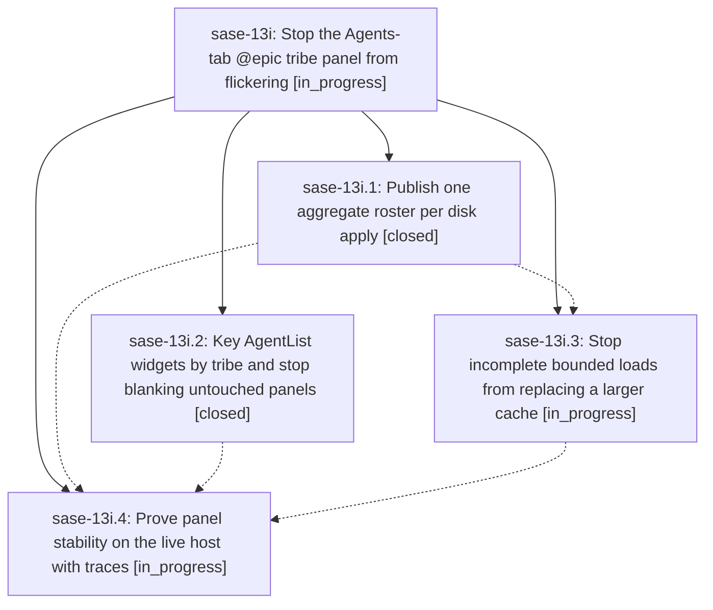

# Bead: sase-13i — Stop the Agents-tab @epic tribe panel from flickering

[Bead Pages](../README.md) / sase-13i

**Status:** ◐ in_progress · **Type:** ▸ plan · **Tier:** epic
**Owner:** `bryanbugyi34@gmail.com` · **Created by:** [bbugyi200.athena.0ns](https://github.com/sase-org/sase--agents/blob/main/families/bbugyi200.athena.0ns.md) · **Assignee:** `sase-13i.land`
**Created:** 2026-09-19 10:43:11 EDT
**Plan:** [202609/epic\_tribe\_panel\_flicker.md](https://github.com/sase-org/sase--plans/blob/main/202609/epic_tribe_panel_flicker.md)

<!-- sase:links:start -->

## Links

| Relation | Artifact | Why |
| --- | --- | --- |
| implemented-by | [plan:202609/epic_tribe_panel_flicker.md][1] | derived from the plan's `bead_id:` frontmatter field |

[1]: https://github.com/sase-org/sase--plans/blob/main/202609/epic_tribe_panel_flicker.md

<!-- sase:links:end -->

## Description

The Agents-tab @epic tribe panel stays mounted as a tribe-keyed widget across disk applies, proc-shell sync, bounded loads, and sibling-tribe occupancy churn: one logical apply publishes one roster, incomplete bounded loads never delete by omission, and a standing filter query no longer forces a full rebuild of untouched panels.

## Phases

| Bead | Title | Status | Size | Created | Agents | Commits |
|---|---|---|---|---|---:|---:|
| [sase-13i.1](sase-13i.1.md) | Publish one aggregate roster per disk apply | ✓ closed | medium | 2026-09-19 | 1 | 1 |
| [sase-13i.2](sase-13i.2.md) | Key AgentList widgets by tribe and stop blanking untouched panels | ✓ closed | medium | 2026-09-19 | 1 | 1 |
| [sase-13i.3](sase-13i.3.md) | Stop incomplete bounded loads from replacing a larger cache | ◐ in_progress | medium | 2026-09-19 | 1 | 0 |
| [sase-13i.4](sase-13i.4.md) | Prove panel stability on the live host with traces | ◐ in_progress | medium | 2026-09-19 | 1 | 0 |

## Lineage

## Agents

| Agent | Bead | Commits |
|---|---|---:|
| [bbugyi200.athena.sase-13i.1](https://github.com/sase-org/sase--agents/blob/main/agents/bbugyi200.athena.sase-13i.1/README.md) | [sase-13i.1](sase-13i.1.md) | 1 |
| [bbugyi200.athena.sase-13i.2](https://github.com/sase-org/sase--agents/blob/main/agents/bbugyi200.athena.sase-13i.2/README.md) | [sase-13i.2](sase-13i.2.md) | 1 |
| [bbugyi200.athena.sase-13i.3](https://github.com/sase-org/sase--agents/blob/main/agents/bbugyi200.athena.sase-13i.3/README.md) | [sase-13i.3](sase-13i.3.md) | 0 |
| [bbugyi200.athena.sase-13i.4](https://github.com/sase-org/sase--agents/blob/main/agents/bbugyi200.athena.sase-13i.4/README.md) | [sase-13i.4](sase-13i.4.md) | 0 |
| [bbugyi200.athena.sase-13i.land](https://github.com/sase-org/sase--agents/blob/main/agents/bbugyi200.athena.sase-13i.land/README.md) | [sase-13i](README.md) | 0 |

## Commits

| Repo | Commit | Subject | Bead | Committed |
|---|---|---|---|---|
| sase | [`9831ab6`](https://github.com/sase-org/sase/commit/9831ab623c039e3b90730aa30129f256328bf26f) | feat(tui): publish one aggregate Agents roster per disk apply | [sase-13i.1](sase-13i.1.md) | 2026-09-19 12:23:33 EDT |
| sase | [`45a7895`](https://github.com/sase-org/sase/commit/45a7895b6b98360ac447352a570c75ca1ea7a180) | feat(tui): key AgentList widgets by tribe and skip sibling rebuilds | [sase-13i.2](sase-13i.2.md) | 2026-09-19 12:54:53 EDT |
