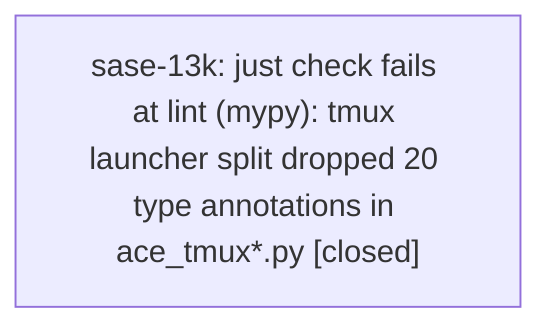

# Bead: sase-13k — just check fails at lint (mypy): tmux launcher split dropped 20 type annotations in ace\_tmux\*.py

[Bead Pages](../README.md) / sase-13k

**Status:** ✓ closed · **Resolution:** done · **Type:** ◆ task · **Task type:** ⚙ ci · **+1 reports:** +4
**Owner:** `bryanbugyi34@gmail.com` · **Created by:** [bbugyi200.athena.0nx](https://github.com/sase-org/sase--agents/blob/main/agents/bbugyi200.athena.0nx/README.md) · **Assignee:** `sase-13k` · **Size:** small
**Created:** 2026-09-20 07:24:57 EDT · **Closed:** 2026-09-20 10:04:48 EDT

<!-- sase:links:start -->

## Links

| Relation | Artifact | Why |
| --- | --- | --- |
| related | [bead:sase-10n][1] | Same class: a toobig split landed with a red lint gate (symvision there, mypy here) |
| related | [bead:sase-13l][2] | Same class: a toobig split landed with a red lint gate; sase-13k is the mypy gate that masks this one |

[1]: https://github.com/sase-org/sase--beads/blob/main/pages/sase-10n/README.md
[2]: https://github.com/sase-org/sase--beads/blob/main/pages/sase-13l/README.md

<!-- sase:links:end -->

## Description

`just check` fails on a clean tree at origin/master (244442ee8) at `lint (mypy)` with 20 `[no-untyped-def]` errors in three modules created by the toobig split commit e89aa2566 ("refactor(ace): split tmux launcher modules", 2026-09-19, agent `toobig-5p.ace_tmux.0`):

- `src/sase/main/ace_tmux.py` (10 errors: the `_run_tmux_command`, `_default_runner`, ... facade helpers)
- `src/sase/main/ace_tmux_window.py` (7 errors)
- `src/sase/main/ace_tmux_session.py` (3 errors)

The pre-split `ace_tmux.py` annotated these with `_RunCommand`, `_TimeoutValue`, and friends; the split re-created the functions without their annotations, and `[tool.mypy]` sets `disallow_untyped_defs = true`. `mypy` stops `just check` before the flags, pyscripts, symvision, toobig, validation and scoped-test stages ever run, so every agent's `just check` is red until this lands. Found while landing the numbered notification tabs work, whose diff touches none of these files.

Fix: restore the original signatures (`git show e89aa2566^:src/sase/main/ace_tmux.py`), importing the shared types from `ace_tmux_support.py`. Keep the `ace_tmux.subprocess.run` monkeypatch seam that the facade comments describe.

---

\## CI failure

- **Node:** `just _lint-mypy (src/sase/main/ace_tmux.py, ace_tmux_window.py, ace_tmux_session.py)`

Deterministic and static, not intermittent: it is a type-check over source that has not changed since e89aa2566, and it fails identically on every run (`just check`, and `just _lint-mypy` alone). None of the three files is modified in the discovering agent's working tree, and mypy reports no error in any file that agent changed. The same 20 errors reproduce with:

    .venv/bin/mypy 2>&1 | grep ace_tmux

## Notes

[2026-09-20T11:36:41Z · 0nx] Masks sase-13l: after mypy is fixed the symvision gate fails next on ace_tmux_support.py private imports (same split commit e89aa2566). Fix both in one pass.

[2026-09-20T14:04:48Z · sase-13k] Restored the 20 dropped annotations in ace_tmux.py, ace_tmux_window.py and ace_tmux_session.py, using new shared aliases _RunTmuxCommand and _RequestDir in ace_tmux_support.py; the ace_tmux.subprocess.run seam is unchanged. Verified: mypy over the whole repo reports no issues (run with the sibling sase_35 venv, since sase_36 has no .venv); ruff check and format are clean on the tmux modules; tests/main/test_ace_tmux.py and test_screenshot_launch_failures.py pass (24); symvision reports nothing for the tmux modules. I did not run full just check.

## +1 Evidence

> **+1** by `0nw` · 2026-09-20 07:59:56 EDT
> **Observed since:** 2026-09-20 07:08:54 EDT
>
> Independently reproduced 2026-09-20 in workspace sase_32 at master 244442ee8. 'sase tool run check' (run 7898a59ddea29818b4c74990c6482384) aborts at 'lint (mypy)' with the same 20 [no-untyped-def] errors in ace_tmux.py / ace_tmux_session.py / ace_tmux_window.py. Reproduces in isolation: '.venv/bin/mypy src/sase/main/ace_tmux.py src/sase/main/ace_tmux_session.py src/sase/main/ace_tmux_window.py' -> 'Found 20 errors in 3 files'. The working tree only touches unrelated files (pending-gate status refresh). Impact: 'just check' stops at its first failing gate, so every gate after mypy (including 'test (scoped)') never runs; this blocks landing unrelated work.

> **+1** by `0nv--code` · 2026-09-20 08:05:52 EDT
> **Observed since:** 2026-09-20 07:25:26 EDT
>
> Independently reproduced 2026-09-20 in workspace sase_31 while verifying an unrelated tale (service SSH agent capture): on a clean tree at origin/master 244442ee8 (my changes stashed), '.venv/bin/mypy' reports the same 20 [no-untyped-def] errors in ace_tmux.py (10), ace_tmux_window.py (7), ace_tmux_session.py (3). Impact: 'sase tool run check' aborts at 'lint (mypy)' so every later stage, including the test-scoped lane, is masked for any agent's change.

> **+1** by `sase-iu` · 2026-09-20 09:16:37 EDT
> **Observed since:** 2026-09-20 08:38:04 EDT
>
> Independently reproduced 2026-09-20 in workspace sase_33 at clean master 86ff62c08 (after the sase-13l symvision fix landed): 'sase tool run check' aborts at 'lint (mypy)' with the same 20 [no-untyped-def] errors in src/sase/main/ace_tmux.py, ace_tmux_session.py and ace_tmux_window.py. Discovered while closing sase-iu (contract manifest); my diff touches only tests/contract_manifest.txt and tests/test_contract_manifest.py, so this blocks 'just check' for every agent.

> **+1** by `0ny--code` · 2026-09-20 09:29:40 EDT
> **Observed since:** 2026-09-20 08:31:47 EDT
>
> Independently reproduced on a stashed-clean tree at master 86ff62c08 (a later commit than the report): .venv/bin/mypy on src/sase/main/ace_tmux.py, ace_tmux_session.py, ace_tmux_window.py still reports the same 20 [no-untyped-def] errors. Impact: mypy is the first failing gate in `sase tool run check`, so it aborts before flags/pyscripts/symvision/toobig/validate and the scoped test lane; an unrelated change (service/lease work) had to run those gates by hand.

## Lineage

## Agents

| Agent | Bead | Commits |
|---|---|---:|
| [bbugyi200.athena.sase-13k](https://github.com/sase-org/sase--agents/blob/main/agents/bbugyi200.athena.sase-13k/README.md) | [sase-13k](README.md) | 1 |

## Commits

| Repo | Commit | Subject | Bead | Committed |
|---|---|---|---|---|
| sase | [`45df425`](https://github.com/sase-org/sase/commit/45df4254982add7daa1b47eb364d028885904e31) | fix(ace): restore type annotations dropped by the tmux launcher split | [sase-13k](README.md) | 2026-09-20 10:05:53 EDT |
