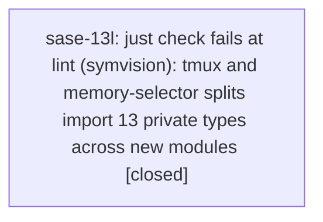

# Bead: sase-13l — just check fails at lint (symvision): tmux and memory-selector splits import 13 private types across new modules

[Bead Pages](../README.md) / sase-13l

**Status:** ✓ closed · **Resolution:** done · **Type:** ◆ task · **Task type:** ⚙ ci · **+1 reports:** +2
**Owner:** `bryanbugyi34@gmail.com` · **Created by:** [bbugyi200.athena.0nx](https://github.com/sase-org/sase--agents/blob/main/agents/bbugyi200.athena.0nx/README.md) · **Assignee:** `sase-13l` · **Size:** small
**Created:** 2026-09-20 07:33:06 EDT · **Closed:** 2026-09-20 08:29:16 EDT

<!-- sase:links:start -->

## Links

| Relation | Artifact | Why |
| --- | --- | --- |
| related | [bead:sase-13k][1] | Same class: a toobig split landed with a red lint gate; sase-13k is the mypy gate that masks this one |
| related | [bead:sase-13s][2] | Same class; sase-13l fixed the private-import errors and the tmux/selector unused publics that this one was masked behind |
| related | [bead:sase-zk][3] | Same class: a toobig split landed with a red lint gate; sase-13k is the mypy gate that masks this one |

[1]: https://github.com/sase-org/sase--beads/blob/main/pages/sase-13k/README.md
[2]: https://github.com/sase-org/sase--beads/blob/main/pages/sase-13s/README.md
[3]: https://github.com/sase-org/sase--beads/blob/main/pages/sase-zk/README.md

<!-- sase:links:end -->

## Description

`just _lint-symvision` fails on origin/master (244442ee8) with "Private functions/classes should not be imported" for 13 names that two toobig split commits (same `toobig-5p` batch) made cross-module imports:

- `src/sase/main/ace_tmux_support.py` (commit e89aa2566, `toobig-5p.ace_tmux.0`): `_OwnedBootstrapWindow`, `_ResolvedSession`, `_TmuxLaunchError`, `_TmuxWindow`
- `src/sase/memory/selector_models.py` (commit 47f3a31b4, `toobig-5p.selector.0`): `_MemorySelectorError`, `_MemoryWebReadLink`, `_NoteInlineContext`, `_NoteSelector`, `_PendingNoteStrandRoot`, `_ResolvedNoteLinks`, `_ResolvedStrandLink`, `_StrandSelector`, `_WebSelector`

Fix: make the types that the new sibling modules import public (drop the leading underscore and update importers), following `sase memory read symvision.md`; do not suppress with pragmas. Same class as sase-10n and sase-zk (other split modules). Ordering note: `just check` runs mypy first (see sase-13k), so this gate is masked until that one is fixed; expect it to appear the moment sase-13k lands.

Found while landing the numbered notification tabs work, which touches none of these files: after mypy aborted `just check`, every remaining stage was run individually and this was the only other failure.

---

\## CI failure

- **Node:** `just _lint-symvision (src/sase/main/ace_tmux_support.py, src/sase/memory/selector_models.py)`

Static and deterministic: symvision reads the import graph of source that is unchanged since the two split commits, and fails identically on every run. None of the 13 named symbols is in a file the discovering agent modified, and all other post-mypy stages passed on the same tree (feature flags, pyscripts, test waits, changelog, terminology, toobig, SASE validation, committed plans). Reproduce with `just _lint-symvision`.

## Notes

[2026-09-20T12:29:16Z · sase-13l] Made the 13 imported private types public (ace_tmux_support: TmuxLaunchError, TmuxWindow, OwnedBootstrapWindow, ResolvedSession; selector_models: 9 selector/link types) and updated importers plus tests/memory/test_memory_selector.py; dropped the redundant TmuxLaunchError alias. No pragmas. just _lint-symvision no longer reports the private-import class. It then surfaced a masked second class (unused publics); made the ones in ace_tmux*.py and memory/selector*.py private (13 symbols). The remaining 27 unused publics are in other modules and filed as sase-13s. ruff clean; tests/memory + tests/main/test_ace_tmux.py pass (199); mypy still shows only the 20 pre-existing sase-13k errors; toobig ok. Full just check not run: mypy (sase-13k) and symvision (sase-13s) still fail on unrelated code.

## +1 Evidence

> **+1** by `0nw` · 2026-09-20 08:00:22 EDT
> **Observed since:** 2026-09-20 07:08:54 EDT
>
> Independently reproduced 2026-09-20 in workspace sase_32 at master 244442ee8 by running 'just _lint-symvision' directly (it is masked behind sase-13k in 'just check'). Same 13 private symbols flagged: 9 in src/sase/memory/selector_models.py and 4 in src/sase/main/ace_tmux_support.py (_OwnedBootstrapWindow, _ResolvedSession, _TmuxLaunchError, _TmuxWindow). It was the only lint/validate gate other than mypy that was red: _lint-flags, _lint-pyscripts, _lint-test-waits, _lint-changelog, _lint-patch-stitch-terminology, _lint-toobig, validate and validate-committed-plans all passed. The working tree touches none of the flagged files.

> **+1** by `0nv--code` · 2026-09-20 08:06:19 EDT
> **Observed since:** 2026-09-20 07:25:26 EDT
>
> Independently reproduced 2026-09-20 in workspace sase_31 at clean origin/master 244442ee8: 'just _lint-symvision' fails with the same private-import violations, exactly 4 names in src/sase/main/ace_tmux_support.py and 9 in src/sase/memory/selector_models.py (13 total). Found by running the stages after mypy individually; no file from my diff appears in the violation list.

## Lineage

## Agents

| Agent | Bead | Commits |
|---|---|---:|
| [bbugyi200.athena.sase-13l](https://github.com/sase-org/sase--agents/blob/main/agents/bbugyi200.athena.sase-13l/README.md) | [sase-13l](README.md) | 1 |

## Commits

| Repo | Commit | Subject | Bead | Committed |
|---|---|---|---|---|
| sase | [`86ff62c`](https://github.com/sase-org/sase/commit/86ff62c08a81a0e0d70ac1e2a86867a285ae6be9) | fix(lint): make cross-module tmux and memory-selector symbols public or private for symvision | [sase-13l](README.md) | 2026-09-20 08:30:22 EDT |
