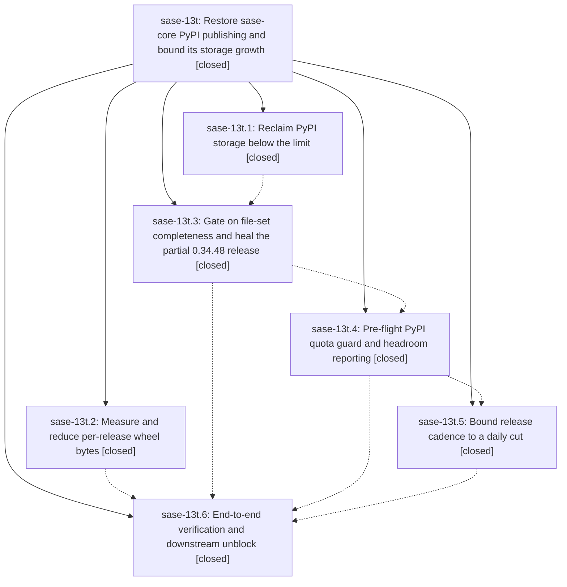

# Bead: sase-13t — Restore sase-core PyPI publishing and bound its storage growth

[Bead Pages](../README.md) / sase-13t

**Status:** ✓ closed · **Resolution:** done · **Type:** ▸ plan · **Tier:** epic
**Owner:** `bryanbugyi34@gmail.com` · **Created by:** [bbugyi200.apollo.11](https://github.com/sase-org/sase--agents/blob/main/families/bbugyi200.apollo.11.md) · **Assignee:** `sase-13t.land`
**Created:** 2026-09-20 08:29:25 EDT · **Closed:** 2026-09-20 15:21:00 EDT
**Plan:** [202609/pypi\_quota\_and\_release\_publishing.md](https://github.com/sase-org/sase--plans/blob/main/202609/pypi_quota_and_release_publishing.md)

<!-- sase:links:start -->

## Links

| Relation | Artifact | Why |
| --- | --- | --- |
| implemented-by | [plan:202609/pypi_quota_and_release_publishing.md][1] | derived from the plan's `bead_id:` frontmatter field |
| related | [bead:sase-10d][2] | Epic sase-13t's PyPI retention deletion removed every sase-core-rs 0.32.x release, which is the window every published sase pins; this bead's floor raise plus a sase release is the only way to make 'pip install sase' resolve again. |

[1]: https://github.com/sase-org/sase--plans/blob/main/202609/pypi_quota_and_release_publishing.md
[2]: https://github.com/sase-org/sase--beads/blob/main/pages/sase-10d/README.md

<!-- sase:links:end -->

## Description

The sase-core Release-plz workflow publishes complete releases to PyPI again, the project sits well under its 10 GB PyPI storage limit with months of headroom instead of days, a partial upload can no longer be mistaken for a published release, and a pre-flight guard fails loudly with an actionable message before PyPI can reject an upload mid-stream.

## Notes

[2026-09-20T12:32:25Z · bryanbugyi34@gmail.com] I've already manually deleted the 0.34.0-0.34.9 PyPI releases from PyPI for the sase-core-rs package.

[2026-09-20T19:21:00Z · sase-13t.land] LANDED by sase-13t.land 2026-09-20. All 6 phases closed; every phase note re-verified against live PyPI, live GitHub Actions, and the sase-core source. No --epic-symbol entries for this epic at any point.

\## Verified against reality, not phase notes

- **Commits really landed and are pushed.** sase-core master == origin/master, working tree clean at landing start. The epic's commits: f68baeb (retention tool + runbook), 0b48713 + 894bbb1 (PyPI device-confirmation wall root cause and login-wall-aware deletion driver), a4c4e65 (completeness gate), 9b3ade4 (quota preflight), 4987457 (daily cadence).
- **Live PyPI matches the reported numbers exactly.** 31 releases / 155 files / 2,270,272,572 B = 2.11 GiB, 21.1% of the 10 GiB limit. 0.34.48 and 0.34.70 each hold all 5 expected files, none yanked. The reclaim did happen (0.32.61 and 0.33.0 are gone).
- **The gate works against live PyPI**, run from the checkout with the workflow's real EXPECTED_DIST_SUFFIXES: 0.34.70 complete, 0.34.48 complete, 0.34.10 absent. The script correctly refuses to run when EXPECTED_DIST_SUFFIXES is unset, so the workflow really is the single source of truth.
- **The quota guard works on both paths.** Fit: "PyPI quota ok: 2,270,272,572 used + 80,000,000 incoming <= 10,737,418,240 limit" plus a step-summary table with bytes used/free and "About 109 more releases". Overflow (limit forced low): exits 1 with an ::error:: naming current/incoming/limit/overflow and pointing at docs/pypi-retention.md. Limit is 10 GiB = 10737418240, which resolves sase-13t.1's PROPOSED FOLLOW-UP #2.
- **Cadence is wired as specified.** Daily cut cron "41 7 * * *" beside the "23 */6 * * *" heal cron; release-plz-merge gated on workflow_dispatch-with-dry_run=false or that exact schedule; run-id-isolated concurrency for non-cut runs; every merge safety guard unchanged. Last 12 Release-plz runs green, no open PRs. Push run 35528672167 confirmed push-does-not-merge; dispatch run 35528969349 confirmed the escape hatch.
- **shrink really landed nothing**, as the plan required: [profile.release] is still lto="thin"/codegen-units=1 with no opt-level override, and the macOS job still targets universal2.
- **Downstream corroboration is real**: sase-10d, sase-12y.4 and sase-11l.11.4 each carry the sase-13t.6 evidence note.
- `./scripts/check.sh` (fmt, clippy, cargo test, script tests) exits 0 in sase-core.

\## Integration

sase-core commits since the epic's first (f68baeb) that are not the epic's own — 1db3b29, 24399f1, 3cae8ef, a7f26b2 and the v0.34.68/69/70 release chores — touch only crates/** and changelogs. Nothing duplicates or conflicts with the release/publish infrastructure this epic changed. In the sase repo, uv.lock pins sase-core-rs 0.34.48 with only the 3 wheels that existed while 0.34.48 was partial; that is deliberately left alone, because .github/workflows/publish.yml refreshes it through tools/ratchet_core_window + uv lock, which is sase-10d's owned path and explicitly out of scope for this plan.

\## Remaining epic work, finished during landing

**Fixed the yanked-release livelock** raised as a PROPOSED FOLLOW-UP on sase-13t.3. The plan specified "present and non-yanked", and the phase implemented it faithfully, but the result was a defect: PyPI never accepts a re-upload of a yanked filename, so a yanked workspace version left needs_publish=true forever — every push and every six-hourly cron would rebuild all five artifacts for a publish that can only be a no-op. The "stay as specified" option in the follow-up was not a real alternative, so it was not left as a decision. `pypi_release_files.py` now reports a distinct `yanked` state (missing outranks yanked, so a genuinely partial release still heals first); the workflow builds for absent|partial only and emits a ::warning:: naming the bump-the-version remedy for yanked. 5 new unit tests (56 total, up from 51), workflow YAML re-parsed, docs/pypi-retention.md and the workflow header updated.

**Hardened the retention runbook's pin audit** against the regression below: it now also requires auditing the requirement metadata frozen into consumers' *published* distributions, with a runnable snippet, not just a grep of their checkouts.

\## Regression this epic caused — remedy owned by sase-10d, escalated there

**Every published `sase` on PyPI is currently uninstallable.** The retention run deleted every sase-core-rs below 0.34.23, but the newest published sase (0.17.1, and every release back to 0.13.3) pins `sase-core-rs>=0.32.16,<0.33.0` — a window with nothing left in it. Reproduced with uv pip compile: `sase==0.17.1` -> "No solution found"; `sase-research-artifacts` -> hard failure; `sase-telegram` and `sase-github` -> silent backtrack to their 0.1.0-era releases with sase==0.1.0. The pin audit in sase-13t.1 note #1 checked consumer checkouts and correctly found nothing below 0.34.19; published-distribution metadata was the blind spot.

Deletion is irreversible, so the only remedy is publishing a sase release carrying a surviving floor — which is exactly sase-10d (READY, and core is ready for it: 0.34.70 is complete and contains 23f19f0; ratchet_core_window --report-only proposes 0.34.48 -> 0.34.70). Full reproduction and impact recorded as a note on sase-10d, with a related link back to this epic. Not closed here because cutting and publishing a sase release is sase-10d's owned work and explicitly out of scope for this plan.

\## Disposition of every PROPOSED FOLLOW-UP

1. sase-13t.1 #2 (preflight must use 10 GiB, not 10e9) — ALREADY SATISFIED: PYPI_PROJECT_LIMIT_BYTES is 10737418240, and a unit test keeps pypi_retention.py's copy in agreement. No task.
2. sase-13t.1 #3 (sase-telegram uv.lock pins deleted 0.32.61) — DECLINED as a standalone task and folded into the sase-10d note. It cannot be refreshed in place: `uv lock --upgrade-package sase-core-rs` keeps sase at 0.17.1, whose window is now empty. It resolves itself once sase-10d publishes a sase release, and nothing reads that lock today (verified: no uv sync/--locked/--frozen in that repo's Justfile, workflows, or scripts).
3. sase-13t.1 #7 (a failed custom gate becomes unreachable) — FILED as sase-14g (bug, large, READY). Not epic-caused: two independent defects in gate-shell registration and in the absence of an undismiss action.
4. sase-13t.2 #2 and #3 (macOS arm64-only; opt-level="s") — FILED together as sase-14h (feature, small, READY). One user decision with all measurements already recorded; filing them separately would have split one decision in two.
5. sase-13t.3 #1 (yanked livelock) — FIXED during landing, see above.
6. sase-13t.6 #1 (the daily cut has not yet fired) — NOT FILED, deliberately. No catalog task type fits "observe a cron at a future time", and our side of it is already pinned by 14 unit tests plus the two live runs above; what is unobserved is GitHub's scheduler. The first cut is 2026-09-21 07:41 UTC: it should merge exactly one release PR and its publish job should print a headroom table. If it does not fire, the symptom is self-announcing — the release PR accumulates and no release is cut.

\## Known-unverified

The scheduled daily cut has never run (item 6 above). Everything else in this epic has been exercised against live PyPI or a real Actions run.

## Phases

| Bead | Title | Status | Size | Created | Agents | Commits |
|---|---|---|---|---|---:|---:|
| [sase-13t.1](sase-13t.1.md) | Reclaim PyPI storage below the limit | ✓ closed | medium | 2026-09-20 | 1 | 1 |
| [sase-13t.2](sase-13t.2.md) | Measure and reduce per-release wheel bytes | ✓ closed | medium | 2026-09-20 | 1 | 0 |
| [sase-13t.3](sase-13t.3.md) | Gate on file-set completeness and heal the partial 0.34.48 release | ✓ closed | medium | 2026-09-20 | 1 | 1 |
| [sase-13t.4](sase-13t.4.md) | Pre-flight PyPI quota guard and headroom reporting | ✓ closed | small | 2026-09-20 | 1 | 1 |
| [sase-13t.5](sase-13t.5.md) | Bound release cadence to a daily cut | ✓ closed | medium | 2026-09-20 | 1 | 1 |
| [sase-13t.6](sase-13t.6.md) | End-to-end verification and downstream unblock | ✓ closed | small | 2026-09-20 | 1 | 0 |

## Lineage

## Agents

| Agent | Bead | Commits |
|---|---|---:|
| [bbugyi200.apollo.sase-13t.1](https://github.com/sase-org/sase--agents/blob/main/agents/bbugyi200.apollo.sase-13t.1/README.md) | [sase-13t.1](sase-13t.1.md) | 1 |
| [bbugyi200.apollo.sase-13t.2](https://github.com/sase-org/sase--agents/blob/main/agents/bbugyi200.apollo.sase-13t.2/README.md) | [sase-13t.2](sase-13t.2.md) | 0 |
| [bbugyi200.apollo.sase-13t.3](https://github.com/sase-org/sase--agents/blob/main/agents/bbugyi200.apollo.sase-13t.3/README.md) | [sase-13t.3](sase-13t.3.md) | 1 |
| [bbugyi200.apollo.sase-13t.4](https://github.com/sase-org/sase--agents/blob/main/agents/bbugyi200.apollo.sase-13t.4/README.md) | [sase-13t.4](sase-13t.4.md) | 1 |
| [bbugyi200.apollo.sase-13t.5](https://github.com/sase-org/sase--agents/blob/main/agents/bbugyi200.apollo.sase-13t.5/README.md) | [sase-13t.5](sase-13t.5.md) | 1 |
| [bbugyi200.apollo.sase-13t.6](https://github.com/sase-org/sase--agents/blob/main/agents/bbugyi200.apollo.sase-13t.6/README.md) | [sase-13t.6](sase-13t.6.md) | 0 |
| [bbugyi200.apollo.sase-13t.land](https://github.com/sase-org/sase--agents/blob/main/agents/bbugyi200.apollo.sase-13t.land/README.md) | [sase-13t](README.md) | 2 |

## Commits

| Repo | Commit | Subject | Bead | Committed |
|---|---|---|---|---|
| sase-core | [`sase-core@f68baeb`](https://github.com/sase-org/sase-core/commit/f68baebef4c3db01c2511c332e775e2d5cdeaace) | ci: add PyPI storage retention tool and runbook for sase-core-rs | [sase-13t.1](sase-13t.1.md) | 2026-09-20 09:48:38 EDT |
| sase-core | [`sase-core@a4c4e65`](https://github.com/sase-org/sase-core/commit/a4c4e65c21159ba9e7195db91c7e32d92bf76d0a) | ci(release): gate PyPI publishing on file-set completeness, not version existence | [sase-13t.3](sase-13t.3.md) | 2026-09-20 13:47:36 EDT |
| sase-core | [`sase-core@9b3ade4`](https://github.com/sase-org/sase-core/commit/9b3ade44031ddd6a98d983065a89abc34930334e) | ci(release): fail the PyPI publish before upload when the project quota cannot fit it | [sase-13t.4](sase-13t.4.md) | 2026-09-20 14:02:02 EDT |
| sase-core | [`sase-core@4987457`](https://github.com/sase-org/sase-core/commit/4987457d2d86f36d622223cedf009925a5e529ea) | ci(release): cut releases once a day instead of merging the release PR on every push | [sase-13t.5](sase-13t.5.md) | 2026-09-20 14:19:10 EDT |
| sase-core | [`sase-core@696fa37`](https://github.com/sase-org/sase-core/commit/696fa37ea2c007ff94070a57a21f4a7ad98f445a) | ci(release): settle a yanked release instead of rebuilding it forever | [sase-13t](README.md) | 2026-09-20 15:43:08 EDT |
| sase--plans | [`sase--plans@d1f1a92`](https://github.com/sase-org/sase--plans/commit/d1f1a92506c9d5df1c4cf4ade15046fd96e5051c) | docs(plan): mark the PyPI quota and release publishing plan done | [sase-13t](README.md) | 2026-09-20 15:44:52 EDT |
