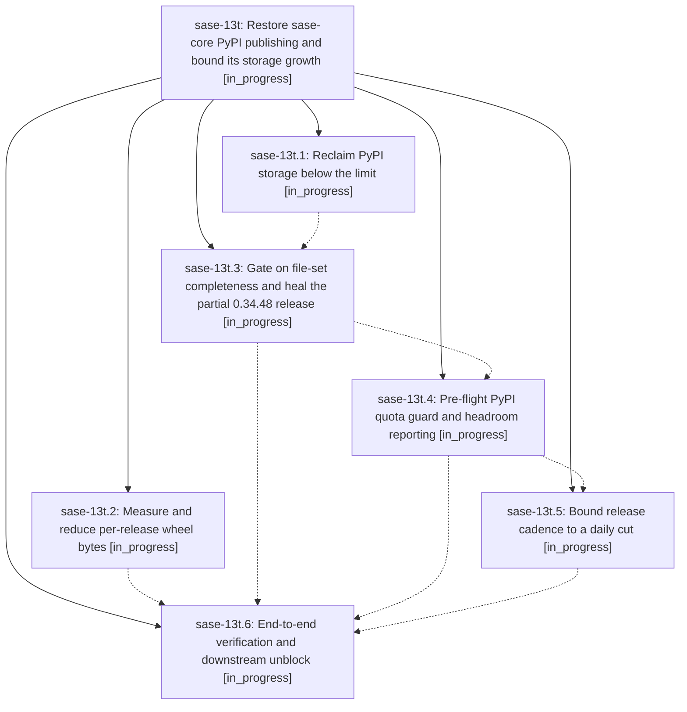

# Bead: sase-13t — Restore sase-core PyPI publishing and bound its storage growth

[Bead Pages](../README.md) / sase-13t

**Status:** ◐ in_progress · **Type:** ▸ plan · **Tier:** epic
**Owner:** `bryanbugyi34@gmail.com` · **Created by:** [bbugyi200.apollo.11](https://github.com/sase-org/sase--agents/blob/main/families/bbugyi200.apollo.11.md) · **Assignee:** `sase-13t.land`
**Created:** 2026-09-20 08:29:25 EDT
**Plan:** [202609/pypi\_quota\_and\_release\_publishing.md](https://github.com/sase-org/sase--plans/blob/main/202609/pypi_quota_and_release_publishing.md)

<!-- sase:links:start -->

## Links

| Relation | Artifact | Why |
| --- | --- | --- |
| implemented-by | [plan:202609/pypi_quota_and_release_publishing.md][1] | derived from the plan's `bead_id:` frontmatter field |

[1]: https://github.com/sase-org/sase--plans/blob/main/202609/pypi_quota_and_release_publishing.md

<!-- sase:links:end -->

## Description

The sase-core Release-plz workflow publishes complete releases to PyPI again, the project sits well under its 10 GB PyPI storage limit with months of headroom instead of days, a partial upload can no longer be mistaken for a published release, and a pre-flight guard fails loudly with an actionable message before PyPI can reject an upload mid-stream.

## Notes

[2026-09-20T12:32:25Z · bryanbugyi34@gmail.com] I've already manually deleted the 0.34.0-0.34.9 PyPI releases from PyPI for the sase-core-rs package.

## Phases

| Bead | Title | Status | Size | Created | Agents | Commits |
|---|---|---|---|---|---:|---:|
| [sase-13t.1](sase-13t.1.md) | Reclaim PyPI storage below the limit | ◐ in_progress | medium | 2026-09-20 | 1 | 1 |
| [sase-13t.2](sase-13t.2.md) | Measure and reduce per-release wheel bytes | ◐ in_progress | medium | 2026-09-20 | 1 | 0 |
| [sase-13t.3](sase-13t.3.md) | Gate on file-set completeness and heal the partial 0.34.48 release | ◐ in_progress | medium | 2026-09-20 | 1 | 0 |
| [sase-13t.4](sase-13t.4.md) | Pre-flight PyPI quota guard and headroom reporting | ◐ in_progress | small | 2026-09-20 | 1 | 0 |
| [sase-13t.5](sase-13t.5.md) | Bound release cadence to a daily cut | ◐ in_progress | medium | 2026-09-20 | 1 | 0 |
| [sase-13t.6](sase-13t.6.md) | End-to-end verification and downstream unblock | ◐ in_progress | small | 2026-09-20 | 1 | 0 |

## Lineage

## Agents

| Agent | Bead | Commits |
|---|---|---:|
| [bbugyi200.apollo.sase-13t.1](https://github.com/sase-org/sase--agents/blob/main/agents/bbugyi200.apollo.sase-13t.1/README.md) | [sase-13t.1](sase-13t.1.md) | 1 |
| [bbugyi200.apollo.sase-13t.2](https://github.com/sase-org/sase--agents/blob/main/agents/bbugyi200.apollo.sase-13t.2/README.md) | [sase-13t.2](sase-13t.2.md) | 0 |
| [bbugyi200.apollo.sase-13t.3](https://github.com/sase-org/sase--agents/blob/main/agents/bbugyi200.apollo.sase-13t.3/README.md) | [sase-13t.3](sase-13t.3.md) | 0 |
| [bbugyi200.apollo.sase-13t.4](https://github.com/sase-org/sase--agents/blob/main/agents/bbugyi200.apollo.sase-13t.4/README.md) | [sase-13t.4](sase-13t.4.md) | 0 |
| [bbugyi200.apollo.sase-13t.5](https://github.com/sase-org/sase--agents/blob/main/agents/bbugyi200.apollo.sase-13t.5/README.md) | [sase-13t.5](sase-13t.5.md) | 0 |
| [bbugyi200.apollo.sase-13t.6](https://github.com/sase-org/sase--agents/blob/main/agents/bbugyi200.apollo.sase-13t.6/README.md) | [sase-13t.6](sase-13t.6.md) | 0 |
| [bbugyi200.apollo.sase-13t.land](https://github.com/sase-org/sase--agents/blob/main/agents/bbugyi200.apollo.sase-13t.land/README.md) | [sase-13t](README.md) | 0 |

## Commits

| Repo | Commit | Subject | Bead | Committed |
|---|---|---|---|---|
| sase-core | [`sase-core@f68baeb`](https://github.com/sase-org/sase-core/commit/f68baebef4c3db01c2511c332e775e2d5cdeaace) | ci: add PyPI storage retention tool and runbook for sase-core-rs | [sase-13t.1](sase-13t.1.md) | 2026-09-20 09:48:38 EDT |
