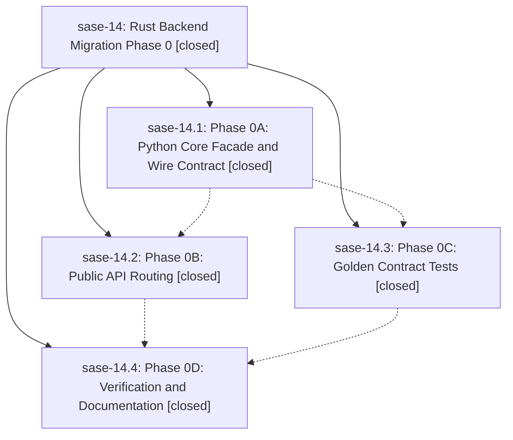

# Bead: sase-14 — Rust Backend Migration Phase 0

[Bead Pages](../README.md) / sase-14

**Status:** ✓ closed · **Resolution:** (unrecorded) · **Type:** plan · **Tier:** epic
**Owner:** `bryanbugyi34@gmail.com`
**Created:** 2026-04-29 03:52:23 UTC · **Closed:** 2026-04-29 04:44:47 UTC
**Plan:** [202604/rust\_backend\_phase0.md](https://github.com/sase-org/sase--plans/blob/main/202604/rust_backend_phase0.md)

## Phases

| Bead | Title | Status | Size | Agents | Commits |
|---|---|---|---|---:|---:|
| [sase-14.1](sase-14.1.md) | Phase 0A: Python Core Facade and Wire Contract | ✓ closed | small | 0 | 1 |
| [sase-14.2](sase-14.2.md) | Phase 0B: Public API Routing | ✓ closed | small | 0 | 1 |
| [sase-14.3](sase-14.3.md) | Phase 0C: Golden Contract Tests | ✓ closed | small | 0 | 1 |
| [sase-14.4](sase-14.4.md) | Phase 0D: Verification and Documentation | ✓ closed | small | 0 | 1 |

## Lineage

## Commits

| Commit | Subject | Bead | Committed (UTC) |
|---|---|---|---|
| [`747f420`](https://github.com/sase-org/sase/commit/747f4200cec697898e81827df764149fc3f69d27) | feat(core): Phase 0A — Python core facade and wire contract (sase-14.1) | [sase-14.1](sase-14.1.md) | 2026-04-29 04:12:37 |
| [`0d498d0`](https://github.com/sase-org/sase/commit/0d498d029770bb0e45a55012028594ce048fae8a) | test(core): Phase 0C — golden contract tests for sase.core facade (sase-14.3) | [sase-14.3](sase-14.3.md) | 2026-04-29 04:25:36 |
| [`4f6fd31`](https://github.com/sase-org/sase/commit/4f6fd312e0f9c26e39610915ba2cc214a3ad0d07) | feat(core): route public ChangeSpec/query/status APIs through sase.core facade (sase-14.2) | [sase-14.2](sase-14.2.md) | 2026-04-29 04:30:10 |
| [`42b791f`](https://github.com/sase-org/sase/commit/42b791fa43ca2b3cbec1516698c935b15f2c81dd) | docs(core): Phase 0D — backend boundary docstrings and handoff (sase-14.4) | [sase-14.4](sase-14.4.md) | 2026-04-29 04:41:39 |
