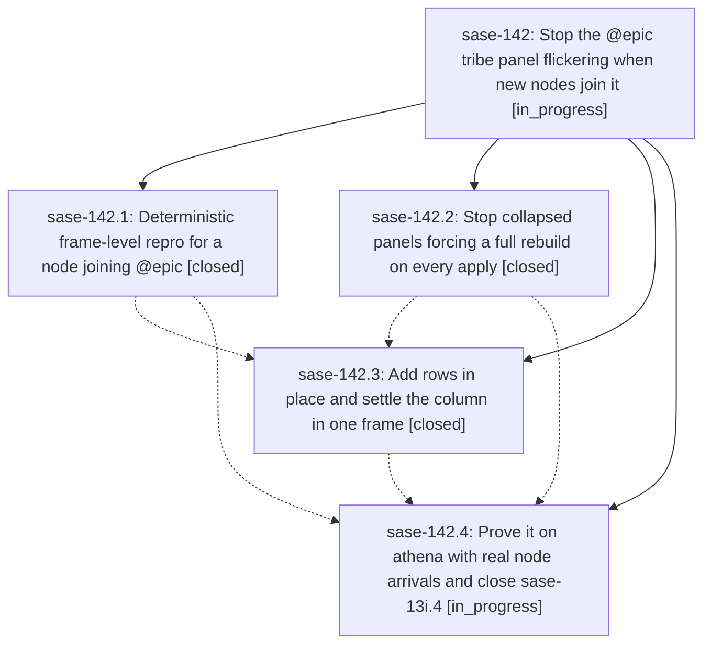

# Bead: sase-142 — Stop the @epic tribe panel flickering when new nodes join it

[Bead Pages](../README.md) / sase-142

**Status:** ◐ in_progress · **Type:** ▸ plan · **Tier:** epic
**Owner:** `bryanbugyi34@gmail.com` · **Created by:** [bbugyi200.athena.sase-13i.4.f0.f0](https://github.com/sase-org/sase--agents/blob/main/families/bbugyi200.athena.sase-13i.4.f0.f0.md) · **Assignee:** `sase-142.land`
**Created:** 2026-09-20 12:14:19 EDT
**Plan:** [202609/epic\_panel\_new\_node\_flicker.md](https://github.com/sase-org/sase--plans/blob/main/202609/epic_panel_new_node_flicker.md)

<!-- sase:links:start -->

## Links

| Relation | Artifact | Why |
| --- | --- | --- |
| implemented-by | [plan:202609/epic_panel_new_node_flicker.md][1] | derived from the plan's `bead_id:` frontmatter field |

[1]: https://github.com/sase-org/sase--plans/blob/main/202609/epic_panel_new_node_flicker.md

<!-- sase:links:end -->

## Description

A new agent node joining the @epic tribe panel produces exactly one visual transition: the panel widget is never blanked, its highlight and scroll position survive, the agent-list column geometry settles in the same frame as the rows, and an apply that changes nothing repaints nothing. The claim is proved by a deterministic frame-level harness in CI and re-proved by a landed-SHA soak on athena that actually creates new nodes.

## Notes

[2026-09-20T18:54:59Z · 15.w0--code] DISCOVERED ISSUE: On 2026-09-20 at master HEAD 15763853b (workspace sase_10), while implementing an unrelated docs/YAML change, tests/ace/tui/test_epic_panel_arrival_frames.py fails 4 tests (16 pass, 1 xfail): test_each_arrival_reaches_the_epic_panel_through_a_refresh (plain assertion: 'assert all(...)' False at line 102), and three strict xfails that now XPASS(strict): test_an_apply_that_changes_no_rendered_row_repaints_nothing[noop], [starting], and test_no_panel_reports_a_grouping_mode_other_than_the_apps. The XPASS(strict) reasons are 'an apply that changes nothing still repaints the collapsed panel', 'an unrendered STARTING arrival still repaints the collapsed panel', and 'the collapsed panel keeps the default grouping mode'. That is what the file's own docstring predicts once a fix lands: phase sase-142.2 (closed, 'Stop collapsed panels forcing a full rebuild on every apply') appears to have fixed those three invariants, so their sase-13i strict-xfail markers are now stale and turn the suite red until removed. Confirmed deterministic and not caused by my diff: the same 7 failures (these 4 plus test_capacity_gate_to_admission x2, tracked on sase-13q, and test_lazy_tier2_reconcile_apply x1, tracked on sase-13n) reproduce with my working-tree changes stashed. Left for the epic's owner/land agent: remove the three stale strict-xfail markers and triage why test_each_arrival_reaches_the_epic_panel_through_a_refresh fails as a plain assertion; not created as a separate task because it is causally this epic's own work.

## Phases

| Bead | Title | Status | Size | Created | Agents | Commits |
|---|---|---|---|---|---:|---:|
| [sase-142.1](sase-142.1.md) | Deterministic frame-level repro for a node joining @epic | ✓ closed | medium | 2026-09-20 | 1 | 1 |
| [sase-142.2](sase-142.2.md) | Stop collapsed panels forcing a full rebuild on every apply | ✓ closed | small | 2026-09-20 | 1 | 1 |
| [sase-142.3](sase-142.3.md) | Add rows in place and settle the column in one frame | ✓ closed | medium | 2026-09-20 | 1 | 1 |
| [sase-142.4](sase-142.4.md) | Prove it on athena with real node arrivals and close sase-13i.4 | ◐ in_progress | medium | 2026-09-20 | 1 | 0 |

## Lineage

## Agents

| Agent | Bead | Commits |
|---|---|---:|
| [bbugyi200.athena.sase-142.1](https://github.com/sase-org/sase--agents/blob/main/agents/bbugyi200.athena.sase-142.1/README.md) | [sase-142.1](sase-142.1.md) | 1 |
| [bbugyi200.athena.sase-142.2](https://github.com/sase-org/sase--agents/blob/main/agents/bbugyi200.athena.sase-142.2/README.md) | [sase-142.2](sase-142.2.md) | 1 |
| [bbugyi200.athena.sase-142.3](https://github.com/sase-org/sase--agents/blob/main/agents/bbugyi200.athena.sase-142.3/README.md) | [sase-142.3](sase-142.3.md) | 1 |
| [bbugyi200.athena.sase-142.4](https://github.com/sase-org/sase--agents/blob/main/agents/bbugyi200.athena.sase-142.4/README.md) | [sase-142.4](sase-142.4.md) | 0 |
| [bbugyi200.athena.sase-142.land](https://github.com/sase-org/sase--agents/blob/main/agents/bbugyi200.athena.sase-142.land/README.md) | [sase-142](README.md) | 0 |

## Commits

| Repo | Commit | Subject | Bead | Committed |
|---|---|---|---|---|
| sase | [`686851c`](https://github.com/sase-org/sase/commit/686851c9e3db8c489e4e4259c7411bed07e6a5f4) | fix(tui): record grouping mode on collapsed panels so applies stay incremental | [sase-142.2](sase-142.2.md) | 2026-09-20 12:41:35 EDT |
| sase | [`2df2137`](https://github.com/sase-org/sase/commit/2df2137e0f0b0fa78f84e67218f07aa57638594d) | test(tui): add a frame-level paint log and repro for a node joining the @epic panel | [sase-142.1](sase-142.1.md) | 2026-09-20 13:23:26 EDT |
| sase | [`7442af7`](https://github.com/sase-org/sase/commit/7442af7afc8be0f547f6337c756cb296fabf833c) | feat(tui): insert arriving agent rows in place and settle the column in one frame | [sase-142.3](sase-142.3.md) | 2026-09-20 15:47:50 EDT |
