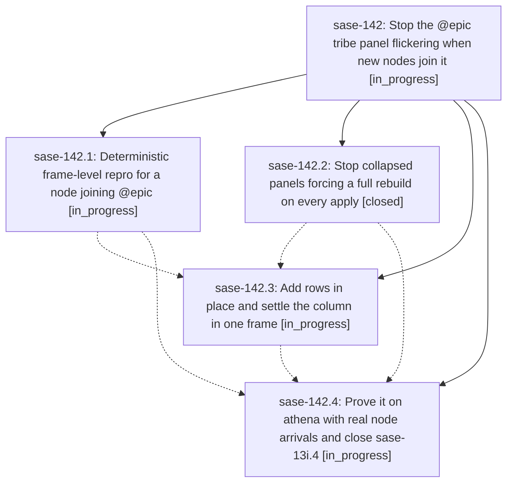

# Bead: sase-142 — Stop the @epic tribe panel flickering when new nodes join it

[Bead Pages](../README.md) / sase-142

**Status:** ◐ in_progress · **Type:** ▸ plan · **Tier:** epic
**Owner:** `bryanbugyi34@gmail.com` · **Created by:** [bbugyi200.athena.sase-13i.4.f0.f0](https://github.com/sase-org/sase--agents/blob/main/families/bbugyi200.athena.sase-13i.4.f0.f0.md) · **Assignee:** `sase-142.land`
**Created:** 2026-09-20 12:14:19 EDT
**Plan:** [202609/epic\_panel\_new\_node\_flicker.md](https://github.com/sase-org/sase--plans/blob/main/202609/epic_panel_new_node_flicker.md)

## Description

A new agent node joining the @epic tribe panel produces exactly one visual transition: the panel widget is never blanked, its highlight and scroll position survive, the agent-list column geometry settles in the same frame as the rows, and an apply that changes nothing repaints nothing. The claim is proved by a deterministic frame-level harness in CI and re-proved by a landed-SHA soak on athena that actually creates new nodes.

## Phases

| Bead | Title | Status | Size | Created | Agents | Commits |
|---|---|---|---|---|---:|---:|
| [sase-142.1](sase-142.1.md) | Deterministic frame-level repro for a node joining @epic | ◐ in_progress | medium | 2026-09-20 | 1 | 0 |
| [sase-142.2](sase-142.2.md) | Stop collapsed panels forcing a full rebuild on every apply | ✓ closed | small | 2026-09-20 | 1 | 1 |
| [sase-142.3](sase-142.3.md) | Add rows in place and settle the column in one frame | ◐ in_progress | medium | 2026-09-20 | 1 | 0 |
| [sase-142.4](sase-142.4.md) | Prove it on athena with real node arrivals and close sase-13i.4 | ◐ in_progress | medium | 2026-09-20 | 1 | 0 |

## Lineage

## Agents

| Agent | Bead | Commits |
|---|---|---:|
| [bbugyi200.athena.sase-142.1](https://github.com/sase-org/sase--agents/blob/main/agents/bbugyi200.athena.sase-142.1/README.md) | [sase-142.1](sase-142.1.md) | 0 |
| [bbugyi200.athena.sase-142.2](https://github.com/sase-org/sase--agents/blob/main/agents/bbugyi200.athena.sase-142.2/README.md) | [sase-142.2](sase-142.2.md) | 1 |
| [bbugyi200.athena.sase-142.3](https://github.com/sase-org/sase--agents/blob/main/agents/bbugyi200.athena.sase-142.3/README.md) | [sase-142.3](sase-142.3.md) | 0 |
| [bbugyi200.athena.sase-142.4](https://github.com/sase-org/sase--agents/blob/main/agents/bbugyi200.athena.sase-142.4/README.md) | [sase-142.4](sase-142.4.md) | 0 |
| [bbugyi200.athena.sase-142.land](https://github.com/sase-org/sase--agents/blob/main/agents/bbugyi200.athena.sase-142.land/README.md) | [sase-142](README.md) | 0 |

## Commits

| Repo | Commit | Subject | Bead | Committed |
|---|---|---|---|---|
| sase | [`686851c`](https://github.com/sase-org/sase/commit/686851c9e3db8c489e4e4259c7411bed07e6a5f4) | fix(tui): record grouping mode on collapsed panels so applies stay incremental | [sase-142.2](sase-142.2.md) | 2026-09-20 12:41:35 EDT |
