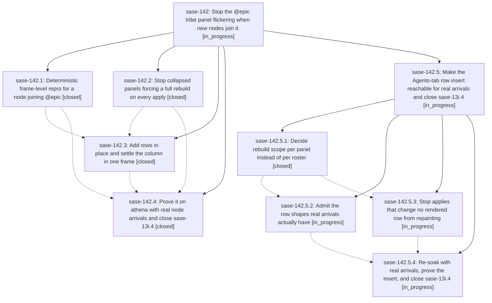

# Bead: sase-142 — Stop the @epic tribe panel flickering when new nodes join it

[Bead Pages](../README.md) / sase-142

**Status:** ◐ in_progress · **Type:** ▸ plan · **Tier:** epic
**Owner:** `bryanbugyi34@gmail.com` · **Created by:** [bbugyi200.athena.sase-13i.4.f0.f0](https://github.com/sase-org/sase--agents/blob/main/families/bbugyi200.athena.sase-13i.4.f0.f0.md) · **Assignee:** `sase-142.land`
**Created:** 2026-09-20 12:14:19 EDT
**Plan:** [202609/epic\_panel\_new\_node\_flicker.md](https://github.com/sase-org/sase--plans/blob/main/202609/epic_panel_new_node_flicker.md)

<!-- sase:links:start -->

## Links

| Relation | Artifact | Why |
| --- | --- | --- |
| implemented-by | [plan:202609/epic_panel_new_node_flicker.md][1] | derived from the plan's `bead_id:` frontmatter field |

[1]: https://github.com/sase-org/sase--plans/blob/main/202609/epic_panel_new_node_flicker.md

<!-- sase:links:end -->

## Description

A new agent node joining the @epic tribe panel produces exactly one visual transition: the panel widget is never blanked, its highlight and scroll position survive, the agent-list column geometry settles in the same frame as the rows, and an apply that changes nothing repaints nothing. The claim is proved by a deterministic frame-level harness in CI and re-proved by a landed-SHA soak on athena that actually creates new nodes.

## Notes

[2026-09-20T18:54:59Z · 15.w0--code] DISCOVERED ISSUE: On 2026-09-20 at master HEAD 15763853b (workspace sase_10), while implementing an unrelated docs/YAML change, tests/ace/tui/test_epic_panel_arrival_frames.py fails 4 tests (16 pass, 1 xfail): test_each_arrival_reaches_the_epic_panel_through_a_refresh (plain assertion: 'assert all(...)' False at line 102), and three strict xfails that now XPASS(strict): test_an_apply_that_changes_no_rendered_row_repaints_nothing[noop], [starting], and test_no_panel_reports_a_grouping_mode_other_than_the_apps. The XPASS(strict) reasons are 'an apply that changes nothing still repaints the collapsed panel', 'an unrendered STARTING arrival still repaints the collapsed panel', and 'the collapsed panel keeps the default grouping mode'. That is what the file's own docstring predicts once a fix lands: phase sase-142.2 (closed, 'Stop collapsed panels forcing a full rebuild on every apply') appears to have fixed those three invariants, so their sase-13i strict-xfail markers are now stale and turn the suite red until removed. Confirmed deterministic and not caused by my diff: the same 7 failures (these 4 plus test_capacity_gate_to_admission x2, tracked on sase-13q, and test_lazy_tier2_reconcile_apply x1, tracked on sase-13n) reproduce with my working-tree changes stashed. Left for the epic's owner/land agent: remove the three stale strict-xfail markers and triage why test_each_arrival_reaches_the_epic_panel_through_a_refresh fails as a plain assertion; not created as a separate task because it is causally this epic's own work.

[2026-09-20T21:05:15Z · sase-142.land] LANDING INTERRUPTED — epic NOT closed; remaining work planned as a child epic.

VERIFIED (steps 1-2), at origin/master 03cc36be5c after a fast-forward from ec7dbbfdf9:
- Epic commits 686851c9e3 (collapsed-panel grouping mode), 2df2137e0f (paint log +
  arrival harness), 7442af7afc (in-place insert + one-frame column settle) are all
  landed on master; read the source, not just the notes.
- Note #1 on this bead (15.w0--code, stale sase-13i strict-xfail markers turning
  tests/ace/tui/test_epic_panel_arrival_frames.py red at 15763853b) is RESOLVED. It was
  recorded at 14:54 EDT, before 7442af7afc landed at 15:46 EDT; that commit removed all
  four markers. Re-ran the three epic suites at current master in a clean install:
  test_epic_panel_arrival_frames.py + test_agent_list_try_insert_rows.py +
  test_agent_display_collapsed_panel_mode.py = 78 passed, 0 failed, 0 xfail, 0 xpass.
- sase-142.2 confirmed in source: AgentList.render_collapsed(*, grouping_mode) is
  keyword-only with no default (agent_list.py:361); both call sites pass it
  (_display_panel_widgets.py:415, _display_panel_patches.py:253).
  _agent_display_widgets_match_grouping_mode() is untouched.
- sase-142.3 confirmed in source: AgentList.try_insert_rows exists and is wired through
  PanelPatchMixin._try_insert_panel_rows with a display_row_insert cost and an
  observable decline reason; PanelLayoutMixin._settle_agent_list_container_width
  (_display_panel_layout.py:20) is called at the end of both
  _refresh_panel_widgets_impl (_display_panel_widgets.py:545) and
  _refresh_affected_panel_widgets (:624); _by_status_display_membership_changed skips
  identities that had no rendered row.
- INTEGRATION: the only Agents-tab commit that landed inside this epic's window is
  8ae9ac1eab (retire tribe panels when their last node is dismissed). It landed before
  7442af7afc, so sase-142.3 already built on it, and the two meet cleanly in
  _display_panel_state.py (both mixin contracts coexist). Its retirement path requests
  list_changed=True, which routes through _refresh_panel_widgets_impl and therefore
  already gets the epic's in-frame width settle. Every other commit in the window
  (notifications, muse, service, llm, visual goldens) is outside this epic's surface.
  No integration change was required.

NOT COMPLETE — why this epic stays open:
- The plan's phase verify-new-nodes-on-athena states a hard exit criterion: "a nonzero
  count of display_row_insert, proving arrivals were actually observed". The 2284s
  landed-SHA soak on athena recorded display_row_insert = 0 successes AND 0 attempts
  across 7 real @epic arrivals. The global gates in
  _try_refresh_agents_display_incremental (_display.py ~297-308) return False on
  diff.duplicate_identity / _by_status_display_membership_changed /
  diff_touches_workflow_tree before any per-panel insert is attempted, so the fast path
  this epic shipped is unreachable in production. A structural change one panel makes
  still rebuilds every panel.
- The plan's "zero display_full_rebuild on applies with unchanged occupancy keys" is
  literally unmet: 21 of 50 non-startup rebuilds had unchanged occupancy with a
  non-stale_grouping_mode reason (status_membership_change 9, panel_membership_change 7,
  workflow_tree_change 5).
- sase-13i.4 — which phase 4 is titled to close — is still IN_PROGRESS.
The user-facing claim did hold on athena (0 stale_grouping_mode, down from 232 of 234;
0 panel-count dips; @epic never unmounted across 52 spans; harness invariants
inv1/2/3/4/6 held across all 20 arrival windows), so the flicker itself is fixed. What
is missing is the mechanism reaching real arrivals and the criterion that proves it.

PROPOSED FOLLOW-UP TRIAGE (all 8 collected from child beads):
- sase-142.4 #2 (insert unreachable for real arrivals) -> child epic, phase 1/2.
- sase-142.4 #3 (21/50 same-occupancy rebuilds) -> child epic, phase 2.
- sase-142.4 #6 (a live soak needs a plain-leaf probe; sase-run agents carry #git/#gh
  and render as WORKFLOW families) -> child epic, phase 3.
- sase-142.1 #2 (sibling panels repaint on clan arrivals because _panel_paint_key folds
  global fold_counts into every panel) -> child epic, phase 2; it is the same "an apply
  that changes nothing repaints nothing" goal.
- sase-142.3 #4 (the fast-path remover does not settle the column when a panel collapses
  on removal) -> child epic, phase 2; it is the mirror of the helper this epic shipped.
- sase-142.3 #1 (tui_perf.md should name try_insert_rows and the in-frame settle) ->
  child epic, phase 3, routed through the memory-write skill. Deliberately NOT applied
  in this turn: sase plan propose does not carry a working tree, so the edit would have
  been lost with this ephemeral workspace.
- sase-142.3 #2 (highlight/scroll-reset sub-claim refuted at frame level) -> DECLINED as
  a follow-up; it is a recorded negative result, nothing to implement. Revisit only if a
  soak shows a highlight or scroll jump.
- sase-142.3 #3 (sase-142.4 should tally insert fallback reasons) -> already DONE by
  sase-142.4; superseded by its note #2.

NOT CAUSED BY THIS EPIC, routed out via /sase_new_task:
- sase-142.4 #4 (launch-admission %w(time=...) waits never elapse after the coordinator
  process changes; _resolve_time_wait defaults started=now because _waiting_since is
  only filled by a running engine) -> recorded as a DISCOVERED ISSUE note on active epic
  sase-s6, whose phase 3 built that durable coordinator. No task bead, per the
  causally-related-active-epic rule.
- sase-142.4 #5 (probe 0od died with a bare "Failed to prepare workspace" and pinned
  home_12) -> new task bead sase-14m, filed as the more general defect: prepare_workspace
  returns a bare bool so the underlying git/update error is discarded and the failure is
  undiagnosable from the run artifact.

sase bead epic-symbols sase-142: no entries, so nothing is keyed to this epic or its
phases and the symvision whitelist needs no retirement when this does close.

## Phases

| Bead | Title | Status | Size | Created | Agents | Commits |
|---|---|---|---|---|---:|---:|
| [sase-142.1](sase-142.1.md) | Deterministic frame-level repro for a node joining @epic | ✓ closed | medium | 2026-09-20 | 1 | 1 |
| [sase-142.2](sase-142.2.md) | Stop collapsed panels forcing a full rebuild on every apply | ✓ closed | small | 2026-09-20 | 1 | 1 |
| [sase-142.3](sase-142.3.md) | Add rows in place and settle the column in one frame | ✓ closed | medium | 2026-09-20 | 1 | 1 |
| [sase-142.4](sase-142.4.md) | Prove it on athena with real node arrivals and close sase-13i.4 | ✓ closed | medium | 2026-09-20 | 1 | 0 |

## Lineage

## Agents

| Agent | Bead | Commits |
|---|---|---:|
| [bbugyi200.athena.sase-142.1](https://github.com/sase-org/sase--agents/blob/main/agents/bbugyi200.athena.sase-142.1/README.md) | [sase-142.1](sase-142.1.md) | 1 |
| [bbugyi200.athena.sase-142.2](https://github.com/sase-org/sase--agents/blob/main/agents/bbugyi200.athena.sase-142.2/README.md) | [sase-142.2](sase-142.2.md) | 1 |
| [bbugyi200.athena.sase-142.3](https://github.com/sase-org/sase--agents/blob/main/agents/bbugyi200.athena.sase-142.3/README.md) | [sase-142.3](sase-142.3.md) | 1 |
| [bbugyi200.athena.sase-142.4](https://github.com/sase-org/sase--agents/blob/main/families/bbugyi200.athena.sase-142.4.md) | [sase-142.4](sase-142.4.md) | 0 |
| [bbugyi200.athena.sase-142.5.1](https://github.com/sase-org/sase--agents/blob/main/agents/bbugyi200.athena.sase-142.5.1/README.md) | [sase-142.5.1](sase-142.5.1.md) | 1 |
| [bbugyi200.athena.sase-142.5.2](https://github.com/sase-org/sase--agents/blob/main/agents/bbugyi200.athena.sase-142.5.2/README.md) | [sase-142.5.2](sase-142.5.2.md) | 1 |
| [bbugyi200.athena.sase-142.5.3](https://github.com/sase-org/sase--agents/blob/main/agents/bbugyi200.athena.sase-142.5.3/README.md) | [sase-142.5.3](sase-142.5.3.md) | 1 |
| [bbugyi200.athena.sase-142.5.4](https://github.com/sase-org/sase--agents/blob/main/agents/bbugyi200.athena.sase-142.5.4/README.md) | [sase-142.5.4](sase-142.5.4.md) | 0 |
| [bbugyi200.athena.sase-142.5.land](https://github.com/sase-org/sase--agents/blob/main/agents/bbugyi200.athena.sase-142.5.land/README.md) | [sase-142.5](sase-142.5.md) | 0 |
| [bbugyi200.athena.sase-142.land](https://github.com/sase-org/sase--agents/blob/main/families/bbugyi200.athena.sase-142.land.md) | [sase-142](README.md) | 0 |

## Commits

| Repo | Commit | Subject | Bead | Committed |
|---|---|---|---|---|
| sase | [`686851c`](https://github.com/sase-org/sase/commit/686851c9e3db8c489e4e4259c7411bed07e6a5f4) | fix(tui): record grouping mode on collapsed panels so applies stay incremental | [sase-142.2](sase-142.2.md) | 2026-09-20 12:41:35 EDT |
| sase | [`2df2137`](https://github.com/sase-org/sase/commit/2df2137e0f0b0fa78f84e67218f07aa57638594d) | test(tui): add a frame-level paint log and repro for a node joining the @epic panel | [sase-142.1](sase-142.1.md) | 2026-09-20 13:23:26 EDT |
| sase | [`7442af7`](https://github.com/sase-org/sase/commit/7442af7afc8be0f547f6337c756cb296fabf833c) | feat(tui): insert arriving agent rows in place and settle the column in one frame | [sase-142.3](sase-142.3.md) | 2026-09-20 15:47:50 EDT |
| sase | [`6302207`](https://github.com/sase-org/sase/commit/630220713d23e94bb839787922c44b06982ec8fb) | refactor(tui): decide Agents-tab rebuild scope per panel instead of per roster | [sase-142.5.1](sase-142.5.1.md) | 2026-09-20 18:41:11 EDT |
| sase | [`baf07cf`](https://github.com/sase-org/sase/commit/baf07cf13ceb9bada37390b98b61cab188f086f2) | test(tui): pin the whole-family row-insert decline behind its banner invariant | [sase-142.5.2](sase-142.5.2.md) | 2026-09-20 19:18:45 EDT |
| sase | [`8464f4b`](https://github.com/sase-org/sase/commit/8464f4bcb011a7976094fa25dd72c42fa0c323d3) | fix(tui): scope panel paint keys per panel and settle removal collapses in-frame | [sase-142.5.3](sase-142.5.3.md) | 2026-09-20 19:26:43 EDT |
