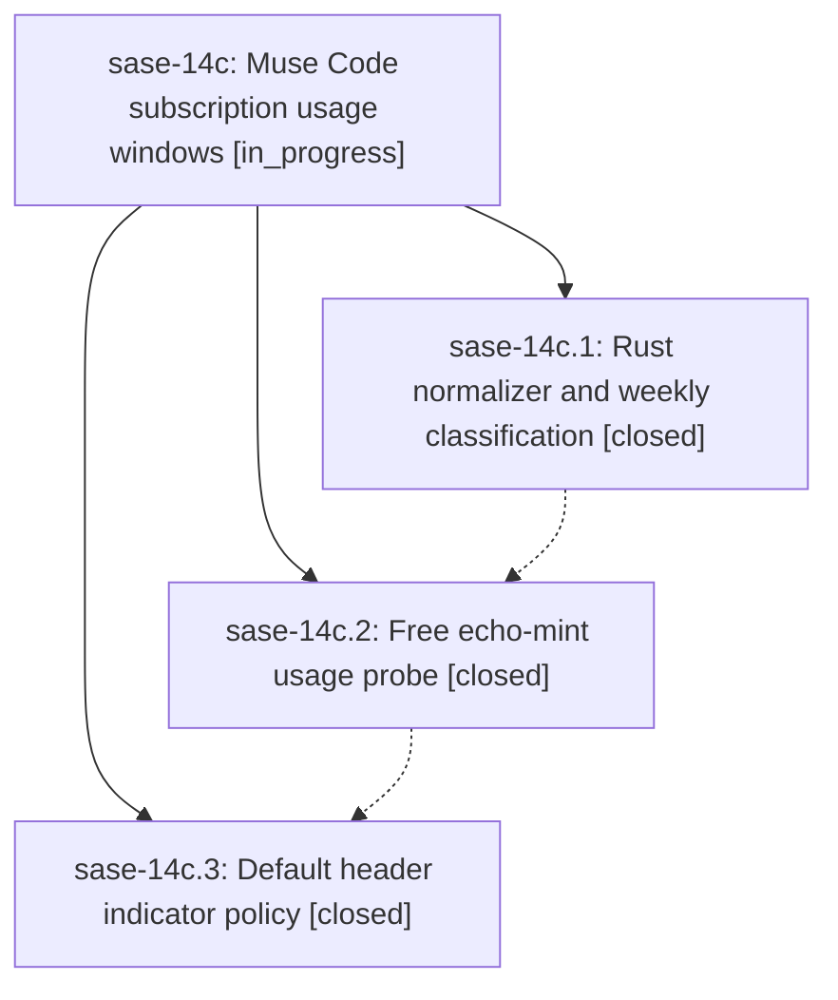

# Bead: sase-14c — Muse Code subscription usage windows

[Bead Pages](../README.md) / sase-14c

**Status:** ◐ in_progress · **Type:** ▸ plan · **Tier:** epic
**Owner:** `bryanbugyi34@gmail.com` · **Created by:** [bbugyi200.athena.0o6](https://github.com/sase-org/sase--agents/blob/main/families/bbugyi200.athena.0o6.md) · **Assignee:** `sase-14c.land`
**Created:** 2026-09-20 12:41:08 EDT
**Plan:** [202609/muse\_usage\_windows.md](https://github.com/sase-org/sase--plans/blob/main/202609/muse_usage_windows.md)

<!-- sase:links:start -->

## Links

| Relation | Artifact | Why |
| --- | --- | --- |
| implemented-by | [plan:202609/muse_usage_windows.md][1] | derived from the plan's `bead_id:` frontmatter field |

[1]: https://github.com/sase-org/sase--plans/blob/main/202609/muse_usage_windows.md

<!-- sase:links:end -->

## Description

SASE collects Muse Code's two subscription usage windows on the normal background cadence at zero model cost, and the TUI header shows Muse's weekly window by default whenever Muse is an eligible provider.

## Phases

| Bead | Title | Status | Size | Created | Agents | Commits |
|---|---|---|---|---|---:|---:|
| [sase-14c.1](sase-14c.1.md) | Rust normalizer and weekly classification | ✓ closed | medium | 2026-09-20 | 1 | 1 |
| [sase-14c.2](sase-14c.2.md) | Free echo-mint usage probe | ✓ closed | medium | 2026-09-20 | 1 | 1 |
| [sase-14c.3](sase-14c.3.md) | Default header indicator policy | ✓ closed | small | 2026-09-20 | 1 | 1 |

## Lineage

## Agents

| Agent | Bead | Commits |
|---|---|---:|
| [bbugyi200.athena.sase-14c.1](https://github.com/sase-org/sase--agents/blob/main/agents/bbugyi200.athena.sase-14c.1/README.md) | [sase-14c.1](sase-14c.1.md) | 1 |
| [bbugyi200.athena.sase-14c.2](https://github.com/sase-org/sase--agents/blob/main/agents/bbugyi200.athena.sase-14c.2/README.md) | [sase-14c.2](sase-14c.2.md) | 1 |
| [bbugyi200.athena.sase-14c.3](https://github.com/sase-org/sase--agents/blob/main/agents/bbugyi200.athena.sase-14c.3/README.md) | [sase-14c.3](sase-14c.3.md) | 1 |
| [bbugyi200.athena.sase-14c.land](https://github.com/sase-org/sase--agents/blob/main/agents/bbugyi200.athena.sase-14c.land/README.md) | [sase-14c](README.md) | 0 |

## Commits

| Repo | Commit | Subject | Bead | Committed |
|---|---|---|---|---|
| sase-core | [`sase-core@3cae8ef`](https://github.com/sase-org/sase-core/commit/3cae8ef9ed926a1d3fb88e8b455ee663c0c3f24f) | feat(provider\_usage): normalize Muse subscription usage and classify its weekly window | [sase-14c.1](sase-14c.1.md) | 2026-09-20 13:16:56 EDT |
| sase | [`6086402`](https://github.com/sase-org/sase/commit/608640272582a14cddb2d7c71a2e69af6ed36599) | feat(muse): collect subscription usage with a free echo-mint probe | [sase-14c.2](sase-14c.2.md) | 2026-09-20 15:11:40 EDT |
| sase | [`ec7dbbf`](https://github.com/sase-org/sase/commit/ec7dbbfdf97ce5341d9f0247cbfff50e32482de2) | feat(usage): hide Muse's 5-hour window from the header by default | [sase-14c.3](sase-14c.3.md) | 2026-09-20 16:01:38 EDT |
