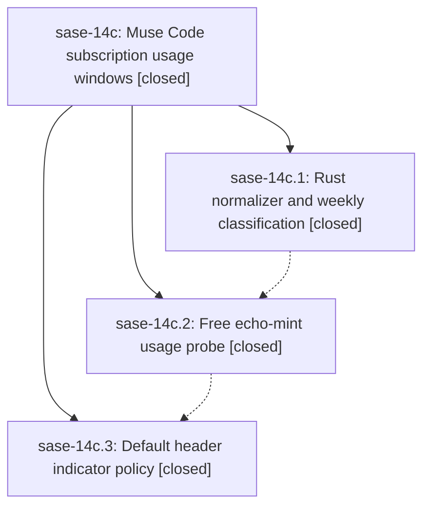

# Bead: sase-14c — Muse Code subscription usage windows

[Bead Pages](../README.md) / sase-14c

**Status:** ✓ closed · **Resolution:** done · **Type:** ▸ plan · **Tier:** epic
**Owner:** `bryanbugyi34@gmail.com` · **Created by:** [bbugyi200.athena.0o6](https://github.com/sase-org/sase--agents/blob/main/families/bbugyi200.athena.0o6.md) · **Assignee:** `sase-14c.land`
**Created:** 2026-09-20 12:41:08 EDT · **Closed:** 2026-09-20 16:24:04 EDT
**Plan:** [202609/muse\_usage\_windows.md](https://github.com/sase-org/sase--plans/blob/main/202609/muse_usage_windows.md)

<!-- sase:links:start -->

## Links

| Relation | Artifact | Why |
| --- | --- | --- |
| implemented-by | [plan:202609/muse_usage_windows.md][1] | derived from the plan's `bead_id:` frontmatter field |
| related | [bead:sase-14i][2] | Epic sase-14c added the third provider == "muse" allowlist arm in indicator.rs and named this refactor in its plan's Risks and Out-of-scope sections |

[1]: https://github.com/sase-org/sase--plans/blob/main/202609/muse_usage_windows.md
[2]: https://github.com/sase-org/sase--beads/blob/main/pages/sase-14i/README.md

<!-- sase:links:end -->

## Description

SASE collects Muse Code's two subscription usage windows on the normal background cadence at zero model cost, and the TUI header shows Muse's weekly window by default whenever Muse is an eligible provider.

## Notes

[2026-09-20T20:24:04Z · sase-14c.land] LAND VERIFICATION (sase-14c, all 3 phases closed done).

Code read, not taken on report:
- Phase 1 (sase-14c.1) is on sase-core master as 3cae8ef and released as v0.34.70 (9262540). Confirmed in the linked checkout: crates/sase_core/src/provider_usage/muse.rs exists; the Muse arm is in indicator.rs::is_weekly_window (provider=="muse" && key=="weekly" && Account); normalize_muse_usage + ProviderUsageNormalizeMuseUsageRequestWire are re-exported from provider_usage/mod.rs and lib.rs; py_provider_usage_normalize_muse_usage is registered in sase_core_py with its binding-inventory doc line and a round-trip test.
- Phase 2 (sase-14c.2) landed as 608640272. Read src/sase/llm_provider/usage/muse.py end to end: the MSP sequence is initialize -> initialized notification -> session/start(providerId=echo, UUIDv7 commandId) -> echo-session guard -> turn/start -> poll usage/read; the guard returns vendor_drift before any turn/start, poll-budget exhaustion returns the payload to the core normalizer (authoritative-empty absence, never an error and never 0%), MUSE_NO_AUTO_UPDATE=1 is set, schema-fingerprint drift only warns, and _uuid7 is hand-rolled for Python 3.12. MuseProvider.llm_usage_capabilities/{probe:True,passive_events:False} and llm_usage_probe are wired in muse.py:291-300. pyproject pins sase-core-rs>=0.34.70,<0.35.0 and sase-core-revision.txt is a4c4e65; the installed sase_core_rs exposes provider_usage_normalize_muse_usage.
- Phase 3 (sase-14c.3) landed as ec7dbbfdf. default_config.yml and sase.schema.json both ship llm_provider.usage_metrics.indicator.providers.muse.windows.session: never, with an accurate commented example for restoring it; docs/configuration.md and docs/llms.md describe the policy and the eligibility chain.

Every child note was addressed:
- sase-14c.1 note 1 (PROPOSED FOLLOW-UP: authoritative-empty clears stored Muse windows, so a missed mint can blank the header weekly indicator for up to one refresh cadence) was decided inside the epic by phase 2, which knowingly accepted the blip: the mint lands 2.4-2.9s against an 8s poll budget, and making a deadline miss an error outcome would trip collector health on logged-out hosts. The accepted tradeoff is documented in _poll_usage's docstring. No task filed; this is a recorded decision, not open work.
- sase-14c.3 note 1 (PROPOSED FOLLOW-UP: master just check is red independently of this epic) re-verified today. Every item is pre-existing and already tracked by an open bead, so nothing new was filed: flags gate rule 7 (closed flag bead sase-12m still defines service_host) is sase-11y.10.1.2 [IN_PROGRESS]; the 26 unused-public-symbol symvision entries in sdd/_store_clone_*, ace/tui/models/_agent_runner_slot_capacity.py, service/host_*.py and completion/runtime_cache_generation.py are sase-13s [READY]; test_capacity_gate_to_admission x2 is sase-13o/sase-13q; test_lazy_tier2_reconcile_apply::test_changed_query_incomplete_load_after_reconcile_rearms is sase-13n. The 4 tests/ace/tui/test_epic_panel_arrival_frames.py failures that note listed now PASS - 7442af7af fixed them after the note was written.
- sase-14c.2 note 1 needed no follow-up; its core floor/revision ratchet and live proof were re-confirmed here.
- One follow-up filed: sase-14i (task(feature), medium, ready) for the plan's Risk 4 / Out-of-scope item - replacing the accumulated per-provider string allowlists in sase-core indicator.rs, to which this epic added the third arm. Linked related to sase-14c. No semantic duplicate found by search or the one-week sweep, and no active epic is causally related (sase-yz covers collector health and vendor drift, not weekly classification).

INTEGRATION with everything committed since the epic started (16 commits from 686851c9e at 12:41 through HEAD): the epic's own phase 3 commit ec7dbbfdf IS master HEAD, and phase 2 sits above 68d727bbf, so both epic commits already build on the post-start tree; nothing landed after the epic that it has not seen. Reviewed the commits that touch the same surfaces:
- 68d727bbf (muse-spark-1.3-contributor added to the @xsmall/@small/@medium builtin alias pools) is the one that materially interacts: eligible_usage_providers() admits a provider referenced by a model alias, and _referenced_provider_ids() reads get_builtin_model_aliases(), so Muse is now referenced by default and subscription-usage collection turns on automatically wherever the muse CLI is present. That is coherent with this epic rather than in conflict - the probe is free - and the phase 3 docs already state the gate correctly ("the muse CLI is installed and Muse is referenced by a model alias or enabled in llm_provider.usage_metrics.providers"). No change needed.
- a0244d759 (muse run-stream delta coalescing) and the per-run token accounting in _muse_session_usage.py are a different subsystem from subscription usage windows; no duplication. Replacing the run transport with MSP was explicitly out of scope for this epic.
- 8c83b8f0e (top-bar launch-default pill), 0f5a81da7 / 15763853b (notification delivery), 7442af7af and 8ae9ac1ea (Agents-tab panels) do not touch the usage cluster; phase 3 landed on top of all of them and its 60/80/140-column header render tests pass against the current tree.
- sase-core master has moved 4 commits past the pinned a4c4e65, but all four are ci(release) changes with no binding or wire impact, so no further ratchet is warranted here.

VERIFICATION run on this clean tree at ec7dbbfdf:
- just check: green through fmt (python), fmt (markdown), keep-sorted, ruff, mypy, then aborts at lint (feature flags) on the pre-existing sase-12m/service_host rule-7 failure. Because check stops at the first failure I ran every remaining stage by hand: pyscripts OK, test waits OK, changelog OK, patch/stitch terminology OK, symvision FAILS with exactly the 26 pre-existing sase-13s entries (its --epic-symbol list names only sase-14d.5 and sase-11y, none for this epic), toobig OK, just validate OK, just validate-committed-plans OK, just test-scoped 703 passed.
- Epic-scoped tests: tests/llm_provider/test_muse_usage_probe.py + tests/llm_provider/test_muse_usage_indicator_default.py + tests/ace/tui/test_usage_header.py = 47 passed.
- Live proof against the real Muse binary: .venv/bin/sase usage refresh -p muse returned status=ok and sase usage list -p muse shows both windows - key=session "Muse 5-hour session" and key=weekly "Muse weekly all models", both source=probe, scope=account, freshness=fresh, populated resets_at - with no model call and no tokens.
- sase bead epic-symbols sase-14c: no entries, so nothing to resolve or re-key.

Goal met: SASE collects Muse's two subscription usage windows on the normal background cadence at zero model cost, and the header shows only the weekly one by default whenever Muse is an eligible provider.

## Phases

| Bead | Title | Status | Size | Created | Agents | Commits |
|---|---|---|---|---|---:|---:|
| [sase-14c.1](sase-14c.1.md) | Rust normalizer and weekly classification | ✓ closed | medium | 2026-09-20 | 1 | 1 |
| [sase-14c.2](sase-14c.2.md) | Free echo-mint usage probe | ✓ closed | medium | 2026-09-20 | 1 | 1 |
| [sase-14c.3](sase-14c.3.md) | Default header indicator policy | ✓ closed | small | 2026-09-20 | 1 | 1 |

## Lineage

## Agents

| Agent | Bead | Commits |
|---|---|---:|
| [bbugyi200.athena.sase-14c.1](https://github.com/sase-org/sase--agents/blob/main/agents/bbugyi200.athena.sase-14c.1/README.md) | [sase-14c.1](sase-14c.1.md) | 1 |
| [bbugyi200.athena.sase-14c.2](https://github.com/sase-org/sase--agents/blob/main/agents/bbugyi200.athena.sase-14c.2/README.md) | [sase-14c.2](sase-14c.2.md) | 1 |
| [bbugyi200.athena.sase-14c.3](https://github.com/sase-org/sase--agents/blob/main/agents/bbugyi200.athena.sase-14c.3/README.md) | [sase-14c.3](sase-14c.3.md) | 1 |
| [bbugyi200.athena.sase-14c.land](https://github.com/sase-org/sase--agents/blob/main/agents/bbugyi200.athena.sase-14c.land/README.md) | [sase-14c](README.md) | 1 |

## Commits

| Repo | Commit | Subject | Bead | Committed |
|---|---|---|---|---|
| sase-core | [`sase-core@3cae8ef`](https://github.com/sase-org/sase-core/commit/3cae8ef9ed926a1d3fb88e8b455ee663c0c3f24f) | feat(provider\_usage): normalize Muse subscription usage and classify its weekly window | [sase-14c.1](sase-14c.1.md) | 2026-09-20 13:16:56 EDT |
| sase | [`6086402`](https://github.com/sase-org/sase/commit/608640272582a14cddb2d7c71a2e69af6ed36599) | feat(muse): collect subscription usage with a free echo-mint probe | [sase-14c.2](sase-14c.2.md) | 2026-09-20 15:11:40 EDT |
| sase | [`ec7dbbf`](https://github.com/sase-org/sase/commit/ec7dbbfdf97ce5341d9f0247cbfff50e32482de2) | feat(usage): hide Muse's 5-hour window from the header by default | [sase-14c.3](sase-14c.3.md) | 2026-09-20 16:01:38 EDT |
| sase--plans | [`sase--plans@9ab6aff`](https://github.com/sase-org/sase--plans/commit/9ab6afff76e06b92d59a1867ee0c7af3e59ee60e) | docs(plans): mark the Muse subscription usage windows plan done | [sase-14c](README.md) | 2026-09-20 16:29:32 EDT |
