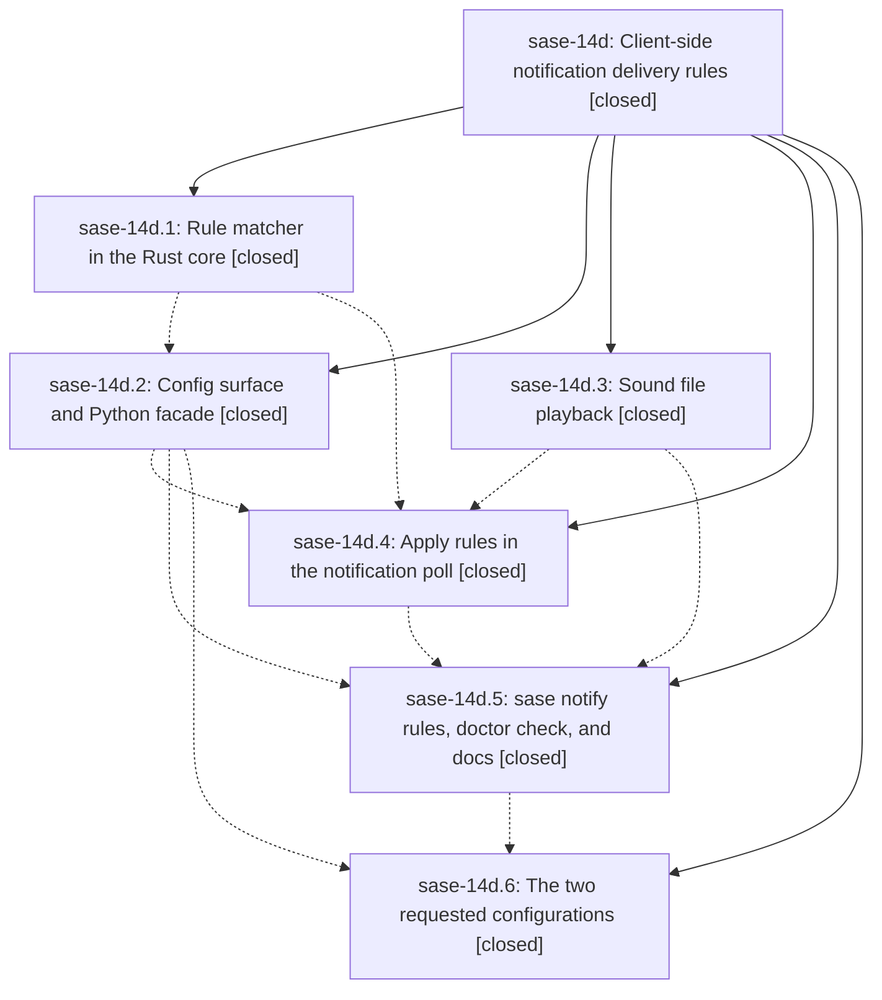

# Bead: sase-14d — Client-side notification delivery rules

[Bead Pages](../README.md) / sase-14d

**Status:** ✓ closed · **Resolution:** done · **Type:** ▸ plan · **Tier:** epic
**Owner:** `bryanbugyi34@gmail.com` · **Created by:** [bbugyi200.athena.0o7](https://github.com/sase-org/sase--agents/blob/main/families/bbugyi200.athena.0o7.md) · **Assignee:** `sase-14d.land`
**Created:** 2026-09-20 13:11:29 EDT · **Closed:** 2026-09-20 18:12:38 EDT
**Plan:** [202609/notification\_delivery\_rules.md](https://github.com/sase-org/sase--plans/blob/main/202609/notification_delivery_rules.md)

<!-- sase:links:start -->

## Links

| Relation | Artifact | Why |
| --- | --- | --- |
| implemented-by | [plan:202609/notification_delivery_rules.md][1] | derived from the plan's `bead_id:` frontmatter field |

[1]: https://github.com/sase-org/sase--plans/blob/main/202609/notification_delivery_rules.md

<!-- sase:links:end -->

## Description

A person receiving SASE notifications can match them by tab, sender, action, tag, title, or note text, and decide per match whether a TUI toast is shown and whether the announcement is the terminal bell, a custom sound file, or silence. Task-bead notifications announce nothing on every machine, and kellys_mbp announces with a sound file instead of the bell.

## Notes

[2026-09-20T22:12:38Z · sase-14d.land] VERIFIED all six phases against the source, not just their notes. Commits: 15763853b3
(sound-backend), 9a99238cdf (config-rules), 0f5a81da70 (tui-delivery), 03cc36be5c
(observability), sase-core a7f26b2 (core-rules), chezmoi f7da6820 (chezmoi-config).

Core: crates/sase_core/src/notifications/rules.rs and the
resolve_notification_deliveries PyO3 binding are present at the pinned revision.
sase-core-revision.txt now reads a4c4e65c, which `git merge-base --is-ancestor` confirms
is a descendant of the v0.34.70 release (92625404) carrying a7f26b2; the binding is
present at that SHA.

Python: delivery.py drops a malformed rule whole, caches on the config token, and
short-circuits an empty batch or empty rule list; the poll resolves one batch per tick
on the existing asyncio.to_thread hop, filters toast:false rows before
format_batch_toasts, and plays one sound per tick. `_poll_agent_completions_once` is
still the only announcement site in the repo (no other _ring_tmux_bell or
format_batch_toasts caller), and every symbol the epic added has a real non-test
consumer, so nothing needed a whitelist: `sase bead epic-symbols sase-14d` is empty and
no sase-14d --epic-symbol line remains in the Justfile.

Live end-to-end on athena, not just unit tests: `sase notify rules` lists
quiet-task-beads from the [user] layer, `sase doctor -C config.notification_rules` is
OK, and `sase notify rules --explain <TaskTriage id>` attributes both toast and sound to
quiet-task-beads. The chezmoi sase.yml rule is applied here; the kellys_mbp overlay is
committed and waits on the release cadence (see FOLLOW-UP 6).

INTEGRATION with the 15 commits that landed since 15763853b3 and the 5 that landed on
origin/master mid-landing: nothing else touches notification announcement, so there was
no duplicate or conflicting implementation to reconcile. Fast-forwarded to 19c515e0ae
and re-verified there. Three of those commits retired this epic's own follow-ups
(below). 47e281b7a0 privatized symbols only in sdd/service/completion/runner-slot
modules, none of them this epic's.

FIXED HERE (epic-caused, from sase-14d.4 note #3): a sound file was awaited inside the
poll tick, so a multi-second chime delayed that tick, the Agents refresh behind it, and
the auto-refresh tick by the file's duration (30s timeout cap) where the 0.3s bell had
hidden the cost. A file now plays on a detached task with a single-player guard, so
ticks arriving faster than the file is long cannot stack up players; the bell stays
awaited. 3 new tests plus a docs paragraph in docs/notifications.md.

FOLLOW-UP OUTCOMES (every PROPOSED FOLLOW-UP across the six phase beads):
1. sase-14d.1 #1, doctor needs its own unclosed-glob test because the core matcher is
   total: ALREADY DONE inside the epic by sase-14d.5 - _has_unclosed_bracket plus
   test_unclosed_bracket_detection_agrees_with_the_core, which pins the Python detection
   to the core's literal-'[' behavior, and the check also flags empty criterion lists,
   blank sounds, and no-op rules. No task filed.
2. sase-14d.2 #1, raise the sase-core-rs floor to >=0.34.70: ALREADY DONE by 6086402725,
   which bumped pyproject.toml to sase-core-rs>=0.34.70,<0.35.0 and ratcheted the pin.
   No task filed.
3. sase-14d.2 #2 / .3 #1 / .4 #1 / .5 #2, symvision red at HEAD on ~26 unused public
   symbols from other in-flight work: FIXED UPSTREAM by 47e281b7a0. lint (symvision) is
   green. No task filed.
4. sase-14d.5 #1, lint (feature flags) red on closed flag bead sase-12m still having a
   service_host definition: FIXED UPSTREAM by ef99009908. Green. No task filed.
5. sase-14d.4 #2 / .5 #3, 7 tests failing at clean HEAD: ALL FIXED UPSTREAM - the 4
   epic-panel arrival-frame nodes by 7442af7afc, lazy-tier2 by 54fff48206, the 2
   capacity-gate nodes by 19c515e0ae. The full scoped lane is green.
6. sase-14d.6, the kellys_mbp rule is committed to chezmoi but not applied there:
   DECLINED as a task bead, deliberately. The source of truth is committed and the next
   ordinary chezmoi apply on that machine picks it up; the only hazard is applying
   before a carrying build is installed, which produces an unknown-key warning in
   `sase config validate` rather than breakage, and sase-14d.6's own note already
   records the verification steps. There is no work here an agent can do or that a ready
   bead would usefully gate on the release cadence.
7. sase-14d.5 #3 tail, two tests assert the absent-bead-store branch but let the
   resolver find the host's live store: FILED as sase-14o (task(ci), small) after
   reproducing both nodes at 19c515e0ae, with related links to sase-ql and sase-ml.
   Unrelated to this epic.

`just check` passes clean at 19c515e0ae with this landing's changes: every lint gate,
SASE validation, committed plans, and test (scoped).

## Phases

| Bead | Title | Status | Size | Created | Agents | Commits |
|---|---|---|---|---|---:|---:|
| [sase-14d.1](sase-14d.1.md) | Rule matcher in the Rust core | ✓ closed | medium | 2026-09-20 | 1 | 1 |
| [sase-14d.2](sase-14d.2.md) | Config surface and Python facade | ✓ closed | medium | 2026-09-20 | 1 | 1 |
| [sase-14d.3](sase-14d.3.md) | Sound file playback | ✓ closed | small | 2026-09-20 | 1 | 1 |
| [sase-14d.4](sase-14d.4.md) | Apply rules in the notification poll | ✓ closed | medium | 2026-09-20 | 1 | 1 |
| [sase-14d.5](sase-14d.5.md) | sase notify rules, doctor check, and docs | ✓ closed | medium | 2026-09-20 | 1 | 1 |
| [sase-14d.6](sase-14d.6.md) | The two requested configurations | ✓ closed | small | 2026-09-20 | 1 | 1 |

## Lineage

## Agents

| Agent | Bead | Commits |
|---|---|---:|
| [bbugyi200.athena.sase-14d.1](https://github.com/sase-org/sase--agents/blob/main/agents/bbugyi200.athena.sase-14d.1/README.md) | [sase-14d.1](sase-14d.1.md) | 1 |
| [bbugyi200.athena.sase-14d.2](https://github.com/sase-org/sase--agents/blob/main/agents/bbugyi200.athena.sase-14d.2/README.md) | [sase-14d.2](sase-14d.2.md) | 1 |
| [bbugyi200.athena.sase-14d.3](https://github.com/sase-org/sase--agents/blob/main/agents/bbugyi200.athena.sase-14d.3/README.md) | [sase-14d.3](sase-14d.3.md) | 1 |
| [bbugyi200.athena.sase-14d.4](https://github.com/sase-org/sase--agents/blob/main/agents/bbugyi200.athena.sase-14d.4/README.md) | [sase-14d.4](sase-14d.4.md) | 1 |
| [bbugyi200.athena.sase-14d.5](https://github.com/sase-org/sase--agents/blob/main/agents/bbugyi200.athena.sase-14d.5/README.md) | [sase-14d.5](sase-14d.5.md) | 1 |
| [bbugyi200.athena.sase-14d.6](https://github.com/sase-org/sase--agents/blob/main/agents/bbugyi200.athena.sase-14d.6/README.md) | [sase-14d.6](sase-14d.6.md) | 1 |
| [bbugyi200.athena.sase-14d.land](https://github.com/sase-org/sase--agents/blob/main/agents/bbugyi200.athena.sase-14d.land/README.md) | [sase-14d](README.md) | 1 |

## Commits

| Repo | Commit | Subject | Bead | Committed |
|---|---|---|---|---|
| sase | [`1576385`](https://github.com/sase-org/sase/commit/15763853b338ad6e43b2610d4866e5aec67ec237) | feat(tui): add sound-file playback for notification delivery | [sase-14d.3](sase-14d.3.md) | 2026-09-20 13:28:57 EDT |
| sase-core | [`sase-core@a7f26b2`](https://github.com/sase-org/sase-core/commit/a7f26b2b2018901501c443931c518c86d5469110) | feat(notifications): add delivery rule matcher and resolve\_notification\_deliveries binding | [sase-14d.1](sase-14d.1.md) | 2026-09-20 13:31:24 EDT |
| sase | [`9a99238`](https://github.com/sase-org/sase/commit/9a99238cdf0e9e415575f5b11559cdb2f29c59c2) | feat(notifications): add ace.notification\_rules config and Python delivery facade | [sase-14d.2](sase-14d.2.md) | 2026-09-20 14:40:33 EDT |
| sase | [`0f5a81d`](https://github.com/sase-org/sase/commit/0f5a81da70e3fa4360d0f4eab1e44efdcfcb8ca9) | feat(tui): apply notification delivery rules in the poll | [sase-14d.4](sase-14d.4.md) | 2026-09-20 15:38:12 EDT |
| sase | [`03cc36b`](https://github.com/sase-org/sase/commit/03cc36be5c6ff17474f5390ed402bc82d3a53a5d) | feat(notify): add sase notify rules, doctor check, and delivery-rules docs | [sase-14d.5](sase-14d.5.md) | 2026-09-20 16:54:29 EDT |
| chezmoi | [`chezmoi@f7da682`](https://github.com/bbugyi200/dotfiles/commit/f7da68203d0b2d2568496fbac7f7c4497eb45870) | feat(sase): add notification delivery rules for task beads and kellys\_mbp chime | [sase-14d.6](sase-14d.6.md) | 2026-09-20 17:05:55 EDT |
| sase | [`2322fe5`](https://github.com/sase-org/sase/commit/2322fe5f9cc5affb97aeef8fdfc13b249bcf5230) | fix(tui): play notification sound files detached from the poll tick | [sase-14d](README.md) | 2026-09-20 18:17:20 EDT |
