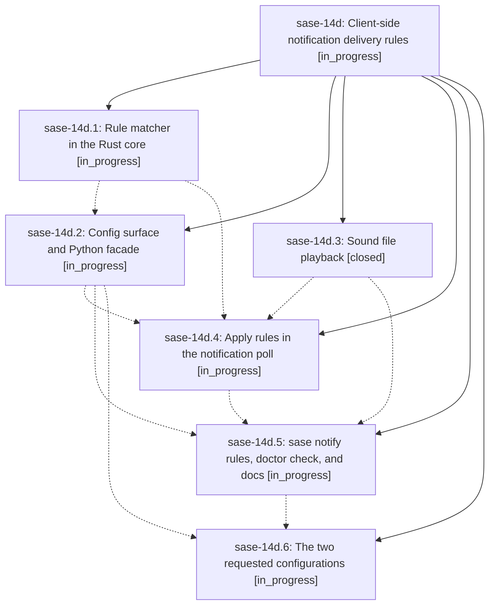

# Bead: sase-14d — Client-side notification delivery rules

[Bead Pages](../README.md) / sase-14d

**Status:** ◐ in_progress · **Type:** ▸ plan · **Tier:** epic
**Owner:** `bryanbugyi34@gmail.com` · **Created by:** [bbugyi200.athena.0o7](https://github.com/sase-org/sase--agents/blob/main/families/bbugyi200.athena.0o7.md) · **Assignee:** `sase-14d.land`
**Created:** 2026-09-20 13:11:29 EDT
**Plan:** [202609/notification\_delivery\_rules.md](https://github.com/sase-org/sase--plans/blob/main/202609/notification_delivery_rules.md)

## Description

A person receiving SASE notifications can match them by tab, sender, action, tag, title, or note text, and decide per match whether a TUI toast is shown and whether the announcement is the terminal bell, a custom sound file, or silence. Task-bead notifications announce nothing on every machine, and kellys_mbp announces with a sound file instead of the bell.

## Phases

| Bead | Title | Status | Size | Created | Agents | Commits |
|---|---|---|---|---|---:|---:|
| [sase-14d.1](sase-14d.1.md) | Rule matcher in the Rust core | ◐ in_progress | medium | 2026-09-20 | 1 | 0 |
| [sase-14d.2](sase-14d.2.md) | Config surface and Python facade | ◐ in_progress | medium | 2026-09-20 | 1 | 0 |
| [sase-14d.3](sase-14d.3.md) | Sound file playback | ✓ closed | small | 2026-09-20 | 1 | 1 |
| [sase-14d.4](sase-14d.4.md) | Apply rules in the notification poll | ◐ in_progress | medium | 2026-09-20 | 1 | 0 |
| [sase-14d.5](sase-14d.5.md) | sase notify rules, doctor check, and docs | ◐ in_progress | medium | 2026-09-20 | 1 | 0 |
| [sase-14d.6](sase-14d.6.md) | The two requested configurations | ◐ in_progress | small | 2026-09-20 | 1 | 0 |

## Lineage

## Agents

| Agent | Bead | Commits |
|---|---|---:|
| [bbugyi200.athena.sase-14d.1](https://github.com/sase-org/sase--agents/blob/main/agents/bbugyi200.athena.sase-14d.1/README.md) | [sase-14d.1](sase-14d.1.md) | 0 |
| [bbugyi200.athena.sase-14d.2](https://github.com/sase-org/sase--agents/blob/main/agents/bbugyi200.athena.sase-14d.2/README.md) | [sase-14d.2](sase-14d.2.md) | 0 |
| [bbugyi200.athena.sase-14d.3](https://github.com/sase-org/sase--agents/blob/main/agents/bbugyi200.athena.sase-14d.3/README.md) | [sase-14d.3](sase-14d.3.md) | 1 |
| [bbugyi200.athena.sase-14d.4](https://github.com/sase-org/sase--agents/blob/main/agents/bbugyi200.athena.sase-14d.4/README.md) | [sase-14d.4](sase-14d.4.md) | 0 |
| [bbugyi200.athena.sase-14d.5](https://github.com/sase-org/sase--agents/blob/main/agents/bbugyi200.athena.sase-14d.5/README.md) | [sase-14d.5](sase-14d.5.md) | 0 |
| [bbugyi200.athena.sase-14d.6](https://github.com/sase-org/sase--agents/blob/main/agents/bbugyi200.athena.sase-14d.6/README.md) | [sase-14d.6](sase-14d.6.md) | 0 |
| [bbugyi200.athena.sase-14d.land](https://github.com/sase-org/sase--agents/blob/main/agents/bbugyi200.athena.sase-14d.land/README.md) | [sase-14d](README.md) | 0 |

## Commits

| Repo | Commit | Subject | Bead | Committed |
|---|---|---|---|---|
| sase | [`1576385`](https://github.com/sase-org/sase/commit/15763853b338ad6e43b2610d4866e5aec67ec237) | feat(tui): add sound-file playback for notification delivery | [sase-14d.3](sase-14d.3.md) | 2026-09-20 13:28:57 EDT |
