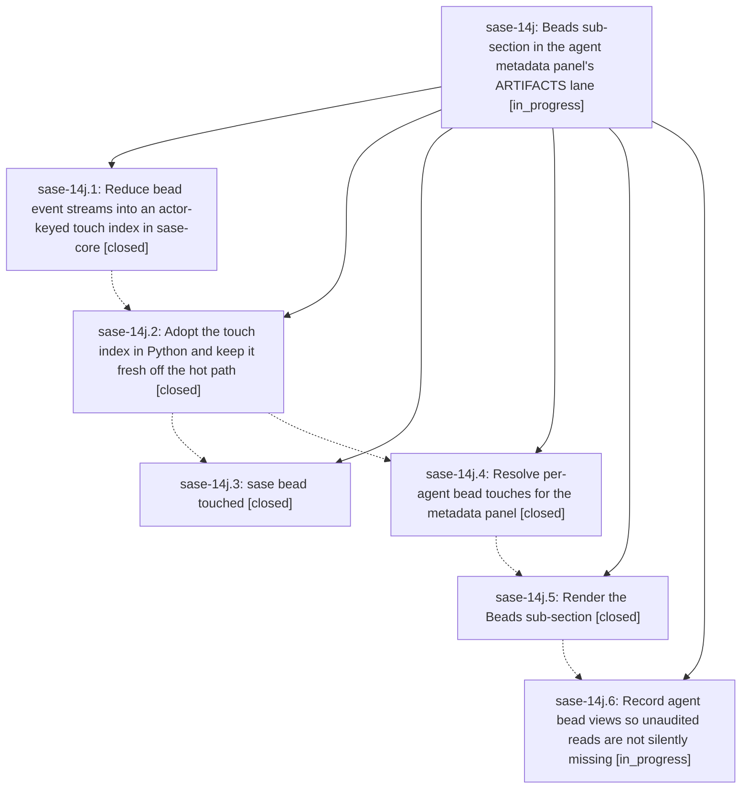

# Bead: sase-14j — Beads sub-section in the agent metadata panel's ARTIFACTS lane

[Bead Pages](../README.md) / sase-14j

**Status:** ◐ in_progress · **Type:** ▸ plan · **Tier:** epic
**Owner:** `bryanbugyi34@gmail.com` · **Created by:** [bbugyi200.athena.0oa](https://github.com/sase-org/sase--agents/blob/main/families/bbugyi200.athena.0oa.md) · **Assignee:** `sase-14j.land`
**Created:** 2026-09-20 16:31:04 EDT
**Plan:** [202609/agent\_bead\_touches.md](https://github.com/sase-org/sase--plans/blob/main/202609/agent_bead_touches.md)

<!-- sase:links:start -->

## Links

| Relation | Artifact | Why |
| --- | --- | --- |
| implemented-by | [plan:202609/agent_bead_touches.md][1] | derived from the plan's `bead_id:` frontmatter field |

[1]: https://github.com/sase-org/sase--plans/blob/main/202609/agent_bead_touches.md

<!-- sase:links:end -->

## Description

Selecting a sase agent in the Agents tab shows a Beads sub-section inside SASE CONTEXT's ARTIFACTS lane that lists every bead that agent read, created, or changed, with one row per bead, the verbs it performed, and the bead's title; the underlying agent-to-bead touch facts are reduced once in sase-core, queryable from the CLI, and cheap enough for the panel's hot path.

## Notes

[2026-09-21T01:31:44Z · sase-14l.land] DISCOVERED ISSUE (found by the sase-14l land agent, 2026-09-21, master 383f2c282): 'just check' now fails its final gate on this epic's core capabilities, after every lint stage and the test lane have run:

  [core-floor-probe] blocked_unpublished: sase-core-rs==0.34.70 is missing 3 capability(s), and at least one has no containing sase-core release tag yet.
  [core-floor-probe] bead_touch_index_query:   first appears in sase-core 9a5c568 (feat(bead): reduce event streams into an actor-keyed touch index); no release tag contains it yet.
  [core-floor-probe] bead_touch_index_refresh: same
  [core-floor-probe] bead_touch_index_status:  same
  error: Recipe 'check' failed on line 712 with exit code 1

Phase sase-14j.2 (821a21c49) landed src/sase/core/bead_touch_index_facade.py against
sase-core 9a5c568, which is newer than sase-core-revision.txt's pin
(1655a1298fc99a906d1c0ae9607b8a142aec08e8) and is not in any published sase-core
release. Until sase-core cuts a release containing 9a5c568 (or the floor probe is
taught to accept an unpublished capability behind this epic), every agent's 'just
check' in this repo ends red on this gate regardless of their own changes. Not caused
by epic sase-14l; recorded here because this epic owns the capability.

## Phases

| Bead | Title | Status | Size | Created | Agents | Commits |
|---|---|---|---|---|---:|---:|
| [sase-14j.1](sase-14j.1.md) | Reduce bead event streams into an actor-keyed touch index in sase-core | ✓ closed | medium | 2026-09-20 | 1 | 1 |
| [sase-14j.2](sase-14j.2.md) | Adopt the touch index in Python and keep it fresh off the hot path | ✓ closed | medium | 2026-09-20 | 1 | 1 |
| [sase-14j.3](sase-14j.3.md) | sase bead touched | ✓ closed | small | 2026-09-20 | 1 | 0 |
| [sase-14j.4](sase-14j.4.md) | Resolve per-agent bead touches for the metadata panel | ✓ closed | medium | 2026-09-20 | 1 | 1 |
| [sase-14j.5](sase-14j.5.md) | Render the Beads sub-section | ✓ closed | medium | 2026-09-20 | 1 | 1 |
| [sase-14j.6](sase-14j.6.md) | Record agent bead views so unaudited reads are not silently missing | ◐ in_progress | small | 2026-09-20 | 1 | 0 |

## Lineage

## Agents

| Agent | Bead | Commits |
|---|---|---:|
| [bbugyi200.athena.sase-14j.1](https://github.com/sase-org/sase--agents/blob/main/agents/bbugyi200.athena.sase-14j.1/README.md) | [sase-14j.1](sase-14j.1.md) | 1 |
| [bbugyi200.athena.sase-14j.2](https://github.com/sase-org/sase--agents/blob/main/agents/bbugyi200.athena.sase-14j.2/README.md) | [sase-14j.2](sase-14j.2.md) | 1 |
| [bbugyi200.athena.sase-14j.3](https://github.com/sase-org/sase--agents/blob/main/families/bbugyi200.athena.sase-14j.3.md) | [sase-14j.3](sase-14j.3.md) | 0 |
| [bbugyi200.athena.sase-14j.4](https://github.com/sase-org/sase--agents/blob/main/families/bbugyi200.athena.sase-14j.4.md) | [sase-14j.4](sase-14j.4.md) | 1 |
| [bbugyi200.athena.sase-14j.5](https://github.com/sase-org/sase--agents/blob/main/agents/bbugyi200.athena.sase-14j.5/README.md) | [sase-14j.5](sase-14j.5.md) | 1 |
| [bbugyi200.athena.sase-14j.6](https://github.com/sase-org/sase--agents/blob/main/agents/bbugyi200.athena.sase-14j.6/README.md) | [sase-14j.6](sase-14j.6.md) | 0 |
| [bbugyi200.athena.sase-14j.land](https://github.com/sase-org/sase--agents/blob/main/agents/bbugyi200.athena.sase-14j.land/README.md) | [sase-14j](README.md) | 0 |

## Commits

| Repo | Commit | Subject | Bead | Committed |
|---|---|---|---|---|
| sase-core | [`sase-core@9a5c568`](https://github.com/sase-org/sase-core/commit/9a5c56809a66261d194de07c4a7f400a10706328) | feat(bead): reduce event streams into an actor-keyed touch index | [sase-14j.1](sase-14j.1.md) | 2026-09-20 17:19:43 EDT |
| sase | [`821a21c`](https://github.com/sase-org/sase/commit/821a21c49332a8ed315a2e4109888264a189b2e7) | feat(beads): add bead touch index facade with refresh hooks and doctor check | [sase-14j.2](sase-14j.2.md) | 2026-09-20 18:46:47 EDT |
| sase | [`e1ba485`](https://github.com/sase-org/sase/commit/e1ba4851c1011acc8a8825d5570159b14f7926d0) | feat(tui): resolve per-agent bead touches for the metadata panel | [sase-14j.4](sase-14j.4.md) | 2026-09-20 21:06:00 EDT |
| sase | [`2b3b37e`](https://github.com/sase-org/sase/commit/2b3b37e8977acdbd81cb51f0146fdab9902b7f06) | feat(agents): render Beads sub-section in ARTIFACTS lane | [sase-14j.5](sase-14j.5.md) | 2026-09-20 22:20:12 EDT |
