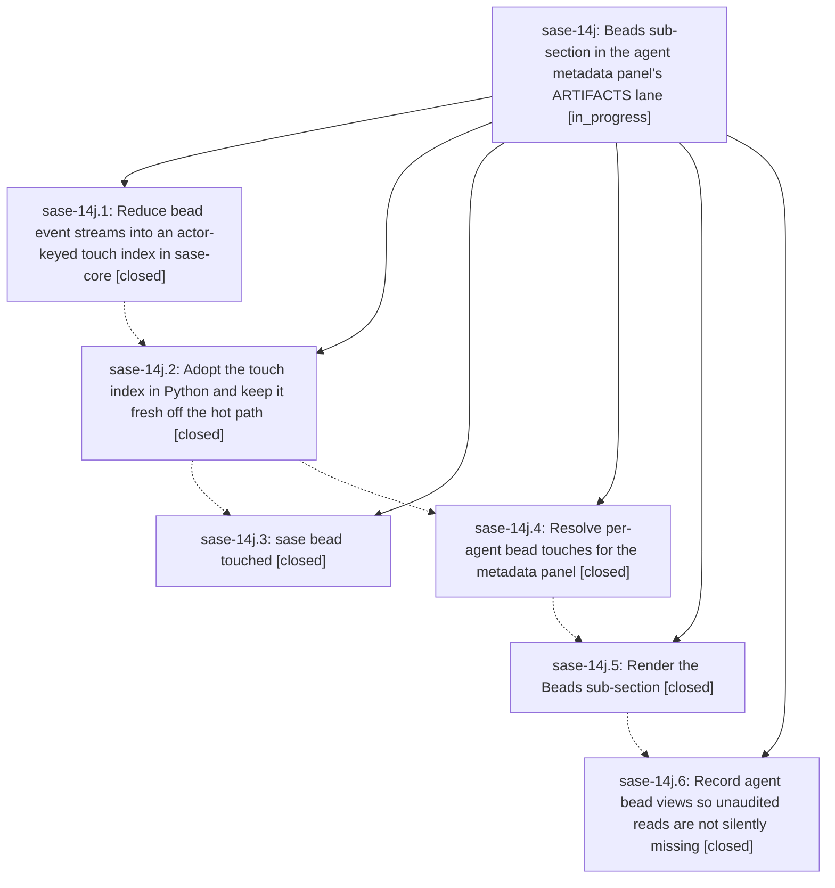

# Bead: sase-14j — Beads sub-section in the agent metadata panel's ARTIFACTS lane

[Bead Pages](../README.md) / sase-14j

**Status:** ◐ in_progress · **Type:** ▸ plan · **Tier:** epic
**Owner:** `bryanbugyi34@gmail.com` · **Created by:** [bbugyi200.athena.0oa](https://github.com/sase-org/sase--agents/blob/main/families/bbugyi200.athena.0oa.md) · **Assignee:** `sase-14j.land`
**Created:** 2026-09-20 16:31:04 EDT
**Plan:** [202609/agent\_bead\_touches.md](https://github.com/sase-org/sase--plans/blob/main/202609/agent_bead_touches.md)

<!-- sase:links:start -->

## Links

| Relation | Artifact | Why |
| --- | --- | --- |
| implemented-by | [plan:202609/agent_bead_touches.md][1] | derived from the plan's `bead_id:` frontmatter field |

[1]: https://github.com/sase-org/sase--plans/blob/main/202609/agent_bead_touches.md

<!-- sase:links:end -->

## Description

Selecting a sase agent in the Agents tab shows a Beads sub-section inside SASE CONTEXT's ARTIFACTS lane that lists every bead that agent read, created, or changed, with one row per bead, the verbs it performed, and the bead's title; the underlying agent-to-bead touch facts are reduced once in sase-core, queryable from the CLI, and cheap enough for the panel's hot path.

## Notes

[2026-09-21T01:31:44Z · sase-14l.land] DISCOVERED ISSUE (found by the sase-14l land agent, 2026-09-21, master 383f2c282): 'just check' now fails its final gate on this epic's core capabilities, after every lint stage and the test lane have run:

  [core-floor-probe] blocked_unpublished: sase-core-rs==0.34.70 is missing 3 capability(s), and at least one has no containing sase-core release tag yet.
  [core-floor-probe] bead_touch_index_query:   first appears in sase-core 9a5c568 (feat(bead): reduce event streams into an actor-keyed touch index); no release tag contains it yet.
  [core-floor-probe] bead_touch_index_refresh: same
  [core-floor-probe] bead_touch_index_status:  same
  error: Recipe 'check' failed on line 712 with exit code 1

Phase sase-14j.2 (821a21c49) landed src/sase/core/bead_touch_index_facade.py against
sase-core 9a5c568, which is newer than sase-core-revision.txt's pin
(1655a1298fc99a906d1c0ae9607b8a142aec08e8) and is not in any published sase-core
release. Until sase-core cuts a release containing 9a5c568 (or the floor probe is
taught to accept an unpublished capability behind this epic), every agent's 'just
check' in this repo ends red on this gate regardless of their own changes. Not caused
by epic sase-14l; recorded here because this epic owns the capability.

[2026-09-21T04:06:46Z · toobig-5q.loading_apply.0] DISCOVERED ISSUE (2026-09-21, master 44577fb8f9, found while verifying an unrelated file split; independent of the core-floor-probe note above): two more master-red gates trace to this epic. Both reproduced on a clean HEAD via git stash.

(1) `just check` fails at lint (symvision): bead_touch_glyph and ordered_bead_verb_chips in src/sase/ace/tui/widgets/prompt_panel/_agent_bead_touches.py are 'Unused public functions/classes'. The module came in with 2b3b37e897 (render Beads sub-section in ARTIFACTS lane). Both are used only inside that file (lines 135, 160) and by tests/ace/tui/widgets/test_agent_bead_touch_rows.py; test references do not count, so per symvision.md they should become private (or gain a real non-test consumer; --epic-symbol is only for a not-yet-landed later phase, e.g. sase-14j.6).

(2) The scoped test lane fails tests/test_check_sase_core_rs_bindings_tool.py::test_dev_extension_exposes_every_collected_name: the installed sase_core_rs extension lacks bead_touch_index_query, bead_touch_index_refresh and bead_touch_index_status. Same three capabilities as the floor-probe note above, and the same stale-wheel cause sase-14j.4 recorded for tests/core/test_bead_touch_index_facade.py.

[2026-09-21T13:26:28Z · sase-14j.land] LAND VERIFICATION, interrupted for remaining work (sase-14j.land, 2026-09-21, master da766b87a). Phases .1, .2, .4, .5, and .6 are verified in source and in commits 821a21c49, e1ba4851c, 2b3b37e89, and da766b87a (sase-core 9a5c568 for .1). Remaining epic work is planned as a child tale:
(1) sase-14j.3 is CLOSED, but `sase bead touched` never landed. The host commit finalizer failed (muse exec exit 143) after the bead-close commit, and the code commit was never made. The full uncommitted diff survives at ~/.sase/projects/gh_sase-org__sase/artifacts/ace-run/202609/20/20260920163305/commit_diffs/002.diff. With its Justfile/_notification_utils/settlement-test hunks excluded (already landed via d79525c55), it applies cleanly to da766b87a. It predates .5/.6, so it still needs view integration, the shared glyph vocabulary, and one row per bead. Its -a/--all flag is dead because the core index drops owner and invalid actors (sase-core touch_index.rs owner_email_and_invalid_actors_never_become_touchers).
(2) Master Gate has been red since 821a21c49. sase-core-revision.txt pins 1655a129, which predates 9a5c568, so the 'Check pinned core bindings' lint step and three shard tests fail on missing bead_touch_index_query/refresh/status (run 35602782267). This needs `just ratchet-core-revision`.
(3) symvision: bead_touch_glyph and ordered_bead_verb_chips are unused public symbols. The Justfile's sase-14j epic-symbol entries (BeadTouchIndexStatus, BeadTouchRefresh, query_touches_for_agent) need resolving.
(4) Three Agents-tab PNG goldens (agents_task_bead_notes / agents_phase_bead_context / agents_phase_bead_and_plan_context 120x40) were never regenerated after 2b3b37e89.
FOLLOW-UP DISPOSITIONS so far: filed sase-159 (link_added/link_removed actor is always the owner) and sase-15a (note/+1 actors are bare local names; root cause resolve_mutation_author), both from the plan's 'Memory and follow-ups'. +1'd sase-14q for sase-14j.5 note #3 (proc gear badge in goldens). Declined sase-14j.4 #1 and sase-14j.5 #2: the sase-14l.3 epic-symbol was already retired by d79525c55. sase-14j.4 #2 and epic note #2(2) (stale sase_core_rs wheel): the local wheel now exposes the bindings, and the CI side is item (2). Declined sase-14j.1 #2 (touch status can lag a +1 reopen): no surface keys behavior off status, which is emitted only in JSON and is documented as last-known from reduced events; revisit if a consumer starts keying off it. Epic note #1 (core floor probe) is now advisory since f43d6e4fe; the published-floor gap closes when sase-core cuts a release containing 9a5c568 and the release floor ratchets, which is release workflow, not landing work. Items (1)-(4) cover sase-14j.1 #1, sase-14j.5 #1, sase-14j.6 #1, and epic note #2(1).

## Phases

| Bead | Title | Status | Size | Created | Agents | Commits |
|---|---|---|---|---|---:|---:|
| [sase-14j.1](sase-14j.1.md) | Reduce bead event streams into an actor-keyed touch index in sase-core | ✓ closed | medium | 2026-09-20 | 1 | 1 |
| [sase-14j.2](sase-14j.2.md) | Adopt the touch index in Python and keep it fresh off the hot path | ✓ closed | medium | 2026-09-20 | 1 | 1 |
| [sase-14j.3](sase-14j.3.md) | sase bead touched | ✓ closed | small | 2026-09-20 | 1 | 0 |
| [sase-14j.4](sase-14j.4.md) | Resolve per-agent bead touches for the metadata panel | ✓ closed | medium | 2026-09-20 | 1 | 1 |
| [sase-14j.5](sase-14j.5.md) | Render the Beads sub-section | ✓ closed | medium | 2026-09-20 | 1 | 1 |
| [sase-14j.6](sase-14j.6.md) | Record agent bead views so unaudited reads are not silently missing | ✓ closed | small | 2026-09-20 | 1 | 1 |

## Lineage

## Agents

| Agent | Bead | Commits |
|---|---|---:|
| [bbugyi200.athena.sase-14j.1](https://github.com/sase-org/sase--agents/blob/main/agents/bbugyi200.athena.sase-14j.1/README.md) | [sase-14j.1](sase-14j.1.md) | 1 |
| [bbugyi200.athena.sase-14j.2](https://github.com/sase-org/sase--agents/blob/main/agents/bbugyi200.athena.sase-14j.2/README.md) | [sase-14j.2](sase-14j.2.md) | 1 |
| [bbugyi200.athena.sase-14j.3](https://github.com/sase-org/sase--agents/blob/main/families/bbugyi200.athena.sase-14j.3.md) | [sase-14j.3](sase-14j.3.md) | 0 |
| [bbugyi200.athena.sase-14j.4](https://github.com/sase-org/sase--agents/blob/main/families/bbugyi200.athena.sase-14j.4.md) | [sase-14j.4](sase-14j.4.md) | 1 |
| [bbugyi200.athena.sase-14j.5](https://github.com/sase-org/sase--agents/blob/main/agents/bbugyi200.athena.sase-14j.5/README.md) | [sase-14j.5](sase-14j.5.md) | 1 |
| [bbugyi200.athena.sase-14j.6](https://github.com/sase-org/sase--agents/blob/main/agents/bbugyi200.athena.sase-14j.6/README.md) | [sase-14j.6](sase-14j.6.md) | 1 |
| [bbugyi200.athena.sase-14j.land](https://github.com/sase-org/sase--agents/blob/main/families/bbugyi200.athena.sase-14j.land.md) | [sase-14j](README.md) | 1 |

## Commits

| Repo | Commit | Subject | Bead | Committed |
|---|---|---|---|---|
| sase-core | [`sase-core@9a5c568`](https://github.com/sase-org/sase-core/commit/9a5c56809a66261d194de07c4a7f400a10706328) | feat(bead): reduce event streams into an actor-keyed touch index | [sase-14j.1](sase-14j.1.md) | 2026-09-20 17:19:43 EDT |
| sase | [`821a21c`](https://github.com/sase-org/sase/commit/821a21c49332a8ed315a2e4109888264a189b2e7) | feat(beads): add bead touch index facade with refresh hooks and doctor check | [sase-14j.2](sase-14j.2.md) | 2026-09-20 18:46:47 EDT |
| sase | [`e1ba485`](https://github.com/sase-org/sase/commit/e1ba4851c1011acc8a8825d5570159b14f7926d0) | feat(tui): resolve per-agent bead touches for the metadata panel | [sase-14j.4](sase-14j.4.md) | 2026-09-20 21:06:00 EDT |
| sase | [`2b3b37e`](https://github.com/sase-org/sase/commit/2b3b37e8977acdbd81cb51f0146fdab9902b7f06) | feat(agents): render Beads sub-section in ARTIFACTS lane | [sase-14j.5](sase-14j.5.md) | 2026-09-20 22:20:12 EDT |
| sase | [`da766b8`](https://github.com/sase-org/sase/commit/da766b87a17b6fdbb1402fef50b4d28fc460e44c) | feat(beads): record agent bead show views as weaker viewed touches | [sase-14j.6](sase-14j.6.md) | 2026-09-21 08:59:35 EDT |
| sase | [`319fe6b`](https://github.com/sase-org/sase/commit/319fe6b246fa09f4c8fa509a98f4a8b9e4c9f10f) | feat(beads): land sase bead touched with panel-agreeing rows, core pin, and Beads goldens | [sase-14j](README.md) | 2026-09-21 10:55:32 EDT |
