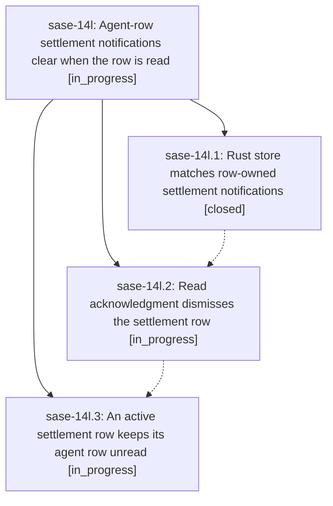

# Bead: sase-14l — Agent-row settlement notifications clear when the row is read

[Bead Pages](../README.md) / sase-14l

**Status:** ◐ in_progress · **Type:** ▸ plan · **Tier:** epic
**Owner:** `bryanbugyi34@gmail.com` · **Created by:** [bbugyi200.apollo.17](https://github.com/sase-org/sase--agents/blob/main/families/bbugyi200.apollo.17.md) · **Assignee:** `sase-14l.land`
**Created:** 2026-09-20 16:56:53 EDT
**Plan:** [202609/epic\_launch\_read\_dismiss.md](https://github.com/sase-org/sase--plans/blob/main/202609/epic_launch_read_dismiss.md)

<!-- sase:links:start -->

## Links

| Relation | Artifact | Why |
| --- | --- | --- |
| implemented-by | [plan:202609/epic_launch_read_dismiss.md][1] | derived from the plan's `bead_id:` frontmatter field |

[1]: https://github.com/sase-org/sase--plans/blob/main/202609/epic_launch_read_dismiss.md

<!-- sase:links:end -->

## Description

An `epic-launch` or `monitor-settlement` notification that names one exact agent row is dismissed automatically the moment that row goes unread to read in the Agents tab, through the same Rust-owned store operation every surface already uses, so the notification inbox stops accumulating launch rows the user has already acknowledged on the agent.

## Phases

| Bead | Title | Status | Size | Created | Agents | Commits |
|---|---|---|---|---|---:|---:|
| [sase-14l.1](sase-14l.1.md) | Rust store matches row-owned settlement notifications | ✓ closed | small | 2026-09-20 | 1 | 1 |
| [sase-14l.2](sase-14l.2.md) | Read acknowledgment dismisses the settlement row | ◐ in_progress | medium | 2026-09-20 | 1 | 0 |
| [sase-14l.3](sase-14l.3.md) | An active settlement row keeps its agent row unread | ◐ in_progress | small | 2026-09-20 | 1 | 0 |

## Lineage

## Agents

| Agent | Bead | Commits |
|---|---|---:|
| [bbugyi200.apollo.sase-14l.1](https://github.com/sase-org/sase--agents/blob/main/agents/bbugyi200.apollo.sase-14l.1/README.md) | [sase-14l.1](sase-14l.1.md) | 1 |
| [bbugyi200.apollo.sase-14l.2](https://github.com/sase-org/sase--agents/blob/main/agents/bbugyi200.apollo.sase-14l.2/README.md) | [sase-14l.2](sase-14l.2.md) | 0 |
| [bbugyi200.apollo.sase-14l.3](https://github.com/sase-org/sase--agents/blob/main/agents/bbugyi200.apollo.sase-14l.3/README.md) | [sase-14l.3](sase-14l.3.md) | 0 |
| [bbugyi200.apollo.sase-14l.land](https://github.com/sase-org/sase--agents/blob/main/agents/bbugyi200.apollo.sase-14l.land/README.md) | [sase-14l](README.md) | 0 |

## Commits

| Repo | Commit | Subject | Bead | Committed |
|---|---|---|---|---|
| sase-core | [`sase-core@1655a12`](https://github.com/sase-org/sase-core/commit/1655a1298fc99a906d1c0ae9607b8a142aec08e8) | feat(notifications): dismiss row-owned settlement rows by exact agent key | [sase-14l.1](sase-14l.1.md) | 2026-09-20 17:14:43 EDT |
