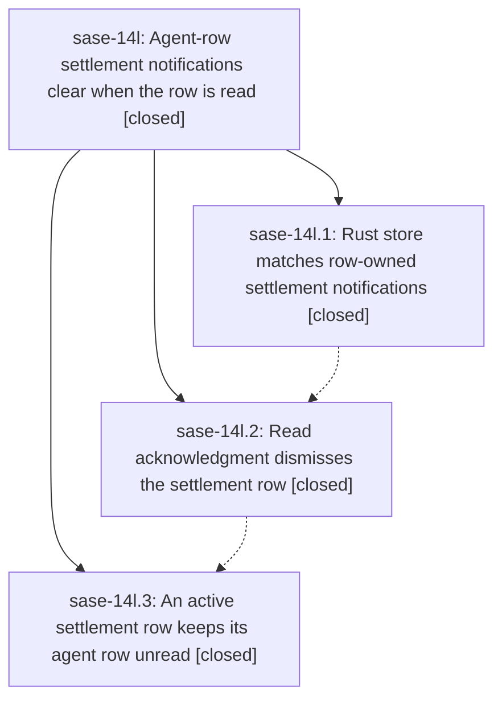

# Bead: sase-14l — Agent-row settlement notifications clear when the row is read

[Bead Pages](../README.md) / sase-14l

**Status:** ✓ closed · **Resolution:** done · **Type:** ▸ plan · **Tier:** epic
**Owner:** `bryanbugyi34@gmail.com` · **Created by:** [bbugyi200.apollo.17](https://github.com/sase-org/sase--agents/blob/main/families/bbugyi200.apollo.17.md) · **Assignee:** `sase-14l.land`
**Created:** 2026-09-20 16:56:53 EDT · **Closed:** 2026-09-20 21:33:52 EDT
**Plan:** [202609/epic\_launch\_read\_dismiss.md](https://github.com/sase-org/sase--plans/blob/main/202609/epic_launch_read_dismiss.md)

<!-- sase:links:start -->

## Links

| Relation | Artifact | Why |
| --- | --- | --- |
| implemented-by | [plan:202609/epic_launch_read_dismiss.md][1] | derived from the plan's `bead_id:` frontmatter field |

[1]: https://github.com/sase-org/sase--plans/blob/main/202609/epic_launch_read_dismiss.md

<!-- sase:links:end -->

## Description

An `epic-launch` or `monitor-settlement` notification that names one exact agent row is dismissed automatically the moment that row goes unread to read in the Agents tab, through the same Rust-owned store operation every surface already uses, so the notification inbox stops accumulating launch rows the user has already acknowledged on the agent.

## Notes

[2026-09-21T01:33:52Z · sase-14l.land] LAND VERIFICATION (epic sase-14l, all 3 phases closed done, master 383f2c282, workspace sase_16).

VERIFIED (step 1). Read every child note and the code behind it.
- sase-14l.1 (core-match): confirmed in the sase-core checkout. Commit 1655a12 adds
  matches_agent_settlement_notification / _for_agents to
  crates/sase_core/src/notifications/store.rs with the exact (cl_name, raw_suffix) rule,
  no cl_name-only fallback and a comment naming the reason, ORed into the existing
  DismissAgentCompletionsMatchingAgents arm with matched/changed accounting untouched;
  the agent-less DismissAgentCompletions arm and matches_agent_completion_notification
  are unchanged as the plan required. 167 lines of new parity tests.
- sase-14l.2 (host-ack): sase-core-revision.txt is at 1655a12 and that SHA is an
  ancestor of sase-core HEAD. _notification_utils.py carries the settlement predicate
  and the combined agent_row_notification_matches_agent; _unread_state.py's
  _remove_agent_completion_notifications_from_cache uses the combined predicate, which
  is the single funnel for all four read-ack/dismissal paths in the plan's section 1.1.
  Verified by reading those call sites that no new plumbing was needed. docs/notifications.md
  and docs/rust_backend.md both carry the widened contract, including why cl_name alone
  is not enough. Confirmed _notification_polling.py and _notification_provider.py keep
  no parallel copy of the completion predicate (grepped every 'user-agent'/JumpToAgent/
  settlement-sender site in src/sase/ace and src/sase/notifications).
- sase-14l.3 (unread-projection): active_row_owned_notification_keys is the union helper,
  active_completion_agent_keys is untouched and still feeds the artifact-dir refresh, and
  _reconcile_unread_from_completion_notifications builds active_keys from the union.
  projection_has_active_completion resolves an exact settlement key through the node's
  completion_keys, so family reach stays host-side as designed.
- END-TO-END proof against the real installed Rust extension (not mocks): seeded a live
  notification store with six rows and called
  dismiss_agent_completion_notifications_matching_agents([{cl_name, raw_suffix}]).
  changed=3; dismissed exactly the matching epic-launch row, the matching
  monitor-settlement row and the user-agent completion row; left the wrong-raw_suffix
  row, the raw_suffix-less row and the axe row alone. That is the epic's rule verbatim.
- 73 focused host tests pass (settlement predicate, unread projection, selection, toggle).

INTEGRATED (step 2). Reviewed all 19 non-epic commits that landed after this epic was
created (2026-09-20T20:56Z). The epic's final commit sits on top of all of them, so
there was no post-epic drift to reconcile. Checked the ones that could plausibly
duplicate or conflict: 2322fe5f9 touches _notification_polling.py only for detached
sound playback and keeps no predicate copy; 630220713 / 8464f4bcb rework Agents-tab
rebuild and paint scoping, not unread projection; 47e281b7a's privatization pass is
already reflected in the phase code (the completion predicate is
_agent_completion_notification_matches_agent). No visual fixture references epic-launch
or monitor-settlement, so the unread-marker change moves no PNG golden.

LANDED (step 3).
- Epic symbol resolved, not deferred: sase-14l(agent_settlement_notification_matches_agent)
  was whitelisted because its only non-test caller is same-file. Privatized it to
  _agent_settlement_notification_matches_agent (matching its sibling
  _agent_completion_notification_matches_agent), rewired the in-file caller, the
  docstring cross-reference and the test import, and deleted both the Justfile
  --epic-symbol line and its comment. symvision is clean; sase bead epic-symbols sase-14l
  reports no entries.
- Verification: recorded just check (sase tool 37235f9a8d78265b8a2245b83c369b0f). Every
  lint gate green. The test lane escalated to the full suite: 44321 passed, 16 failed,
  none in notifications, agent unread state, or anything this epic touched. Triaged all
  16 - see below. just check-full was not run (not instructed).

FOLLOW-UP OUTCOMES (every proposal recorded).
- sase-14l.3 note #1 (notify-rules help expects '-e, --explain ID'): DUPLICATE of open
  task sase-14p. Corroborated with sase bead +1 (reproduces in the full lane and in an
  isolated serial rerun; Python 3.12 argparse renders '-e ID'). No new bead.
- sase-14l.3 note #2 (shard timing table drift): DUPLICATE of open task sase-14r.
  Corroborated with sase bead +1, and upgraded its evidence: sase-14r was filed at
  19.98% 'the next new test file will break it'; the crossing has now happened and the
  gate is red at 20.096% (4219 files vs measured 3513). No new bead.
- Section 4.6's row-identity check was carried out by sase-14l.2 against the live agent
  list and recorded there; no settlement row named a timestamp with no Agents-tab row,
  so no family_root_suffix widening was proposed and none was made.
- NEW, not proposed by a child, found by this landing: 4 tests in
  tests/llm_provider/test_usage_config.py assert a bundled weekly:claude-fable-5 window
  that c00964773 (sase-14c.3, epic sase-14c, closed) commented out of default_config.yml.
  Deterministic in the full lane and in isolation. Filed as task sase-14v (ci, small,
  ready) with a related link to sase-10m.
- NEW, routed to the owning active epic instead of a bead: sase-14n got a DISCOVERED
  ISSUE note for two red nodes it owns - test_reap_reclaims_quarantined_store_at_log_horizon
  (phase sase-14n.10 committed a host test that needs sase-core 4b0f5d6, which the
  current pin 1655a12 predates) and test_app_import_budget (now failing the 5.0s CPU
  budget at module_count=3275, i.e. the module-count framing in sase-13p is stale).
- NEW, same routing: sase-14j got a DISCOVERED ISSUE note because its phase sase-14j.2
  landed bead_touch_index_* against unpublished sase-core 9a5c568, so just check's
  core-floor-probe gate now ends red for every agent in this repo.
- DECLINED as flakes, no bead: grok usage probe (2 nodes), muse usage probe, usage-header
  control row, the two plugins-browser update panes, feature-flags pane journeys, and the
  sdd git-identity subprocess - all passed on an isolated rerun of the same tree, or are
  5s/180s wait timeouts recorded under a 6-worker 44k-test lane. Existing beads sase-120
  and sase-136 already cover that class.

NOT CAUSED BY THIS EPIC and deliberately left standing: the core-floor-probe failure and
the two sase-14n nodes above block a fully green just check on master today, but they
belong to sase-14j and sase-14n respectively and both epics are still in progress.

## Phases

| Bead | Title | Status | Size | Created | Agents | Commits |
|---|---|---|---|---|---:|---:|
| [sase-14l.1](sase-14l.1.md) | Rust store matches row-owned settlement notifications | ✓ closed | small | 2026-09-20 | 1 | 1 |
| [sase-14l.2](sase-14l.2.md) | Read acknowledgment dismisses the settlement row | ✓ closed | medium | 2026-09-20 | 1 | 1 |
| [sase-14l.3](sase-14l.3.md) | An active settlement row keeps its agent row unread | ✓ closed | small | 2026-09-20 | 1 | 1 |

## Lineage

## Agents

| Agent | Bead | Commits |
|---|---|---:|
| [bbugyi200.apollo.sase-14l.1](https://github.com/sase-org/sase--agents/blob/main/agents/bbugyi200.apollo.sase-14l.1/README.md) | [sase-14l.1](sase-14l.1.md) | 1 |
| [bbugyi200.apollo.sase-14l.2](https://github.com/sase-org/sase--agents/blob/main/agents/bbugyi200.apollo.sase-14l.2/README.md) | [sase-14l.2](sase-14l.2.md) | 1 |
| [bbugyi200.apollo.sase-14l.3](https://github.com/sase-org/sase--agents/blob/main/agents/bbugyi200.apollo.sase-14l.3/README.md) | [sase-14l.3](sase-14l.3.md) | 1 |
| [bbugyi200.apollo.sase-14l.land](https://github.com/sase-org/sase--agents/blob/main/agents/bbugyi200.apollo.sase-14l.land/README.md) | [sase-14l](README.md) | 1 |

## Commits

| Repo | Commit | Subject | Bead | Committed |
|---|---|---|---|---|
| sase-core | [`sase-core@1655a12`](https://github.com/sase-org/sase-core/commit/1655a1298fc99a906d1c0ae9607b8a142aec08e8) | feat(notifications): dismiss row-owned settlement rows by exact agent key | [sase-14l.1](sase-14l.1.md) | 2026-09-20 17:14:43 EDT |
| sase | [`64b2463`](https://github.com/sase-org/sase/commit/64b246312a0fd6ee669577e5be8d45f7564c6ea9) | feat(notify): dismiss row-owned settlement rows on agent read ack | [sase-14l.2](sase-14l.2.md) | 2026-09-20 18:43:05 EDT |
| sase | [`383f2c2`](https://github.com/sase-org/sase/commit/383f2c282791436ddcdf08d7ce9cb57604a7fd58) | feat(agents): add unread projection for settlement notifications | [sase-14l.3](sase-14l.3.md) | 2026-09-20 19:49:16 EDT |
| sase | [`d79525c`](https://github.com/sase-org/sase/commit/d79525c557b2935436f0aed8a986a611d68fceae) | refactor(notify): privatize the settlement row predicate and retire its epic whitelist | [sase-14l](README.md) | 2026-09-20 21:42:36 EDT |
