# Bead: sase-14n — Fix the bug and CI task beads that survived 2026-09-20 triage

[Bead Pages](../README.md) / sase-14n

**Status:** ◐ in_progress · **Type:** ▸ plan · **Tier:** epic
**Owner:** `bryanbugyi34@gmail.com` · **Created by:** [bbugyi200.athena.0oe](https://github.com/sase-org/sase--agents/blob/main/families/bbugyi200.athena.0oe.md) · **Assignee:** `sase-14n.land`
**Created:** 2026-09-20 17:14:06 EDT
**Plan:** [202609/fix\_triaged\_bug\_and\_ci\_beads.md](https://github.com/sase-org/sase--plans/blob/main/202609/fix_triaged_bug_and_ci_beads.md)

## Description

Every bug and CI task bead filed by agents on 2026-09-20 that is neither a duplicate nor already fixed is repaired and closed: `just check` passes on a clean master with no known-failure caveat, the ACE PNG corpus matches its goldens, and the nine product defects behind those beads (ToolRun ledger addressability and retention, the release core-floor smoke, doctor model advisories, the Agents view surfaces, the notification modal footer, gate reachability, and workspace-preparation diagnostics) are fixed.

## Phases

| Bead | Title | Status | Size | Created | Agents | Commits |
|---|---|---|---|---|---:|---:|
| [sase-14n.1](sase-14n.1.md) | Clear the 26 unused public symbols that abort every lint run | ✓ closed | medium | 2026-09-20 | 1 | 1 |
| [sase-14n.10](sase-14n.10.md) | Reclaim quarantined ToolRun stores | ◐ in_progress | medium | 2026-09-20 | 1 | 0 |
| [sase-14n.11](sase-14n.11.md) | Warn on every advisory-flagged pool member | ◐ in_progress | medium | 2026-09-20 | 1 | 0 |
| [sase-14n.12](sase-14n.12.md) | Keep the declared shell block through gate creation | ◐ in_progress | medium | 2026-09-20 | 1 | 0 |
| [sase-14n.13](sase-14n.13.md) | Make notification dismissal recoverable | ◐ in_progress | medium | 2026-09-20 | 1 | 0 |
| [sase-14n.14](sase-14n.14.md) | Surface why workspace preparation failed | ◐ in_progress | medium | 2026-09-20 | 1 | 0 |
| [sase-14n.2](sase-14n.2.md) | Restore the complete-history latch reset on a changed query key | ✓ closed | medium | 2026-09-20 | 1 | 1 |
| [sase-14n.3](sase-14n.3.md) | Settle the land segment's queue weight | ◐ in_progress | medium | 2026-09-20 | 1 | 0 |
| [sase-14n.4](sase-14n.4.md) | Land the TUI import count strictly under its budget | ◐ in_progress | small | 2026-09-20 | 1 | 1 |
| [sase-14n.5](sase-14n.5.md) | Stop eleven ACE tests asserting a full pytest tmp path | ✓ closed | medium | 2026-09-20 | 1 | 1 |
| [sase-14n.6](sase-14n.6.md) | Settle the clan-collapse agent-row label weight | ◐ in_progress | medium | 2026-09-20 | 1 | 0 |
| [sase-14n.7](sase-14n.7.md) | Repair the Agents view surfaces the metadata-only default left behind | ◐ in_progress | medium | 2026-09-20 | 1 | 0 |
| [sase-14n.8](sase-14n.8.md) | Make the notification modal footer fit the modal | ◐ in_progress | medium | 2026-09-20 | 1 | 0 |
| [sase-14n.9](sase-14n.9.md) | Disclose the run id on a failed launch and gate the floor smoke | ◐ in_progress | small | 2026-09-20 | 1 | 0 |

## Lineage

```mermaid
flowchart TD
    n0["sase-14n: Fix the bug and CI task beads that survived 2026-09-20 triage [in_progress]"]
    n1["sase-14n.1: Clear the 26 unused public symbols that abort every lint run [closed]"]
    n2["sase-14n.10: Reclaim quarantined ToolRun stores [in_progress]"]
    n3["sase-14n.11: Warn on every advisory-flagged pool member [in_progress]"]
    n4["sase-14n.12: Keep the declared shell block through gate creation [in_progress]"]
    n5["sase-14n.13: Make notification dismissal recoverable [in_progress]"]
    n6["sase-14n.14: Surface why workspace preparation failed [in_progress]"]
    n7["sase-14n.2: Restore the complete-history latch reset on a changed query key [closed]"]
    n8["sase-14n.3: Settle the land segment's queue weight [in_progress]"]
    n9["sase-14n.4: Land the TUI import count strictly under its budget [in_progress]"]
    n10["sase-14n.5: Stop eleven ACE tests asserting a full pytest tmp path [closed]"]
    n11["sase-14n.6: Settle the clan-collapse agent-row label weight [in_progress]"]
    n12["sase-14n.7: Repair the Agents view surfaces the metadata-only default left behind [in_progress]"]
    n13["sase-14n.8: Make the notification modal footer fit the modal [in_progress]"]
    n14["sase-14n.9: Disclose the run id on a failed launch and gate the floor smoke [in_progress]"]
    n0 --> n1
    n0 --> n2
    n0 --> n3
    n0 --> n4
    n0 --> n5
    n0 --> n6
    n0 --> n7
    n0 --> n8
    n0 --> n9
    n0 --> n10
    n0 --> n11
    n0 --> n12
    n0 --> n13
    n0 --> n14
    n1 -.-> n2
    n1 -.-> n3
    n1 -.-> n4
    n1 -.-> n5
    n1 -.-> n6
    n1 -.-> n12
    n1 -.-> n13
    n1 -.-> n14
    n7 -.-> n12
    n7 -.-> n13
    n8 -.-> n4
    n8 -.-> n5
    n9 -.-> n12
    n9 -.-> n13
    n10 -.-> n12
    n10 -.-> n13
    n11 -.-> n12
    n11 -.-> n13
```

## Agents

| Agent | Bead | Commits |
|---|---|---:|
| [bbugyi200.athena.sase-14n.1](https://github.com/sase-org/sase--agents/blob/main/agents/bbugyi200.athena.sase-14n.1/README.md) | [sase-14n.1](sase-14n.1.md) | 1 |
| [bbugyi200.athena.sase-14n.10](https://github.com/sase-org/sase--agents/blob/main/agents/bbugyi200.athena.sase-14n.10/README.md) | [sase-14n.10](sase-14n.10.md) | 0 |
| [bbugyi200.athena.sase-14n.11](https://github.com/sase-org/sase--agents/blob/main/agents/bbugyi200.athena.sase-14n.11/README.md) | [sase-14n.11](sase-14n.11.md) | 0 |
| [bbugyi200.athena.sase-14n.12](https://github.com/sase-org/sase--agents/blob/main/agents/bbugyi200.athena.sase-14n.12/README.md) | [sase-14n.12](sase-14n.12.md) | 0 |
| [bbugyi200.athena.sase-14n.13](https://github.com/sase-org/sase--agents/blob/main/agents/bbugyi200.athena.sase-14n.13/README.md) | [sase-14n.13](sase-14n.13.md) | 0 |
| [bbugyi200.athena.sase-14n.14](https://github.com/sase-org/sase--agents/blob/main/agents/bbugyi200.athena.sase-14n.14/README.md) | [sase-14n.14](sase-14n.14.md) | 0 |
| [bbugyi200.athena.sase-14n.2](https://github.com/sase-org/sase--agents/blob/main/agents/bbugyi200.athena.sase-14n.2/README.md) | [sase-14n.2](sase-14n.2.md) | 1 |
| [bbugyi200.athena.sase-14n.3](https://github.com/sase-org/sase--agents/blob/main/families/bbugyi200.athena.sase-14n.3.md) | [sase-14n.3](sase-14n.3.md) | 0 |
| [bbugyi200.athena.sase-14n.4](https://github.com/sase-org/sase--agents/blob/main/agents/bbugyi200.athena.sase-14n.4/README.md) | [sase-14n.4](sase-14n.4.md) | 1 |
| [bbugyi200.athena.sase-14n.5](https://github.com/sase-org/sase--agents/blob/main/agents/bbugyi200.athena.sase-14n.5/README.md) | [sase-14n.5](sase-14n.5.md) | 1 |
| [bbugyi200.athena.sase-14n.6](https://github.com/sase-org/sase--agents/blob/main/agents/bbugyi200.athena.sase-14n.6/README.md) | [sase-14n.6](sase-14n.6.md) | 0 |
| [bbugyi200.athena.sase-14n.7](https://github.com/sase-org/sase--agents/blob/main/agents/bbugyi200.athena.sase-14n.7/README.md) | [sase-14n.7](sase-14n.7.md) | 0 |
| [bbugyi200.athena.sase-14n.8](https://github.com/sase-org/sase--agents/blob/main/agents/bbugyi200.athena.sase-14n.8/README.md) | [sase-14n.8](sase-14n.8.md) | 0 |
| [bbugyi200.athena.sase-14n.9](https://github.com/sase-org/sase--agents/blob/main/agents/bbugyi200.athena.sase-14n.9/README.md) | [sase-14n.9](sase-14n.9.md) | 0 |
| [bbugyi200.athena.sase-14n.land](https://github.com/sase-org/sase--agents/blob/main/agents/bbugyi200.athena.sase-14n.land/README.md) | [sase-14n](README.md) | 0 |

## Commits

| Repo | Commit | Subject | Bead | Committed |
|---|---|---|---|---|
| sase | [`54fff48`](https://github.com/sase-org/sase/commit/54fff48206f82a4328c41edd4859a2aa65d95b75) | fix(tui): restore complete-history latch reset on a changed query key | [sase-14n.2](sase-14n.2.md) | 2026-09-20 17:29:32 EDT |
| sase | [`5963c52`](https://github.com/sase-org/sase/commit/5963c52e8261f191531009b029ffa3ccf7afe97e) | fix(tui): defer heap and perf imports out of the app startup closure | [sase-14n.4](sase-14n.4.md) | 2026-09-20 17:46:40 EDT |
| sase | [`47e281b`](https://github.com/sase-org/sase/commit/47e281b7a0a60c029284dd9d7ac9d2b69661800b) | fix(lint): privatize 26 unused public symbols flagged by symvision | [sase-14n.1](sase-14n.1.md) | 2026-09-20 17:47:07 EDT |
| sase | [`ac3091c`](https://github.com/sase-org/sase/commit/ac3091c3a71eb845e7d8556e6b93cb8d4356c469) | test(ace): assert zoom file and commit plan paths independent of basetemp length | [sase-14n.5](sase-14n.5.md) | 2026-09-20 17:51:24 EDT |
