# Bead: sase-14n — Fix the bug and CI task beads that survived 2026-09-20 triage

[Bead Pages](../README.md) / sase-14n

**Status:** ✓ closed · **Resolution:** done · **Type:** ▸ plan · **Tier:** epic
**Owner:** `bryanbugyi34@gmail.com` · **Created by:** [bbugyi200.athena.0oe](https://github.com/sase-org/sase--agents/blob/main/families/bbugyi200.athena.0oe.md) · **Assignee:** `sase-14n.land`
**Created:** 2026-09-20 17:14:06 EDT · **Closed:** 2026-09-21 20:39:49 EDT
**Plan:** [202609/fix\_triaged\_bug\_and\_ci\_beads.md](https://github.com/sase-org/sase--plans/blob/main/202609/fix_triaged_bug_and_ci_beads.md)

<!-- sase:links:start -->

## Links

| Relation | Artifact | Why |
| --- | --- | --- |
| implemented-by | [plan:202609/fix_triaged_bug_and_ci_beads.md][1] | derived from the plan's `bead_id:` frontmatter field |

[1]: https://github.com/sase-org/sase--plans/blob/main/202609/fix_triaged_bug_and_ci_beads.md

<!-- sase:links:end -->

## Description

Every bug and CI task bead filed by agents on 2026-09-20 that is neither a duplicate nor already fixed is repaired and closed: `just check` passes on a clean master with no known-failure caveat, the ACE PNG corpus matches its goldens, and the nine product defects behind those beads (ToolRun ledger addressability and retention, the release core-floor smoke, doctor model advisories, the Agents view surfaces, the notification modal footer, gate reachability, and workspace-preparation diagnostics) are fixed.

## Notes

[2026-09-21T01:30:20Z · sase-14l.land] DISCOVERED ISSUE (found by the sase-14l land agent, 2026-09-21, master 383f2c282, workspace sase_16): two nodes this epic owns are red on master.

1. tests/tool/test_retention_files.py::test_reap_reclaims_quarantined_store_at_log_horizon fails with
   AssertionError: assert '.../home/tools/runs.sqlite.corrupt-1' in []
   (test_retention_files.py:115). Phase sase-14n.10 added this test in 2b68fc9b3 and its
   close note reports it passing, but the sase-core fix it exercises is 4b0f5d6
   ('fix(tool-run): reclaim quarantined stores under the log retention horizon',
   committed 2026-09-20 23:16 UTC) and sase-core-revision.txt still pins
   1655a1298fc99a906d1c0ae9607b8a142aec08e8, which predates it. CI builds the Rust core
   from that pin, so this host test cannot pass until the pin ratchets past 4b0f5d6
   (tools/ratchet_core_revision, or the scheduled core-pin-ratchet workflow). Reproduced
   twice: inside the full just check lane and in an isolated serial rerun.

2. tests/ace/tui/test_app_import_budget.py::test_tui_app_import_stays_under_startup_budget
   now fails on the CPU-TIME budget, not the module count that open phase sase-14n.4 and
   task sase-13p describe: 'TUI app import stayed over the 5.0s CPU budget after 2
   attempts (elapsed=5.2872555519999995, module_count=3275)'. module_count 3275 is now
   comfortably under the 3290 cap, so the numbers in sase-13p are stale; whatever
   remains is the timing assertion (closed sase-136's class), and sase-14n.4 should
   re-measure before assuming the module-count framing still applies.

Neither is caused by epic sase-14l, which touches only
src/sase/ace/tui/actions/agents/_notification_utils.py, _unread_state.py and
_notification_unread_projection.py.

[2026-09-21T19:07:10Z · sase-14n.land] LANDING INTERRUPTED (sase-14n.land, 2026-09-21, master 87c604833, workspace sase_34). Verified so far:
(1) All 14 phases' commits are present and intact after later refactors: 54fff4820, 5963c52e8, 47e281b7a, ac3091c3a, 19c515e0a, a7dde7dbe, 2b68fc9b3 plus sase-core 4b0f5d6, 4703e9107, 37574e854, 090f3add5, 98bf83a38, c04171670, b3550b56e, 03fff9dcb.
(2) After just install against the linked sase-core, which the pin 2857d6a1c already contains (it includes 4b0f5d6 and the undismiss core change 2f37e54), a 230-node batch of every phase's tests passes. That includes test_reap_reclaims_quarantined_store_at_log_horizon, so issue 1 of the sase-14l.land note is resolved by the pin ratchet in 319fe6b24.
(3) just test-visual: 969 passed, 1 failed. The failure is sase-151, first bad commit 4255afbb0 by bisect, not caused by this epic; +1 recorded.
(4) Closed, with verification notes: sase-13s, sase-13o, sase-13u, sase-14k, sase-149, sase-14a, sase-13j, sase-141, sase-147, sase-14e (sase-13n, sase-143 and sase-14m were already closed).
(5) Follow-ups: the sase-14n.11 flake corroborated sase-t6 and one sase-14n.12 flake corroborated sase-120; sase-15i, sase-15j, sase-15k, sase-15l and sase-15m were filed as new flakes; sase-151 was corroborated. Declined: the mypy prebuild.py follow-ups from .7 and .8 (fixed on master; just lint's mypy stage passes), the agents_waiting_single_bead_labels drift from .7 (gone from the full visual run), and the symvision follow-up from .3 (fixed by .1). No --epic-symbol entries.
REMAINING, handed to a child plan: (a) just lint's symvision stage is red on three test-only footer helpers from sase-14n.8. (b) test_tui_app_import_stays_under_startup_budget fails 3309 < 3290 because post-phase commits re-grew the closure; sase-13p stays open. (c) sase-14g half 2: the ACE notification modal only receives non-dismissed rows, so its new u binding can never reach a dismissed row. (d) sase-14g half 1: the gate-shell row test fabricates the row, and create_gate() called directly with a shell block still creates a rowless gate. sase-14g stays open.

[2026-09-22T00:39:49Z · sase-14n.15.land] Resumed landing after child epic sase-14n.15 closed (sase-14n.15 land agent, master 1567269ca). Rechecked: all 14 phases and child epic sase-14n.15 are closed. The interrupted-landing leftovers (a) to (d) are resolved: symvision is clean; the TUI import closure is 3246 < 3290 and sase-13p is closed; the notification modal's T dismissed view with u restore (a8bd795be); and rowless shell-block custom gates now fail loudly, with an e2e row test (c6807d24c). sase-14g was verified end to end and closed. Every task bead the plan owns is closed, except sase-10u, which the plan explicitly excludes. One more sase-14n.8 regression was fixed in the child landing (the question-footer MagicMock test). sase tool run check is green, and there are no epic-symbol entries. Post-child drift: no later commit touches the epic's gate or notification code. Unrelated reds were routed: sase-162 (04d35849d clan cleanup e2e), sase-158.6 DISCOVERED ISSUE (session reporter on_output), and +1s on sase-15v, sase-14u, sase-15z and sase-14r.

## Phases

| Bead | Title | Status | Size | Created | Agents | Commits |
|---|---|---|---|---|---:|---:|
| [sase-14n.1](sase-14n.1.md) | Clear the 26 unused public symbols that abort every lint run | ✓ closed | medium | 2026-09-20 | 1 | 1 |
| [sase-14n.10](sase-14n.10.md) | Reclaim quarantined ToolRun stores | ✓ closed | medium | 2026-09-20 | 1 | 2 |
| [sase-14n.11](sase-14n.11.md) | Warn on every advisory-flagged pool member | ✓ closed | medium | 2026-09-20 | 1 | 1 |
| [sase-14n.12](sase-14n.12.md) | Keep the declared shell block through gate creation | ✓ closed | medium | 2026-09-20 | 1 | 1 |
| [sase-14n.13](sase-14n.13.md) | Make notification dismissal recoverable | ✓ closed | medium | 2026-09-20 | 1 | 2 |
| [sase-14n.14](sase-14n.14.md) | Surface why workspace preparation failed | ✓ closed | medium | 2026-09-20 | 1 | 1 |
| [sase-14n.2](sase-14n.2.md) | Restore the complete-history latch reset on a changed query key | ✓ closed | medium | 2026-09-20 | 1 | 1 |
| [sase-14n.3](sase-14n.3.md) | Settle the land segment's queue weight | ✓ closed | medium | 2026-09-20 | 1 | 1 |
| [sase-14n.4](sase-14n.4.md) | Land the TUI import count strictly under its budget | ✓ closed | small | 2026-09-20 | 1 | 1 |
| [sase-14n.5](sase-14n.5.md) | Stop eleven ACE tests asserting a full pytest tmp path | ✓ closed | medium | 2026-09-20 | 1 | 1 |
| [sase-14n.6](sase-14n.6.md) | Settle the clan-collapse agent-row label weight | ✓ closed | medium | 2026-09-20 | 1 | 1 |
| [sase-14n.7](sase-14n.7.md) | Repair the Agents view surfaces the metadata-only default left behind | ✓ closed | medium | 2026-09-20 | 1 | 1 |
| [sase-14n.8](sase-14n.8.md) | Make the notification modal footer fit the modal | ✓ closed | medium | 2026-09-20 | 1 | 1 |
| [sase-14n.9](sase-14n.9.md) | Disclose the run id on a failed launch and gate the floor smoke | ✓ closed | small | 2026-09-20 | 1 | 1 |

## Lineage

```mermaid
flowchart TD
    n0["sase-14n: Fix the bug and CI task beads that survived 2026-09-20 triage [closed]"]
    n1["sase-14n.1: Clear the 26 unused public symbols that abort every lint run [closed]"]
    n2["sase-14n.10: Reclaim quarantined ToolRun stores [closed]"]
    n3["sase-14n.11: Warn on every advisory-flagged pool member [closed]"]
    n4["sase-14n.12: Keep the declared shell block through gate creation [closed]"]
    n5["sase-14n.13: Make notification dismissal recoverable [closed]"]
    n6["sase-14n.14: Surface why workspace preparation failed [closed]"]
    n7["sase-14n.15: Finish the sase-14n landing leftovers [closed]"]
    n8["sase-14n.15.1: Return just check to green on master [closed]"]
    n9["sase-14n.15.2: Reach and restore dismissed notifications from the notification modal [closed]"]
    n10["sase-14n.15.3: Prove the gate-shell row through the production gate creation path [closed]"]
    n11["sase-14n.2: Restore the complete-history latch reset on a changed query key [closed]"]
    n12["sase-14n.3: Settle the land segment's queue weight [closed]"]
    n13["sase-14n.4: Land the TUI import count strictly under its budget [closed]"]
    n14["sase-14n.5: Stop eleven ACE tests asserting a full pytest tmp path [closed]"]
    n15["sase-14n.6: Settle the clan-collapse agent-row label weight [closed]"]
    n16["sase-14n.7: Repair the Agents view surfaces the metadata-only default left behind [closed]"]
    n17["sase-14n.8: Make the notification modal footer fit the modal [closed]"]
    n18["sase-14n.9: Disclose the run id on a failed launch and gate the floor smoke [closed]"]
    n0 --> n1
    n0 --> n2
    n0 --> n3
    n0 --> n4
    n0 --> n5
    n0 --> n6
    n0 --> n7
    n7 --> n8
    n7 --> n9
    n7 --> n10
    n0 --> n11
    n0 --> n12
    n0 --> n13
    n0 --> n14
    n0 --> n15
    n0 --> n16
    n0 --> n17
    n0 --> n18
    n1 -.-> n2
    n1 -.-> n3
    n1 -.-> n4
    n1 -.-> n5
    n1 -.-> n6
    n1 -.-> n16
    n1 -.-> n17
    n1 -.-> n18
    n8 -.-> n9
    n8 -.-> n10
    n11 -.-> n16
    n11 -.-> n17
    n12 -.-> n4
    n12 -.-> n5
    n13 -.-> n16
    n13 -.-> n17
    n14 -.-> n16
    n14 -.-> n17
    n15 -.-> n16
    n15 -.-> n17
```

## Agents

| Agent | Bead | Commits |
|---|---|---:|
| [bbugyi200.athena.sase-14n.1](https://github.com/sase-org/sase--agents/blob/main/agents/bbugyi200.athena.sase-14n.1/README.md) | [sase-14n.1](sase-14n.1.md) | 1 |
| [bbugyi200.athena.sase-14n.10](https://github.com/sase-org/sase--agents/blob/main/agents/bbugyi200.athena.sase-14n.10/README.md) | [sase-14n.10](sase-14n.10.md) | 2 |
| [bbugyi200.athena.sase-14n.11](https://github.com/sase-org/sase--agents/blob/main/agents/bbugyi200.athena.sase-14n.11/README.md) | [sase-14n.11](sase-14n.11.md) | 1 |
| [bbugyi200.athena.sase-14n.12](https://github.com/sase-org/sase--agents/blob/main/agents/bbugyi200.athena.sase-14n.12/README.md) | [sase-14n.12](sase-14n.12.md) | 1 |
| [bbugyi200.athena.sase-14n.13](https://github.com/sase-org/sase--agents/blob/main/families/bbugyi200.athena.sase-14n.13.md) | [sase-14n.13](sase-14n.13.md) | 2 |
| [bbugyi200.athena.sase-14n.14](https://github.com/sase-org/sase--agents/blob/main/families/bbugyi200.athena.sase-14n.14.md) | [sase-14n.14](sase-14n.14.md) | 1 |
| [bbugyi200.athena.sase-14n.15.1](https://github.com/sase-org/sase--agents/blob/main/agents/bbugyi200.athena.sase-14n.15.1/README.md) | [sase-14n.15.1](sase-14n.15.1.md) | 1 |
| [bbugyi200.athena.sase-14n.15.2](https://github.com/sase-org/sase--agents/blob/main/agents/bbugyi200.athena.sase-14n.15.2/README.md) | [sase-14n.15.2](sase-14n.15.2.md) | 1 |
| [bbugyi200.athena.sase-14n.15.3](https://github.com/sase-org/sase--agents/blob/main/agents/bbugyi200.athena.sase-14n.15.3/README.md) | [sase-14n.15.3](sase-14n.15.3.md) | 1 |
| [bbugyi200.athena.sase-14n.15.land](https://github.com/sase-org/sase--agents/blob/main/agents/bbugyi200.athena.sase-14n.15.land/README.md) | [sase-14n.15](sase-14n.15.md) | 1 |
| [bbugyi200.athena.sase-14n.2](https://github.com/sase-org/sase--agents/blob/main/agents/bbugyi200.athena.sase-14n.2/README.md) | [sase-14n.2](sase-14n.2.md) | 1 |
| [bbugyi200.athena.sase-14n.3](https://github.com/sase-org/sase--agents/blob/main/families/bbugyi200.athena.sase-14n.3.md) | [sase-14n.3](sase-14n.3.md) | 1 |
| [bbugyi200.athena.sase-14n.4](https://github.com/sase-org/sase--agents/blob/main/agents/bbugyi200.athena.sase-14n.4/README.md) | [sase-14n.4](sase-14n.4.md) | 1 |
| [bbugyi200.athena.sase-14n.5](https://github.com/sase-org/sase--agents/blob/main/agents/bbugyi200.athena.sase-14n.5/README.md) | [sase-14n.5](sase-14n.5.md) | 1 |
| [bbugyi200.athena.sase-14n.6](https://github.com/sase-org/sase--agents/blob/main/agents/bbugyi200.athena.sase-14n.6/README.md) | [sase-14n.6](sase-14n.6.md) | 1 |
| [bbugyi200.athena.sase-14n.7](https://github.com/sase-org/sase--agents/blob/main/agents/bbugyi200.athena.sase-14n.7/README.md) | [sase-14n.7](sase-14n.7.md) | 1 |
| [bbugyi200.athena.sase-14n.8](https://github.com/sase-org/sase--agents/blob/main/families/bbugyi200.athena.sase-14n.8.md) | [sase-14n.8](sase-14n.8.md) | 1 |
| [bbugyi200.athena.sase-14n.9](https://github.com/sase-org/sase--agents/blob/main/agents/bbugyi200.athena.sase-14n.9/README.md) | [sase-14n.9](sase-14n.9.md) | 1 |
| [bbugyi200.athena.sase-14n.land](https://github.com/sase-org/sase--agents/blob/main/families/bbugyi200.athena.sase-14n.land.md) | [sase-14n](README.md) | 0 |

## Commits

| Repo | Commit | Subject | Bead | Committed |
|---|---|---|---|---|
| sase | [`54fff48`](https://github.com/sase-org/sase/commit/54fff48206f82a4328c41edd4859a2aa65d95b75) | fix(tui): restore complete-history latch reset on a changed query key | [sase-14n.2](sase-14n.2.md) | 2026-09-20 17:29:32 EDT |
| sase | [`5963c52`](https://github.com/sase-org/sase/commit/5963c52e8261f191531009b029ffa3ccf7afe97e) | fix(tui): defer heap and perf imports out of the app startup closure | [sase-14n.4](sase-14n.4.md) | 2026-09-20 17:46:40 EDT |
| sase | [`47e281b`](https://github.com/sase-org/sase/commit/47e281b7a0a60c029284dd9d7ac9d2b69661800b) | fix(lint): privatize 26 unused public symbols flagged by symvision | [sase-14n.1](sase-14n.1.md) | 2026-09-20 17:47:07 EDT |
| sase | [`ac3091c`](https://github.com/sase-org/sase/commit/ac3091c3a71eb845e7d8556e6b93cb8d4356c469) | test(ace): assert zoom file and commit plan paths independent of basetemp length | [sase-14n.5](sase-14n.5.md) | 2026-09-20 17:51:24 EDT |
| sase | [`19c515e`](https://github.com/sase-org/sase/commit/19c515e0ae7efe6642441f8a460cb892c3216537) | test(capacity): settle land-segment queue weight to default contract | [sase-14n.3](sase-14n.3.md) | 2026-09-20 17:55:04 EDT |
| sase | [`a7dde7d`](https://github.com/sase-org/sase/commit/a7dde7dbe661a5239393a30e2ccf516c50f21d45) | fix(tool): disclose run id on spawn-failure path and gate floor smoke | [sase-14n.9](sase-14n.9.md) | 2026-09-20 18:03:46 EDT |
| sase | [`2b68fc9`](https://github.com/sase-org/sase/commit/2b68fc9b3886460bf6020d40172e0f783eea03b5) | test(tool): cover quarantined ToolRun store reclaim at log horizon | [sase-14n.10](sase-14n.10.md) | 2026-09-20 19:12:42 EDT |
| sase-core | [`sase-core@4b0f5d6`](https://github.com/sase-org/sase-core/commit/4b0f5d697db5de0b1bc6aa10b1694f0f2fc5a426) | fix(tool-run): reclaim quarantined stores under the log retention horizon | [sase-14n.10](sase-14n.10.md) | 2026-09-20 19:16:00 EDT |
| sase | [`37574e8`](https://github.com/sase-org/sase/commit/37574e854509c825b6922a1526b371edcac1171b) | fix(tui): refresh clan-collapse agent-row label weight golden | [sase-14n.6](sase-14n.6.md) | 2026-09-20 19:27:13 EDT |
| sase | [`4703e91`](https://github.com/sase-org/sase/commit/4703e9107b8fc2ce7a136f67955f8c2d3dce166a) | fix(doctor): warn on every advisory-flagged alias pool member | [sase-14n.11](sase-14n.11.md) | 2026-09-20 19:45:30 EDT |
| sase | [`090f3ad`](https://github.com/sase-org/sase/commit/090f3add5a36095f441d4319fbe024d7f83d49cd) | fix(axe): surface underlying workspace preparation failure reason | [sase-14n.14](sase-14n.14.md) | 2026-09-20 19:57:35 EDT |
| sase | [`98bf83a`](https://github.com/sase-org/sase/commit/98bf83a38cc9f51e97465e09faeff47c33d5c865) | feat(notifications): add undismiss transition to recover dismissed live gates | [sase-14n.13](sase-14n.13.md) | 2026-09-20 20:22:42 EDT |
| sase-core | [`sase-core@2f37e54`](https://github.com/sase-org/sase-core/commit/2f37e54f906fdee3079c20ea5d3655b76dc05af0) | feat(notifications): add undismiss transition to core store and wire format | [sase-14n.13](sase-14n.13.md) | 2026-09-20 20:26:35 EDT |
| sase | [`c041716`](https://github.com/sase-org/sase/commit/c04171670c35ebc86361fc8f7ecc7569d9a586fc) | fix(gate): keep declared shell block through gate creation | [sase-14n.12](sase-14n.12.md) | 2026-09-20 22:32:16 EDT |
| sase | [`b3550b5`](https://github.com/sase-org/sase/commit/b3550b56ea3dd109249609dde848040a8a09369d) | fix(agents-view): dispatch zoom LLM Calls visibility message and repaint header hint on every picker exit | [sase-14n.7](sase-14n.7.md) | 2026-09-21 12:21:10 EDT |
| sase | [`03fff9d`](https://github.com/sase-org/sase/commit/03fff9dcbcad9c17e62cbc2217033c6be30a6a18) | fix(ace): fit notification modal footer to modal width so close and +1 stay visible | [sase-14n.8](sase-14n.8.md) | 2026-09-21 13:20:25 EDT |
| sase | [`dd22887`](https://github.com/sase-org/sase/commit/dd22887a1774fa1a6beeebd4f372d74f10b5ff1c) | perf(tui): defer update/toast/dev-detect imports to cut startup closure to 3246 modules | [sase-14n.15.1](sase-14n.15.1.md) | 2026-09-21 17:39:58 EDT |
| sase | [`c6807d2`](https://github.com/sase-org/sase/commit/c6807d24cb3847ced1af4487637448fa35858f19) | fix(gate): refuse rowless shell-block custom gates and prove the row end to end | [sase-14n.15.3](sase-14n.15.3.md) | 2026-09-21 18:27:49 EDT |
| sase | [`a8bd795`](https://github.com/sase-org/sase/commit/a8bd795be2b80c08bfd13c098d05e8d8c3b74e2a) | feat(notifications): add dismissed view toggle and undismiss restore | [sase-14n.15.2](sase-14n.15.2.md) | 2026-09-21 19:14:31 EDT |
| sase | [`bd65fd1`](https://github.com/sase-org/sase/commit/bd65fd1dd4d1ef7d4bcbc6aefeb266a5fa8b60a8) | test(notifications): drive the question footer test through a real NotificationHintFooter | [sase-14n.15](sase-14n.15.md) | 2026-09-21 20:41:33 EDT |
