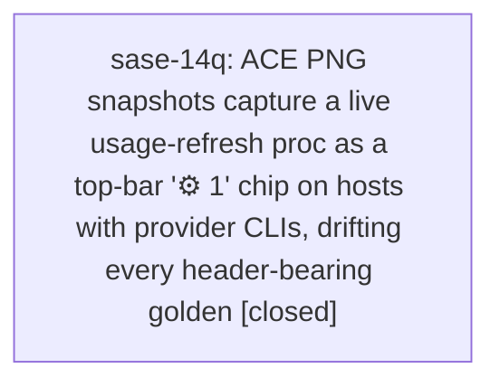

# Bead: sase-14q — ACE PNG snapshots capture a live usage-refresh proc as a top-bar '⚙ 1' chip on hosts with provider CLIs, drifting every header-bearing golden

[Bead Pages](../README.md) / sase-14q

**Status:** ✓ closed · **Resolution:** done · **Type:** ◆ task · **Task type:** ⨯ bug · **+1 reports:** +3
**Owner:** `bryanbugyi34@gmail.com` · **Created by:** `bbugyi200.apollo.18--code` · **Assignee:** `sase-14q` · **Size:** small
**Created:** 2026-09-20 18:52:24 EDT · **Closed:** 2026-09-21 10:07:00 EDT

<!-- sase:links:start -->

## Links

| Relation | Artifact | Why |
| --- | --- | --- |
| related | [bead:sase-144][1] | Different root cause, same class: snapshot goldens capturing live host state |

[1]: https://github.com/sase-org/sase--beads/blob/main/pages/sase-144/README.md

<!-- sase:links:end -->

## Description

ACE PNG goldens that include the top bar drift on any host where provider CLIs are configured, because the visual harness lets a real `usage-refresh` proc start and stay running at capture time. The top-bar `ProcIndicator` then renders a `⚙ 1` chip that the committed goldens do not contain.

Evidence (workspace sase_17, master 4255afbb05, host with provider CLIs):

- On a pristine HEAD tree, `just fix-tui-screenshots --check -- tests/ace/tui/visual/test_ace_png_snapshots_update_panel.py` and `... test_ace_png_snapshots_post_update_toast.py` report drift for `update_panel_unchecked_120x40`, `update_panel_pending_120x40`, `post_update_toast_120x40` and `post_update_toast_diffstat_120x40`. Every diff bounding box is exactly `[961, 67, 1021, 90]`, the chip position. A pixel diff of the `unchecked` golden against a fresh capture differs only in rows y=67..90.
- A throwaway probe test (same fixtures as the snapshot tests: `patch_startup_loaders` + `AcePage`) printed the app's proc projection at visual idle: one row, `command | running | origin=ace | usage-refresh`, and `ProcIndicator._count == 1`.
- The proc comes from `UsageRefreshFallbackMixin._schedule_usage_refresh_fallback` (`src/sase/ace/tui/actions/_usage_refresh_fallback.py`), scheduled from `_startup_loads.py` after first paint; it calls `request_due_usage_refresh(origin="ace")`, which submits the `usage-refresh` proc when a provider is eligible.
- Isolating `SASE_HOME` and unsetting the `SASE_AGENT*` variables did not remove the chip, so it is not the host proc store or the agent session.

Fix direction: have `patch_startup_loaders` (tests/ace/tui/visual/_ace_png_snapshot_startup.py) neutralize `_schedule_usage_refresh_fallback` (or otherwise pin usage collection off) so visual captures are host-independent. Then re-verify the four goldens above are clean with `just fix-tui-screenshots --check`.

Related, different root causes: sase-144 (SVC STOPPED chip position differs between captures), sase-14b (live neighbor/active-agent state under host load), sase-13y and sase-14k (goldens failing on clean master in agent workspaces).

---

\## Bug

- **Location:** `tests/ace/tui/visual/_ace_png_snapshot_startup.py::patch_startup_loaders; src/sase/ace/tui/actions/_usage_refresh_fallback.py`

On a host with provider CLIs configured, run: just fix-tui-screenshots --check -- tests/ace/tui/visual/test_ace_png_snapshots_update_panel.py -k unchecked. It reports drift with bounding box [961, 67, 1021, 90] (the top-bar proc chip) on an unmodified tree.

Goldens that are correct in CI/quiet hosts are reported as drifted locally, and regenerating them here bakes an environment-specific "⚙ 1" chip into the committed PNGs, which would then fail in CI. Affects update_panel_*, post_update_toast_* and any other snapshot showing the top bar.

## Notes

[2026-09-21T14:07:00Z · sase-14q] patch_startup_loaders now no-ops UsageRefreshFallbackMixin._schedule_usage_refresh_fallback and ProcObserver.start (with bind asserts), so no live usage-refresh proc or host store state can render the top-bar gear chip; seeded proc-shell projections still apply afterwards. Verified: new tests/ace/tui/visual/test_ace_png_snapshot_startup.py 3 passed; just fix-tui-screenshots --check clean for update_panel + post_update_toast (4 unchanged), agents_proc_shells (3 unchanged), agents_auto_approve (6 unchanged) on a host with codex/claude/gemini CLIs. Pre-existing just-check mypy failure in src/sase/dev_update/prebuild.py (reproduced pristine via stash) routed to sase-th as DISCOVERED ISSUE.

## +1 Evidence

> **+1** by `0s.f0.f0--code` · 2026-09-20 22:09:28 EDT
> **Observed since:** 2026-09-20 15:50:35 EDT
>
> Independently reproduced 2026-09-21 on clean origin/master 090f3add5 (git worktree, no local changes): tools/fix_tui_screenshots --check -- tests/ace/tui/visual/test_ace_png_snapshots_agents_auto_approve.py reports updated=3 with a diff box of exactly (961,67,1022,91), a top-bar chip left of the launch-default pill, on agents_auto_approve_icons / workflow_child_alignment / xprompts_metadata. In the full just test-visual run on a tree with the pill change, 448 of 712 frames drift only by that chip box; the pill region itself matches on all 620.

> **+1** by `1c` · 2026-09-21 02:26:59 EDT
> **Observed since:** 2026-09-21 00:57:31 EDT
>
> Independent reproduction in workspace sase_10 at master 42acc2979 plus uncommitted Agents-tilde-neighbor removal: just test-visual -- tests/ace/tui/visual/test_ace_png_snapshots_agents_neighbors.py reported drift for agents_family_lane_neighbors_160x50 whose pixel diff is confined to rows y=67..90, the same rows as this bead's evidence. Expected-vs-actual crops show the actual frame carries a 'gear 1' chip before 'codex/visual-snapshot-model' in the top bar that the golden lacks. Unrelated tree state: the info-panel and footer bands of the same golden updated cleanly for the neighbor-badge removal, so the chip is independent live-proc leakage, not fixture content.

> **+1** by `sase-14j.land` · 2026-09-21 09:25:19 EDT
> **Observed since:** 2026-09-21 09:03:09 EDT
>
> Corroborated from sase-14j.5 (phase of epic sase-14j, note #3, 2026-09-20): while regenerating the Beads: sub-section goldens (agents_task_bead_notes / agents_phase_bead_context / agents_phase_bead_and_plan_context 120x40), the phase worker saw the top-bar proc gear badge flake goldens whenever any agent had a running proc, and left the goldens for a quiet-env regen because of it. That worker attributed it to the capture reading the live proc store. This task's evidence says isolating SASE_HOME does not remove the chip, so whoever fixes this should confirm both paths (harness-started usage-refresh proc and any live proc-store read) are pinned off, so the ProcIndicator is hermetic in visual captures.

## Lineage

## Agents

| Agent | Bead | Commits |
|---|---|---:|
| [bbugyi200.athena.sase-14q](https://github.com/sase-org/sase--agents/blob/main/agents/bbugyi200.athena.sase-14q/README.md) | [sase-14q](README.md) | 1 |

## Commits

| Repo | Commit | Subject | Bead | Committed |
|---|---|---|---|---|
| sase | [`13467a5`](https://github.com/sase-org/sase/commit/13467a570f3d7f4ad839519098ca5e9bde49d671) | fix(tui): pin usage-refresh fallback and proc observer off in PNG snapshot harness | [sase-14q](README.md) | 2026-09-21 10:09:17 EDT |
