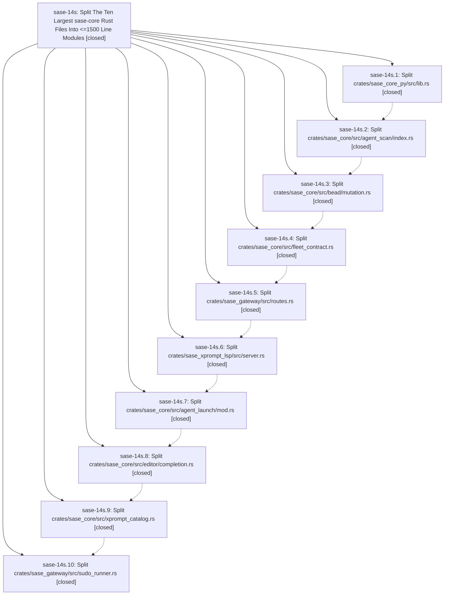

# Bead: sase-14s — Split The Ten Largest sase-core Rust Files Into \<=1500 Line Modules

[Bead Pages](../README.md) / sase-14s

**Status:** ✓ closed · **Resolution:** done · **Type:** ▸ plan · **Tier:** epic
**Owner:** `bryanbugyi34@gmail.com` · **Created by:** [bbugyi200.athena.0oh](https://github.com/sase-org/sase--agents/blob/main/families/bbugyi200.athena.0oh.md) · **Assignee:** `sase-14s.land`
**Created:** 2026-09-20 19:06:06 EDT · **Closed:** 2026-09-21 13:04:01 EDT
**Plan:** [202609/sase\_core\_big\_file\_split.md](https://github.com/sase-org/sase--plans/blob/main/202609/sase_core_big_file_split.md)

<!-- sase:links:start -->

## Links

| Relation | Artifact | Why |
| --- | --- | --- |
| implemented-by | [plan:202609/sase_core_big_file_split.md][1] | derived from the plan's `bead_id:` frontmatter field |

[1]: https://github.com/sase-org/sase--plans/blob/main/202609/sase_core_big_file_split.md

<!-- sase:links:end -->

## Description

Each of the ten largest Rust files in the sase-core repo is decomposed into a module tree whose every file is at most 1500 lines, with no behavior change, no public API change, and `just check` green after each phase.

## Notes

[2026-09-21T17:04:01Z · sase-14s.land] LANDED by sase-14s.land. VERIFIED (sase-core master 5154900): all 10 phases closed; each epic commit (03036af 601d4e7 5f7088a 4df82c7 a14f559 cc9c86c d1ac7bf 2857d6a ca597b9 5154900) keeps the repo-wide #[test] count (4055..4063) and fn count unchanged across the commit; every file in all ten target trees is <=1500 lines (max 1438, sase_core_py/beads/mod.rs); old monolith paths are gone, agent_launch/mod.rs is an 83-line facade, and no #[path] attributes are used. The repo-wide >1500 audit lists only untargeted files. sase_core_rs pymodule registrations: 827 before and after, same name set. The completion commit's -165 net lines are rustfmt reflow after de-indenting tests (checked with a sorted-line diff). The epic bead has no notes of its own; each child note's claims check out. INTEGRATED: the 10 non-epic sase-core commits since the epic started (4b0f5d6 2f37e54 60782f2 5e8d315 19274c0 3f56910 b13332f 2b78764 ffc77b7 3e346b0, plus upstream d99ba11 d48aaf3) each sit either before the relevant split (and are carried into it) or already edit the new trees (routes/support.rs, server/actions.rs); nothing re-created a monolith or duplicated logic. sase-core has no stale path references. In the sase repo, fixed tools/probe_core_floor: _diagnose_capability pickaxed only crates/sase_core_py/src/lib.rs, so any binding added after the split would be misreported as 'no introducing commit' / blocked_unpublished. The path is widened to crates/sase_core_py/src, with a new real-git regression test in tests/test_probe_core_floor_tool.py that fails on the old path. Also updated a stale editor/completion.rs comment in tests/ace/tui/widgets/test_artifact_ref_completion_catalog.py. just check in sase: fmt, ruff, flags, pyscripts, changelog, terminology, symvision, validate, committed-plans, and the probe all green; the probe_core_floor tests pass. Pre-existing red gates, none from this epic: mypy on prebuild.py and test-waits on stream_command.py (sase-158 DISCOVERED ISSUE / sase-15c); toobig on test_detach_scope.py (fixed on origin/master d05be99aad); the escalated full-suite failures are already tracked (sase-14u/14v, 14r, 154, 13p) or fixed upstream (the service_host_scenarios ImportError). FOLLOW-UPS: sase-14s.8 provider_priority LockTimeout -> +1 on duplicate sase-yn. sase-14s.5 gateway fleet route 504/snapshot_refresh timeouts -> new flake task sase-15g (large). sase-14s.10 sudo_runner apt_get_shaped ETXTBSY -> new flake task sase-15h (medium, related sase-15e/15f; also covers the unnamed sudo_runner flake sase-14s.9 saw). Extra: the test_cli_at_path_values ('touched','verb') failure is recorded as a DISCOVERED ISSUE on the causing active epic sase-14j. No epic-symbol entries.

## Phases

| Bead | Title | Status | Size | Created | Agents | Commits |
|---|---|---|---|---|---:|---:|
| [sase-14s.1](sase-14s.1.md) | Split crates/sase\_core\_py/src/lib.rs | ✓ closed | medium | 2026-09-20 | 1 | 1 |
| [sase-14s.10](sase-14s.10.md) | Split crates/sase\_gateway/src/sudo\_runner.rs | ✓ closed | medium | 2026-09-20 | 1 | 1 |
| [sase-14s.2](sase-14s.2.md) | Split crates/sase\_core/src/agent\_scan/index.rs | ✓ closed | medium | 2026-09-20 | 1 | 1 |
| [sase-14s.3](sase-14s.3.md) | Split crates/sase\_core/src/bead/mutation.rs | ✓ closed | medium | 2026-09-20 | 1 | 1 |
| [sase-14s.4](sase-14s.4.md) | Split crates/sase\_core/src/fleet\_contract.rs | ✓ closed | medium | 2026-09-20 | 1 | 1 |
| [sase-14s.5](sase-14s.5.md) | Split crates/sase\_gateway/src/routes.rs | ✓ closed | medium | 2026-09-20 | 1 | 1 |
| [sase-14s.6](sase-14s.6.md) | Split crates/sase\_xprompt\_lsp/src/server.rs | ✓ closed | medium | 2026-09-20 | 1 | 1 |
| [sase-14s.7](sase-14s.7.md) | Split crates/sase\_core/src/agent\_launch/mod.rs | ✓ closed | medium | 2026-09-20 | 1 | 1 |
| [sase-14s.8](sase-14s.8.md) | Split crates/sase\_core/src/editor/completion.rs | ✓ closed | medium | 2026-09-20 | 1 | 1 |
| [sase-14s.9](sase-14s.9.md) | Split crates/sase\_core/src/xprompt\_catalog.rs | ✓ closed | medium | 2026-09-20 | 1 | 1 |

## Lineage

## Agents

| Agent | Bead | Commits |
|---|---|---:|
| [bbugyi200.athena.sase-14s.1](https://github.com/sase-org/sase--agents/blob/main/agents/bbugyi200.athena.sase-14s.1/README.md) | [sase-14s.1](sase-14s.1.md) | 1 |
| [bbugyi200.athena.sase-14s.10](https://github.com/sase-org/sase--agents/blob/main/agents/bbugyi200.athena.sase-14s.10/README.md) | [sase-14s.10](sase-14s.10.md) | 1 |
| [bbugyi200.athena.sase-14s.2](https://github.com/sase-org/sase--agents/blob/main/agents/bbugyi200.athena.sase-14s.2/README.md) | [sase-14s.2](sase-14s.2.md) | 1 |
| [bbugyi200.athena.sase-14s.3](https://github.com/sase-org/sase--agents/blob/main/agents/bbugyi200.athena.sase-14s.3/README.md) | [sase-14s.3](sase-14s.3.md) | 1 |
| [bbugyi200.athena.sase-14s.4](https://github.com/sase-org/sase--agents/blob/main/agents/bbugyi200.athena.sase-14s.4/README.md) | [sase-14s.4](sase-14s.4.md) | 1 |
| [bbugyi200.athena.sase-14s.5](https://github.com/sase-org/sase--agents/blob/main/agents/bbugyi200.athena.sase-14s.5/README.md) | [sase-14s.5](sase-14s.5.md) | 1 |
| [bbugyi200.athena.sase-14s.6](https://github.com/sase-org/sase--agents/blob/main/families/bbugyi200.athena.sase-14s.6.md) | [sase-14s.6](sase-14s.6.md) | 1 |
| [bbugyi200.athena.sase-14s.7](https://github.com/sase-org/sase--agents/blob/main/agents/bbugyi200.athena.sase-14s.7/README.md) | [sase-14s.7](sase-14s.7.md) | 1 |
| [bbugyi200.athena.sase-14s.8](https://github.com/sase-org/sase--agents/blob/main/agents/bbugyi200.athena.sase-14s.8/README.md) | [sase-14s.8](sase-14s.8.md) | 1 |
| [bbugyi200.athena.sase-14s.9](https://github.com/sase-org/sase--agents/blob/main/agents/bbugyi200.athena.sase-14s.9/README.md) | [sase-14s.9](sase-14s.9.md) | 1 |
| [bbugyi200.athena.sase-14s.land](https://github.com/sase-org/sase--agents/blob/main/agents/bbugyi200.athena.sase-14s.land/README.md) | [sase-14s](README.md) | 1 |

## Commits

| Repo | Commit | Subject | Bead | Committed |
|---|---|---|---|---|
| sase-core | [`sase-core@03036af`](https://github.com/sase-org/sase-core/commit/03036afdbf9b510550d3c60b6e08357ce939c992) | refactor(sase\_core\_py): split 35kloc lib.rs into domain module tree | [sase-14s.1](sase-14s.1.md) | 2026-09-20 20:27:04 EDT |
| sase-core | [`sase-core@601d4e7`](https://github.com/sase-org/sase-core/commit/601d4e73c4fe467cba9f0acbae9e688999e46371) | refactor(agent\_scan): split 13kloc index.rs into domain module tree | [sase-14s.2](sase-14s.2.md) | 2026-09-20 21:19:29 EDT |
| sase-core | [`sase-core@5f7088a`](https://github.com/sase-org/sase-core/commit/5f7088a9d056bf4fb4551d0ff6359dda64b36814) | refactor(bead): split 11kloc mutation.rs into domain module tree | [sase-14s.3](sase-14s.3.md) | 2026-09-20 22:36:02 EDT |
| sase-core | [`sase-core@4df82c7`](https://github.com/sase-org/sase-core/commit/4df82c70846f85106f056b0a17a8abd4cb529630) | refactor(sase-core): split fleet\_contract into module tree | [sase-14s.4](sase-14s.4.md) | 2026-09-20 23:26:52 EDT |
| sase-core | [`sase-core@a14f559`](https://github.com/sase-org/sase-core/commit/a14f559996789dea6eadbeee9ed736ad73d92c25) | refactor(gateway): split routes.rs into routes/ module tree by API area | [sase-14s.5](sase-14s.5.md) | 2026-09-21 00:22:38 EDT |
| sase-core | [`sase-core@cc9c86c`](https://github.com/sase-org/sase-core/commit/cc9c86c4c1a61f11271288e34ad2c99b51bbf553) | refactor(xprompt\_lsp): split 9939-line server.rs into server/ module tree | [sase-14s.6](sase-14s.6.md) | 2026-09-21 01:21:07 EDT |
| sase-core | [`sase-core@d1ac7bf`](https://github.com/sase-org/sase-core/commit/d1ac7bf5e2849be7d002ee3d675c3d36c897d8bc) | refactor(sase-core): split agent\_launch/mod.rs into \<=1500 line modules | [sase-14s.7](sase-14s.7.md) | 2026-09-21 08:42:19 EDT |
| sase-core | [`sase-core@2857d6a`](https://github.com/sase-org/sase-core/commit/2857d6a1c80d92b67b1d08c0db8fa8d1a5fd22c0) | refactor(editor): split completion.rs into source-keyed module tree | [sase-14s.8](sase-14s.8.md) | 2026-09-21 09:32:10 EDT |
| sase-core | [`sase-core@ca597b9`](https://github.com/sase-org/sase-core/commit/ca597b94ebc4603cee9c1c05f4d6c25f336116dd) | refactor(xprompt\_catalog): split 4850-line module into \<=875-line tree | [sase-14s.9](sase-14s.9.md) | 2026-09-21 10:31:16 EDT |
| sase-core | [`sase-core@5154900`](https://github.com/sase-org/sase-core/commit/51549000a1cfa59e4b6806a39ed5595bba93dde1) | refactor(sase\_gateway): split sudo\_runner.rs into \<=701-line module tree | [sase-14s.10](sase-14s.10.md) | 2026-09-21 11:29:34 EDT |
| sase | [`af6b1f4`](https://github.com/sase-org/sase/commit/af6b1f475ca6d4c8a11bad0fd461ec560f0be93b) | fix(tools): diagnose core-floor bindings across the split sase\_core\_py module tree | [sase-14s](README.md) | 2026-09-21 13:07:21 EDT |
