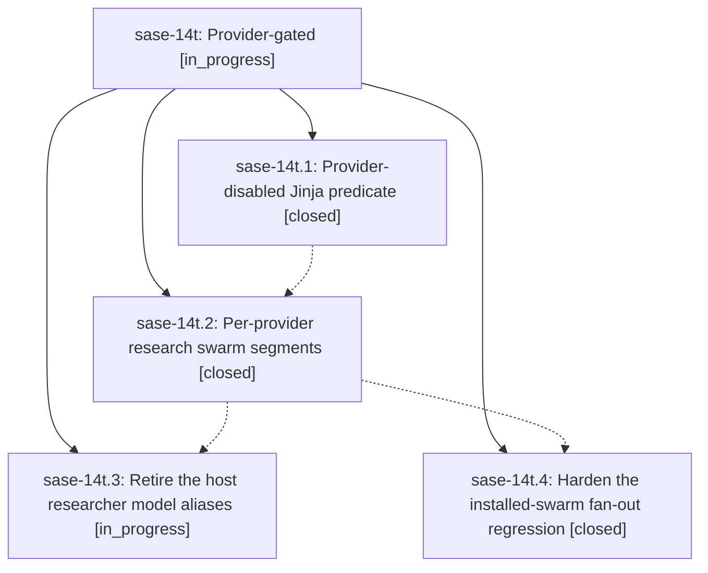

# Bead: sase-14t — Provider-gated

[Bead Pages](../README.md) / sase-14t

**Status:** ◐ in_progress · **Type:** ▸ plan · **Tier:** epic
**Owner:** `bryanbugyi34@gmail.com` · **Created by:** [bbugyi200.athena.0oi](https://github.com/sase-org/sase--agents/blob/main/families/bbugyi200.athena.0oi.md) · **Assignee:** `sase-14t.land`
**Created:** 2026-09-20 20:51:29 EDT
**Plan:** [202609/research\_swarm\_providers.md](https://github.com/sase-org/sase--plans/blob/main/202609/research_swarm_providers.md)

<!-- sase:links:start -->

## Links

| Relation | Artifact | Why |
| --- | --- | --- |
| implemented-by | [plan:202609/research_swarm_providers.md][1] | derived from the plan's `bead_id:` frontmatter field |

[1]: https://github.com/sase-org/sase--plans/blob/main/202609/research_swarm_providers.md

<!-- sase:links:end -->

## Description

#research_swarm launches one researcher per enabled LLM provider (codex and claude by default, grok and muse opt-in), skips any provider that is temporarily disabled, names every input and report suffix after its provider, and the lead consolidates whatever set of reports actually ran.

## Phases

| Bead | Title | Status | Size | Created | Agents | Commits |
|---|---|---|---|---|---:|---:|
| [sase-14t.1](sase-14t.1.md) | Provider-disabled Jinja predicate | ✓ closed | small | 2026-09-20 | 1 | 1 |
| [sase-14t.2](sase-14t.2.md) | Per-provider research swarm segments | ✓ closed | medium | 2026-09-20 | 1 | 1 |
| [sase-14t.3](sase-14t.3.md) | Retire the host researcher model aliases | ◐ in_progress | xsmall | 2026-09-20 | 1 | 0 |
| [sase-14t.4](sase-14t.4.md) | Harden the installed-swarm fan-out regression | ✓ closed | small | 2026-09-20 | 1 | 1 |

## Lineage

## Agents

| Agent | Bead | Commits |
|---|---|---:|
| [bbugyi200.athena.sase-14t.1](https://github.com/sase-org/sase--agents/blob/main/agents/bbugyi200.athena.sase-14t.1/README.md) | [sase-14t.1](sase-14t.1.md) | 1 |
| [bbugyi200.athena.sase-14t.2](https://github.com/sase-org/sase--agents/blob/main/agents/bbugyi200.athena.sase-14t.2/README.md) | [sase-14t.2](sase-14t.2.md) | 1 |
| [bbugyi200.athena.sase-14t.3](https://github.com/sase-org/sase--agents/blob/main/agents/bbugyi200.athena.sase-14t.3/README.md) | [sase-14t.3](sase-14t.3.md) | 0 |
| [bbugyi200.athena.sase-14t.4](https://github.com/sase-org/sase--agents/blob/main/agents/bbugyi200.athena.sase-14t.4/README.md) | [sase-14t.4](sase-14t.4.md) | 1 |
| [bbugyi200.athena.sase-14t.land](https://github.com/sase-org/sase--agents/blob/main/agents/bbugyi200.athena.sase-14t.land/README.md) | [sase-14t](README.md) | 0 |

## Commits

| Repo | Commit | Subject | Bead | Committed |
|---|---|---|---|---|
| sase | [`a34db56`](https://github.com/sase-org/sase/commit/a34db565b62246700733658a77937daffe5451f5) | feat(xprompt): add provider\_disabled/provider\_enabled Jinja filters | [sase-14t.1](sase-14t.1.md) | 2026-09-20 21:30:42 EDT |
| sase-research-artifacts | [`sase-research-artifacts@343a1ec`](https://github.com/sase-org/sase-research-artifacts/commit/343a1ecd5458a97ab038bbb8413dc52fe3e4775a) | feat(research): gate swarm researchers per provider | [sase-14t.2](sase-14t.2.md) | 2026-09-20 22:30:52 EDT |
| sase | [`44577fb`](https://github.com/sase-org/sase/commit/44577fb8f9b9222e2fb8956df9fb64a36c2e8d26) | test(runner-slots): harden installed-swarm fan-out test against provider-disable state | [sase-14t.4](sase-14t.4.md) | 2026-09-20 22:53:37 EDT |
