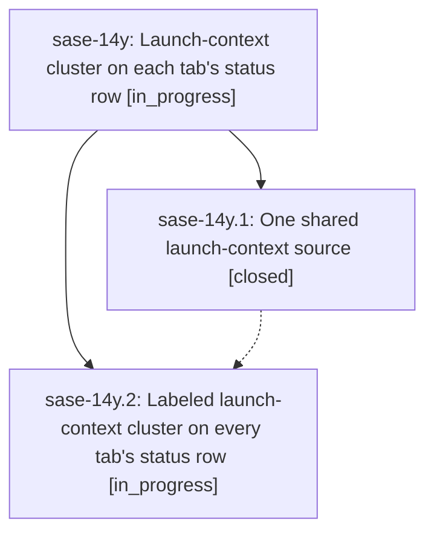

# Bead: sase-14y — Launch-context cluster on each tab's status row

[Bead Pages](../README.md) / sase-14y

**Status:** ◐ in_progress · **Type:** ▸ plan · **Tier:** epic
**Owner:** `bryanbugyi34@gmail.com` · **Created by:** [bbugyi200.apollo.0s.f0.f0.w2](https://github.com/sase-org/sase--agents/blob/main/families/bbugyi200.apollo.0s.f0.f0.w2.md) · **Assignee:** `sase-14y.land`
**Created:** 2026-09-20 22:21:51 EDT
**Plan:** [202609/launch\_context\_row.md](https://github.com/sase-org/sase--plans/blob/main/202609/launch_context_row.md)

<!-- sase:links:start -->

## Links

| Relation | Artifact | Why |
| --- | --- | --- |
| implemented-by | [plan:202609/launch_context_row.md][1] | derived from the plan's `bead_id:` frontmatter field |

[1]: https://github.com/sase-org/sase--plans/blob/main/202609/launch_context_row.md

<!-- sase:links:end -->

## Description

The launch-default model/effort and current-project chips leave the crowded top bar and appear, clearly labeled and with precise tooltips, at the far right of every tab's status row, backed by one shared state source.

## Phases

| Bead | Title | Status | Size | Created | Agents | Commits |
|---|---|---|---|---|---:|---:|
| [sase-14y.1](sase-14y.1.md) | One shared launch-context source | ✓ closed | medium | 2026-09-20 | 1 | 1 |
| [sase-14y.2](sase-14y.2.md) | Labeled launch-context cluster on every tab's status row | ◐ in_progress | medium | 2026-09-20 | 1 | 0 |

## Lineage

## Agents

| Agent | Bead | Commits |
|---|---|---:|
| [bbugyi200.apollo.sase-14y.1](https://github.com/sase-org/sase--agents/blob/main/agents/bbugyi200.apollo.sase-14y.1/README.md) | [sase-14y.1](sase-14y.1.md) | 1 |
| [bbugyi200.apollo.sase-14y.2](https://github.com/sase-org/sase--agents/blob/main/agents/bbugyi200.apollo.sase-14y.2/README.md) | [sase-14y.2](sase-14y.2.md) | 0 |
| [bbugyi200.apollo.sase-14y.land](https://github.com/sase-org/sase--agents/blob/main/agents/bbugyi200.apollo.sase-14y.land/README.md) | [sase-14y](README.md) | 0 |

## Commits

| Repo | Commit | Subject | Bead | Committed |
|---|---|---|---|---|
| sase | [`42acc29`](https://github.com/sase-org/sase/commit/42acc29794b3a3dadc7e8a000c767a7f1d1074d0) | refactor(tui): share launch-context polling through LaunchContextSource | [sase-14y.1](sase-14y.1.md) | 2026-09-21 00:52:21 EDT |
