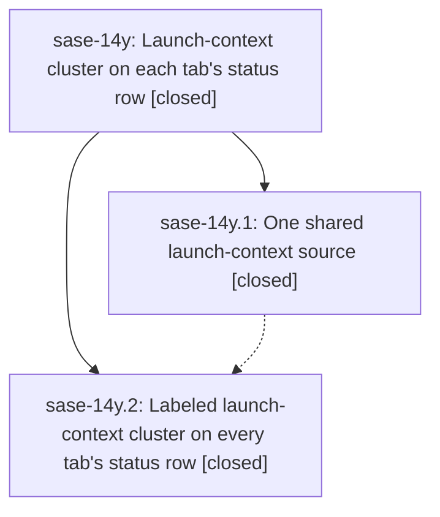

# Bead: sase-14y — Launch-context cluster on each tab's status row

[Bead Pages](../README.md) / sase-14y

**Status:** ✓ closed · **Resolution:** done · **Type:** ▸ plan · **Tier:** epic
**Owner:** `bryanbugyi34@gmail.com` · **Created by:** [bbugyi200.apollo.0s.f0.f0.w2](https://github.com/sase-org/sase--agents/blob/main/families/bbugyi200.apollo.0s.f0.f0.w2.md) · **Assignee:** `sase-14y.land`
**Created:** 2026-09-20 22:21:51 EDT · **Closed:** 2026-09-21 20:02:28 EDT
**Plan:** [202609/launch\_context\_row.md](https://github.com/sase-org/sase--plans/blob/main/202609/launch_context_row.md)

<!-- sase:links:start -->

## Links

| Relation | Artifact | Why |
| --- | --- | --- |
| implemented-by | [plan:202609/launch_context_row.md][1] | derived from the plan's `bead_id:` frontmatter field |

[1]: https://github.com/sase-org/sase--plans/blob/main/202609/launch_context_row.md

<!-- sase:links:end -->

## Description

The launch-default model/effort and current-project chips leave the crowded top bar and appear, clearly labeled and with precise tooltips, at the far right of every tab's status row, backed by one shared state source.

## Notes

[2026-09-22T00:02:28Z · sase-14y.land] Verified: both phases closed; 42acc2979 (sase-14y.1) adds app-scoped LaunchContextSource with render-only LLMOverrideIndicator/CurrentProjectIndicator views; dd1d49bf5 (sase-14y.2 takeover) adds density-aware LaunchContextBar on #agent-info-row, #artifacts-header and #axe-info-row, removes both chips from #top-bar, rewrites tooltips, updates docs/ace.md + default_config.yml, and refreshes goldens. No remaining query_one of the indicators outside the bar; docs no longer place the chips in the top bar. 117 targeted tests pass (launch_context_bar/source, top_bar_order, llm_override_indicator, current_project_indicator, models_panel_leader_mode, projects_pane_set_current, agents_onboarding). Integration: the takeover commit was rebased over all 50+ commits landed since the epic started (incl. %auto top-bar badge and rocket-badge goldens re-banked); origin/master adds only an unrelated docs commit. No epic-symbol entries. Follow-ups: sase-14y.1#1 -> +1 sase-150 (symvision unused publics); sase-14y.2#1,#7 -> +1 sase-151 (gate shell output golden); sase-14y.1#2 + sase-14y.2#4,#5 (transient top-bar chip) -> +1 sase-14q (the +1 auto-reopened it on a session-start window; re-closed with explanation since observations predate its fix); sase-14y.2#1 zoom-modal timeout -> new flake sase-160; sase-14y.2#2,#3 neighbors determinism -> new flake sase-15y (related sase-14w/sase-14b); sase-14y.2#6 codex usage tempdir leak -> new bug sase-15x. None caused by this epic; none declined.

## Phases

| Bead | Title | Status | Size | Created | Agents | Commits |
|---|---|---|---|---|---:|---:|
| [sase-14y.1](sase-14y.1.md) | One shared launch-context source | ✓ closed | medium | 2026-09-20 | 1 | 1 |
| [sase-14y.2](sase-14y.2.md) | Labeled launch-context cluster on every tab's status row | ✓ closed | medium | 2026-09-20 | 1 | 0 |

## Lineage

## Agents

| Agent | Bead | Commits |
|---|---|---:|
| [bbugyi200.apollo.sase-14y.1](https://github.com/sase-org/sase--agents/blob/main/agents/bbugyi200.apollo.sase-14y.1/README.md) | [sase-14y.1](sase-14y.1.md) | 1 |
| [bbugyi200.apollo.sase-14y.2](https://github.com/sase-org/sase--agents/blob/main/agents/bbugyi200.apollo.sase-14y.2/README.md) | [sase-14y.2](sase-14y.2.md) | 0 |
| [bbugyi200.apollo.sase-14y.land](https://github.com/sase-org/sase--agents/blob/main/agents/bbugyi200.apollo.sase-14y.land/README.md) | [sase-14y](README.md) | 1 |

## Commits

| Repo | Commit | Subject | Bead | Committed |
|---|---|---|---|---|
| sase | [`42acc29`](https://github.com/sase-org/sase/commit/42acc29794b3a3dadc7e8a000c767a7f1d1074d0) | refactor(tui): share launch-context polling through LaunchContextSource | [sase-14y.1](sase-14y.1.md) | 2026-09-21 00:52:21 EDT |
| sase--plans | [`sase--plans@dfc53ac`](https://github.com/sase-org/sase--plans/commit/dfc53ac6ea89c222321f0e15906f8c60ba71ed61) | chore(plans): mark launch\_context\_row epic plan done after sase-14y landing | [sase-14y](README.md) | 2026-09-21 20:08:20 EDT |
