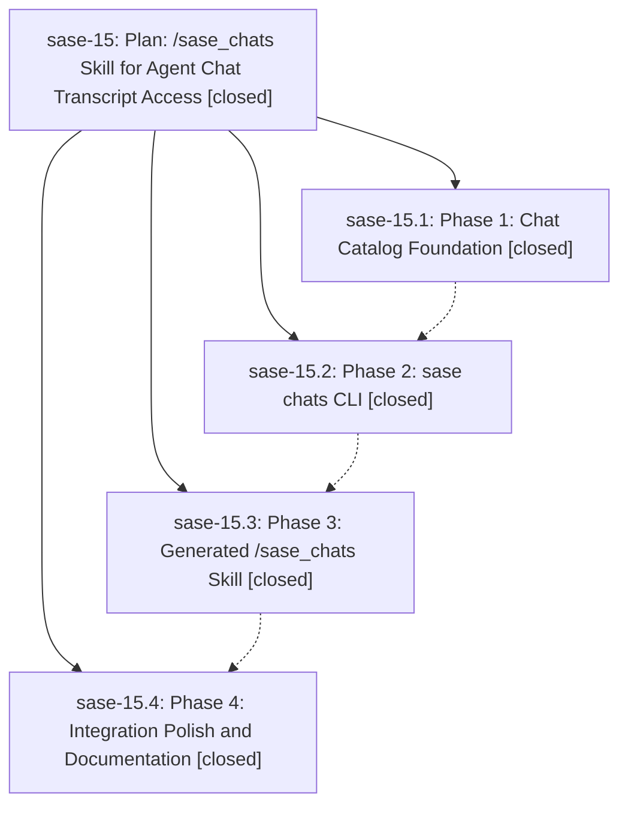

# Bead: sase-15 — Plan: /sase\_chats Skill for Agent Chat Transcript Access

[Bead Pages](../README.md) / sase-15

**Status:** ✓ closed · **Resolution:** (unrecorded) · **Type:** plan · **Tier:** epic
**Owner:** `bryanbugyi34@gmail.com`
**Created:** 2026-04-29 04:46:02 UTC · **Closed:** 2026-04-29 05:50:22 UTC
**Plan:** [202604/sase\_chats\_skill\_1.md](https://github.com/sase-org/sase--plans/blob/main/202604/sase_chats_skill_1.md)

## Phases

| Bead | Title | Status | Size | Agents | Commits |
|---|---|---|---|---:|---:|
| [sase-15.1](sase-15.1.md) | Phase 1: Chat Catalog Foundation | ✓ closed | small | 0 | 1 |
| [sase-15.2](sase-15.2.md) | Phase 2: sase chats CLI | ✓ closed | small | 0 | 1 |
| [sase-15.3](sase-15.3.md) | Phase 3: Generated /sase\_chats Skill | ✓ closed | small | 0 | 1 |
| [sase-15.4](sase-15.4.md) | Phase 4: Integration Polish and Documentation | ✓ closed | small | 0 | 1 |

## Lineage

## Commits

| Commit | Subject | Bead | Committed (UTC) |
|---|---|---|---|
| [`0599c45`](https://github.com/sase-org/sase/commit/0599c459aa80b838a4c965717d60d0ebdc934393) | feat(history): add chat\_catalog foundation for /sase\_chats skill (sase-15.1) | [sase-15.1](sase-15.1.md) | 2026-04-29 04:58:37 |
| [`9495e1a`](https://github.com/sase-org/sase/commit/9495e1a607238b099e0c6864913647af3f87052e) | feat(skills): add /sase\_chats agent skill for chat transcript access (sase-15.3) | [sase-15.3](sase-15.3.md) | 2026-04-29 05:04:26 |
| [`8de127f`](https://github.com/sase-org/sase/commit/8de127fbba63511ade3bd6cb721cc08c61d83559) | feat(chats): add \`sase chats\` CLI for prior chat transcript access (sase-15.2) | [sase-15.2](sase-15.2.md) | 2026-04-29 05:12:01 |
| [`42bb654`](https://github.com/sase-org/sase/commit/42bb65458df03c3e0725d7dfe33da6450d088b1d) | chore: document sase chats command surface (sase-15.4) | [sase-15.4](sase-15.4.md) | 2026-04-29 05:47:57 |
