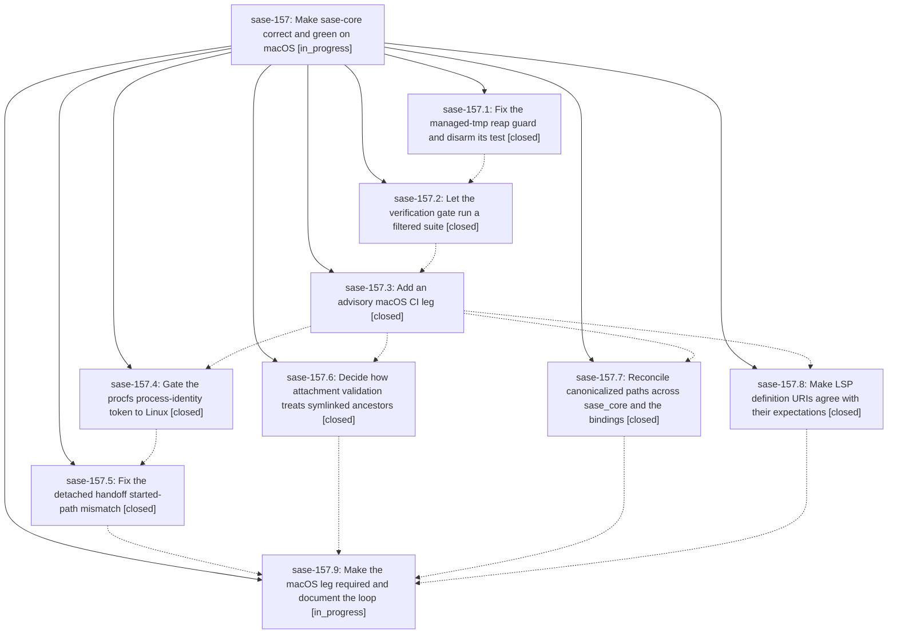

# Bead: sase-157 — Make sase-core correct and green on macOS

[Bead Pages](../README.md) / sase-157

**Status:** ◐ in_progress · **Type:** ▸ plan · **Tier:** epic
**Owner:** `bryanbugyi34@gmail.com` · **Created by:** [bbugyi200.athena.0oj](https://github.com/sase-org/sase--agents/blob/main/families/bbugyi200.athena.0oj.md) · **Assignee:** `sase-157.land`
**Created:** 2026-09-21 06:25:42 EDT
**Plan:** [202609/macos\_portability.md](https://github.com/sase-org/sase--plans/blob/main/202609/macos_portability.md)

<!-- sase:links:start -->

## Links

| Relation | Artifact | Why |
| --- | --- | --- |
| implemented-by | [plan:202609/macos_portability.md][1] | derived from the plan's `bead_id:` frontmatter field |

[1]: https://github.com/sase-org/sase--plans/blob/main/202609/macos_portability.md

<!-- sase:links:end -->

## Description

The managed-tmp reap guard refuses broad roots on every platform and no test can perform a live reap, every sase-core workspace test passes on macOS, and a required macOS CI leg keeps it that way.

## Phases

| Bead | Title | Status | Size | Created | Agents | Commits |
|---|---|---|---|---|---:|---:|
| [sase-157.1](sase-157.1.md) | Fix the managed-tmp reap guard and disarm its test | ✓ closed | small | 2026-09-21 | 1 | 1 |
| [sase-157.2](sase-157.2.md) | Let the verification gate run a filtered suite | ✓ closed | xsmall | 2026-09-21 | 1 | 1 |
| [sase-157.3](sase-157.3.md) | Add an advisory macOS CI leg | ✓ closed | small | 2026-09-21 | 1 | 1 |
| [sase-157.4](sase-157.4.md) | Gate the procfs process-identity token to Linux | ✓ closed | medium | 2026-09-21 | 1 | 1 |
| [sase-157.5](sase-157.5.md) | Fix the detached handoff started-path mismatch | ✓ closed | medium | 2026-09-21 | 1 | 1 |
| [sase-157.6](sase-157.6.md) | Decide how attachment validation treats symlinked ancestors | ✓ closed | medium | 2026-09-21 | 1 | 1 |
| [sase-157.7](sase-157.7.md) | Reconcile canonicalized paths across sase\_core and the bindings | ✓ closed | medium | 2026-09-21 | 1 | 1 |
| [sase-157.8](sase-157.8.md) | Make LSP definition URIs agree with their expectations | ✓ closed | small | 2026-09-21 | 1 | 1 |
| [sase-157.9](sase-157.9.md) | Make the macOS leg required and document the loop | ◐ in_progress | small | 2026-09-21 | 1 | 0 |

## Lineage

## Agents

| Agent | Bead | Commits |
|---|---|---:|
| [bbugyi200.athena.sase-157.1](https://github.com/sase-org/sase--agents/blob/main/agents/bbugyi200.athena.sase-157.1/README.md) | [sase-157.1](sase-157.1.md) | 1 |
| [bbugyi200.athena.sase-157.2](https://github.com/sase-org/sase--agents/blob/main/agents/bbugyi200.athena.sase-157.2/README.md) | [sase-157.2](sase-157.2.md) | 1 |
| [bbugyi200.athena.sase-157.3](https://github.com/sase-org/sase--agents/blob/main/agents/bbugyi200.athena.sase-157.3/README.md) | [sase-157.3](sase-157.3.md) | 1 |
| [bbugyi200.athena.sase-157.4](https://github.com/sase-org/sase--agents/blob/main/agents/bbugyi200.athena.sase-157.4/README.md) | [sase-157.4](sase-157.4.md) | 1 |
| [bbugyi200.athena.sase-157.5](https://github.com/sase-org/sase--agents/blob/main/families/bbugyi200.athena.sase-157.5.md) | [sase-157.5](sase-157.5.md) | 1 |
| [bbugyi200.athena.sase-157.6](https://github.com/sase-org/sase--agents/blob/main/agents/bbugyi200.athena.sase-157.6/README.md) | [sase-157.6](sase-157.6.md) | 1 |
| [bbugyi200.athena.sase-157.7](https://github.com/sase-org/sase--agents/blob/main/agents/bbugyi200.athena.sase-157.7/README.md) | [sase-157.7](sase-157.7.md) | 1 |
| [bbugyi200.athena.sase-157.8](https://github.com/sase-org/sase--agents/blob/main/agents/bbugyi200.athena.sase-157.8/README.md) | [sase-157.8](sase-157.8.md) | 1 |
| [bbugyi200.athena.sase-157.9](https://github.com/sase-org/sase--agents/blob/main/agents/bbugyi200.athena.sase-157.9/README.md) | [sase-157.9](sase-157.9.md) | 0 |
| [bbugyi200.athena.sase-157.land](https://github.com/sase-org/sase--agents/blob/main/agents/bbugyi200.athena.sase-157.land/README.md) | [sase-157](README.md) | 0 |

## Commits

| Repo | Commit | Subject | Bead | Committed |
|---|---|---|---|---|
| sase-core | [`sase-core@60782f2`](https://github.com/sase-org/sase-core/commit/60782f2dfc2c82ceeb59394d8ac46d8a096317c0) | fix(sase-core): harden managed\_tmp reap-root guard and disarm guard test | [sase-157.1](sase-157.1.md) | 2026-09-21 06:45:45 EDT |
| sase-core | [`sase-core@5e8d315`](https://github.com/sase-org/sase-core/commit/5e8d3158b4562cfc23ca4998f059177d9029a010) | feat(sase-core): forward check.sh/justfile trailing args to cargo test/clippy | [sase-157.2](sase-157.2.md) | 2026-09-21 07:06:03 EDT |
| sase-core | [`sase-core@19274c0`](https://github.com/sase-org/sase-core/commit/19274c0e452411fc8714a9a4b2a72fd3f2f835a0) | ci: add advisory macOS leg to rust-checks matrix | [sase-157.3](sase-157.3.md) | 2026-09-21 07:37:23 EDT |
| sase-core | [`sase-core@3f56910`](https://github.com/sase-org/sase-core/commit/3f569106e7b4d3711c0daa2987daf666e328c2c3) | fix(gateway): allow symlinked ancestors in attachment validation | [sase-157.6](sase-157.6.md) | 2026-09-21 08:30:42 EDT |
| sase-core | [`sase-core@b13332f`](https://github.com/sase-org/sase-core/commit/b13332f36e3ba924803ccde2a7084a1615a1e046) | feat(sase-core): gate procfs process-identity token to Linux | [sase-157.4](sase-157.4.md) | 2026-09-21 08:59:47 EDT |
| sase-core | [`sase-core@2b78764`](https://github.com/sase-org/sase-core/commit/2b7876444f58d6098e81f5b2e8991b186f1126fe) | fix(sase-core): reconcile canonicalized paths across sase\_core and bindings | [sase-157.7](sase-157.7.md) | 2026-09-21 09:02:36 EDT |
| sase-core | [`sase-core@ffc77b7`](https://github.com/sase-org/sase-core/commit/ffc77b751cb0831795767d7f0790b30b8680b103) | fix(xprompt-lsp): echo catalog definition paths verbatim in go-to-definition URIs | [sase-157.8](sase-157.8.md) | 2026-09-21 09:19:33 EDT |
| sase-core | [`sase-core@3e346b0`](https://github.com/sase-org/sase-core/commit/3e346b045ca0f3832f92ff8265f1d5d4ac5215e7) | fix(sase-gateway): stabilize sudo\_runner hold-pipe stub and waiting-worker timing under parallel load | [sase-157.5](sase-157.5.md) | 2026-09-21 11:02:53 EDT |
