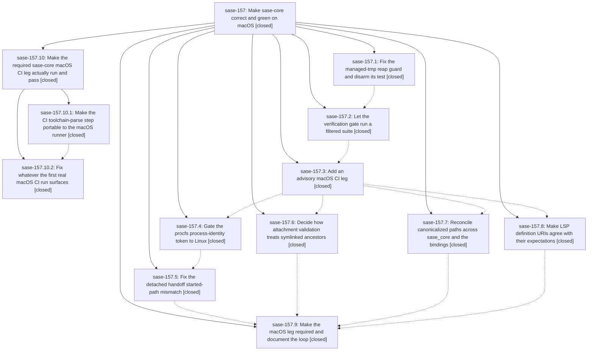

# Bead: sase-157 — Make sase-core correct and green on macOS

[Bead Pages](../README.md) / sase-157

**Status:** ✓ closed · **Resolution:** done · **Type:** ▸ plan · **Tier:** epic
**Owner:** `bryanbugyi34@gmail.com` · **Created by:** [bbugyi200.athena.0oj](https://github.com/sase-org/sase--agents/blob/main/families/bbugyi200.athena.0oj.md) · **Assignee:** `sase-157.land`
**Created:** 2026-09-21 06:25:42 EDT · **Closed:** 2026-09-21 13:25:26 EDT
**Plan:** [202609/macos\_portability.md](https://github.com/sase-org/sase--plans/blob/main/202609/macos_portability.md)

<!-- sase:links:start -->

## Links

| Relation | Artifact | Why |
| --- | --- | --- |
| implemented-by | [plan:202609/macos_portability.md][1] | derived from the plan's `bead_id:` frontmatter field |

[1]: https://github.com/sase-org/sase--plans/blob/main/202609/macos_portability.md

<!-- sase:links:end -->

## Description

The managed-tmp reap guard refuses broad roots on every platform and no test can perform a live reap, every sase-core workspace test passes on macOS, and a required macOS CI leg keeps it that way.

## Notes

[2026-09-21T16:32:32Z · sase-157.land] LAND INTERRUPTED (sase-157.land, 2026-09-21): Steps 1-2 verified. All 9 phases closed. Commits 60782f2 5e8d315 19274c0 3f56910 b13332f 2b78764 ffc77b7 3e346b0 (started-path fix lives here, despite the title) d99ba11 checked against current source; the fixes survived the later refactors (d1ac7bf, 2857d6a, ca597b9, 5154900 sudo_runner split). Integration: no sase-repo changes needed (managed_tmp_reaper and sudo runner are thin adapters over sase_core_rs; sase/sudo already falls back when detached_execution is not advertised). BLOCKER, caused by this epic: sase-core master CI has been red since d99ba11. The now-required macOS leg fails in 'Read pinned toolchain' because BSD sed does not understand \s, so the toolchain resolves to the literal 'channel = "stable"' (CI run 35623241380). The macOS leg has never run tests in CI. This was sase-157.5's PROPOSED FOLLOW-UP, never fixed. Planned as a child epic (parent_bead sase-157). Follow-up outcomes: sase-157.4 telemetry concurrent_writers flake -> filed sase-15d. sase-157.9 sudo_runner flakes -> filed sase-15e (post_spawn_identity: empty worker.pid race, pre-existing at 60782f2^) and sase-15f (cwd_removed_after_authentication). sase-157.5 macOS toolchain step -> epic work, in the child plan. epic-symbols: none.

[2026-09-21T17:25:26Z · sase-157.10.land] Rechecked after child epic sase-157.10 landed: the previous land note's only blocker (macOS leg failing at toolchain parse, master red since d99ba11) is fixed by sase-core d48aaf3. Master CI 35628324928 is green on all jobs, including the blocking macos-latest fmt+clippy+full test leg (no continue-on-error), which confirms in CI that every workspace test passes on macOS. Release-plz PR 310 CI is green. Drift since d99ba11: only d48aaf3; the sase repo has only unrelated commits (0b30610471, af6b1f475c). All 9 phases and the child epic are closed, and the AGENTS.md 'Platform paths' rule is present. Follow-ups are unchanged from the prior note (sase-15d/15e/15f filed). No epic-symbol entries.

## Phases

| Bead | Title | Status | Size | Created | Agents | Commits |
|---|---|---|---|---|---:|---:|
| [sase-157.1](sase-157.1.md) | Fix the managed-tmp reap guard and disarm its test | ✓ closed | small | 2026-09-21 | 1 | 1 |
| [sase-157.2](sase-157.2.md) | Let the verification gate run a filtered suite | ✓ closed | xsmall | 2026-09-21 | 1 | 1 |
| [sase-157.3](sase-157.3.md) | Add an advisory macOS CI leg | ✓ closed | small | 2026-09-21 | 1 | 1 |
| [sase-157.4](sase-157.4.md) | Gate the procfs process-identity token to Linux | ✓ closed | medium | 2026-09-21 | 1 | 1 |
| [sase-157.5](sase-157.5.md) | Fix the detached handoff started-path mismatch | ✓ closed | medium | 2026-09-21 | 1 | 1 |
| [sase-157.6](sase-157.6.md) | Decide how attachment validation treats symlinked ancestors | ✓ closed | medium | 2026-09-21 | 1 | 1 |
| [sase-157.7](sase-157.7.md) | Reconcile canonicalized paths across sase\_core and the bindings | ✓ closed | medium | 2026-09-21 | 1 | 1 |
| [sase-157.8](sase-157.8.md) | Make LSP definition URIs agree with their expectations | ✓ closed | small | 2026-09-21 | 1 | 1 |
| [sase-157.9](sase-157.9.md) | Make the macOS leg required and document the loop | ✓ closed | small | 2026-09-21 | 1 | 1 |

## Lineage

## Agents

| Agent | Bead | Commits |
|---|---|---:|
| [bbugyi200.athena.sase-157.1](https://github.com/sase-org/sase--agents/blob/main/agents/bbugyi200.athena.sase-157.1/README.md) | [sase-157.1](sase-157.1.md) | 1 |
| [bbugyi200.athena.sase-157.10.1](https://github.com/sase-org/sase--agents/blob/main/agents/bbugyi200.athena.sase-157.10.1/README.md) | [sase-157.10.1](sase-157.10.1.md) | 1 |
| [bbugyi200.athena.sase-157.10.2](https://github.com/sase-org/sase--agents/blob/main/families/bbugyi200.athena.sase-157.10.2.md) | [sase-157.10.2](sase-157.10.2.md) | 0 |
| [bbugyi200.athena.sase-157.10.land](https://github.com/sase-org/sase--agents/blob/main/agents/bbugyi200.athena.sase-157.10.land/README.md) | [sase-157.10](sase-157.10.md) | 1 |
| [bbugyi200.athena.sase-157.2](https://github.com/sase-org/sase--agents/blob/main/agents/bbugyi200.athena.sase-157.2/README.md) | [sase-157.2](sase-157.2.md) | 1 |
| [bbugyi200.athena.sase-157.3](https://github.com/sase-org/sase--agents/blob/main/agents/bbugyi200.athena.sase-157.3/README.md) | [sase-157.3](sase-157.3.md) | 1 |
| [bbugyi200.athena.sase-157.4](https://github.com/sase-org/sase--agents/blob/main/agents/bbugyi200.athena.sase-157.4/README.md) | [sase-157.4](sase-157.4.md) | 1 |
| [bbugyi200.athena.sase-157.5](https://github.com/sase-org/sase--agents/blob/main/families/bbugyi200.athena.sase-157.5.md) | [sase-157.5](sase-157.5.md) | 1 |
| [bbugyi200.athena.sase-157.6](https://github.com/sase-org/sase--agents/blob/main/agents/bbugyi200.athena.sase-157.6/README.md) | [sase-157.6](sase-157.6.md) | 1 |
| [bbugyi200.athena.sase-157.7](https://github.com/sase-org/sase--agents/blob/main/agents/bbugyi200.athena.sase-157.7/README.md) | [sase-157.7](sase-157.7.md) | 1 |
| [bbugyi200.athena.sase-157.8](https://github.com/sase-org/sase--agents/blob/main/agents/bbugyi200.athena.sase-157.8/README.md) | [sase-157.8](sase-157.8.md) | 1 |
| [bbugyi200.athena.sase-157.9](https://github.com/sase-org/sase--agents/blob/main/agents/bbugyi200.athena.sase-157.9/README.md) | [sase-157.9](sase-157.9.md) | 1 |
| [bbugyi200.athena.sase-157.land](https://github.com/sase-org/sase--agents/blob/main/families/bbugyi200.athena.sase-157.land.md) | [sase-157](README.md) | 0 |

## Commits

| Repo | Commit | Subject | Bead | Committed |
|---|---|---|---|---|
| sase-core | [`sase-core@60782f2`](https://github.com/sase-org/sase-core/commit/60782f2dfc2c82ceeb59394d8ac46d8a096317c0) | fix(sase-core): harden managed\_tmp reap-root guard and disarm guard test | [sase-157.1](sase-157.1.md) | 2026-09-21 06:45:45 EDT |
| sase-core | [`sase-core@5e8d315`](https://github.com/sase-org/sase-core/commit/5e8d3158b4562cfc23ca4998f059177d9029a010) | feat(sase-core): forward check.sh/justfile trailing args to cargo test/clippy | [sase-157.2](sase-157.2.md) | 2026-09-21 07:06:03 EDT |
| sase-core | [`sase-core@19274c0`](https://github.com/sase-org/sase-core/commit/19274c0e452411fc8714a9a4b2a72fd3f2f835a0) | ci: add advisory macOS leg to rust-checks matrix | [sase-157.3](sase-157.3.md) | 2026-09-21 07:37:23 EDT |
| sase-core | [`sase-core@3f56910`](https://github.com/sase-org/sase-core/commit/3f569106e7b4d3711c0daa2987daf666e328c2c3) | fix(gateway): allow symlinked ancestors in attachment validation | [sase-157.6](sase-157.6.md) | 2026-09-21 08:30:42 EDT |
| sase-core | [`sase-core@b13332f`](https://github.com/sase-org/sase-core/commit/b13332f36e3ba924803ccde2a7084a1615a1e046) | feat(sase-core): gate procfs process-identity token to Linux | [sase-157.4](sase-157.4.md) | 2026-09-21 08:59:47 EDT |
| sase-core | [`sase-core@2b78764`](https://github.com/sase-org/sase-core/commit/2b7876444f58d6098e81f5b2e8991b186f1126fe) | fix(sase-core): reconcile canonicalized paths across sase\_core and bindings | [sase-157.7](sase-157.7.md) | 2026-09-21 09:02:36 EDT |
| sase-core | [`sase-core@ffc77b7`](https://github.com/sase-org/sase-core/commit/ffc77b751cb0831795767d7f0790b30b8680b103) | fix(xprompt-lsp): echo catalog definition paths verbatim in go-to-definition URIs | [sase-157.8](sase-157.8.md) | 2026-09-21 09:19:33 EDT |
| sase-core | [`sase-core@3e346b0`](https://github.com/sase-org/sase-core/commit/3e346b045ca0f3832f92ff8265f1d5d4ac5215e7) | fix(sase-gateway): stabilize sudo\_runner hold-pipe stub and waiting-worker timing under parallel load | [sase-157.5](sase-157.5.md) | 2026-09-21 11:02:53 EDT |
| sase-core | [`sase-core@d99ba11`](https://github.com/sase-org/sase-core/commit/d99ba118f8108cfd347a63b12db055470ae69b2d) | fix(sase-core): make macOS CI leg blocking and fix canonicalization test | [sase-157.9](sase-157.9.md) | 2026-09-21 12:04:38 EDT |
| sase-core | [`sase-core@d48aaf3`](https://github.com/sase-org/sase-core/commit/d48aaf3e37582df010c8966c8b90a820f25b1530) | fix(ci): make toolchain-parse step portable to BSD sed/grep | [sase-157.10.1](sase-157.10.1.md) | 2026-09-21 12:51:55 EDT |
| sase--plans | [`sase--plans@e091534`](https://github.com/sase-org/sase--plans/commit/e091534aab300d482dadb21bc029e5e284587f01) | chore(plans): mark macos\_ci\_leg\_green and macos\_portability plans done | [sase-157.10](sase-157.10.md) | 2026-09-21 13:28:54 EDT |
