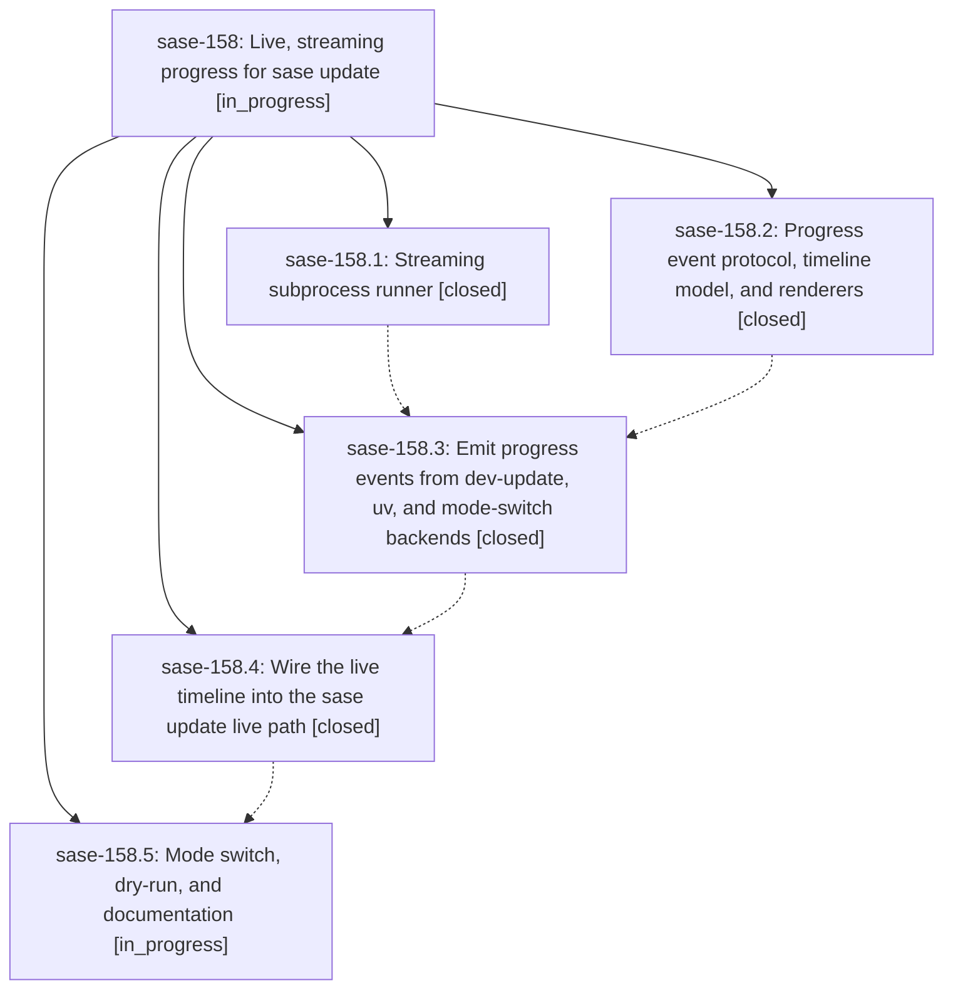

# Bead: sase-158 — Live, streaming progress for sase update

[Bead Pages](../README.md) / sase-158

**Status:** ◐ in_progress · **Type:** ▸ plan · **Tier:** epic
**Owner:** `bryanbugyi34@gmail.com` · **Created by:** [bbugyi200.apollo.1d](https://github.com/sase-org/sase--agents/blob/main/families/bbugyi200.apollo.1d.md) · **Assignee:** `sase-158.land`
**Created:** 2026-09-21 07:49:21 EDT
**Plan:** [202609/sase\_update\_live\_progress.md](https://github.com/sase-org/sase--plans/blob/main/202609/sase_update_live_progress.md)

<!-- sase:links:start -->

## Links

| Relation | Artifact | Why |
| --- | --- | --- |
| implemented-by | [plan:202609/sase_update_live_progress.md][1] | derived from the plan's `bead_id:` frontmatter field |

[1]: https://github.com/sase-org/sase--plans/blob/main/202609/sase_update_live_progress.md

<!-- sase:links:end -->

## Description

`sase update` shows every step as it happens: a live timeline on terminals and an append-only log when output is piped. It streams the tail of slow subprocess output (cargo, uv), shows each checkout's commits and diffstat as it fast-forwards, expands the failing step's output on error, survives Ctrl-C cleanly, and always leaves a full log file behind. The JSON and quiet contracts stay stable.

## Notes

[2026-09-21T14:49:56Z · sase-11y.11.land] DISCOVERED ISSUE (sase-11y.11 land agent, workspace sase_32, master f330e2b94): three whole-repo just check gates are red on files added or changed by 94ccd1917 (sase-158.1, streaming subprocess runner). (1) lint (mypy): src/sase/dev_update/prebuild.py:134 and :162 pass _run_command where DevCommandRunner is expected. DevCommandRunner.__call__ gained an on_output keyword that _run_command lacks. Also routed to sase-th note #5 by sase-14q, and reported by phase sase-11y.11.3 (PROPOSED FOLLOW-UP). (2) lint (test waits): tests/dev_update/test_stream_command.py:119 fixed-sleep-missing-pragma (needs '# sase-test-wait: <reason>' or an observable wait). (3) lint (symvision): sanitize_line in src/sase/dev_update/stream_command.py is an unused public symbol. Consume it in a later phase with a sase-158 --epic-symbol entry until then, or privatize it. The sase-158.1 note verified mypy on only 4 files and never reached the whole-repo gates, so these slipped through. Every agent's just check stops at mypy until (1) is fixed.

## Phases

| Bead | Title | Status | Size | Created | Agents | Commits |
|---|---|---|---|---|---:|---:|
| [sase-158.1](sase-158.1.md) | Streaming subprocess runner | ✓ closed | medium | 2026-09-21 | 1 | 1 |
| [sase-158.2](sase-158.2.md) | Progress event protocol, timeline model, and renderers | ✓ closed | medium | 2026-09-21 | 1 | 1 |
| [sase-158.3](sase-158.3.md) | Emit progress events from dev-update, uv, and mode-switch backends | ✓ closed | medium | 2026-09-21 | 1 | 1 |
| [sase-158.4](sase-158.4.md) | Wire the live timeline into the sase update live path | ✓ closed | medium | 2026-09-21 | 1 | 1 |
| [sase-158.5](sase-158.5.md) | Mode switch, dry-run, and documentation | ◐ in_progress | small | 2026-09-21 | 1 | 0 |

## Lineage

## Agents

| Agent | Bead | Commits |
|---|---|---:|
| [bbugyi200.apollo.sase-158.1](https://github.com/sase-org/sase--agents/blob/main/families/bbugyi200.apollo.sase-158.1.md) | [sase-158.1](sase-158.1.md) | 1 |
| [bbugyi200.apollo.sase-158.2](https://github.com/sase-org/sase--agents/blob/main/agents/bbugyi200.apollo.sase-158.2/README.md) | [sase-158.2](sase-158.2.md) | 1 |
| [bbugyi200.apollo.sase-158.3](https://github.com/sase-org/sase--agents/blob/main/agents/bbugyi200.apollo.sase-158.3/README.md) | [sase-158.3](sase-158.3.md) | 1 |
| [bbugyi200.apollo.sase-158.4](https://github.com/sase-org/sase--agents/blob/main/agents/bbugyi200.apollo.sase-158.4/README.md) | [sase-158.4](sase-158.4.md) | 1 |
| [bbugyi200.apollo.sase-158.5](https://github.com/sase-org/sase--agents/blob/main/agents/bbugyi200.apollo.sase-158.5/README.md) | [sase-158.5](sase-158.5.md) | 0 |
| [bbugyi200.apollo.sase-158.land](https://github.com/sase-org/sase--agents/blob/main/agents/bbugyi200.apollo.sase-158.land/README.md) | [sase-158](README.md) | 0 |

## Commits

| Repo | Commit | Subject | Bead | Committed |
|---|---|---|---|---|
| sase | [`94ccd19`](https://github.com/sase-org/sase/commit/94ccd19176a50586b97c2f8add0d431d1097ed18) | feat(dev-update): add line-streaming subprocess runner with on\_output sink | [sase-158.1](sase-158.1.md) | 2026-09-21 09:28:42 EDT |
| sase | [`d9a1de8`](https://github.com/sase-org/sase/commit/d9a1de8cc03d9c8f0cab1a50d150fc8bc67481cd) | feat(update-progress): add event protocol, timeline, renderers, and session | [sase-158.2](sase-158.2.md) | 2026-09-21 09:38:52 EDT |
| sase | [`5a89392`](https://github.com/sase-org/sase/commit/5a89392fe0fbfc59052b47257b9a882345c3302a) | feat(dev-update): instrument plan, execute, reconcile and mode-switch backends with progress events | [sase-158.3](sase-158.3.md) | 2026-09-21 10:35:55 EDT |
| sase | [`f64bd3a`](https://github.com/sase-org/sase/commit/f64bd3ac23c282e3af056ace496b5def2eccf37c) | feat(update): wire live-update progress session timeline | [sase-158.4](sase-158.4.md) | 2026-09-21 13:32:15 EDT |
