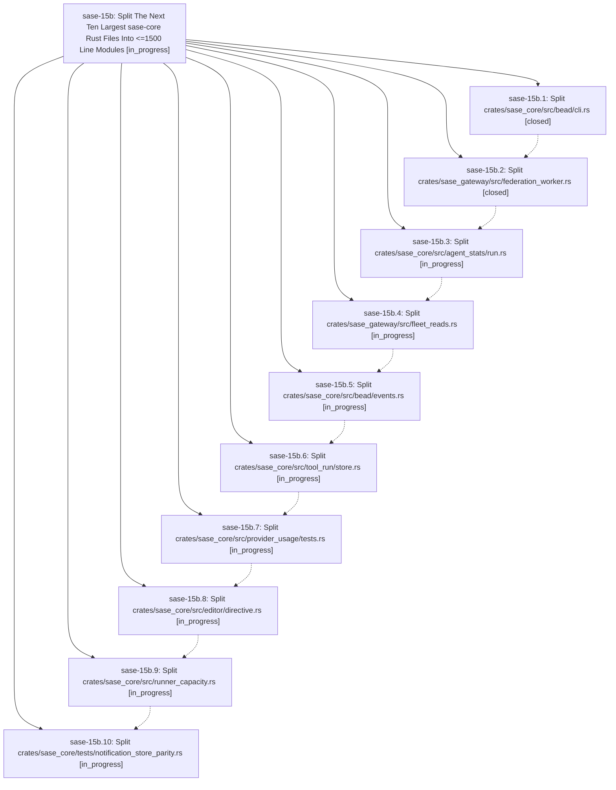

# Bead: sase-15b — Split The Next Ten Largest sase-core Rust Files Into \<=1500 Line Modules

[Bead Pages](../README.md) / sase-15b

**Status:** ◐ in_progress · **Type:** ▸ plan · **Tier:** epic
**Owner:** `bryanbugyi34@gmail.com` · **Created by:** [bbugyi200.athena.0oh.r0](https://github.com/sase-org/sase--agents/blob/main/families/bbugyi200.athena.0oh.r0.md) · **Assignee:** `sase-15b.land`
**Created:** 2026-09-21 11:31:35 EDT
**Plan:** [202609/sase\_core\_next\_ten\_big\_file\_split.md](https://github.com/sase-org/sase--plans/blob/main/202609/sase_core_next_ten_big_file_split.md)

<!-- sase:links:start -->

## Links

| Relation | Artifact | Why |
| --- | --- | --- |
| implemented-by | [plan:202609/sase_core_next_ten_big_file_split.md][1] | derived from the plan's `bead_id:` frontmatter field |

[1]: https://github.com/sase-org/sase--plans/blob/main/202609/sase_core_next_ten_big_file_split.md

<!-- sase:links:end -->

## Description

Each of the ten largest Rust files remaining in the sase-core repo after epic sase-14s is decomposed into a module tree whose every file is at most 1500 lines, with no behavior change, no public API change, and `just check` green after each phase.

## Phases

| Bead | Title | Status | Size | Created | Agents | Commits |
|---|---|---|---|---|---:|---:|
| [sase-15b.1](sase-15b.1.md) | Split crates/sase\_core/src/bead/cli.rs | ✓ closed | medium | 2026-09-21 | 1 | 1 |
| [sase-15b.10](sase-15b.10.md) | Split crates/sase\_core/tests/notification\_store\_parity.rs | ◐ in_progress | medium | 2026-09-21 | 1 | 0 |
| [sase-15b.2](sase-15b.2.md) | Split crates/sase\_gateway/src/federation\_worker.rs | ✓ closed | medium | 2026-09-21 | 1 | 1 |
| [sase-15b.3](sase-15b.3.md) | Split crates/sase\_core/src/agent\_stats/run.rs | ◐ in_progress | medium | 2026-09-21 | 1 | 0 |
| [sase-15b.4](sase-15b.4.md) | Split crates/sase\_gateway/src/fleet\_reads.rs | ◐ in_progress | medium | 2026-09-21 | 1 | 0 |
| [sase-15b.5](sase-15b.5.md) | Split crates/sase\_core/src/bead/events.rs | ◐ in_progress | medium | 2026-09-21 | 1 | 0 |
| [sase-15b.6](sase-15b.6.md) | Split crates/sase\_core/src/tool\_run/store.rs | ◐ in_progress | medium | 2026-09-21 | 1 | 0 |
| [sase-15b.7](sase-15b.7.md) | Split crates/sase\_core/src/provider\_usage/tests.rs | ◐ in_progress | medium | 2026-09-21 | 1 | 0 |
| [sase-15b.8](sase-15b.8.md) | Split crates/sase\_core/src/editor/directive.rs | ◐ in_progress | medium | 2026-09-21 | 1 | 0 |
| [sase-15b.9](sase-15b.9.md) | Split crates/sase\_core/src/runner\_capacity.rs | ◐ in_progress | medium | 2026-09-21 | 1 | 0 |

## Lineage

## Agents

| Agent | Bead | Commits |
|---|---|---:|
| [bbugyi200.athena.sase-15b.1](https://github.com/sase-org/sase--agents/blob/main/agents/bbugyi200.athena.sase-15b.1/README.md) | [sase-15b.1](sase-15b.1.md) | 1 |
| [bbugyi200.athena.sase-15b.10](https://github.com/sase-org/sase--agents/blob/main/agents/bbugyi200.athena.sase-15b.10/README.md) | [sase-15b.10](sase-15b.10.md) | 0 |
| [bbugyi200.athena.sase-15b.2](https://github.com/sase-org/sase--agents/blob/main/agents/bbugyi200.athena.sase-15b.2/README.md) | [sase-15b.2](sase-15b.2.md) | 1 |
| [bbugyi200.athena.sase-15b.3](https://github.com/sase-org/sase--agents/blob/main/agents/bbugyi200.athena.sase-15b.3/README.md) | [sase-15b.3](sase-15b.3.md) | 0 |
| [bbugyi200.athena.sase-15b.4](https://github.com/sase-org/sase--agents/blob/main/agents/bbugyi200.athena.sase-15b.4/README.md) | [sase-15b.4](sase-15b.4.md) | 0 |
| [bbugyi200.athena.sase-15b.5](https://github.com/sase-org/sase--agents/blob/main/agents/bbugyi200.athena.sase-15b.5/README.md) | [sase-15b.5](sase-15b.5.md) | 0 |
| [bbugyi200.athena.sase-15b.6](https://github.com/sase-org/sase--agents/blob/main/agents/bbugyi200.athena.sase-15b.6/README.md) | [sase-15b.6](sase-15b.6.md) | 0 |
| [bbugyi200.athena.sase-15b.7](https://github.com/sase-org/sase--agents/blob/main/agents/bbugyi200.athena.sase-15b.7/README.md) | [sase-15b.7](sase-15b.7.md) | 0 |
| [bbugyi200.athena.sase-15b.8](https://github.com/sase-org/sase--agents/blob/main/agents/bbugyi200.athena.sase-15b.8/README.md) | [sase-15b.8](sase-15b.8.md) | 0 |
| [bbugyi200.athena.sase-15b.9](https://github.com/sase-org/sase--agents/blob/main/agents/bbugyi200.athena.sase-15b.9/README.md) | [sase-15b.9](sase-15b.9.md) | 0 |
| [bbugyi200.athena.sase-15b.land](https://github.com/sase-org/sase--agents/blob/main/agents/bbugyi200.athena.sase-15b.land/README.md) | [sase-15b](README.md) | 0 |

## Commits

| Repo | Commit | Subject | Bead | Committed |
|---|---|---|---|---|
| sase-core | [`sase-core@61dc4e1`](https://github.com/sase-org/sase-core/commit/61dc4e19713189e8e9d0a2e3aeedafcf16d584ad) | refactor(bead): split bead cli.rs into bead/cli module tree | [sase-15b.1](sase-15b.1.md) | 2026-09-21 13:46:20 EDT |
| sase-core | [`sase-core@b5cea78`](https://github.com/sase-org/sase-core/commit/b5cea78ea99fd4f5210aabcf11036c56f02b293b) | refactor(gateway): split federation\_worker.rs into federation\_worker/ module tree | [sase-15b.2](sase-15b.2.md) | 2026-09-21 14:16:57 EDT |
