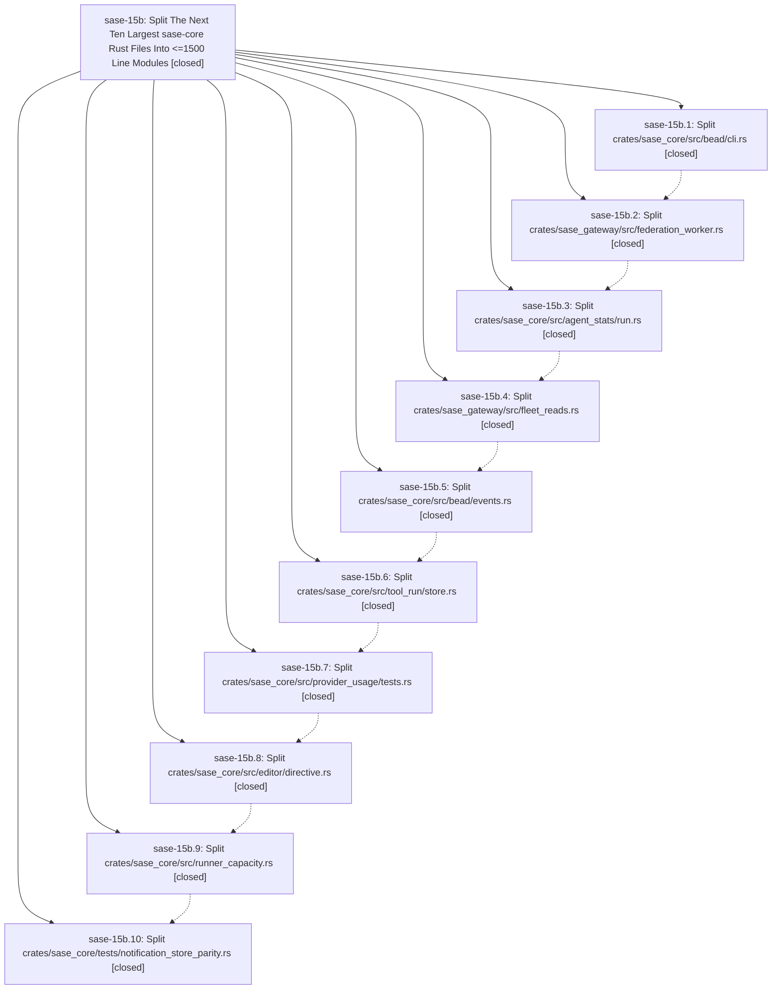

# Bead: sase-15b — Split The Next Ten Largest sase-core Rust Files Into \<=1500 Line Modules

[Bead Pages](../README.md) / sase-15b

**Status:** ✓ closed · **Resolution:** done · **Type:** ▸ plan · **Tier:** epic
**Owner:** `bryanbugyi34@gmail.com` · **Created by:** [bbugyi200.athena.0oh.r0](https://github.com/sase-org/sase--agents/blob/main/families/bbugyi200.athena.0oh.r0.md) · **Assignee:** `sase-15b.land`
**Created:** 2026-09-21 11:31:35 EDT · **Closed:** 2026-09-21 19:57:36 EDT
**Plan:** [202609/sase\_core\_next\_ten\_big\_file\_split.md](https://github.com/sase-org/sase--plans/blob/main/202609/sase_core_next_ten_big_file_split.md)

<!-- sase:links:start -->

## Links

| Relation | Artifact | Why |
| --- | --- | --- |
| implemented-by | [plan:202609/sase_core_next_ten_big_file_split.md][1] | derived from the plan's `bead_id:` frontmatter field |

_Plus 3 automatic references — see [Referenced By](#referenced-by)._

[1]: https://github.com/sase-org/sase--plans/blob/main/202609/sase_core_next_ten_big_file_split.md

<!-- sase:links:end -->

## Description

Each of the ten largest Rust files remaining in the sase-core repo after epic sase-14s is decomposed into a module tree whose every file is at most 1500 lines, with no behavior change, no public API change, and `just check` green after each phase.

## Notes

[2026-09-21T23:57:36Z · sase-15b.land] LANDED by sase-15b.land. VERIFIED (sase-core master 8886406, contained in release v0.34.71 / c5186cc): all 10 phases closed. Each epic commit (61dc4e1 b5cea78 006dd16 e93e248 ad732d6 b7af6b7 71b05bb 59327d6 f54b2ba 8886406) removed its monolith. Every file in the ten target trees is <=1500 lines (max 1103, editor/directive/tests.rs). No #[path] attributes and no generic module names; only tests/support.rs is used, as the plan allows. #[test]/#[tokio::test] counts match the pre-split file for every target (47,16,21,23,26,20,60,29,43,63). The set of `pub` item names is identical before and after for all 8 library targets, and mod.rs files re-export the public surface. The repo-wide >1500 audit lists only untargeted files. sudo_runner is a tree (no sudo_runner.rs). A fresh sase-core `just check` at 8886406 exited 0 (fmt, clippy, all workspace tests, 56 sase_core_py tests). Every child note's claims check out. The epic bead had no notes of its own.
INTEGRATED: the only non-epic sase-core commit during the epic, 45a966c (agy usage normalizer, sase-15p.1), landed before phase 7 and its 3 agy tests were carried into provider_usage/tests/agy.rs (3,368-line input, 60/60 tests). The later c5186cc is the v0.34.71 release commit. No stale old-path references in sase-core, sase-nvim, sase-github, or sase-telegram. In the sase repo I updated 3 stale path pointers: src/sase/axe/run_agent_wait_slot_candidate.py (runner_capacity.rs -> runner_capacity/candidate.rs), src/sase/sdd/plan_ref_display.py (bead/cli.rs -> bead/cli/design_refs.rs), and docs/rust_backend.md (notification_store_parity.rs -> notification_store_parity/). I also fixed tests/test_bead_flag_presentation.py's comment, which pointed at bead/cli.rs for an ANSI_TYPE_FLAG constant that d80fa83 had already deleted. The sase commits since the epic started are unrelated feature work. sase `just check`: every lint gate green (fmt, ruff, mypy, flags, pyscripts, test waits, changelog, terminology, symvision, toobig, validation, committed plans). The docstring edits escalated the scoped lane to the full suite: 44600 passed, 18 failed, all pre-existing and unrelated to this epic. They recur in other workspaces' recent check runs. Tracked: sase-14u/14v test_usage_config, sase-14r shard drift, sase-120 git identity, sase-12c flag toggle, sase-14j touched --verb. New: sase-15z (0b30610471's stale bead_hooks env=None mocks and unclassified bead read --project/--reason). Not triaged further (intermittent across runs): notification modal question footer, cleanup-panel clan members, session reporter uv runner, agy usage probe, plugins pane update.
FOLLOW-UPS: sase-15b.10 (bead_event_parity.rs 2,182 / agent_scan_parity.rs 2,139 over the 1500-line invariant) -> new task sase-15u (feature, medium; no duplicate or causal epic). sase-15b.4 (transient unnamed sase_core --lib failure under parallel load) -> declined: the phase agent's grep filtered out the test name (confirmed in its tool_calls.jsonl), so it cannot be deduplicated against sase-yn/15g/15h or reproduced. The next full gate and my own sase-core just check were green. No --epic-symbol entries.

## Phases

| Bead | Title | Status | Size | Created | Agents | Commits |
|---|---|---|---|---|---:|---:|
| [sase-15b.1](sase-15b.1.md) | Split crates/sase\_core/src/bead/cli.rs | ✓ closed | medium | 2026-09-21 | 1 | 1 |
| [sase-15b.10](sase-15b.10.md) | Split crates/sase\_core/tests/notification\_store\_parity.rs | ✓ closed | medium | 2026-09-21 | 1 | 1 |
| [sase-15b.2](sase-15b.2.md) | Split crates/sase\_gateway/src/federation\_worker.rs | ✓ closed | medium | 2026-09-21 | 1 | 1 |
| [sase-15b.3](sase-15b.3.md) | Split crates/sase\_core/src/agent\_stats/run.rs | ✓ closed | medium | 2026-09-21 | 1 | 1 |
| [sase-15b.4](sase-15b.4.md) | Split crates/sase\_gateway/src/fleet\_reads.rs | ✓ closed | medium | 2026-09-21 | 1 | 1 |
| [sase-15b.5](sase-15b.5.md) | Split crates/sase\_core/src/bead/events.rs | ✓ closed | medium | 2026-09-21 | 1 | 1 |
| [sase-15b.6](sase-15b.6.md) | Split crates/sase\_core/src/tool\_run/store.rs | ✓ closed | medium | 2026-09-21 | 1 | 1 |
| [sase-15b.7](sase-15b.7.md) | Split crates/sase\_core/src/provider\_usage/tests.rs | ✓ closed | medium | 2026-09-21 | 1 | 1 |
| [sase-15b.8](sase-15b.8.md) | Split crates/sase\_core/src/editor/directive.rs | ✓ closed | medium | 2026-09-21 | 1 | 1 |
| [sase-15b.9](sase-15b.9.md) | Split crates/sase\_core/src/runner\_capacity.rs | ✓ closed | medium | 2026-09-21 | 1 | 1 |

## Lineage

## Agents

| Agent | Bead | Commits |
|---|---|---:|
| [bbugyi200.athena.sase-15b.1](https://github.com/sase-org/sase--agents/blob/main/agents/bbugyi200.athena.sase-15b.1/README.md) | [sase-15b.1](sase-15b.1.md) | 1 |
| [bbugyi200.athena.sase-15b.10](https://github.com/sase-org/sase--agents/blob/main/agents/bbugyi200.athena.sase-15b.10/README.md) | [sase-15b.10](sase-15b.10.md) | 1 |
| [bbugyi200.athena.sase-15b.2](https://github.com/sase-org/sase--agents/blob/main/agents/bbugyi200.athena.sase-15b.2/README.md) | [sase-15b.2](sase-15b.2.md) | 1 |
| [bbugyi200.athena.sase-15b.3](https://github.com/sase-org/sase--agents/blob/main/agents/bbugyi200.athena.sase-15b.3/README.md) | [sase-15b.3](sase-15b.3.md) | 1 |
| [bbugyi200.athena.sase-15b.4](https://github.com/sase-org/sase--agents/blob/main/agents/bbugyi200.athena.sase-15b.4/README.md) | [sase-15b.4](sase-15b.4.md) | 1 |
| [bbugyi200.athena.sase-15b.5](https://github.com/sase-org/sase--agents/blob/main/agents/bbugyi200.athena.sase-15b.5/README.md) | [sase-15b.5](sase-15b.5.md) | 1 |
| [bbugyi200.athena.sase-15b.6](https://github.com/sase-org/sase--agents/blob/main/agents/bbugyi200.athena.sase-15b.6/README.md) | [sase-15b.6](sase-15b.6.md) | 1 |
| [bbugyi200.athena.sase-15b.7](https://github.com/sase-org/sase--agents/blob/main/agents/bbugyi200.athena.sase-15b.7/README.md) | [sase-15b.7](sase-15b.7.md) | 1 |
| [bbugyi200.athena.sase-15b.8](https://github.com/sase-org/sase--agents/blob/main/agents/bbugyi200.athena.sase-15b.8/README.md) | [sase-15b.8](sase-15b.8.md) | 1 |
| [bbugyi200.athena.sase-15b.9](https://github.com/sase-org/sase--agents/blob/main/agents/bbugyi200.athena.sase-15b.9/README.md) | [sase-15b.9](sase-15b.9.md) | 1 |
| [bbugyi200.athena.sase-15b.land](https://github.com/sase-org/sase--agents/blob/main/agents/bbugyi200.athena.sase-15b.land/README.md) | [sase-15b](README.md) | 2 |

## Commits

| Repo | Commit | Subject | Bead | Committed |
|---|---|---|---|---|
| sase-core | [`sase-core@61dc4e1`](https://github.com/sase-org/sase-core/commit/61dc4e19713189e8e9d0a2e3aeedafcf16d584ad) | refactor(bead): split bead cli.rs into bead/cli module tree | [sase-15b.1](sase-15b.1.md) | 2026-09-21 13:46:20 EDT |
| sase-core | [`sase-core@b5cea78`](https://github.com/sase-org/sase-core/commit/b5cea78ea99fd4f5210aabcf11036c56f02b293b) | refactor(gateway): split federation\_worker.rs into federation\_worker/ module tree | [sase-15b.2](sase-15b.2.md) | 2026-09-21 14:16:57 EDT |
| sase-core | [`sase-core@006dd16`](https://github.com/sase-org/sase-core/commit/006dd162cd11a0afbc0c70d2b604bd41f8ffbc64) | refactor(agent\_stats): split run.rs into run/ module tree | [sase-15b.3](sase-15b.3.md) | 2026-09-21 14:50:10 EDT |
| sase-core | [`sase-core@e93e248`](https://github.com/sase-org/sase-core/commit/e93e24879f7be9f04e0e29377735676f738f55b2) | refactor(sase-gateway): split fleet\_reads into module tree | [sase-15b.4](sase-15b.4.md) | 2026-09-21 15:25:36 EDT |
| sase-core | [`sase-core@ad732d6`](https://github.com/sase-org/sase-core/commit/ad732d67480bea95cc5a64428988ffb522731e81) | refactor(sase-core): split bead events into wire, import, reduction, merge modules | [sase-15b.5](sase-15b.5.md) | 2026-09-21 15:55:32 EDT |
| sase-core | [`sase-core@b7af6b7`](https://github.com/sase-org/sase-core/commit/b7af6b7ce58a0888253e1f8223f2e502512d33bb) | refactor(sase-core): split tool\_run store into connection, lifecycle, query, retention modules | [sase-15b.6](sase-15b.6.md) | 2026-09-21 16:21:13 EDT |
| sase-core | [`sase-core@71b05bb`](https://github.com/sase-org/sase-core/commit/71b05bbce8b71e55fa6201fd0d4e5e5e0991a171) | refactor(sase-core): split provider\_usage tests into tests/ directory | [sase-15b.7](sase-15b.7.md) | 2026-09-21 16:56:29 EDT |
| sase-core | [`sase-core@59327d6`](https://github.com/sase-org/sase-core/commit/59327d62c18b61c8680d367e69ab58c6f1c296f9) | refactor(sase-core): split editor directive into metadata, contract, candidate, context modules | [sase-15b.8](sase-15b.8.md) | 2026-09-21 17:21:30 EDT |
| sase-core | [`sase-core@f54b2ba`](https://github.com/sase-org/sase-core/commit/f54b2ba4cb7c38739f0a9c5c202ca1a4077de9d4) | refactor(sase-core): split runner\_capacity into module tree | [sase-15b.9](sase-15b.9.md) | 2026-09-21 17:52:24 EDT |
| sase-core | [`sase-core@8886406`](https://github.com/sase-org/sase-core/commit/88864065127efa138b71c3e778b60916a5f81b17) | refactor(sase-core): split notification\_store\_parity test into behavior-area modules | [sase-15b.10](sase-15b.10.md) | 2026-09-21 18:12:37 EDT |
| sase | [`cbc0f0c`](https://github.com/sase-org/sase/commit/cbc0f0c32565c5b7da474e00249601344138677e) | docs: point sase-core references at the split module trees from epic sase-15b | [sase-15b](README.md) | 2026-09-21 19:59:50 EDT |
| sase--plans | [`sase--plans@f69fc62`](https://github.com/sase-org/sase--plans/commit/f69fc62288345790cbef3a59919c2af066c65940) | chore(plans): mark sase\_core\_next\_ten\_big\_file\_split done after sase-15b landed | [sase-15b](README.md) | 2026-09-21 20:03:54 EDT |

<!-- sase:referenced-by:start -->

## Referenced By

| Relation | Artifact | Why | Uses |
| --- | --- | --- | ---: |
| read-by | [agent:research.24.cld][1] | research sase-core agent maintainability | 2 |
| read-by | [agent:sase-15b.2][2] | epic symbols check | 1 |
| read-by | [agent:sase-15b.land][3] | Confirm epic is closed before final declaration | 2 |

[1]: https://github.com/sase-org/sase--agents/blob/main/agents/bbugyi200.athena.research.24.cld/README.md
[2]: https://github.com/sase-org/sase--agents/blob/main/agents/bbugyi200.athena.sase-15b.2/README.md
[3]: https://github.com/sase-org/sase--agents/blob/main/agents/bbugyi200.athena.sase-15b.land/README.md

<!-- sase:referenced-by:end -->
