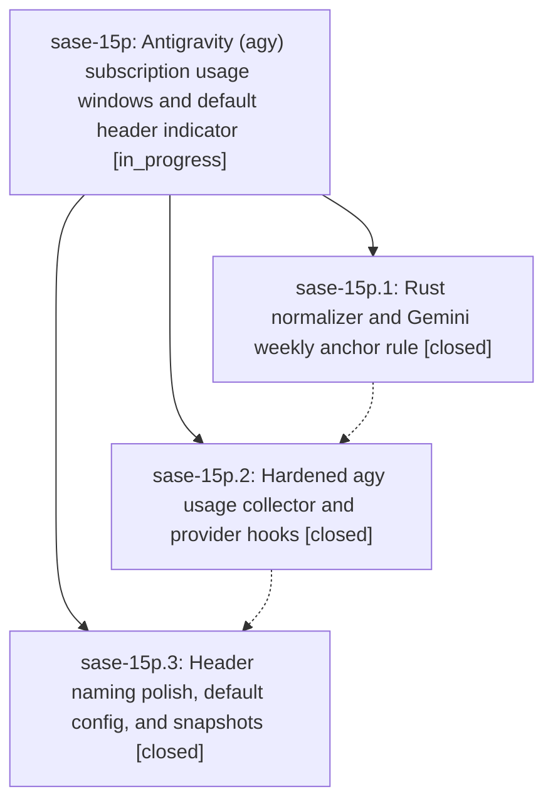

# Bead: sase-15p — Antigravity (agy) subscription usage windows and default header indicator

[Bead Pages](../README.md) / sase-15p

**Status:** ◐ in_progress · **Type:** ▸ plan · **Tier:** epic
**Owner:** `bryanbugyi34@gmail.com` · **Created by:** [bbugyi200.athena.0os](https://github.com/sase-org/sase--agents/blob/main/families/bbugyi200.athena.0os.md) · **Assignee:** `sase-15p.land`
**Created:** 2026-09-21 15:31:51 EDT
**Plan:** [202609/agy\_usage\_windows.md](https://github.com/sase-org/sase--plans/blob/main/202609/agy_usage_windows.md)

<!-- sase:links:start -->

## Links

| Relation | Artifact | Why |
| --- | --- | --- |
| implemented-by | [plan:202609/agy_usage_windows.md][1] | derived from the plan's `bead_id:` frontmatter field |

[1]: https://github.com/sase-org/sase--plans/blob/main/202609/agy_usage_windows.md

<!-- sase:links:end -->

## Description

SASE collects Antigravity's four subscription usage windows on the normal background cadence at zero model cost, and the top-right TUI header shows agy's Gemini weekly window by default (for example `🪐 96% 6d1h`) whenever agy is installed and in use, proven by a live post-landing screenshot saved as a SASE artifact.

## Phases

| Bead | Title | Status | Size | Created | Agents | Commits |
|---|---|---|---|---|---:|---:|
| [sase-15p.1](sase-15p.1.md) | Rust normalizer and Gemini weekly anchor rule | ✓ closed | medium | 2026-09-21 | 1 | 1 |
| [sase-15p.2](sase-15p.2.md) | Hardened agy usage collector and provider hooks | ✓ closed | medium | 2026-09-21 | 1 | 1 |
| [sase-15p.3](sase-15p.3.md) | Header naming polish, default config, and snapshots | ✓ closed | small | 2026-09-21 | 1 | 1 |

## Lineage

## Agents

| Agent | Bead | Commits |
|---|---|---:|
| [bbugyi200.athena.sase-15p.1](https://github.com/sase-org/sase--agents/blob/main/agents/bbugyi200.athena.sase-15p.1/README.md) | [sase-15p.1](sase-15p.1.md) | 1 |
| [bbugyi200.athena.sase-15p.2](https://github.com/sase-org/sase--agents/blob/main/agents/bbugyi200.athena.sase-15p.2/README.md) | [sase-15p.2](sase-15p.2.md) | 1 |
| [bbugyi200.athena.sase-15p.3](https://github.com/sase-org/sase--agents/blob/main/agents/bbugyi200.athena.sase-15p.3/README.md) | [sase-15p.3](sase-15p.3.md) | 1 |
| [bbugyi200.athena.sase-15p.land](https://github.com/sase-org/sase--agents/blob/main/agents/bbugyi200.athena.sase-15p.land/README.md) | [sase-15p](README.md) | 0 |

## Commits

| Repo | Commit | Subject | Bead | Committed |
|---|---|---|---|---|
| sase-core | [`sase-core@45a966c`](https://github.com/sase-org/sase-core/commit/45a966c64523f21a90959758317088869618b1ee) | feat(provider-usage): add agy usage normalizer and Gemini weekly anchor rule | [sase-15p.1](sase-15p.1.md) | 2026-09-21 15:50:37 EDT |
| sase | [`8e0f38a`](https://github.com/sase-org/sase/commit/8e0f38a532354685635d6534fd351b8c189ce100) | feat(agy): hardened usage collector, provider hooks, fixture, tests, docs (interim; verification pending build) | [sase-15p.2](sase-15p.2.md) | 2026-09-21 16:15:05 EDT |
| sase | [`80c0f54`](https://github.com/sase-org/sase/commit/80c0f549e4dba7467756f2827c05940b82f9b3e5) | feat(agy): header naming polish, default config, and snapshots | [sase-15p.3](sase-15p.3.md) | 2026-09-21 17:56:08 EDT |
