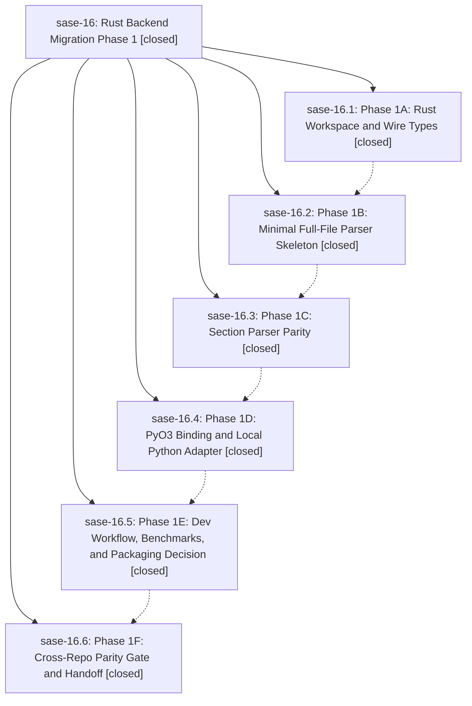

# Bead: sase-16 — Rust Backend Migration Phase 1

[Bead Pages](../README.md) / sase-16

**Status:** ✓ closed · **Resolution:** (unrecorded) · **Type:** plan · **Tier:** epic
**Owner:** `bryanbugyi34@gmail.com`
**Created:** 2026-04-29 04:53:11 UTC · **Closed:** 2026-04-29 06:45:22 UTC
**Plan:** [202604/rust\_backend\_phase1.md](https://github.com/sase-org/sase--plans/blob/main/202604/rust_backend_phase1.md)

## Phases

| Bead | Title | Status | Size | Agents | Commits |
|---|---|---|---|---:|---:|
| [sase-16.1](sase-16.1.md) | Phase 1A: Rust Workspace and Wire Types | ✓ closed | small | 0 | 0 |
| [sase-16.2](sase-16.2.md) | Phase 1B: Minimal Full-File Parser Skeleton | ✓ closed | small | 0 | 0 |
| [sase-16.3](sase-16.3.md) | Phase 1C: Section Parser Parity | ✓ closed | small | 0 | 0 |
| [sase-16.4](sase-16.4.md) | Phase 1D: PyO3 Binding and Local Python Adapter | ✓ closed | small | 0 | 1 |
| [sase-16.5](sase-16.5.md) | Phase 1E: Dev Workflow, Benchmarks, and Packaging Decision | ✓ closed | small | 0 | 1 |
| [sase-16.6](sase-16.6.md) | Phase 1F: Cross-Repo Parity Gate and Handoff | ✓ closed | small | 0 | 1 |

## Lineage

## Commits

| Commit | Subject | Bead | Committed (UTC) |
|---|---|---|---|
| [`43ffcff`](https://github.com/sase-org/sase/commit/43ffcff9c0ec9422fcf5360985471c959036ed06) | feat(core): Phase 1D wire sase\_core\_rs into parse\_project\_bytes (sase-16.4) | [sase-16.4](sase-16.4.md) | 2026-04-29 06:16:50 |
| [`8880108`](https://github.com/sase-org/sase/commit/8880108b2cc32f56da7d143047c24c821525ef5d) | feat: Phase 1E dev workflow + core parse benchmark (sase-16.5) | [sase-16.5](sase-16.5.md) | 2026-04-29 06:29:40 |
| [`b875999`](https://github.com/sase-org/sase/commit/b87599997164e0c916aba23e344b417b769d3b25) | chore(core): Phase 1F — cross-repo parity gate and handoff (sase-16.6) | [sase-16.6](sase-16.6.md) | 2026-04-29 06:42:13 |
| [`794a829`](https://github.com/sase-org/sase/commit/794a8291bb4028877d581e6261587f4f35da1a06) | chore: close Rust backend Phase 1 epic (sase-16) | [sase-16](README.md) | 2026-04-29 06:47:03 |
