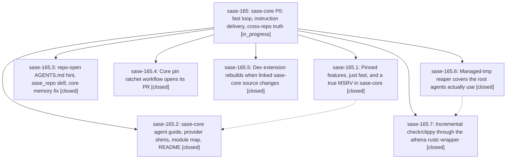

# Bead: sase-165 — sase-core P0: fast loop, instruction delivery, cross-repo truth

[Bead Pages](../README.md) / sase-165

**Status:** ◐ in_progress · **Type:** ▸ plan · **Tier:** epic
**Owner:** `bryanbugyi34@gmail.com` · **Created by:** [bbugyi200.athena.0p2](https://github.com/sase-org/sase--agents/blob/main/families/bbugyi200.athena.0p2.md) · **Assignee:** `sase-165.land`
**Created:** 2026-09-22 08:18:20 EDT
**Plan:** [202609/sase\_core\_p0\_agent\_maintainability.md](https://github.com/sase-org/sase--plans/blob/main/202609/sase_core_p0_agent_maintainability.md)

## Description

Every agent that touches sase-core gets a concise, accurate guide without being told to look for it. A real sase_core edit re-checks in about 30 s on athena, and switching cargo scope no longer recompiles sase_core. sase stops producing false signals about the core: the pin bot opens its PRs, and `just check` rebuilds a dev extension that no longer matches the linked core source.

## Notes

[2026-09-22T16:42:13Z · sase-165.land] LAND PROGRESS (sase-165.land, 2026-09-22, master 8d1779a3e, sase-core 035851e, chezmoi 034c594b): VERIFIED all 7 phases in code: .1 hakari workspace-hack + check.sh features gate (passes; CI both OS legs) + just fast + rust-version 1.89/0 allows (scope switch <=0.42s per 1d129cd); .2 AGENTS.md 97 lines, CLAUDE.md/GEMINI.md shims, just modules, manifest deleted, README 50 lines; .3 repo-open stderr hint (seen live), skill sentence, core memory fixed, rust_backend.md subsection; .4 ratchet apply tolerates exit 2 — manual run 35754368140 opened bot PR #302 (pin -> 035851e0dad8); .5 stamp + CORE_SOURCE_STALE bit + _setup rebuild + flake-baseline retirement; .6 SASE_TMPDIR/SASE_HOME captured + root-mismatch warnings; .7 wrapper split + agent_cargo_incremental opt-in, MEASURED edit->check 22.07s (<=30s), 0/220 sccache invocations carry incremental (note on sase-165.7). 100 targeted tests pass. CLOSED sase-15w, sase-15v, sase-15q (plan required; phases had not). LANDING DONE: sase skill init -y deployed sase_repo (chezmoi d02225f4, applied); chezmoi apply already on athena. USER ACTIONS LEFT: 'sase service init --yes' + service restart from an interactive shell (athena env still lacks SASE_TMPDIR); 'sase update' so installed sase (primary 3 behind) includes e081abe1c, then re-measure a real agent's first sase-core check. REMAINING EPIC WORK -> child tale plan: (a) .5 gap — identity dirty digest covers only Cargo.toml/Cargo.lock/crates/sase_core_py, so uncommitted crates/sase_core edits never flag a rebuild (reproduced); (b) .4 plan step 3 behavior test (stubbed run-script execution) missing, only string asserts; (c) AGENTS.md/README just-check step list omits the features gate; rust_backend.md cites removed sase_core_py/extension-module feature. FOLLOW-UP OUTCOMES: .4#1/.5#2/.6#2 pre-existing failures -> +1 sase-15z (commit_bead_hooks x3 + cli_at_path_values), +1 sase-14r (shards drift), +1 sase-14u (usage_config x4; closed 16:35Z by sase-165.6.f0 fix, reopen correctly withheld; sase-14v dup also closed), DISCOVERED ISSUE on sase-158 (session_proc_reporter: 5a89392fe/sase-158.3 on_output kwarg), DISCOVERED ISSUE on sase-142.5 (arrival_frames: bisected to 2bf6f3d87); .4#2 flakes -> +1 sase-15l (sase_update_mixed) and +1 sase-qr (update_confirm); .5#2 fakey monitor capacity / launch proc runtime / ace testing leaks DECLINED: no node IDs, launch_proc_runtime and ace_testing pass at HEAD, load-flake class already tracked (sase-13c, sase-15k). None caused by this epic. epic-symbols: none.

## Phases

| Bead | Title | Status | Size | Created | Agents | Commits |
|---|---|---|---|---|---:|---:|
| [sase-165.1](sase-165.1.md) | Pinned features, just fast, and a true MSRV in sase-core | ✓ closed | medium | 2026-09-22 | 1 | 1 |
| [sase-165.2](sase-165.2.md) | sase-core agent guide, provider shims, module map, README | ✓ closed | medium | 2026-09-22 | 1 | 1 |
| [sase-165.3](sase-165.3.md) | repo-open AGENTS.md hint, sase\_repo skill, core memory fix | ✓ closed | small | 2026-09-22 | 1 | 1 |
| [sase-165.4](sase-165.4.md) | Core pin ratchet workflow opens its PR | ✓ closed | small | 2026-09-22 | 1 | 1 |
| [sase-165.5](sase-165.5.md) | Dev extension rebuilds when linked sase-core source changes | ✓ closed | medium | 2026-09-22 | 1 | 1 |
| [sase-165.6](sase-165.6.md) | Managed-tmp reaper covers the root agents actually use | ✓ closed | medium | 2026-09-22 | 1 | 1 |
| [sase-165.7](sase-165.7.md) | Incremental check/clippy through the athena rustc wrapper | ✓ closed | medium | 2026-09-22 | 1 | 2 |

## Lineage

## Agents

| Agent | Bead | Commits |
|---|---|---:|
| [bbugyi200.athena.sase-165.1](https://github.com/sase-org/sase--agents/blob/main/agents/bbugyi200.athena.sase-165.1/README.md) | [sase-165.1](sase-165.1.md) | 1 |
| [bbugyi200.athena.sase-165.2](https://github.com/sase-org/sase--agents/blob/main/agents/bbugyi200.athena.sase-165.2/README.md) | [sase-165.2](sase-165.2.md) | 1 |
| [bbugyi200.athena.sase-165.3](https://github.com/sase-org/sase--agents/blob/main/agents/bbugyi200.athena.sase-165.3/README.md) | [sase-165.3](sase-165.3.md) | 1 |
| [bbugyi200.athena.sase-165.4](https://github.com/sase-org/sase--agents/blob/main/agents/bbugyi200.athena.sase-165.4/README.md) | [sase-165.4](sase-165.4.md) | 1 |
| [bbugyi200.athena.sase-165.5](https://github.com/sase-org/sase--agents/blob/main/agents/bbugyi200.athena.sase-165.5/README.md) | [sase-165.5](sase-165.5.md) | 1 |
| [bbugyi200.athena.sase-165.6](https://github.com/sase-org/sase--agents/blob/main/families/bbugyi200.athena.sase-165.6.md) | [sase-165.6](sase-165.6.md) | 1 |
| [bbugyi200.athena.sase-165.7](https://github.com/sase-org/sase--agents/blob/main/families/bbugyi200.athena.sase-165.7.md) | [sase-165.7](sase-165.7.md) | 2 |
| [bbugyi200.athena.sase-165.land](https://github.com/sase-org/sase--agents/blob/main/families/bbugyi200.athena.sase-165.land.md) | [sase-165](README.md) | 2 |

## Commits

| Repo | Commit | Subject | Bead | Committed |
|---|---|---|---|---|
| sase | [`e8d2386`](https://github.com/sase-org/sase/commit/e8d238688ff9b75edec510d3a8b56aec9e6c77d9) | feat(dev): rebuild extension when linked sase-core source changes | [sase-165.5](sase-165.5.md) | 2026-09-22 09:54:45 EDT |
| sase | [`1404010`](https://github.com/sase-org/sase/commit/1404010b1e255bdc42711b34202c6f0c2d83a27c) | fix(core-pin): tolerate ratchet apply exit 2 so the bot reaches push and PR | [sase-165.4](sase-165.4.md) | 2026-09-22 09:56:50 EDT |
| sase-core | [`sase-core@1d129cd`](https://github.com/sase-org/sase-core/commit/1d129cd24fdb42e1906d32ddea89d416f6a61c05) | feat(fast-loop): unify features via workspace-hack, add drift gate, just fast, true MSRV 1.89 | [sase-165.1](sase-165.1.md) | 2026-09-22 10:16:33 EDT |
| sase | [`772f3f1`](https://github.com/sase-org/sase/commit/772f3f199621b901c1456a9c9d71d0d05bd766a2) | feat(repo-open): name opened repo AGENTS.md on stderr and fix core memory pointer | [sase-165.3](sase-165.3.md) | 2026-09-22 10:36:08 EDT |
| sase | [`529d7d3`](https://github.com/sase-org/sase/commit/529d7d325f050dc8af08d55d49e8251df4492160) | feat(reaper): capture SASE\_TMPDIR in service env and warn on managed-root mismatch | [sase-165.6](sase-165.6.md) | 2026-09-22 10:51:48 EDT |
| sase-core | [`sase-core@035851e`](https://github.com/sase-org/sase-core/commit/035851e0dad8a7ce00bf00735014e5d473c8786a) | docs(core): agent guide, provider shims, module map, README | [sase-165.2](sase-165.2.md) | 2026-09-22 11:15:24 EDT |
| sase | [`e081abe`](https://github.com/sase-org/sase/commit/e081abe1cb9168a20b9ff5a989956d0beb1d96c8) | feat(config): add managed\_tmp.agent\_cargo\_incremental opt-in for agent cargo incremental | [sase-165.7](sase-165.7.md) | 2026-09-22 11:36:45 EDT |
| chezmoi | [`chezmoi@034c594`](https://github.com/bbugyi200/dotfiles/commit/034c594bd4621a306688adad76f306ce8544de36) | feat(cargo): split incremental units via sase-rustc-wrapper for sccache | [sase-165.7](sase-165.7.md) | 2026-09-22 11:40:24 EDT |
| sase | [`8d085d0`](https://github.com/sase-org/sase/commit/8d085d03c641a4904a06433bca64619e0cd45472) | fix: widen dev-extension freshness identity INPUT\_PATHS to Cargo.toml, Cargo.lock, rust-toolchain.toml and crates/ | [sase-165](README.md) | 2026-09-22 13:15:50 EDT |
| sase-core | [`sase-core@b1d2881`](https://github.com/sase-org/sase-core/commit/b1d28818c48c657dccb45801edeb9d9ee4c930fb) | docs(core): name the features gate in the just check step list | [sase-165](README.md) | 2026-09-22 13:18:53 EDT |
