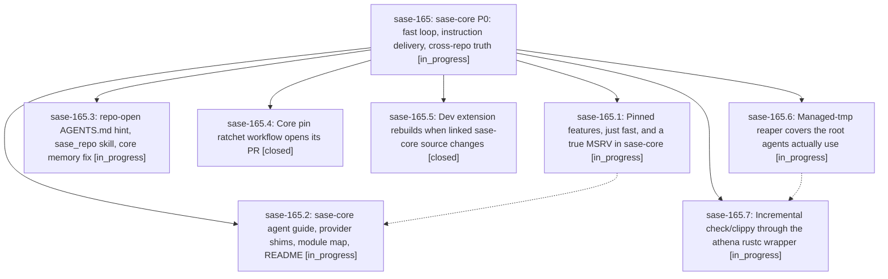

# Bead: sase-165 — sase-core P0: fast loop, instruction delivery, cross-repo truth

[Bead Pages](../README.md) / sase-165

**Status:** ◐ in_progress · **Type:** ▸ plan · **Tier:** epic
**Owner:** `bryanbugyi34@gmail.com` · **Created by:** [bbugyi200.athena.0p2](https://github.com/sase-org/sase--agents/blob/main/families/bbugyi200.athena.0p2.md) · **Assignee:** `sase-165.land`
**Created:** 2026-09-22 08:18:20 EDT
**Plan:** [202609/sase\_core\_p0\_agent\_maintainability.md](https://github.com/sase-org/sase--plans/blob/main/202609/sase_core_p0_agent_maintainability.md)

## Description

Every agent that touches sase-core gets a concise, accurate guide without being told to look for it. A real sase_core edit re-checks in about 30 s on athena, and switching cargo scope no longer recompiles sase_core. sase stops producing false signals about the core: the pin bot opens its PRs, and `just check` rebuilds a dev extension that no longer matches the linked core source.

## Phases

| Bead | Title | Status | Size | Created | Agents | Commits |
|---|---|---|---|---|---:|---:|
| [sase-165.1](sase-165.1.md) | Pinned features, just fast, and a true MSRV in sase-core | ◐ in_progress | medium | 2026-09-22 | 1 | 0 |
| [sase-165.2](sase-165.2.md) | sase-core agent guide, provider shims, module map, README | ◐ in_progress | medium | 2026-09-22 | 1 | 0 |
| [sase-165.3](sase-165.3.md) | repo-open AGENTS.md hint, sase\_repo skill, core memory fix | ◐ in_progress | small | 2026-09-22 | 1 | 1 |
| [sase-165.4](sase-165.4.md) | Core pin ratchet workflow opens its PR | ✓ closed | small | 2026-09-22 | 1 | 1 |
| [sase-165.5](sase-165.5.md) | Dev extension rebuilds when linked sase-core source changes | ✓ closed | medium | 2026-09-22 | 1 | 1 |
| [sase-165.6](sase-165.6.md) | Managed-tmp reaper covers the root agents actually use | ◐ in_progress | medium | 2026-09-22 | 1 | 1 |
| [sase-165.7](sase-165.7.md) | Incremental check/clippy through the athena rustc wrapper | ◐ in_progress | medium | 2026-09-22 | 1 | 0 |

## Lineage

## Agents

| Agent | Bead | Commits |
|---|---|---:|
| [bbugyi200.athena.sase-165.1](https://github.com/sase-org/sase--agents/blob/main/agents/bbugyi200.athena.sase-165.1/README.md) | [sase-165.1](sase-165.1.md) | 0 |
| [bbugyi200.athena.sase-165.2](https://github.com/sase-org/sase--agents/blob/main/agents/bbugyi200.athena.sase-165.2/README.md) | [sase-165.2](sase-165.2.md) | 0 |
| [bbugyi200.athena.sase-165.3](https://github.com/sase-org/sase--agents/blob/main/agents/bbugyi200.athena.sase-165.3/README.md) | [sase-165.3](sase-165.3.md) | 1 |
| [bbugyi200.athena.sase-165.4](https://github.com/sase-org/sase--agents/blob/main/agents/bbugyi200.athena.sase-165.4/README.md) | [sase-165.4](sase-165.4.md) | 1 |
| [bbugyi200.athena.sase-165.5](https://github.com/sase-org/sase--agents/blob/main/agents/bbugyi200.athena.sase-165.5/README.md) | [sase-165.5](sase-165.5.md) | 1 |
| [bbugyi200.athena.sase-165.6](https://github.com/sase-org/sase--agents/blob/main/families/bbugyi200.athena.sase-165.6.md) | [sase-165.6](sase-165.6.md) | 1 |
| [bbugyi200.athena.sase-165.7](https://github.com/sase-org/sase--agents/blob/main/agents/bbugyi200.athena.sase-165.7/README.md) | [sase-165.7](sase-165.7.md) | 0 |
| [bbugyi200.athena.sase-165.land](https://github.com/sase-org/sase--agents/blob/main/agents/bbugyi200.athena.sase-165.land/README.md) | [sase-165](README.md) | 0 |

## Commits

| Repo | Commit | Subject | Bead | Committed |
|---|---|---|---|---|
| sase | [`e8d2386`](https://github.com/sase-org/sase/commit/e8d238688ff9b75edec510d3a8b56aec9e6c77d9) | feat(dev): rebuild extension when linked sase-core source changes | [sase-165.5](sase-165.5.md) | 2026-09-22 09:54:45 EDT |
| sase | [`1404010`](https://github.com/sase-org/sase/commit/1404010b1e255bdc42711b34202c6f0c2d83a27c) | fix(core-pin): tolerate ratchet apply exit 2 so the bot reaches push and PR | [sase-165.4](sase-165.4.md) | 2026-09-22 09:56:50 EDT |
| sase | [`772f3f1`](https://github.com/sase-org/sase/commit/772f3f199621b901c1456a9c9d71d0d05bd766a2) | feat(repo-open): name opened repo AGENTS.md on stderr and fix core memory pointer | [sase-165.3](sase-165.3.md) | 2026-09-22 10:36:08 EDT |
| sase | [`529d7d3`](https://github.com/sase-org/sase/commit/529d7d325f050dc8af08d55d49e8251df4492160) | feat(reaper): capture SASE\_TMPDIR in service env and warn on managed-root mismatch | [sase-165.6](sase-165.6.md) | 2026-09-22 10:51:48 EDT |
