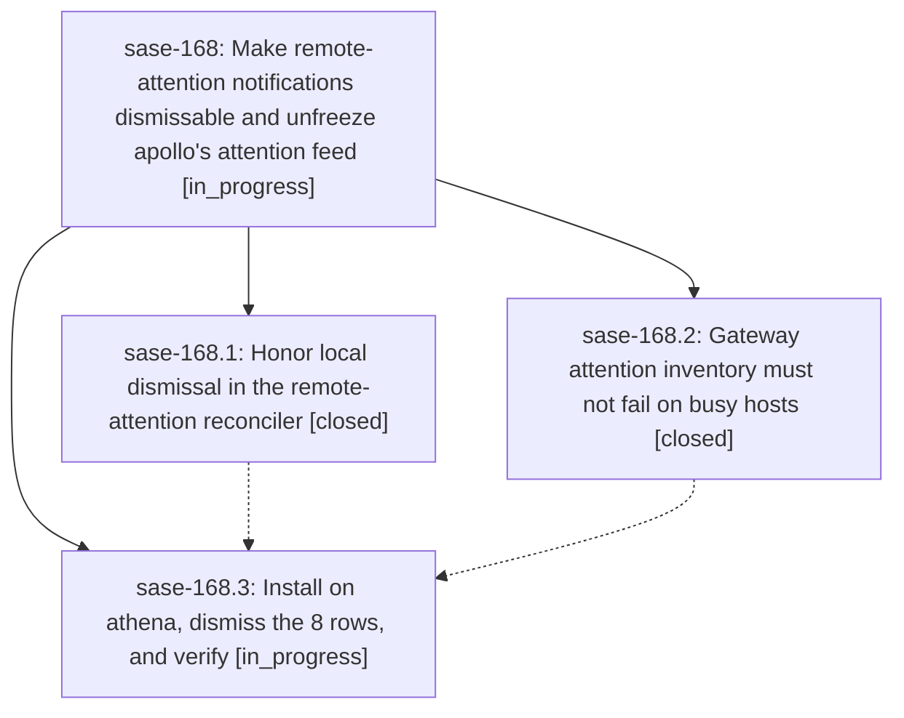

# Bead: sase-168 — Make remote-attention notifications dismissable and unfreeze apollo's attention feed

[Bead Pages](../README.md) / sase-168

**Status:** ◐ in_progress · **Type:** ▸ plan · **Tier:** epic
**Owner:** `bryanbugyi34@gmail.com` · **Created by:** [bbugyi200.athena.0pa](https://github.com/sase-org/sase--agents/blob/main/families/bbugyi200.athena.0pa.md) · **Assignee:** `sase-168.land`
**Created:** 2026-09-22 10:05:56 EDT
**Plan:** [202609/remote\_attention\_dismissal\_fix.md](https://github.com/sase-org/sase--plans/blob/main/202609/remote_attention_dismissal_fix.md)

## Description

A user dismissal of a remote-attention notification sticks for that revision; the gateway attention inventory works on hosts with more than 200 visible notifications; and on athena the fix is installed, the 8 stuck apollo rows are dismissed and stay dismissed, and a fresh sase screenshot no longer shows `?8` at the top right.

## Phases

| Bead | Title | Status | Size | Created | Agents | Commits |
|---|---|---|---|---|---:|---:|
| [sase-168.1](sase-168.1.md) | Honor local dismissal in the remote-attention reconciler | ✓ closed | small | 2026-09-22 | 1 | 1 |
| [sase-168.2](sase-168.2.md) | Gateway attention inventory must not fail on busy hosts | ✓ closed | small | 2026-09-22 | 1 | 1 |
| [sase-168.3](sase-168.3.md) | Install on athena, dismiss the 8 rows, and verify | ◐ in_progress | small | 2026-09-22 | 1 | 0 |

## Lineage

## Agents

| Agent | Bead | Commits |
|---|---|---:|
| [bbugyi200.athena.sase-168.1](https://github.com/sase-org/sase--agents/blob/main/families/bbugyi200.athena.sase-168.1.md) | [sase-168.1](sase-168.1.md) | 1 |
| [bbugyi200.athena.sase-168.2](https://github.com/sase-org/sase--agents/blob/main/agents/bbugyi200.athena.sase-168.2/README.md) | [sase-168.2](sase-168.2.md) | 1 |
| [bbugyi200.athena.sase-168.3](https://github.com/sase-org/sase--agents/blob/main/agents/bbugyi200.athena.sase-168.3/README.md) | [sase-168.3](sase-168.3.md) | 0 |
| [bbugyi200.athena.sase-168.land](https://github.com/sase-org/sase--agents/blob/main/agents/bbugyi200.athena.sase-168.land/README.md) | [sase-168](README.md) | 0 |

## Commits

| Repo | Commit | Subject | Bead | Committed |
|---|---|---|---|---|
| sase-core | [`sase-core@19ee7a0`](https://github.com/sase-org/sase-core/commit/19ee7a09fc0687daec0f336ae2798c96866486c1) | fix(fleet-attention): lift 200-row cap from attention inventory, pre-filter gateway rows | [sase-168.2](sase-168.2.md) | 2026-09-22 10:19:08 EDT |
| sase | [`54d19be`](https://github.com/sase-org/sase/commit/54d19bee61104cd15265ffcb0b2b89855e509a0e) | fix(dispatch): honor local dismissal in remote-attention reconciler | [sase-168.1](sase-168.1.md) | 2026-09-22 10:51:24 EDT |
