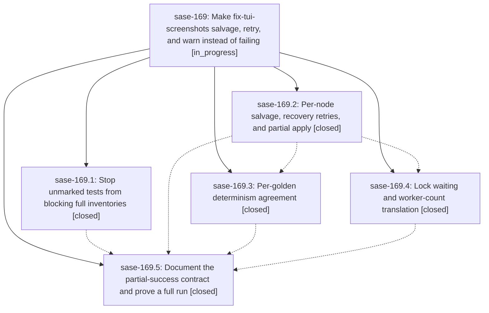

# Bead: sase-169 — Make fix-tui-screenshots salvage, retry, and warn instead of failing

[Bead Pages](../README.md) / sase-169

**Status:** ◐ in_progress · **Type:** ▸ plan · **Tier:** epic
**Owner:** `bryanbugyi34@gmail.com` · **Created by:** [bbugyi200.apollo.1i](https://github.com/sase-org/sase--agents/blob/main/families/bbugyi200.apollo.1i.md) · **Assignee:** `sase-169.land`
**Created:** 2026-09-22 10:17:57 EDT
**Plan:** [202609/fix\_tui\_screenshots\_never\_fail.md](https://github.com/sase-org/sase--plans/blob/main/202609/fix_tui_screenshots_never_fail.md)

## Description

`just fix-tui-screenshots` in update mode applies every golden it can prove, retries the tests and captures that fail or flicker, leaves only the rest untouched behind a loud warning, and exits 0. It fails only when it is invoked wrongly, when the environment must refuse, or when no capture inventory can be produced at all. `--check` stays strict for CI.

## Notes

[2026-09-23T01:33:26Z · sase-169.land] LAND AUDIT (sase-169.land, master 4be75a3d4) follow-up routing — reuse these in the close note: (a) sase-169.2#1 gate PNG re-triage: resolved in-epic; 4be75a3d4 committed it, and targeted --check run a328c3a1b342458abcb240ee525d363a is clean (46 passed); declined. (b) sase-169.3#1 '25 unrelated just-check failures': stale; the named suites (shards, chop import budget, commit bead hooks, neighbor index/navigation, plugins browser, epic panel arrival frames, usage/session/bead CLI) are 165 passed now; declined apart from the live items below. (c) sase-169.3#2 sase_10 stale editable sase_core_rs install: workspace-local environment state, not a code defect; declined. (d) sase-169.5#1 memory notes: created task sase-16r (memory, small, ready), related to sase-16q and sase-12x. (e) sase-169.5#2 journal-conflict exit 2 vs 3: epic work, carried into the follow-up plan. (f) sase-169.5#3 symvision delete_paths_in_background: +1 on sase-16l (reproduced). (g) sase-169.5#4: notify-rules help failure is +1 on sase-14p (reproduced, Python 3.12 argparse); artifact-directory audit failure is a DISCOVERED ISSUE note on active epic sase-16e (sites added by 505934a63 / sase-16e.3); provider_drain and epic_panel arrival-frame 'load flakes' declined (no node IDs or failure signature, and the arrival-frames suite passed). Also noted likely resolution by 4be75a3d4 on sase-16o and sase-16a, and a passing gate-shell node on sase-151. REMAINING EPIC WORK found and planned as a child: (1) capture-retry success reads candidates from the pass-1 capture dir, so every golden is skipped as protocol_error (reproduced with a FakeRunner probe); (2) dead legacy update-mode verify/apply block in _run_locked_check plus now-unreferenced verify_changes, compare_verification_captures, recheck_baseline_or_raise, and trusted_captures; (3) an update-mode unfinished-journal conflict exits 3, but the plan contract says exit 2. No --epic-symbol entries.

## Phases

| Bead | Title | Status | Size | Created | Agents | Commits |
|---|---|---|---|---|---:|---:|
| [sase-169.1](sase-169.1.md) | Stop unmarked tests from blocking full inventories | ✓ closed | small | 2026-09-22 | 1 | 1 |
| [sase-169.2](sase-169.2.md) | Per-node salvage, recovery retries, and partial apply | ✓ closed | medium | 2026-09-22 | 1 | 1 |
| [sase-169.3](sase-169.3.md) | Per-golden determinism agreement | ✓ closed | medium | 2026-09-22 | 1 | 1 |
| [sase-169.4](sase-169.4.md) | Lock waiting and worker-count translation | ✓ closed | small | 2026-09-22 | 1 | 1 |
| [sase-169.5](sase-169.5.md) | Document the partial-success contract and prove a full run | ✓ closed | small | 2026-09-22 | 1 | 1 |

## Lineage

## Agents

| Agent | Bead | Commits |
|---|---|---:|
| [bbugyi200.apollo.sase-169.1](https://github.com/sase-org/sase--agents/blob/main/families/bbugyi200.apollo.sase-169.1.md) | [sase-169.1](sase-169.1.md) | 1 |
| [bbugyi200.apollo.sase-169.2](https://github.com/sase-org/sase--agents/blob/main/agents/bbugyi200.apollo.sase-169.2/README.md) | [sase-169.2](sase-169.2.md) | 1 |
| [bbugyi200.apollo.sase-169.3](https://github.com/sase-org/sase--agents/blob/main/families/bbugyi200.apollo.sase-169.3.md) | [sase-169.3](sase-169.3.md) | 1 |
| [bbugyi200.apollo.sase-169.4](https://github.com/sase-org/sase--agents/blob/main/agents/bbugyi200.apollo.sase-169.4/README.md) | [sase-169.4](sase-169.4.md) | 1 |
| [bbugyi200.apollo.sase-169.5](https://github.com/sase-org/sase--agents/blob/main/families/bbugyi200.apollo.sase-169.5.md) | [sase-169.5](sase-169.5.md) | 1 |
| [bbugyi200.apollo.sase-169.land](https://github.com/sase-org/sase--agents/blob/main/families/bbugyi200.apollo.sase-169.land.md) | [sase-169](README.md) | 1 |

## Commits

| Repo | Commit | Subject | Bead | Committed |
|---|---|---|---|---|
| sase | [`7c763a2`](https://github.com/sase-org/sase/commit/7c763a2e7b0173c2ffdd8f17d79c8f9f7a96d473) | test(visual): ignore non-visual deselection in capture inventory | [sase-169.1](sase-169.1.md) | 2026-09-22 10:54:16 EDT |
| sase | [`7f01925`](https://github.com/sase-org/sase/commit/7f019258b1bfa1523786632d0f85d2b4bab12cf6) | feat(screenshots): salvage per-node captures with recovery retries and partial apply | [sase-169.2](sase-169.2.md) | 2026-09-22 11:32:01 EDT |
| sase | [`890058e`](https://github.com/sase-org/sase/commit/890058e80360707212ee0ef5047a99ba0010664e) | feat(visual): wait for maintenance lock and translate -n to SASE\_PYTEST\_WORKERS | [sase-169.4](sase-169.4.md) | 2026-09-22 13:44:24 EDT |
| sase | [`716291a`](https://github.com/sase-org/sase/commit/716291a9fdb3601c10c9519a77e53b760f2bc1b6) | feat(screenshots): per-golden agreement voting over bounded serial re-verification | [sase-169.3](sase-169.3.md) | 2026-09-22 14:02:26 EDT |
| sase | [`4be75a3`](https://github.com/sase-org/sase/commit/4be75a3d417deeecd69931a79b9a179c6247dc59) | docs(visual): document fix-tui-screenshots partial-success contract | [sase-169.5](sase-169.5.md) | 2026-09-22 20:44:38 EDT |
| sase | [`44cc2b7`](https://github.com/sase-org/sase/commit/44cc2b74b6c38ce4741d2d1a4822d11bdd0ce3db) | fix(visual): close sase-169 landing gaps in fix-tui-screenshots update mode | [sase-169](README.md) | 2026-09-22 21:53:15 EDT |
