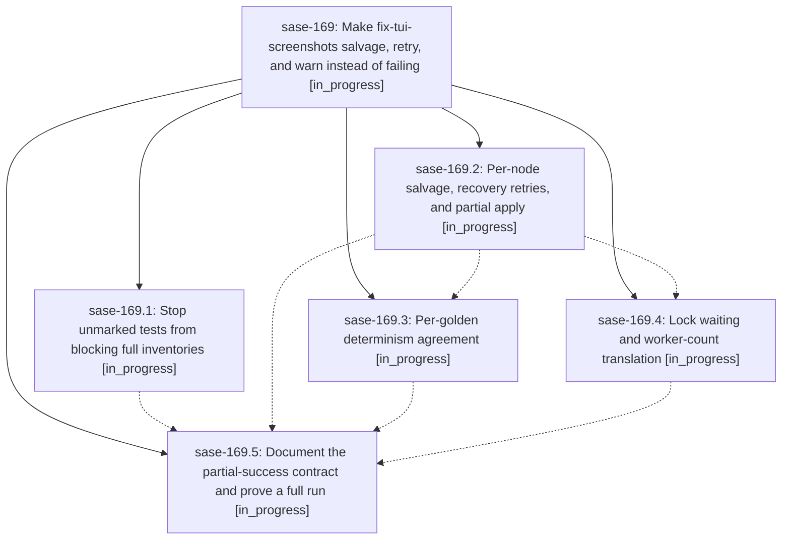

# Bead: sase-169 — Make fix-tui-screenshots salvage, retry, and warn instead of failing

[Bead Pages](../README.md) / sase-169

**Status:** ◐ in_progress · **Type:** ▸ plan · **Tier:** epic
**Owner:** `bryanbugyi34@gmail.com` · **Created by:** [bbugyi200.apollo.1i](https://github.com/sase-org/sase--agents/blob/main/families/bbugyi200.apollo.1i.md) · **Assignee:** `sase-169.land`
**Created:** 2026-09-22 10:17:57 EDT
**Plan:** [202609/fix\_tui\_screenshots\_never\_fail.md](https://github.com/sase-org/sase--plans/blob/main/202609/fix_tui_screenshots_never_fail.md)

## Description

`just fix-tui-screenshots` in update mode applies every golden it can prove, retries the tests and captures that fail or flicker, leaves only the rest untouched behind a loud warning, and exits 0. It fails only when it is invoked wrongly, when the environment must refuse, or when no capture inventory can be produced at all. `--check` stays strict for CI.

## Phases

| Bead | Title | Status | Size | Created | Agents | Commits |
|---|---|---|---|---|---:|---:|
| [sase-169.1](sase-169.1.md) | Stop unmarked tests from blocking full inventories | ◐ in_progress | small | 2026-09-22 | 1 | 1 |
| [sase-169.2](sase-169.2.md) | Per-node salvage, recovery retries, and partial apply | ◐ in_progress | medium | 2026-09-22 | 1 | 1 |
| [sase-169.3](sase-169.3.md) | Per-golden determinism agreement | ◐ in_progress | medium | 2026-09-22 | 1 | 0 |
| [sase-169.4](sase-169.4.md) | Lock waiting and worker-count translation | ◐ in_progress | small | 2026-09-22 | 1 | 0 |
| [sase-169.5](sase-169.5.md) | Document the partial-success contract and prove a full run | ◐ in_progress | small | 2026-09-22 | 1 | 0 |

## Lineage

## Agents

| Agent | Bead | Commits |
|---|---|---:|
| [bbugyi200.apollo.sase-169.1](https://github.com/sase-org/sase--agents/blob/main/families/bbugyi200.apollo.sase-169.1.md) | [sase-169.1](sase-169.1.md) | 1 |
| [bbugyi200.apollo.sase-169.2](https://github.com/sase-org/sase--agents/blob/main/agents/bbugyi200.apollo.sase-169.2/README.md) | [sase-169.2](sase-169.2.md) | 1 |
| [bbugyi200.apollo.sase-169.3](https://github.com/sase-org/sase--agents/blob/main/agents/bbugyi200.apollo.sase-169.3/README.md) | [sase-169.3](sase-169.3.md) | 0 |
| [bbugyi200.apollo.sase-169.4](https://github.com/sase-org/sase--agents/blob/main/agents/bbugyi200.apollo.sase-169.4/README.md) | [sase-169.4](sase-169.4.md) | 0 |
| [bbugyi200.apollo.sase-169.5](https://github.com/sase-org/sase--agents/blob/main/agents/bbugyi200.apollo.sase-169.5/README.md) | [sase-169.5](sase-169.5.md) | 0 |
| [bbugyi200.apollo.sase-169.land](https://github.com/sase-org/sase--agents/blob/main/agents/bbugyi200.apollo.sase-169.land/README.md) | [sase-169](README.md) | 0 |

## Commits

| Repo | Commit | Subject | Bead | Committed |
|---|---|---|---|---|
| sase | [`7c763a2`](https://github.com/sase-org/sase/commit/7c763a2e7b0173c2ffdd8f17d79c8f9f7a96d473) | test(visual): ignore non-visual deselection in capture inventory | [sase-169.1](sase-169.1.md) | 2026-09-22 10:54:16 EDT |
| sase | [`7f01925`](https://github.com/sase-org/sase/commit/7f019258b1bfa1523786632d0f85d2b4bab12cf6) | feat(screenshots): salvage per-node captures with recovery retries and partial apply | [sase-169.2](sase-169.2.md) | 2026-09-22 11:32:01 EDT |
