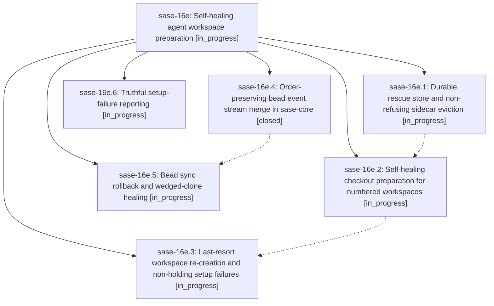

# Bead: sase-16e — Self-healing agent workspace preparation

[Bead Pages](../README.md) / sase-16e

**Status:** ◐ in_progress · **Type:** ▸ plan · **Tier:** epic
**Owner:** `bryanbugyi34@gmail.com` · **Created by:** [bbugyi200.athena.0pc](https://github.com/sase-org/sase--agents/blob/main/families/bbugyi200.athena.0pc.md) · **Assignee:** `sase-16e.land`
**Created:** 2026-09-22 12:13:28 EDT
**Plan:** [202609/self\_healing\_workspace\_prep.md](https://github.com/sase-org/sase--plans/blob/main/202609/self_healing_workspace_prep.md)

## Description

A new SASE agent launch into a numbered ephemeral workspace never fails because of state an earlier run left behind (unpublishable sidecar commits, merge/rebase conflicts, in-progress git operations, dirty or diverged checkouts). Old state is rescued durably outside the workspace on a best-effort basis, the workspace is healed or re-created from the primary checkout, and the bead-merge bug that triggered the original failure is fixed at its root.

## Phases

| Bead | Title | Status | Size | Created | Agents | Commits |
|---|---|---|---|---|---:|---:|
| [sase-16e.1](sase-16e.1.md) | Durable rescue store and non-refusing sidecar eviction | ◐ in_progress | medium | 2026-09-22 | 1 | 0 |
| [sase-16e.2](sase-16e.2.md) | Self-healing checkout preparation for numbered workspaces | ◐ in_progress | medium | 2026-09-22 | 1 | 0 |
| [sase-16e.3](sase-16e.3.md) | Last-resort workspace re-creation and non-holding setup failures | ◐ in_progress | medium | 2026-09-22 | 1 | 0 |
| [sase-16e.4](sase-16e.4.md) | Order-preserving bead event stream merge in sase-core | ✓ closed | medium | 2026-09-22 | 1 | 1 |
| [sase-16e.5](sase-16e.5.md) | Bead sync rollback and wedged-clone healing | ◐ in_progress | medium | 2026-09-22 | 1 | 0 |
| [sase-16e.6](sase-16e.6.md) | Truthful setup-failure reporting | ◐ in_progress | small | 2026-09-22 | 1 | 0 |

## Lineage

## Agents

| Agent | Bead | Commits |
|---|---|---:|
| [bbugyi200.athena.sase-16e.1](https://github.com/sase-org/sase--agents/blob/main/agents/bbugyi200.athena.sase-16e.1/README.md) | [sase-16e.1](sase-16e.1.md) | 0 |
| [bbugyi200.athena.sase-16e.2](https://github.com/sase-org/sase--agents/blob/main/agents/bbugyi200.athena.sase-16e.2/README.md) | [sase-16e.2](sase-16e.2.md) | 0 |
| [bbugyi200.athena.sase-16e.3](https://github.com/sase-org/sase--agents/blob/main/agents/bbugyi200.athena.sase-16e.3/README.md) | [sase-16e.3](sase-16e.3.md) | 0 |
| [bbugyi200.athena.sase-16e.4](https://github.com/sase-org/sase--agents/blob/main/agents/bbugyi200.athena.sase-16e.4/README.md) | [sase-16e.4](sase-16e.4.md) | 1 |
| [bbugyi200.athena.sase-16e.5](https://github.com/sase-org/sase--agents/blob/main/agents/bbugyi200.athena.sase-16e.5/README.md) | [sase-16e.5](sase-16e.5.md) | 0 |
| [bbugyi200.athena.sase-16e.6](https://github.com/sase-org/sase--agents/blob/main/agents/bbugyi200.athena.sase-16e.6/README.md) | [sase-16e.6](sase-16e.6.md) | 0 |
| [bbugyi200.athena.sase-16e.land](https://github.com/sase-org/sase--agents/blob/main/agents/bbugyi200.athena.sase-16e.land/README.md) | [sase-16e](README.md) | 0 |

## Commits

| Repo | Commit | Subject | Bead | Committed |
|---|---|---|---|---|
| sase-core | [`sase-core@9ea034c`](https://github.com/sase-org/sase-core/commit/9ea034c8117ad63cdcd274416ac5be82200bb9bc) | fix(beads): order-preserving event-stream merge with pure-reorder tolerance | [sase-16e.4](sase-16e.4.md) | 2026-09-22 12:35:20 EDT |
