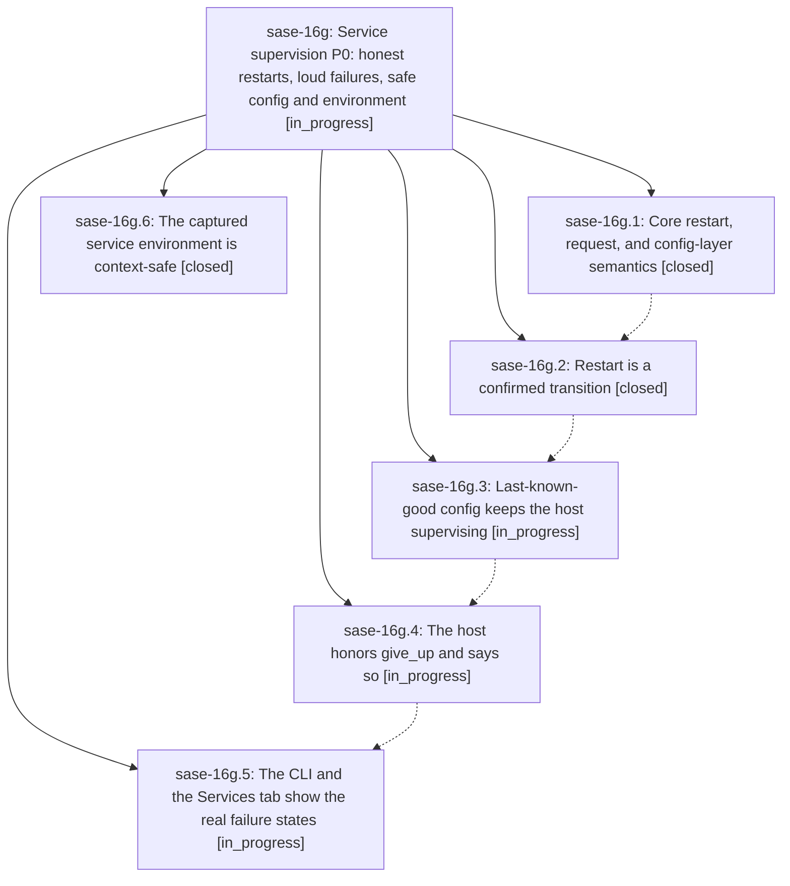

# Bead: sase-16g — Service supervision P0: honest restarts, loud failures, safe config and environment

[Bead Pages](../README.md) / sase-16g

**Status:** ◐ in_progress · **Type:** ▸ plan · **Tier:** epic
**Owner:** `bryanbugyi34@gmail.com` · **Created by:** [bbugyi200.athena.0pe](https://github.com/sase-org/sase--agents/blob/main/families/bbugyi200.athena.0pe.md) · **Assignee:** `sase-16g.land`
**Created:** 2026-09-22 12:59:04 EDT
**Plan:** [202609/services\_p0\_supervision.md](https://github.com/sase-org/sase--plans/blob/main/202609/services_p0_supervision.md)

## Description

The service host obeys its own restart decisions, an explicit restart is a confirmed transition with a new pid, every failure is visible in a notification, the CLI, and the Services tab, a broken config layer never silently stops a proc, and `sase service init` cannot freeze an agent shell's feature flags into the 24/7 host.

## Phases

| Bead | Title | Status | Size | Created | Agents | Commits |
|---|---|---|---|---|---:|---:|
| [sase-16g.1](sase-16g.1.md) | Core restart, request, and config-layer semantics | ✓ closed | medium | 2026-09-22 | 1 | 0 |
| [sase-16g.2](sase-16g.2.md) | Restart is a confirmed transition | ✓ closed | medium | 2026-09-22 | 1 | 1 |
| [sase-16g.3](sase-16g.3.md) | Last-known-good config keeps the host supervising | ◐ in_progress | medium | 2026-09-22 | 1 | 0 |
| [sase-16g.4](sase-16g.4.md) | The host honors give\_up and says so | ◐ in_progress | medium | 2026-09-22 | 1 | 0 |
| [sase-16g.5](sase-16g.5.md) | The CLI and the Services tab show the real failure states | ◐ in_progress | medium | 2026-09-22 | 1 | 0 |
| [sase-16g.6](sase-16g.6.md) | The captured service environment is context-safe | ✓ closed | medium | 2026-09-22 | 1 | 1 |

## Lineage

## Agents

| Agent | Bead | Commits |
|---|---|---:|
| [bbugyi200.athena.sase-16g.1](https://github.com/sase-org/sase--agents/blob/main/agents/bbugyi200.athena.sase-16g.1/README.md) | [sase-16g.1](sase-16g.1.md) | 0 |
| [bbugyi200.athena.sase-16g.2](https://github.com/sase-org/sase--agents/blob/main/agents/bbugyi200.athena.sase-16g.2/README.md) | [sase-16g.2](sase-16g.2.md) | 1 |
| [bbugyi200.athena.sase-16g.3](https://github.com/sase-org/sase--agents/blob/main/agents/bbugyi200.athena.sase-16g.3/README.md) | [sase-16g.3](sase-16g.3.md) | 0 |
| [bbugyi200.athena.sase-16g.4](https://github.com/sase-org/sase--agents/blob/main/agents/bbugyi200.athena.sase-16g.4/README.md) | [sase-16g.4](sase-16g.4.md) | 0 |
| [bbugyi200.athena.sase-16g.5](https://github.com/sase-org/sase--agents/blob/main/agents/bbugyi200.athena.sase-16g.5/README.md) | [sase-16g.5](sase-16g.5.md) | 0 |
| [bbugyi200.athena.sase-16g.6](https://github.com/sase-org/sase--agents/blob/main/agents/bbugyi200.athena.sase-16g.6/README.md) | [sase-16g.6](sase-16g.6.md) | 1 |
| [bbugyi200.athena.sase-16g.land](https://github.com/sase-org/sase--agents/blob/main/agents/bbugyi200.athena.sase-16g.land/README.md) | [sase-16g](README.md) | 0 |

## Commits

| Repo | Commit | Subject | Bead | Committed |
|---|---|---|---|---|
| sase | [`2ce4998`](https://github.com/sase-org/sase/commit/2ce4998e9a164ccc6230df199e4e6b8ee4e7d809) | feat(service): make captured service environment context-safe | [sase-16g.6](sase-16g.6.md) | 2026-09-22 13:21:52 EDT |
| sase | [`00106bb`](https://github.com/sase-org/sase/commit/00106bbef8f03681669461e543f614afd8e43f0c) | feat(service): restarts are confirmed generation transitions with honest CLI outcomes | [sase-16g.2](sase-16g.2.md) | 2026-09-22 14:26:56 EDT |
