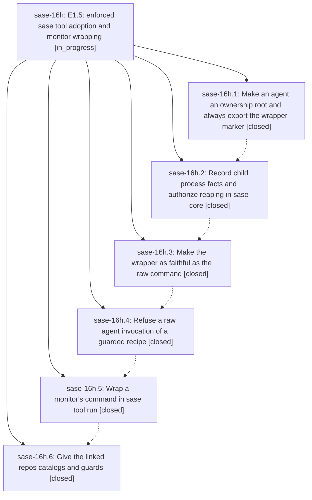

# Bead: sase-16h — E1.5: enforced sase tool adoption and monitor wrapping

[Bead Pages](../README.md) / sase-16h

**Status:** ◐ in_progress · **Type:** ▸ plan · **Tier:** epic
**Owner:** `bryanbugyi34@gmail.com` · **Created by:** [bbugyi200.athena.0pf](https://github.com/sase-org/sase--agents/blob/main/families/bbugyi200.athena.0pf.md) · **Assignee:** `sase-16h.land`
**Created:** 2026-09-22 13:05:38 EDT
**Plan:** [202609/tool\_e15\_enforced\_adoption.md](https://github.com/sase-org/sase--plans/blob/main/202609/tool_e15_enforced_adoption.md)

## Description

Every heavy verification run by a SASE agent is a recorded ToolRun by construction: guarded recipes refuse a raw agent invocation, monitors wrap what they run, the wrapper is at least as faithful as the raw command, and the linked repos carry their own catalogs and guards.

## Notes

[2026-09-22T20:52:08Z · sase-16j.land] DISCOVERED ISSUE: tests/tool/test_observe.py::test_executor_records_samples_and_show_lists_them (added by sase-135.5, 1f6adf43b) failed once in a loaded just test-scoped run on master 5950d069c (45123 passed, 3 failed) and passed in isolation. Possible causal link: 5950d069c (sase-16h.3) moved tool_run_observe to run immediately after spawn and changed executor/liveness sampling, which this test exercises. Observed by sase-16j.land.

## Phases

| Bead | Title | Status | Size | Created | Agents | Commits |
|---|---|---|---|---|---:|---:|
| [sase-16h.1](sase-16h.1.md) | Make an agent an ownership root and always export the wrapper marker | ✓ closed | medium | 2026-09-22 | 1 | 1 |
| [sase-16h.2](sase-16h.2.md) | Record child process facts and authorize reaping in sase-core | ✓ closed | medium | 2026-09-22 | 1 | 2 |
| [sase-16h.3](sase-16h.3.md) | Make the wrapper as faithful as the raw command | ✓ closed | medium | 2026-09-22 | 1 | 1 |
| [sase-16h.4](sase-16h.4.md) | Refuse a raw agent invocation of a guarded recipe | ✓ closed | medium | 2026-09-22 | 1 | 1 |
| [sase-16h.5](sase-16h.5.md) | Wrap a monitor's command in sase tool run | ✓ closed | medium | 2026-09-22 | 1 | 1 |
| [sase-16h.6](sase-16h.6.md) | Give the linked repos catalogs and guards | ✓ closed | medium | 2026-09-22 | 1 | 4 |

## Lineage

## Agents

| Agent | Bead | Commits |
|---|---|---:|
| [bbugyi200.athena.sase-16h.1](https://github.com/sase-org/sase--agents/blob/main/agents/bbugyi200.athena.sase-16h.1/README.md) | [sase-16h.1](sase-16h.1.md) | 1 |
| [bbugyi200.athena.sase-16h.2](https://github.com/sase-org/sase--agents/blob/main/agents/bbugyi200.athena.sase-16h.2/README.md) | [sase-16h.2](sase-16h.2.md) | 2 |
| [bbugyi200.athena.sase-16h.3](https://github.com/sase-org/sase--agents/blob/main/agents/bbugyi200.athena.sase-16h.3/README.md) | [sase-16h.3](sase-16h.3.md) | 1 |
| [bbugyi200.athena.sase-16h.4](https://github.com/sase-org/sase--agents/blob/main/agents/bbugyi200.athena.sase-16h.4/README.md) | [sase-16h.4](sase-16h.4.md) | 1 |
| [bbugyi200.athena.sase-16h.5](https://github.com/sase-org/sase--agents/blob/main/agents/bbugyi200.athena.sase-16h.5/README.md) | [sase-16h.5](sase-16h.5.md) | 1 |
| [bbugyi200.athena.sase-16h.6](https://github.com/sase-org/sase--agents/blob/main/agents/bbugyi200.athena.sase-16h.6/README.md) | [sase-16h.6](sase-16h.6.md) | 4 |
| [bbugyi200.athena.sase-16h.land](https://github.com/sase-org/sase--agents/blob/main/agents/bbugyi200.athena.sase-16h.land/README.md) | [sase-16h](README.md) | 0 |

## Commits

| Repo | Commit | Subject | Bead | Committed |
|---|---|---|---|---|
| sase | [`b33732a`](https://github.com/sase-org/sase/commit/b33732a41d3b981e515c5db06cc57e2382ad526d) | feat(ownership): scrub executor ownership env at agent-launch boundaries | [sase-16h.1](sase-16h.1.md) | 2026-09-22 13:56:02 EDT |
| sase | [`d163dfa`](https://github.com/sase-org/sase/commit/d163dfa2b6db768a04a7814d1bb306c121fd8736) | feat(tool): add tool\_run\_observe adapter, smoke round trip, and symvision epic whitelist | [sase-16h.2](sase-16h.2.md) | 2026-09-22 15:00:28 EDT |
| sase-core | [`sase-core@4b536cd`](https://github.com/sase-org/sase-core/commit/4b536cdcf28dc3fd75f411c3b4b0467c9174d2ce) | feat(tool): add tool\_run observe core, reap wire types, and telemetry binding | [sase-16h.2](sase-16h.2.md) | 2026-09-22 15:06:08 EDT |
| sase | [`5950d06`](https://github.com/sase-org/sase/commit/5950d069c2c5f58f0f42ae2aafb0a8c2c35c0ec2) | feat(tool): wrapper-fidelity process groups, early observe, and orphan reaping | [sase-16h.3](sase-16h.3.md) | 2026-09-22 16:16:28 EDT |
| sase | [`7fad339`](https://github.com/sase-org/sase/commit/7fad3394ca04d16d0331755ffd70b64c3fc362b8) | feat(tool): refuse raw agent runs of guarded check recipes | [sase-16h.4](sase-16h.4.md) | 2026-09-22 17:02:40 EDT |
| sase | [`6167ec4`](https://github.com/sase-org/sase/commit/6167ec42cb1df33bb670ddf3d9c81ea75303a9c2) | feat(monitor): wrap supervised commands in sase tool run | [sase-16h.5](sase-16h.5.md) | 2026-09-22 17:56:24 EDT |
| sase | [`49bf158`](https://github.com/sase-org/sase/commit/49bf158ce6b99362e31ea58d07812fc0cc8d3bf5) | docs(memory): linked repos use sase tool run check too | [sase-16h.6](sase-16h.6.md) | 2026-09-22 18:31:08 EDT |
| sase-core | [`sase-core@2017dbe`](https://github.com/sase-org/sase-core/commit/2017dbe95e6e030e6793dcb7ed99d2ebbef5524d) | feat(tool): add check catalog and recipe guard | [sase-16h.6](sase-16h.6.md) | 2026-09-22 18:34:25 EDT |
| sase-github | [`sase-github@e807f82`](https://github.com/sase-org/sase-github/commit/e807f823f6ee137c72503d8367d0a80543196b97) | feat(tool): add check catalog and recipe guard | [sase-16h.6](sase-16h.6.md) | 2026-09-22 18:36:52 EDT |
| sase-research-artifacts | [`sase-research-artifacts@760ff40`](https://github.com/sase-org/sase-research-artifacts/commit/760ff407f24fc25ce91facd5b984051d09d668e4) | feat(tool): add check catalog and recipe guard | [sase-16h.6](sase-16h.6.md) | 2026-09-22 18:39:38 EDT |

<!-- sase:referenced-by:start -->

## Referenced By

| Relation | Artifact | Why | Uses |
| --- | --- | --- | ---: |
| read-by | [agent:sase-16h.2][1] | Need parent epic context for phase 2 | 1 |
| read-by | [agent:sase-16h.4][2] | epic scope check | 1 |
| read-by | [agent:sase-16j.land][3] | Check if tool observe flake belongs to this epic | 2 |

[1]: https://github.com/sase-org/sase--agents/blob/main/agents/bbugyi200.athena.sase-16h.2/README.md
[2]: https://github.com/sase-org/sase--agents/blob/main/agents/bbugyi200.athena.sase-16h.4/README.md
[3]: https://github.com/sase-org/sase--agents/blob/main/agents/bbugyi200.athena.sase-16j.land/README.md

<!-- sase:referenced-by:end -->
