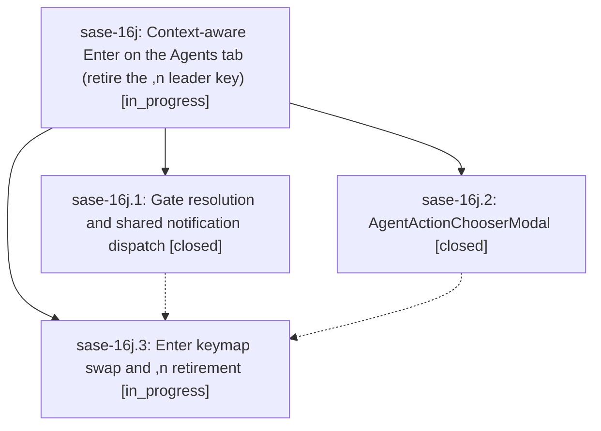

# Bead: sase-16j — Context-aware Enter on the Agents tab (retire the ,n leader key)

[Bead Pages](../README.md) / sase-16j

**Status:** ◐ in_progress · **Type:** ▸ plan · **Tier:** epic
**Owner:** `bryanbugyi34@gmail.com` · **Created by:** [bbugyi200.athena.0ph](https://github.com/sase-org/sase--agents/blob/main/families/bbugyi200.athena.0ph.md) · **Assignee:** `sase-16j.land`
**Created:** 2026-09-22 13:38:27 EDT
**Plan:** [202609/agents\_enter\_act\_on\_agent.md](https://github.com/sase-org/sase--plans/blob/main/202609/agents_enter_act_on_agent.md)

## Description

Pressing Enter on an Agents-tab row opens that agent node's pending gate (every gate kind, including sudo, launch, HITL, and custom gates), jumps to its Patch, or — when both apply — opens a polished one-keypress chooser. The `,n` leader key is retired cleanly, and the footer, help, palette, onboarding, and docs all describe the new Enter.

## Phases

| Bead | Title | Status | Size | Created | Agents | Commits |
|---|---|---|---|---|---:|---:|
| [sase-16j.1](sase-16j.1.md) | Gate resolution and shared notification dispatch | ✓ closed | medium | 2026-09-22 | 1 | 1 |
| [sase-16j.2](sase-16j.2.md) | AgentActionChooserModal | ✓ closed | medium | 2026-09-22 | 1 | 1 |
| [sase-16j.3](sase-16j.3.md) | Enter keymap swap and ,n retirement | ◐ in_progress | medium | 2026-09-22 | 1 | 0 |

## Lineage

## Agents

| Agent | Bead | Commits |
|---|---|---:|
| [bbugyi200.athena.sase-16j.1](https://github.com/sase-org/sase--agents/blob/main/agents/bbugyi200.athena.sase-16j.1/README.md) | [sase-16j.1](sase-16j.1.md) | 1 |
| [bbugyi200.athena.sase-16j.2](https://github.com/sase-org/sase--agents/blob/main/families/bbugyi200.athena.sase-16j.2.md) | [sase-16j.2](sase-16j.2.md) | 1 |
| [bbugyi200.athena.sase-16j.3](https://github.com/sase-org/sase--agents/blob/main/agents/bbugyi200.athena.sase-16j.3/README.md) | [sase-16j.3](sase-16j.3.md) | 0 |
| [bbugyi200.athena.sase-16j.land](https://github.com/sase-org/sase--agents/blob/main/agents/bbugyi200.athena.sase-16j.land/README.md) | [sase-16j](README.md) | 0 |

## Commits

| Repo | Commit | Subject | Bead | Committed |
|---|---|---|---|---|
| sase | [`1c4ebe7`](https://github.com/sase-org/sase/commit/1c4ebe76ad29aaeb1094a182dcec26406d14be70) | feat(scope): describe the completed work | [sase-16j.1](sase-16j.1.md) | 2026-09-22 14:37:32 EDT |
| sase | [`1b2f41d`](https://github.com/sase-org/sase/commit/1b2f41d7dbd58ee7e4a28e411fa50ac3a19a88e1) | feat(ace): add AgentActionChooserModal single-keypress chooser with tests and PNG golden | [sase-16j.2](sase-16j.2.md) | 2026-09-22 15:22:50 EDT |
