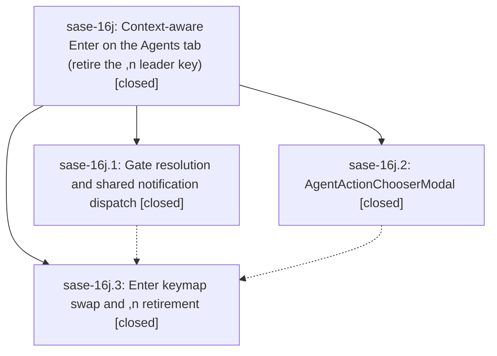

# Bead: sase-16j — Context-aware Enter on the Agents tab (retire the ,n leader key)

[Bead Pages](../README.md) / sase-16j

**Status:** ✓ closed · **Resolution:** done · **Type:** ▸ plan · **Tier:** epic
**Owner:** `bryanbugyi34@gmail.com` · **Created by:** [bbugyi200.athena.0ph](https://github.com/sase-org/sase--agents/blob/main/families/bbugyi200.athena.0ph.md) · **Assignee:** `sase-16j.land`
**Created:** 2026-09-22 13:38:27 EDT · **Closed:** 2026-09-22 16:53:31 EDT
**Plan:** [202609/agents\_enter\_act\_on\_agent.md](https://github.com/sase-org/sase--plans/blob/main/202609/agents_enter_act_on_agent.md)

## Description

Pressing Enter on an Agents-tab row opens that agent node's pending gate (every gate kind, including sudo, launch, HITL, and custom gates), jumps to its Patch, or — when both apply — opens a polished one-keypress chooser. The `,n` leader key is retired cleanly, and the footer, help, palette, onboarding, and docs all describe the new Enter.

## Notes

[2026-09-22T20:53:31Z · sase-16j.land] Verified all 3 phases against commits 1c4ebe76a (resolve: shared notification dispatcher, pure AgentEnterTarget resolver, executor mixin), 1b2f41d7d (AgentActionChooserModal + PNG golden), and b27029e89 (act_on_agent bound to enter, jump_to_agent_patch unbound, ,n retired via _RELOCATED_LEADER_KEYS, footer/help/palette/onboarding/docs updated). Every child note was addressed. Landing fixes: (1) real bug: the executor's off-pump snapshot/detail loads called App.call_from_thread from the app loop thread, which Textual rejects, so Enter did nothing before the first notification poll and the missing-detail fallback never dispatched; now it continues inline after the thread hop, with a real-App regression test (cold snapshot cache), and the test fake that hid it is removed. (2) test_timezone_display_guard failed on the epic's bare datetime.now() in _row_age_seconds; now uses sase.core.time.local_now/parse_local. (3) A lone Patch target's footer hint is 'go to PR' again, per plan section 2.3. Integration: reviewed the 10 non-epic commits since 1c4ebe76a (toggle_agent_header 'd' keymap, status-row polish, docs/ace.md edits, service notifications); no conflicts, no remaining jump_to_notification/has_notification refs, and no duplicates. Verification: 262 epic-scoped tests + test-scoped (2001 passed); ruff/mypy/fmt/validate/committed-plans green. Follow-ups: sase-16j.1/.3 symvision agent_env_refusal_reason -> DISCOVERED ISSUE note on causal epic sase-16g (2ce4998e9, sase-16g.6); toobig tests/service/test_service_host_scenarios.py 1242 lines (found while landing) -> DISCOVERED ISSUE on sase-16g; sase-16j.2 shard drift -> +1 on sase-14r; sase-16j.2 completion snapshot drift -> declined, tests/completion/test_snapshot.py passes on HEAD; plugins-pane mixed-update flake -> +1 on sase-15l; test_observe load flake -> DISCOVERED ISSUE on sase-16h (plausibly caused by 5950d069c). epic-symbols: none.

## Phases

| Bead | Title | Status | Size | Created | Agents | Commits |
|---|---|---|---|---|---:|---:|
| [sase-16j.1](sase-16j.1.md) | Gate resolution and shared notification dispatch | ✓ closed | medium | 2026-09-22 | 1 | 1 |
| [sase-16j.2](sase-16j.2.md) | AgentActionChooserModal | ✓ closed | medium | 2026-09-22 | 1 | 1 |
| [sase-16j.3](sase-16j.3.md) | Enter keymap swap and ,n retirement | ✓ closed | medium | 2026-09-22 | 1 | 1 |

## Lineage

## Agents

| Agent | Bead | Commits |
|---|---|---:|
| [bbugyi200.athena.sase-16j.1](https://github.com/sase-org/sase--agents/blob/main/agents/bbugyi200.athena.sase-16j.1/README.md) | [sase-16j.1](sase-16j.1.md) | 1 |
| [bbugyi200.athena.sase-16j.2](https://github.com/sase-org/sase--agents/blob/main/families/bbugyi200.athena.sase-16j.2.md) | [sase-16j.2](sase-16j.2.md) | 1 |
| [bbugyi200.athena.sase-16j.3](https://github.com/sase-org/sase--agents/blob/main/agents/bbugyi200.athena.sase-16j.3/README.md) | [sase-16j.3](sase-16j.3.md) | 1 |
| [bbugyi200.athena.sase-16j.land](https://github.com/sase-org/sase--agents/blob/main/agents/bbugyi200.athena.sase-16j.land/README.md) | [sase-16j](README.md) | 1 |

## Commits

| Repo | Commit | Subject | Bead | Committed |
|---|---|---|---|---|
| sase | [`1c4ebe7`](https://github.com/sase-org/sase/commit/1c4ebe76ad29aaeb1094a182dcec26406d14be70) | feat(scope): describe the completed work | [sase-16j.1](sase-16j.1.md) | 2026-09-22 14:37:32 EDT |
| sase | [`1b2f41d`](https://github.com/sase-org/sase/commit/1b2f41d7dbd58ee7e4a28e411fa50ac3a19a88e1) | feat(ace): add AgentActionChooserModal single-keypress chooser with tests and PNG golden | [sase-16j.2](sase-16j.2.md) | 2026-09-22 15:22:50 EDT |
| sase | [`b27029e`](https://github.com/sase-org/sase/commit/b27029e894a0176f213c3915ddfc8b003acfed9a) | feat(ace): make Agents Enter context-aware via act\_on\_agent | [sase-16j.3](sase-16j.3.md) | 2026-09-22 16:12:48 EDT |
| sase | [`1329009`](https://github.com/sase-org/sase/commit/13290096779fb308e1a2352e9c2d78fcbf986191) | fix(ace): make Agents Enter work before the first notification poll | [sase-16j](README.md) | 2026-09-22 16:55:27 EDT |

<!-- sase:referenced-by:start -->

## Referenced By

| Relation | Artifact | Why | Uses |
| --- | --- | --- | ---: |
| read-by | [agent:sase-16j.3][1] | parent epic scope | 1 |

[1]: https://github.com/sase-org/sase--agents/blob/main/agents/bbugyi200.athena.sase-16j.3/README.md

<!-- sase:referenced-by:end -->
