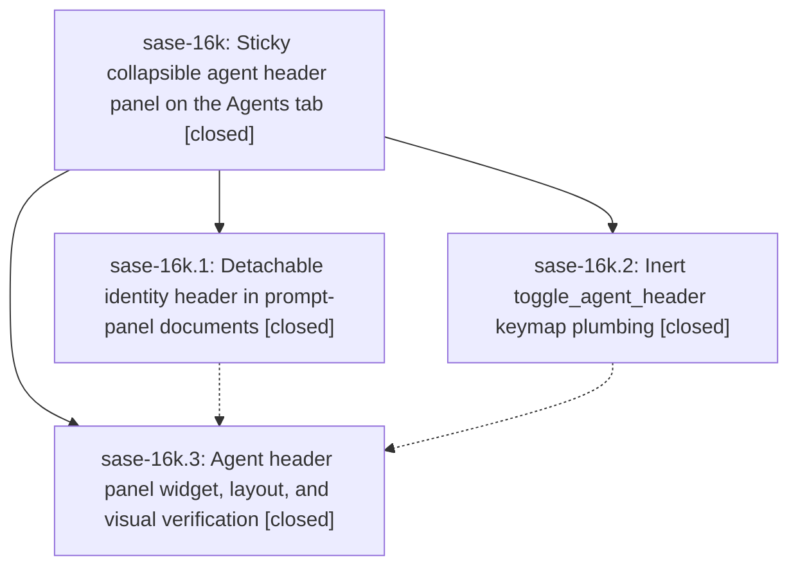

# Bead: sase-16k — Sticky collapsible agent header panel on the Agents tab

[Bead Pages](../README.md) / sase-16k

**Status:** ✓ closed · **Resolution:** done · **Type:** ▸ plan · **Tier:** epic
**Owner:** `bryanbugyi34@gmail.com` · **Created by:** [bbugyi200.athena.0pi](https://github.com/sase-org/sase--agents/blob/main/families/bbugyi200.athena.0pi.md) · **Assignee:** `sase-16k.land`
**Created:** 2026-09-22 13:53:06 EDT · **Closed:** 2026-09-22 18:23:01 EDT
**Plan:** [202609/sticky\_agent\_header\_panel.md](https://github.com/sase-org/sase--plans/blob/main/202609/sticky_agent_header_panel.md)

## Description

On the Agents tab, the selected node's identity header (every field from the kind line through Timestamps, plus Fold where present) renders in its own always-visible panel above the scrolling metadata document whenever the metadata panel is shown. The panel is collapsed to two concise rows by default and expands to the full field list with a configurable `d` keymap. Agent clan nodes are excluded.

## Notes

[2026-09-22T22:23:01Z · sase-16k.land] Verified all 3 phases against plan and commits 9aa46d006 (keymap), 28227947e (document), 7c2e05147 (panel): toggle_agent_header on d end to end with tab-disjoint registry pairs/docs; IdentityHeader detach + compact/expanded builders + sink in AgentPromptPanel; AgentHeaderPanel widget mounted above #agent-prompt-scroll with sink, visibility sync in every metadata-visibility/publish path, header_toggle_available/toggle_header_expanded, bottom-pin reapply, identity-change scroll reset, zoom seeding via inline_document_renderable, CSS (1fr), help row, docs/ace.md, pilot tests, 57 goldens refreshed. Integration: reviewed post-start commits (act_on_agent Enter b27029e89/d21b9453e, action chooser 1b2f41d7d, status row d60464c61, updates badge) - no key or layout conflicts; retired the phase-transitional getattr scaffolding and stale 'lands in a later phase' comments in _app_action_availability, commands/context, _availability_agents, _panel_detail. 230 targeted keymap/palette/header/enter tests pass; just check lint gates green except pre-existing symvision delete_paths_in_background (505934a63, sase-16e.3). epic-symbols: none. Follow-ups: sase-16k.2 #1 pyscripts and sase-16k.1#1/.2#2 agent_env_refusal_reason symvision - declined, now green on master; sase-16k.2 #3 scoped-lane failures - declined, completion snapshot/preview geometry/test_shards all pass at d21b9453e and are tracked by sase-pr/sase-16f/sase-14r; sase-16k.2 #4 flakes - +1 on sase-154 (plugins batch path) and sase-13g (proc dispatch rebind); sase-16k.3 symvision sase-16j.3/toobig - resolved on master. Discovered symvision failure: +1 sase-16l and DISCOVERED ISSUE note on active epic sase-16e.

## Phases

| Bead | Title | Status | Size | Created | Agents | Commits |
|---|---|---|---|---|---:|---:|
| [sase-16k.1](sase-16k.1.md) | Detachable identity header in prompt-panel documents | ✓ closed | medium | 2026-09-22 | 1 | 1 |
| [sase-16k.2](sase-16k.2.md) | Inert toggle\_agent\_header keymap plumbing | ✓ closed | small | 2026-09-22 | 1 | 1 |
| [sase-16k.3](sase-16k.3.md) | Agent header panel widget, layout, and visual verification | ✓ closed | medium | 2026-09-22 | 1 | 1 |

## Lineage

## Agents

| Agent | Bead | Commits |
|---|---|---:|
| [bbugyi200.athena.sase-16k.1](https://github.com/sase-org/sase--agents/blob/main/agents/bbugyi200.athena.sase-16k.1/README.md) | [sase-16k.1](sase-16k.1.md) | 1 |
| [bbugyi200.athena.sase-16k.2](https://github.com/sase-org/sase--agents/blob/main/agents/bbugyi200.athena.sase-16k.2/README.md) | [sase-16k.2](sase-16k.2.md) | 1 |
| [bbugyi200.athena.sase-16k.3](https://github.com/sase-org/sase--agents/blob/main/agents/bbugyi200.athena.sase-16k.3/README.md) | [sase-16k.3](sase-16k.3.md) | 1 |
| [bbugyi200.athena.sase-16k.land](https://github.com/sase-org/sase--agents/blob/main/agents/bbugyi200.athena.sase-16k.land/README.md) | [sase-16k](README.md) | 2 |

## Commits

| Repo | Commit | Subject | Bead | Committed |
|---|---|---|---|---|
| sase | [`9aa46d0`](https://github.com/sase-org/sase/commit/9aa46d006734b2fbbdf49ff2fc1074e209860775) | feat(agents): add inert toggle\_agent\_header keymap plumbing | [sase-16k.2](sase-16k.2.md) | 2026-09-22 14:39:49 EDT |
| sase | [`2822794`](https://github.com/sase-org/sase/commit/28227947e135f66042f61aa3fac9428d1defad6e) | feat(agents): detachable identity header in prompt-panel documents | [sase-16k.1](sase-16k.1.md) | 2026-09-22 16:03:37 EDT |
| sase | [`7c2e051`](https://github.com/sase-org/sase/commit/7c2e051479e6b72789f33063ecd1e476278133af) | feat(agents): sticky collapsible agent header panel on Agents tab | [sase-16k.3](sase-16k.3.md) | 2026-09-22 18:03:59 EDT |
| sase | [`d40c759`](https://github.com/sase-org/sase/commit/d40c759db972e265b7b8d8cc1b5c1e53292afcb5) | refactor(agents): drop phase-transitional header toggle lookups | [sase-16k](README.md) | 2026-09-22 18:25:00 EDT |
| sase--plans | [`sase--plans@9e82e0d`](https://github.com/sase-org/sase--plans/commit/9e82e0d096be6feccdc281cbc5e8b8376f626dba) | chore(plans): mark sticky agent header panel plan done | [sase-16k](README.md) | 2026-09-22 18:28:51 EDT |

<!-- sase:referenced-by:start -->

## Referenced By

| Relation | Artifact | Why | Uses |
| --- | --- | --- | ---: |
| read-by | [agent:sase-16k.1][1] | Need parent epic context for document phase | 1 |
| read-by | [agent:sase-16k.land][2] | Need the epic scope, children, and linked plan file | 2 |

[1]: https://github.com/sase-org/sase--agents/blob/main/agents/bbugyi200.athena.sase-16k.1/README.md
[2]: https://github.com/sase-org/sase--agents/blob/main/agents/bbugyi200.athena.sase-16k.land/README.md

<!-- sase:referenced-by:end -->
